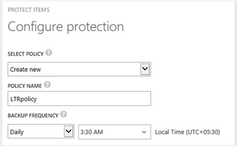

<properties
	pageTitle="备份 Azure 虚拟机 | Windows Azure"
	description="使用本文中的 Azure 虚拟机备份过程来发现、注册和备份虚拟机。"
	services="backup"
	documentationCenter=""
	authors="Jim-Parker"
	manager="jwhit"
	editor=""
	keywords="虚拟机备份;备份虚拟机;备份和灾难恢复"/>

<tags
	ms.service="backup"
	ms.date="11/17/2015"
	wacn.date="01/26/2016"/>

# 备份 Azure 虚拟机
本文提供了备份现有 Azure 虚拟机 (VM)，以根据公司的备份和灾难恢复策略来保护这些 VM 的过程。

首先，在备份 Azure 虚拟机之前，需要注意一些事项。如果你尚未这样做，请完成[先决条件](/documentation/articles/backup-azure-vms-prepare)部分，在环境中做好 VM 备份的准备，然后再继续。

有关其他信息，请参阅[在 Azure 中规划 VM 备份基础结构](/documentation/articles/backup-azure-vms-introduction)和 [Azure 虚拟机](https://azure.microsoft.com/documentation/services/virtual-machines/)。

备份 Azure 虚拟机的过程包括三个主要步骤：

>[AZURE.NOTE]备份虚拟机是在本地完成的过程。你不能将一个区域的虚拟机备份到另一个区域的备份保管库。因此，对于每个需要备份 VM 的 Azure 区域，需要在该区域中至少创建一个备份保管库。

## 步骤 1 - 发现 Azure 虚拟机
发现过程应始终作为第一步来运行，这样是为了确保标识任何添加到订阅的新虚拟机。该过程将在 Azure 上查询订阅中的虚拟机列表和其他信息，例如云服务名称、区域等。

1. 导航到备份保管库（位于 Azure 门户的“恢复服务”下），然后单击“注册的项”。

2. 从下拉菜单中选择“Azure 虚拟机”。

    

3. 单击页面底部的“发现”。
    

    发现过程可能会需要几分钟，将以表格显示虚拟机。屏幕底部有一个通知，让你知道系统正在运行发现过程。

    

    发现过程完成后，该通知会变化。

    

##  步骤 2 - 注册 Azure 虚拟机
注册 Azure 虚拟机即可将其与 Azure 备份服务相关联。这通常是一次性活动。

1. 导航到备份保管库（位于 Azure 门户的“恢复服务”下），然后单击“注册的项”。

2. 从下拉菜单中选择“Azure 虚拟机”。

    

3. 单击页面底部的“注册”。
    

4. 在“注册项”快捷菜单中，选择你要注册的虚拟机。如果存在两个或两个以上的同名虚拟机，请使用云服务来区别它们。

    >[AZURE.TIP]可以一次注册多个虚拟机。

    为每一个选定的虚拟机创建一个作业。

5. 单击通知中的“查看作业”，转到“作业”页。

    

    虚拟机还会出现在注册项列表中，并会显示注册操作的状态。

    

    操作完成后，状态会改变以反映“已注册”状态。

    

## 步骤 3 - 保护 Azure 虚拟机
现在，你可以设置虚拟机的备份和保留策略。只需单个保护操作即可保护多个虚拟机。

2015 年 5 月之后创建的 Azure 备份保管库内置了默认策略。此默认策略随附默认 30 天保留期和每日一次的备份计划。

1. 导航到备份保管库（位于 Azure 门户的“恢复服务”下），然后单击“注册的项”。
2. 从下拉菜单中选择“Azure 虚拟机”。

    

3. 单击页面底部的“保护”。

    此时将显示“保护项”向导。此向导只列出已注册但不受保护的虚拟机。可以在此处选择要保护的虚拟机。

    如果存在两个以上的同名虚拟机，请使用云服务来区别虚拟机。

    >[AZURE.TIP]你可以一次保护多个虚拟机。

    

4. 选择“备份计划”以备份所选虚拟机。你可以从现有的一组策略中进行选择，也可以定义新的策略。

    每个备份策略可以有多个关联的虚拟机。但无论何时，该虚拟机只能与一个策略相关联。

    

    >[AZURE.NOTE]备份策略包括计划备份的保留期方案。如果选择现有的备份策略，则不能修改下一步的保留期选项。

5. 选择要与备份关联的“保留期范围”。

    

    保留策略指定存储备份的时间长短。你可以根据备份的时间指定不同的保留策略。例如，在每个季末创建的备份点可能需要保留更长的时间（以便进行审核），而每天创建的备份点（用作操作恢复点）只需保留 90 天。

    

    在本示例图中：

    - **每天保留策略**：每天创建的备份存储 30 天。
    - **每周保留策略**：每个星期日创建备份并保留 104 周。
    - **每月保留策略**：每月最后一个星期日创建备份并保留 120 个月。
    - **每年保留策略**：每年 1 月份的第一个星期日创建备份并保留 99 年。

    为每个所选虚拟机创建一个作业，以便配置保护策略并将虚拟机关联到该策略。

6. 单击“作业”，并选择适当的筛选器来查看“配置保护”作业列表。

    

## 初始备份
使用策略保护虚拟机后，虚拟机将会出现在“受保护的项”选项卡下，其状态为“受保护 - (等待初始备份)”。默认情况下，第一个计划的备份是*初始备份*。

若要在配置保护后立即触发初始备份，请执行以下操作：

1. 单击“受保护的项”页底部的“立即备份”按钮。

    Azure 备份服务将为初始备份操作创建备份作业。

2. 单击“作业”选项卡查看作业列表。

>[AZURE.NOTE]在执行备份操作的过程中，Azure 备份服务将向虚拟机中的备份扩展发出一条命令，以刷新所有写入并取得一致的快照。

完成初始备份后，“受保护的项”选项卡中的虚拟机状态将显示为“受保护”。

## 查看备份状态和详细信息
虚拟机受保护后，“仪表板”页摘要中的虚拟机计数也会递增。“仪表板”页还显示过去 24 小时内成功、失败和仍在进行的作业数目。单击任何一个类别可在“作业”页中深入查看该类别。

仪表板中的值每 24 小时刷新一次。

## 排查错误
如果你在备份虚拟机时遇到问题，请参阅此[疑难解答](/documentation/articles/backup-azure-vms-troubleshoot)指南以获取帮助。

## 后续步骤

- [管理和监视你的虚拟机](/documentation/articles/backup-azure-manage-vms)
- [恢复虚拟机](/documentation/articles/backup-azure-restore-vms)

<!---HONumber=Mooncake_0104_2016-->