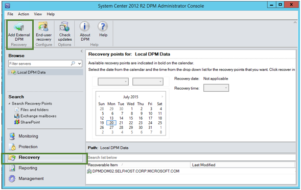
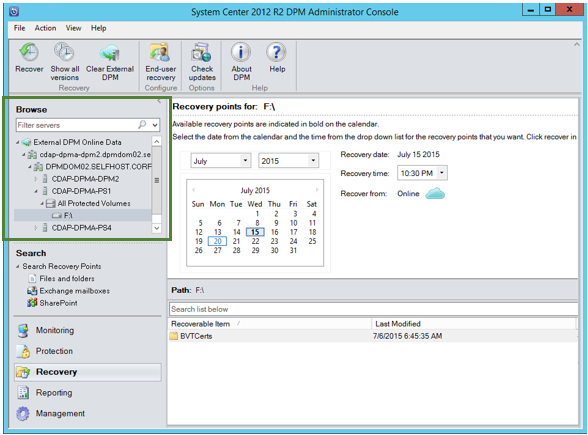
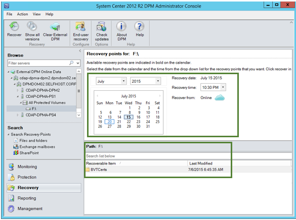
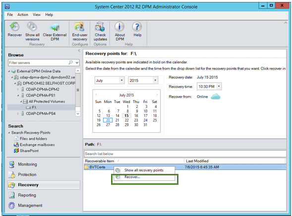
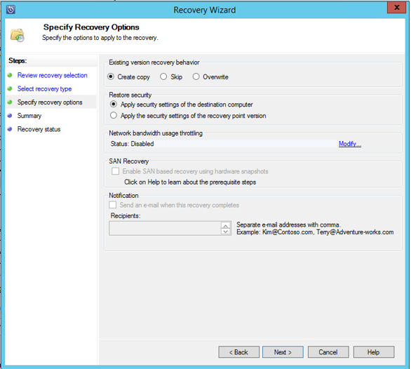
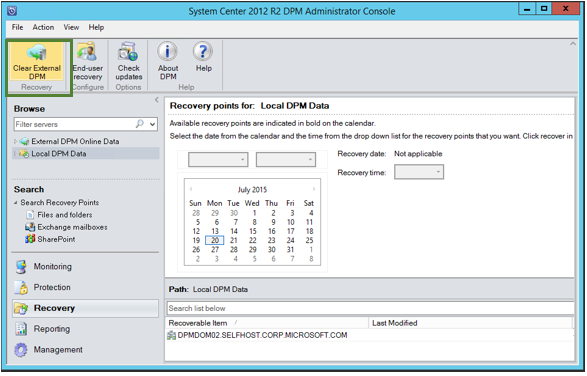
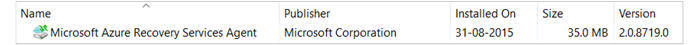

<properties
	pageTitle="从备份保管库中的另一台 DPM 服务器恢复数据 | Azure"
	description="将所保护的数据从任意 DPM 服务器恢复到 Azure 备份保管库，前提是服务器已注册到该保管库。"
	services="backup"
	documentationCenter=""
	authors="giridharreddy"
	manager="shreeshd"
	editor=""/>

<tags
	ms.service="backup"
	ms.date="05/05/2016"
	wacn.date="06/06/2016"/>

# 在备份保管库中恢复另一 DPM 服务器中的数据
现在，你可以将所保护的数据从任意 DPM 服务器恢复到 Azure 备份保管库，前提是服务器已注册到该保管库。此方面的流程已完全集成到 DPM 管理控制台中，类似于其他恢复工作流。

若要从备份保管库中的其他 DMP 服务器恢复数据，你需要[系统中心数据保护管理器 UR7](https://support.microsoft.com/zh-cn/kb/3065246) 和[最新 Azure 备份代理](http://aka.ms/azurebackup_agent)。

## 从另一个 DPM 服务器恢复数据
若要从另一个 DPM 服务器恢复数据，请执行以下步骤：

1. 在 DPM 管理控制台的“恢复”选项卡中，单击“添加外部 DPM”（位于屏幕左上角）。

    

2. 从与要恢复数据的 **DPM 服务器**关联的保管库下载新的**保管库凭据**，从注册到备份保管库的 DPM 服务器列表中选择 DPM 服务器，然后提供与要恢复数据的 DPM 服务器关联的**加密通行短语**。

    

    >[AZURE.NOTE]仅与同一注册保管库关联的 DPM 服务器可以恢复彼此的数据。

    成功添加外部 DPM 服务器以后，你就可以从“恢复”选项卡浏览外部 DPM 服务器和本地 DPM 服务器的数据。

3. 浏览受外部 DPM 服务器保护的生产服务器的可用列表，然后选择适当的数据源。

    

4. 从“恢复点”下拉列表中选择“年份和月份”，然后选择所需的“恢复日期”（对应于恢复点的创建时间），再选择“恢复时间”。

    将在底部窗格中显示文件和文件夹的列表，可以浏览这些文件和文件夹并将其恢复到任何位置。

    

5. 右键单击相应的项目，然后单击“恢复”。

    

6. 查看“恢复所选内容”。验证要恢复的备份副本的数据和时间，以及创建备份副本时所依据的源。如果所选内容不正确，请单击“取消”导航回恢复选项卡，然后选择适当的恢复点。如果所选内容正确无误，请单击“下一步”。

    

7. 选择“恢复到备用位置”。**浏览**到进行恢复的正确位置。

    

8. 选择与“创建副本”、“跳过”或“覆盖”相关的选项。
    - “创建副本”会在出现名称冲突时创建文件的副本。
    - “跳过”会在出现名称冲突时跳过文件恢复操作。
    - “覆盖”会在出现名称冲突时覆盖指定位置的现有副本。

    选择与“还原安全”相对应的选项。你可以应用进行数据恢复的目标计算机的安全设置，也可以应用在创建恢复点时适用于产品的安全设置。

    确定是否在恢复成功完成后发送**通知**。

    

9. “摘要”屏幕列出了目前为止的所选选项。当你单击“恢复”时，数据将恢复到相应的本地位置。

    

    >[AZURE.NOTE]可以在 DPM 服务器的“监视”选项卡中监视恢复作业。

    

10. 单击 DPM 服务器的“恢复”选项卡上的“清除外部 DPM”即可删除外部 DPM 服务器的视图。

    

## 错误消息疑难解答
|没有。 |	错误消息 |	疑难解答步骤 |
| :-------------: |:-------------| :-----|
|1.|		此服务器未注册到保管库凭据所指定的保管库。|	**原因：**当所选保管库凭据文件不属于与 DPM 服务器（在其上进行恢复尝试）关联的备份保管库时，会出现此错误。 **解决方案：**从 DPM 服务器所注册到的备份保管库中下载保管库凭据文件。|
|2.|		可恢复的数据不可用，或所选服务器不是 DPM 服务器。|	**原因：**没有其他安装了 DPM 2012 R2 UR7 的 DPM 服务器注册到了备份保管库、安装了 DPM 2012 R2 UR7 的 DPM 服务器尚未上载元数据，或者所选服务器不是 DPM 服务器（又称 Windows Server 或 Windows Client）。 **解决方案：**如果有其他 DPM 服务器注册到了备份保管库，请确保安装了 SCDPM 2012 R2 UR7 和最新 Azure 备份代理。 如果有其他 DPM 服务器通过 DPM 2012 R2 UR7 注册到了备份保管库，请等到安装 UR7 之后的某一天来启动恢复过程。每夜执行的作业会将所有此前受保护的备份的元数据上载到云。数据将可用于恢复。|
|3.|		没有其他 DPM 服务器注册到此保管库中。|	**原因：**没有其他安装了 DPM 2012 R2 UR7 或更高版本的 DPM 服务器注册到保管库，而恢复是通过保管库尝试进行的。 **解决方案：**如果有其他 DPM 服务器注册到了备份保管库，请确保 SCDPM 2012 R2 UR7 以及最新的 Azure 备份代理均已安装。 如果有其他 DPM 服务器通过 DPM 2012 R2 UR7 注册到了备份保管库，请等到安装 UR7 之后的某一天来启动恢复过程。每夜执行的作业会将所有此前受保护的备份的元数据上载到云。数据将可用于恢复。|
|4.|		提供的加密通行短语与以下服务器的关联通行短语不匹配：**<server name>**|	**原因：**用于 DPM 服务器的恢复数据加密流程的加密通行短语与所提供的加密通行短语不匹配。代理不能对数据进行解密。因此，恢复操作会失败。 **解决方案：**请确保提供的加密通行短语与要进行数据恢复的 DPM 服务器的相关加密通行短语相同。|

## 常见问题：
1. **在安装 UR7 以及最新 Azure 备份代理之后，为何我不能从其他 DPM 服务器添加外部 DPM 服务器？**

    A) 对于现有的通过云对数据源进行保护的 DPM 服务器（使用 Update Rollup 7 之前的更新汇总），必须在安装 UR7 及最新 Azure 备份代理之后等待至少一天，然后才能开始添加外部 DPM 服务器。若要将 DPM 保护组的元数据上载到 Azure，则这是必须的。第一次进行晚间作业时，会发生这种情况。

2. **所需的 Azure 备份代理最低版本是什么版本？**

    A) 若要启用此功能，Azure 备份代理的最低版本为 2.0.8719.0。对 Azure 备份代理版本进行验证时，可以导航到“控制面板”>“所有控制面板项”>“程序和功能”>“Microsoft Azure 恢复服务代理”。如果该版本低于 2.0.8719.0，可下载并安装[最新 Azure 备份代理](https://go.microsoft.com/fwLink/?LinkID=288905)。

    

## 后续步骤：
• [Azure 备份常见问题](/documentation/articles/backup-azure-backup-faq/)

<!---HONumber=Mooncake_0530_2016-->