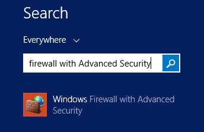
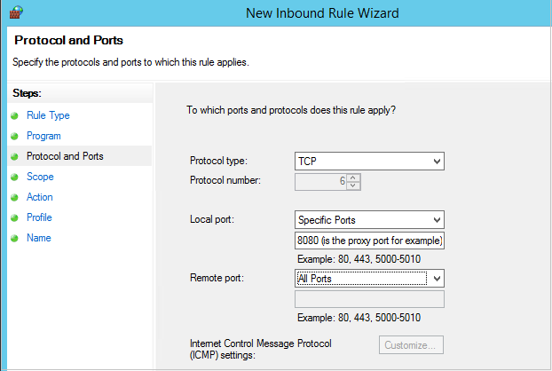

<properties
    pageTitle="Azure 备份：准备备份虚拟机 | Microsoft 文档"
    description="确保对环境进行准备，以便在 Azure 中备份虚拟机。"
    services="backup"
    documentationcenter=""
    author="markgalioto"
    manager="carmonm"
    editor=""
    keywords="备份; 备份;"
    translationtype="Human Translation" />
<tags
    ms.assetid="e87e8db2-b4d9-40e1-a481-1aa560c03395"
    ms.service="backup"
    ms.workload="storage-backup-recovery"
    ms.tgt_pltfrm="na"
    ms.devlang="na"
    ms.topic="article"
    ms.date="2/7/2017"
    wacn.date="04/24/2017"
    ms.author="markgal;trinadhk;"
    ms.sourcegitcommit="a114d832e9c5320e9a109c9020fcaa2f2fdd43a9"
    ms.openlocfilehash="c1909521911db88f1b5b95f36aea289f0513c8a7"
    ms.lasthandoff="05/22/2017" />

# <a name="prepare-your-environment-to-back-up-resource-manager-deployed-virtual-machines"></a>准备环境以备份资源管理器部署的虚拟机
> [AZURE.SELECTOR]
- [资源管理器模型](/documentation/articles/backup-azure-arm-vms-prepare/)
- [经典模型](/documentation/articles/backup-azure-vms-prepare/)

本文提供有关准备环境以备份资源管理器部署的虚拟机 (VM) 的步骤。 过程中显示的步骤将使用 Azure 门户。  

Azure 备份服务提供两种类型的保管库（备份保管库和恢复服务保管库）来保护 VM。 备份保管库保护使用经典部署模型部署的 VM。 恢复服务保管库保护 **经典部署和资源管理器部署的 VM**。 必须使用恢复服务保管库来保护资源管理器部署的 VM。

> [AZURE.NOTE]
> Azure 有两种用于创建和使用资源的部署模型：[资源管理器部署模型和经典部署模型](/documentation/articles/resource-manager-deployment-model/)。 有关使用经典部署模型 VM 的详细信息，请参阅[准备好环境以备份 Azure 虚拟机](/documentation/articles/backup-azure-vms-prepare/)。
>
>

请确保符合以下先决条件，这样才能保护或备份资源管理器部署的虚拟机 (VM)：

- 在与 VM 相同的位置创建恢复服务保管库（或标识现有的恢复服务保管库）。
- 选择方案、定义备份策略并定义要保护的项。
- 检查虚拟机上的 VM 代理安装。
- 检查网络连接

如果确定环境满足这些条件，请转到[备份 VM 的文章](/documentation/articles/backup-azure-vms/)。 如果需要设置或检查上述任何先决条件，本文将引导你逐步完成先决条件的准备步骤。

##<a name="supported-operating-system-for-backup"></a>支持用于备份的操作系统
 - **Linux**：Azure 备份支持 [Azure 认可的分发版列表](/documentation/articles/virtual-machines-linux-endorsed-distros/) ，但 Core OS Linux 除外。 _只要虚拟机上装有 VM 代理且支持 Python，其他自带 Linux 分发版应该也能正常运行。但是，我们不赞同将这些分发版用于备份。_
 - **Windows Server**：不支持低于 Windows Server 2008 R2 的版本。

## <a name="limitations-when-backing-up-and-restoring-a-vm"></a>备份和还原 VM 时的限制
准备环境之前，请先了解限制。

- 不支持备份超过 16 个数据磁盘的虚拟机。
- 不支持备份使用保留 IP 地址且未定义终结点的虚拟机。
- 不支持备份只使用 BEK 进行加密的虚拟机。 不支持备份使用 LUKS 加密方法进行加密的 Linux 虚拟机。
- 不支持备份装有 Docker 扩展的 Linux 虚拟机。
- 备份数据不包括连接到 VM 的网络挂载驱动器。
- 不支持在恢复过程中替换现有虚拟机。 如果在 VM 存在时尝试还原 VM，还原操作将会失败。
- 不支持跨区域备份和还原。
- 可以在 Azure 的所有公共区域中备份虚拟机（请参阅支持区域的[清单](https://azure.microsoft.com/regions/#services)）。 在创建保管库期间，如果你要寻找的区域目前不受支持，则不会在下拉列表中显示它。
- 仅支持通过 PowerShell 还原属于多 DC 配置的域控制器 (DC) VM。 阅读有关[还原多 DC 域控制器](/documentation/articles/backup-azure-restore-vms/#restoring-domain-controller-vms/)的详细信息。
- 仅支持通过 PowerShell 还原采用以下特殊网络配置的虚拟机。 还原操作完成后，在 UI 中使用还原工作流创建的 VM 将不采用这些网络配置。 若要了解详细信息，请参阅[还原采用特殊网络配置的 VM](/documentation/articles/backup-azure-restore-vms/#restoring-vms-with-special-network-configurations/)。
  - 采用负载均衡器配置的虚拟机（内部和外部）
  - 使用多个保留 IP 地址的虚拟机
  - 使用多个网络适配器的虚拟机

## <a name="create-a-recovery-services-vault-for-a-vm"></a>为 VM 创建恢复服务保管库
恢复服务保管库是用于存储在不同时间创建的备份和恢复点的实体。 恢复服务保管库还包含与受保护虚拟机关联的备份策略。

Azure 门户目前不支持 Azure 中国区的恢复服务。 若要创建恢复服务保管库，请执行[此处](/documentation/articles/backup-azure-vms-automation/#create-a-recovery-services-vault/)的 PowerShell 步骤

## <a name="install-the-vm-agent-on-the-virtual-machine"></a>在虚拟机中安装 VM 代理
Azure VM 代理必须安装在 Azure 虚拟机上，备份扩展才能运行。 如果 VM 创建自 Azure 资源库，则 VM 代理已存在于虚拟机上。 此处提供的信息适用于 *不是* 使用从 Azure 映像库创建的 VM 的情况（例如，从本地数据中心迁移的 VM）。 在这种情况下，需要安装 VM 代理才能保护虚拟机。 
了解 [VM 代理](/documentation/articles/virtual-machines-windows-classic-agents-and-extensions/#azure-vm-agents-for-windows-and-linux/)。

如果在备份 Azure VM 时遇到问题，请先检查是否已在虚拟机上正确安装 Azure VM 代理（请参阅下表）。 下表提供了适用于 Windows 和 Linux VM 的 VM 代理的其他信息。

| **操作** | **Windows** | **Linux** |
| --- | --- | --- |
| 安装 VM 代理 |下载并安装 [代理 MSI](http://go.microsoft.com/fwlink/?LinkID=394789&clcid=0x409)。 需要管理员权限才能完成安装。 |<li> 安装最新的 [Linux 代理](/documentation/articles/virtual-machines-linux-agent-user-guide/)。 需要管理员权限才能完成安装。 我们建议从分发存储库安装代理。 我们 **不建议** 直接从 github 安装 Linux VM 代理。  |
| 更新 VM 代理 |更新 VM 代理与重新安装 [VM 代理二进制文件](http://go.microsoft.com/fwlink/?LinkID=394789&clcid=0x409)一样简单。 <br>确保在更新 VM 代理时，没有任何正在运行的备份操作。 |按照[更新 Linux VM 代理](/documentation/articles/virtual-machines-linux-update-agent/)中的说明进行操作。 我们建议从分发存储库更新代理。 我们**不建议**直接从 github 更新 Linux VM 代理。<br>确保在更新 VM 代理时，没有任何正在运行的备份操作。 |
| 验证 VM 代理安装 |<li>导航到 Azure VM 中的 *C:\WindowsAzure\Packages* 文件夹。 <li>你应会发现 WaAppAgent.exe 文件已存在。<li> 右键单击该文件，转到“**属性**”，然后选择“**详细信息**”选项卡。 “产品版本”字段应为 2.6.1198.718 或更高。 |不适用 |

### <a name="backup-extension"></a>备份扩展
在虚拟机上安装 VM 代理后，Azure 备份服务会将备份扩展安装到 VM 代理上。 Azure 备份服务会无缝地升级和修补备份扩展。

无论 VM 是否在运行，备份服务都安装备份扩展。 VM 运行时，很有可能会获得应用程序一致的恢复点。 但是，即使 VM 已关闭并且无法安装扩展，Azure 备份服务也会继续备份 VM。 这被称为脱机 VM。 在这种情况下，恢复点将是 *崩溃一致性*恢复点。

## <a name="network-connectivity"></a>网络连接
为了管理 VM 快照，备份扩展需要连接 Azure 公共 IP 地址。 如果未建立适当的 Internet 连接，虚拟机的 HTTP 请求将会超时，并且备份操作将会失败。 如果你的部署中配置了访问限制（如通过网络安全组 (NSG)），请选择其中一个选项来提供备份流量的明确路径：

- [Whitelist the Azure datacenter IP ranges](https://www.microsoft.com/en-us/download/details.aspx?id=42064)（将 Azure 数据中心 IP 范围加入允许列表）— 请参阅相关文章，获取有关如何将 IP 地址加入允许列表的说明。
- 部署 HTTP 代理服务器来路由流量。

确定要使用的选项时，需在可管理性、精度控制和成本之间进行取舍。

| 选项 | 优点 | 缺点 |
| --- | --- | --- |
| 将 IP 范围加入允许列表 |无额外成本。<br><br>若要在 NSG 中打开访问权限，请使用 <i>Set-AzureNetworkSecurityRule</i> cmdlet。 |管理起来很复杂，因为受影响的 IP 范围会不断变化。<br><br>允许访问整个 Azure，而不只是存储。 |
| HTTP 代理 |允许在代理中对存储 URL 进行精细控制。<br>对 VM 进行单点 Internet 访问。<br>不受 Azure IP 地址变化的影响。 |通过代理软件运行 VM 带来的额外成本。 |

### <a name="whitelist-the-azure-datacenter-ip-ranges"></a>将 Azure 数据中心 IP 范围加入允许列表
若要将 Azure 数据中心 IP 范围加入允许列表，请参阅 [Azure 网站](https://www.microsoft.com/en-us/download/details.aspx?id=42064) ，获取有关 IP 范围的详细信息和说明。

### <a name="using-an-http-proxy-for-vm-backups"></a>使用 HTTP 代理进行 VM 备份
备份 VM 时，VM 上的备份扩展会使用 HTTPS API 将快照管理命令发送到 Azure 存储。 将通过 HTTP 代理路由备份扩展流量，因为它是为了访问公共 Internet 而配置的唯一组件。

> [AZURE.NOTE]
> 至于应该使用何种代理软件，我们不提供任何建议。 请确保所选代理可以进行下述配置步骤。
>
>

以下示例图像显示了使用 HTTP 代理所要执行的三个配置步骤：

- 应用程序 VM 通过代理 VM 路由所有发往公共 Internet 的 HTTP 流量。
- 代理 VM 允许来自虚拟网络中 VM 的传入流量。
- 名为 NSF-lockdown 的网络安全组 (NSG) 需要一个安全规则来允许代理 VM 的出站 Internet 流量。


若要使用 HTTP 代理来与公共 Internet 通信，请遵循以下步骤：

#### <a name="step-1-configure-outgoing-network-connections"></a>步骤 1。 配置传出网络连接
###### <a name="for-windows-machines"></a>对于 Windows 计算机
将为本地系统帐户设置代理服务器配置。

1. 下载 [PsExec](https://technet.microsoft.com/sysinternals/bb897553)
2. 在提升的提示符下运行以下命令：

         psexec -i -s "c:\Program Files\Internet Explorer\iexplore.exe"

     该命令将打开 Internet Explorer 窗口。
3. 转到“工具”->“Internet 选项”->“连接”->“LAN 设置”。
4. 验证系统帐户的代理设置。 设置代理 IP 和端口。
5. 关闭 Internet Explorer。

这样就会设置计算机范围的代理配置，可以用于任何传出的 HTTP/HTTPS 流量。

如果已在当前用户帐户（非本地系统帐户）中设置代理服务器，请使用以下脚本将设置应用到 SYSTEMACCOUNT：

    $obj = Get-ItemProperty -Path Registry::"HKEY_CURRENT_USER\Software\Microsoft\Windows\CurrentVersion\Internet Settings\Connections"
    Set-ItemProperty -Path Registry::"HKEY_USERS\S-1-5-18\Software\Microsoft\Windows\CurrentVersion\Internet Settings\Connections" -Name DefaultConnectionSettings -Value $obj.DefaultConnectionSettings
    Set-ItemProperty -Path Registry::"HKEY_USERS\S-1-5-18\Software\Microsoft\Windows\CurrentVersion\Internet Settings\Connections" -Name SavedLegacySettings -Value $obj.SavedLegacySettings
    $obj = Get-ItemProperty -Path Registry::"HKEY_CURRENT_USER\Software\Microsoft\Windows\CurrentVersion\Internet Settings"
    Set-ItemProperty -Path Registry::"HKEY_USERS\S-1-5-18\Software\Microsoft\Windows\CurrentVersion\Internet Settings" -Name ProxyEnable -Value $obj.ProxyEnable
    Set-ItemProperty -Path Registry::"HKEY_USERS\S-1-5-18\Software\Microsoft\Windows\CurrentVersion\Internet Settings" -Name Proxyserver -Value $obj.Proxyserver

> [AZURE.NOTE]
> 如果在代理服务器日志中发现“(407)需要代理身份验证”，请检查身份验证设置是否正确。
>
>

###### <a name="for-linux-machines"></a>对于 Linux 计算机
将以下代码行添加到 ```/etc/environment``` 文件：

    http_proxy=http://<proxy IP>:<proxy port>

将以下代码行添加到 ```/etc/waagent.conf``` 文件：

    HttpProxy.Host=<proxy IP>
    HttpProxy.Port=<proxy port>

#### <a name="step-2-allow-incoming-connections-on-the-proxy-server"></a>步骤 2. 在代理服务器上允许传入连接：
1. 在代理服务器上打开 Windows 防火墙。 访问防火墙的最简单方法是搜索“具有高级安全性的 Windows 防火墙”。

    
2. 在“Windows 防火墙”对话框中，右键单击“入站规则”，然后单击“新建规则...”。

    
3. 在“**新建入站规则向导**”中针对“**规则类型**”选择“**自定义**”选项，然后单击“**下一步**”。
4. 若要在页面上选择“**程序**”，可先选择“**所有程序**”，然后单击“**下一步**”。
5. 在“**协议和端口**”页面上输入以下信息，然后单击“**下一步**”：

    

   - 对于“*协议类型*”，请选择 *TCP*
   - 对于“*本地端口*”，请选择“*特定端口*”，然后在下面的字段中指定已配置的 ```<Proxy Port>```。
   - 对于“*远程端口*”，请选择“*所有端口*”

     至于该向导的其余部分，可一路单击到最后，然后为此规则指定一个名称。

#### <a name="step-3-add-an-exception-rule-to-the-nsg"></a>步骤 3. 向 NSG 添加例外规则：
在 Azure PowerShell 命令提示符下输入以下命令：

以下命令将在 NSG 中添加一个例外。 此例外允许从 10.0.0.5 上的任何端口流向端口 80 (HTTP) 或 443 (HTTPS) 上的任何 Internet 地址的 TCP 流量。 如果需要访问公共 Internet 中的特定端口，请确保也将该端口添加到 ```-DestinationPortRange```。

    Get-AzureNetworkSecurityGroup -Name "NSG-lockdown" |
    Set-AzureNetworkSecurityRule -Name "allow-proxy " -Action Allow -Protocol TCP -Type Outbound -Priority 200 -SourceAddressPrefix "10.0.0.5/32" -SourcePortRange "*" -DestinationAddressPrefix Internet -DestinationPortRange "80-443"

*这些步骤使用本示例中的特定名称和值。在输入或者将详细信息剪切并粘贴到代码中时，请使用部署的名称和值。*

确定已建立网络连接后，可以开始备份 VM 了。 

## <a name="questions"></a>存在疑问？
如果你有疑问，或者希望包含某种功能，请 [给我们反馈](http://aka.ms/azurebackup_feedback)。

## <a name="next-steps"></a>后续步骤
现在你已准备好环境来备份 VM，下一个逻辑步骤是创建备份。 “计划”一文提供了有关备份 VM 的更详细信息。

- [备份虚拟机](/documentation/articles/backup-azure-vms/)
- [规划 VM 备份基础结构](/documentation/articles/backup-azure-vms-introduction/)
- [管理虚拟机备份](/documentation/articles/backup-azure-manage-vms-classic/)

<!--Update_Description: wording update-->