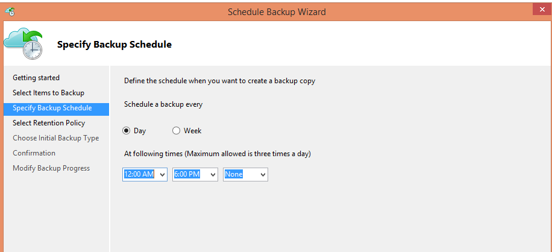
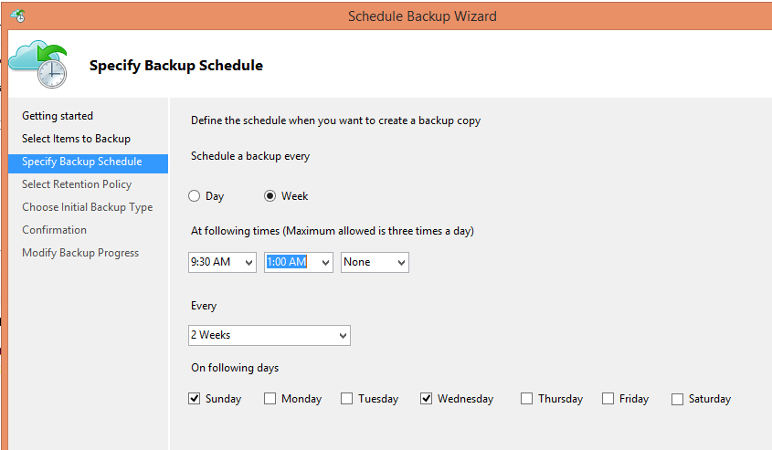
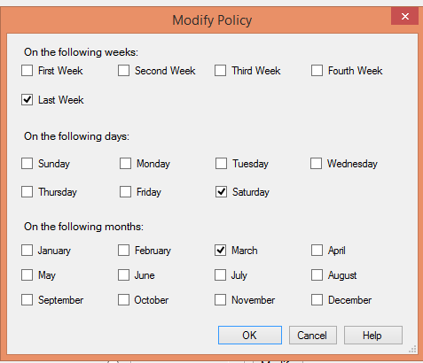

<properties
    pageTitle="使用 Azure 备份来取代磁带基础结构 | Azure"
    description="了解 Azure 备份如何提供类似于磁带的语义，让你能够在 Azure 中备份和还原数据"
    services="backup"
    documentationcenter=""
    author="trinadhk"
    manager="vijayts"
    editor="" />
<tags
    ms.assetid="2e1bb67d-986c-4437-8056-3a63169b4214"
    ms.service="backup"
    ms.devlang="na"
    ms.topic="article"
    ms.tgt_pltfrm="na"
    ms.workload="storage-backup-recovery"
    ms.date="1/10/2017"
    wacn.date="03/20/2017"
    ms.author="saurse;trinadhk;markgal" />  

# 使用 Azure 备份来取代磁带基础结构
Azure 备份和 System Center Data Protection Manager 客户可以：

- 按照最适合组织需求的计划备份数据
- 长期保留备份数据
- 使用 Azure（而不是磁带）解决其长期保留数据的需求。

本文将介绍客户如何启用备份和保留策略。使用磁带解决长期数据保留需求的客户现在可以使用一种强大而可行并且同样提供此功能的替代解决方案。最新版本的 Azure 备份（可从[此处](http://aka.ms/azurebackup_agent)获取）中已启用该功能。若要在 Azure 备份服务中使用 DPM，System Center DPM 客户必须将其软件至少更新到 DPM 2012 R2 UR5。

## 什么是备份计划？
备份计划指示备份操作的频率。例如，下面屏幕中的设置表示要在每天下午 6 点和午夜执行备份。

  

客户还可以安排每周备份。例如，以下屏幕中的设置表示要在每个星期日和星期三的上午 9:30 和夜里 1:00 创建备份。

  

## 什么是保留策略？
保留策略指定备份必须存储的时间长短。客户可以根据备份的创建时间指定不同的保留策略，而不只是为所有备份点指定一个“通用的策略”。例如，每天创建的备份点（用作操作恢复点）可以保留 90 天。在每个季度结束时针对审核用途创建的备份点可以保留更长时间。

  

此策略中指定的“保留点”总数为 90（每日点数） + 40（10 年内的每个季度）= 130。

## 示例 - 组合策略
  

1. **每天保留策略**：每天创建的备份存储 7 天。
2. **每周保留策略**：每天午夜和星期六下午 6 点创建的备份保留 4 周
3. **每月保留策略**：每个月最后一个星期六午夜和下午 6 点创建的备份保留 12 个月
4. **每年保留策略**：每年三月最后一个星期六午夜创建的备份保留 10 年

上图中“保留点”总数（客户可从中还原数据的恢复点）的计算方式如下：

- 每天 2 个点 x 7 天 = 14 个恢复点
- 每周 2 个点 x 4 周 = 8 个恢复点
- 每月 2 个点 x 12 个月 = 24 个恢复点
- 每年 1 个点 x 10 年 = 10 个恢复点

恢复点总数为 56。

> [AZURE.NOTE]
Azure 备份对恢复点的数量没有限制。
>
>

## 高级配置
通过单击上面屏幕中的“修改”，客户可以进一步灵活指定保留计划。

  

## 后续步骤
关于 Azure 备份的详细信息，请参阅：

- [Azure 备份简介](/documentation/articles/backup-introduction-to-azure-backup/)
- [尝试 Azure 备份](/documentation/articles/backup-try-azure-backup-in-10-mins/)

<!---HONumber=Mooncake_0313_2017-->
<!--Update_Description: wording update-->