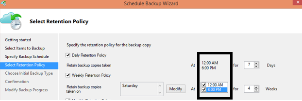

<properties
    pageTitle="Azure 备份常见问题 | Azure"
    description="有关备份服务、备份代理、备份和保留、恢复、安全性，以及有关备份和灾难恢复的常见问题的解答。"
    services="backup"
    documentationcenter=""
    author="markgalioto"
    manager="jwhit"
    editor=""
    keywords="备份和灾难恢复;备份服务" />  

    
<tags
    ms.assetid="1011bdd6-7a64-434f-abd7-2783436668d7"
    ms.service="backup"
    ms.workload="storage-backup-recovery"
    ms.tgt_pltfrm="na"
    ms.devlang="na"
    ms.topic="get-started-article"
    ms.date="11/16/2016"
    wacn.date="12/21/2016"
    ms.author="trinadhk; giridham; arunak; markgal; jimpark;" />  


# Azure 备份服务 - 常见问题

> [AZURE.SELECTOR]
- [经典模式备份常见问题](/documentation/articles/backup-azure-backup-faq/)
- [资源管理器模式备份常见问题](/documentation/articles/backup-azure-backup-ibiza-faq/)

本文提供有关 Azure 备份服务常见问题（及相应解答）的列表。我们的社区可在短时间内提供解答，如果某个问题被经常提出，我们会将它添加到本文中。问题的解答通常提供参考或支持信息。你可以在本文或相关章的 Disqus 部分中提出有关 Azure 备份的问题。还可以在[论坛](https://social.msdn.microsoft.com/Forums/zh-cn/home?forum=windowsazureonlinebackup)中发布有关 Azure 备份服务的问题。

## 可以在哪些受支持的操作系统上使用 Azure 备份向 Azure 备份数据？<br/>
Azure 备份支持在下列操作系统中使用 Azure 备份服务器和 SCDPM 进行文件/文件夹备份以及受保护工作负荷应用程序备份。

| 操作系统 | 平台 | SKU |
|:--- | --- |:--- |
| Windows 8 和最新的 SP |64 位 |Enterprise、Pro |
| Windows 7 和最新的 SP |64 位 |Ultimate、Enterprise、Professional、Home Premium、Home Basic、Starter |
| Windows 8.1 和最新的 SP |64 位 |Enterprise、Pro |
| Windows 10 |64 位 |Enterprise、Pro、Home |
| Windows Server 2012 R2 和最新的 SP |64 位 |Standard、Datacenter、Foundation |
| Windows Server 2012 和最新的 SP |64 位 |Datacenter、Foundation、Standard |
| Windows Storage Server 2012 R2 和最新的 SP |64 位 |Standard、Workgroup |
| Windows Storage Server 2012 和最新的 SP |64 位 |Standard、Workgroup |
| Windows Server 2012 R2 和最新的 SP |64 位 |Essential |
| Windows Server 2008 R2 SP1 |64 位 |Standard、Enterprise、Datacenter、Foundation |
| Windows Server 2008 SP2 |64 位 |Standard、Enterprise、Datacenter、Foundation |

对于 Azure VM 备份：

- **Linux**：Azure 备份支持 [Azure 认可的分发版列表](/documentation/articles/virtual-machines-linux-endorsed-distros/)，但 Core OS Linux 除外。只要虚拟机上装有 VM 代理且支持 Python，其他自带的 Linux 分发版也可能会正常运行。
- **Windows Server**：不支持低于 Windows Server 2008 R2 的版本。

## 可以在哪里下载最新的 Azure 备份代理？<br/>
可以从[此处](http://aka.ms/azurebackup_agent)下载最新的代理用于备份 Windows Server、System Center DPM 或 Windows 客户端。如果你想要备份虚拟机，请使用 VM 代理（会自动安装适当的扩展）。从 Azure 资源库创建的虚拟机上已有 VM 代理。

## 支持哪个版本的 SCDPM 服务器？<br/>
建议在最新的 SCDPM 更新汇总版本（截至 2016 年 8 月为 UR11）上安装[最新](http://aka.ms/azurebackup_agent)的 Azure 备份代理

## 在配置 Azure 备份代理时，系统提示输入保管库凭据。保管库凭据会过期吗？
是的，保管库凭据在 48 小时后过期。如果该文件已过期，请登录到 Azure 门户预览并从保管库下载保管库凭据文件。

## 在每个 Azure 订阅中可以创建的保管库数量是否有任何限制？<br/>
是的。截止到 2016 年 9 月，用户可以为每个订阅创建 25 个备份保管库。用户可以根据订阅为每个受支持的 Azure 备份区域最多创建 25 个恢复服务保管库。如果需要更多的保管库，请创建新订阅。

## 可针对每个保管库注册的服务器/计算机数量是否有任何限制？<br/>
是的，最多可为每个保管库注册 50 个计算机。对于 Azure IaaS 虚拟机，限制为每个保管库 200 个 VM。如需注册更多计算机，请再创建一个保管库。

## 如何将服务器注册到其他数据中心？<br/>
备份数据发送到它所注册到的保管库的数据中心。更改数据中心的最简便方法是卸载代理，然后将代理安装并注册到属于所需数据中心的新保管库。

## 如果我重命名了用于将数据备份到 Azure 的 Windows 服务器，会发生什么情况？<br/>
当你重命名服务器时，所有当前配置的备份都将停止。向备份保管库注册服务器的新名称。向保管库注册新名称时，第一个备份操作为*完整* 备份。如果需要恢复以前备份到采用旧服务器名称的保管库的数据，可以使用“恢复数据”向导中“[**其他服务器**](/documentation/articles/backup-azure-restore-windows-server/#recover-to-an-alternate-machine/)”选项来恢复该数据。

## 可以从哪些类型的驱动器备份文件和文件夹？<br/>
可备份下面一组驱动器/卷：

- 可移动介质：驱动器必须报告为固定的，以便用作备份项的源。
- 只读卷：为使卷影复制服务 (VSS) 起作用，卷必须是可写的。
- 脱机卷：为使 VSS 起作用，卷必须是联机的。
- 网络共享：若要使用联机备份进行备份，卷对于服务器而言必须是本地的。
- Bitlocker 保护的卷：必须先解锁卷，然后才能备份。
- 文件系统标识：此版本的联机备份服务仅支持 NTFS 文件系统。

## 可以从服务器备份哪些文件和文件夹类型？<br/>
支持以下类型：

- 加密
- 压缩
- 稀疏
- 压缩 + 稀疏
- 硬链接：不支持，跳过
- 重分析点：不支持，跳过
- 加密 + 压缩：不支持，跳过
- 加密 + 稀疏：不支持，跳过
- 压缩流：不支持，跳过
- 稀疏流：不支持，跳过

## 针对缓存文件夹的最小大小要求是什么？<br/>
缓存文件夹的大小由你正在备份的数据量确定。缓存文件夹应是数据存储所需空间的 5%。

## 如果本组织有一个保管库，如何在还原数据时隔离某一台服务器与另一台服务器的数据？<br/>
使用同一个保管库注册的任何服务器将能够恢复由*使用同一通行短语*的其他服务器备份的数据。如果想要隔离服务器中的备份数据与组织中的其他服务器，请使用这些服务器的指定通行短语。例如，人力资源服务器可能使用一个加密通行短语，会计结算服务器使用另一个通行短语，而存储服务器使用第三个通行短语。

## 是否可以在订阅之间迁移备份数据或保管库？<br/>
不可以。保管库是在订阅级别创建的，在创建后无法重新分配到另一订阅。

## Azure 备份代理是否适用于使用 Windows Server 2012 删除重复数据功能的服务器？<br/>
是的。代理服务在准备备份操作时将消除了重复的数据转换为常规数据。然后，它将对数据进行优化以便备份、对数据进行加密，然后将已加密的数据发送到联机备份服务。

## 如果在备份作业开始后取消，是否会删除已传输的备份数据？<br/>
否。在删除之前，所有传输到保管库中的数据都会留在保管库中。Azure 备份使用检查点机制，在备份过程中偶尔要对备份数据添加检查点。由于备份数据中有检查点，下次备份过程可以验证文件的完整性。下一备份作业会在已备份数据的基础上进行增量备份。增量备份仅传输新的或已更改的数据，这相当于更好地利用带宽。

如果取消 Azure VM 的备份作业，则会忽略任何已传输的数据。下一备份作业在上次成功备份作业的基础上传输增量数据。

## 为什么即使之前已计划了定期备份，仍会看到警告“尚未为此服务器配置 Azure 备份”？<br/>
在本地服务器上存储的备份计划设置与备份保管库中存储的设置不同时，可能会出现此警告。服务器或设置恢复为已知良好状态后，备份计划可能会失去同步。如果收到此警告，请重新配置备份策略，然后**立即运行备份**，将本地服务器与 Azure 重新同步。

## 要为 Azure 备份配置哪些防火墙规则？<br/>
为了妥善保护本地到 Azure 以及工作负荷到 Azure 的数据，建议你允许防火墙与以下 URL 通信：

- www.msftncsi.com
- *.Microsoft.com
- *.WindowsAzure.com
- *.microsoftonline.com
- *.chinacloudapi.cn

## 是否可以在已由 Azure 备份服务备份的 Azure VM 上使用 VM 扩展来安装 Azure 备份代理？<br/>
绝对是。Azure 备份使用 VM 扩展为 Azure VM 提供 VM 级别备份。在来宾 Windows OS 上安装 Azure 备份代理，以保护该来宾 OS 上的文件和文件夹。

## 是否可以在 Azure VM 上安装 Azure 备份代理来备份 Azure VM 提供的临时存储中存在的文件和文件夹？<br/>
是的。在来宾 Windows OS 上安装 Azure 备份代理，并将文件和文件夹备份到临时存储。但请注意，擦除临时存储数据会导致备份失败。此外，如果临时存储数据已被删除，则你只能还原到非易失性存储。

## 我已安装 Azure 备份代理来保护我的文件和文件夹。现在可以安装 SCDPM 来与 Azure 备份代理配合使用，以便在 Azure 中保护本地应用程序/VM 工作负荷吗？<br/>
若要将 Azure 备份与 System Center Data Protection Manager (DPM) 配合使用，请先安装 DPM，然后安装 Azure 备份代理。以这种顺序安装 Azure 备份组件可确保 Azure 备份代理与 DPM 配合使用。不建议在安装 DPM 之前安装 Azure 备份代理，此操作也不受支持。

## 可以使用 Azure 备份代理指定为 Azure 备份策略一部分的文件路径的长度是多少？<br/>
Azure 备份代理依赖于 NTFS。[文件路径长度规范受限于 Windows API](https://msdn.microsoft.com/zh-cn/library/aa365247.aspx#fully_qualified_vs._relative_paths)。在备份文件的文件路径长度大于 Windows API 所允许的长度时，用户可以选择备份备份文件的父文件夹或磁盘驱动器。

## 使用 Azure 备份代理的 Azure 备份策略的文件路径中允许哪些字符？<br>
 Azure 备份代理依赖于 NTFS。允许使用 [NTFS 支持的字符](https://msdn.microsoft.com/zh-cn/library/aa365247.aspx#naming_conventions)作为文件规范的一部分。

## 是否可以使用 Azure 备份服务器为物体服务器创建裸机恢复 (BMR) 备份？<br/>
是的。

## 是否可以将备份服务配置为在备份作业失败时发送邮件？<br/>
是，备份服务有多个可与 PowerShell 脚本配合使用的基于事件的警报。

## 要备份的每个数据源大小是否有限制？<br/>
可以备份到保管库的数据量没有限制。Azure 备份限制数据源的大小上限，但是这些上限很高。截至 2015 年 8 月，受支持操作系统的数据源大小上限为：

| S.No | 操作系统 | 数据源的最大大小 |
|:---:|:--- |:--- |
| 1 |Windows Server 2012 或更高版本 |54,400 GB |
| 2 |Windows 8 或更高版本 |54,400 GB |
| 3 |Windows Server 2008、Windows Server 2008 R2 |1700 GB |
| 4 |Windows 7 |1700 GB |

下表说明了如何确定每个数据源大小。

| 数据源 | 详细信息 |
|:---:|:--- |
| 数据量(Volume) |从服务器或客户端计算机的单个卷备份的数据量 |
| Hyper-V 虚拟机 |所备份虚拟机的所有 VHD 的数据总和 |
| Microsoft SQL Server 数据库 |所备份的单个 SQL 数据库的大小 |
| Microsoft SharePoint |所备份 SharePoint 场中内容和配置数据库的总和 |
| Microsoft Exchange |所备份 Exchange 服务器中所有 Exchange 数据库的总和 |
| BMR/系统状态 |所备份计算机的 BMR 或系统状态的每个副本 |

## 备份作业每日可计划的次数是否有限制？<br/>
是的，一天可以在 Windows Server 或 Windows 客户端上运行备份操作最多三次。一天可以在 System Center DPM 上运行备份操作最多两次。一天可以运行 IaaS VM 的备份作业一次。

## DPM 和 Windows Server（即，在不带 DPM 的 Windows Server 上）的计划策略是否有差别？<br/>
是的。使用 DPM 时，可以指定每日、每周、每月和每年计划。Windows Server（不带 DPM）只允许你指定每日和每周计划。

## DPM 和 Windows Server/客户端（即，在不带 DPM 的 Windows Server 上）的保留策略是否有差别？<br/>
否，DPM 和 Windows Server/客户端都有每日、每周、每月和每年保留策略。

## 是否可以选择性地配置我的保留策略 - 例如，配置每周和每日保留策略，但不配置每年和每月保留策略？<br/>
是的，Azure 备份保留结构允许你根据自己的要求十分灵活地定义保留策略。

## 我是否可以计划下午 6 点的备份，同时指定其他时间的保留策略？<br/>
不可以。只能在备份时间点应用保留策略。在下图中，保留策略是针对上午 12 点和下午 6 点生成的备份指定的。<br/>

 
<br/>

## 是否为计划的保留策略传输增量复制？<br/>
否，增量复制是根据备份计划页中提到的时间发送的。可以保留的时间点是根据保留策略确定的。

## 如果备份保留了很长一段时间，是否需要更多时间才能恢复较旧的数据点？<br/>
 否，恢复最旧或最新时间点所需的时间相同。每个恢复点的行为类似一个完整的点。

## 如果每个恢复点相当于完整的点，它会影响总体可计费备份存储吗？<br/>
典型的长期保留点产品将备份数据存储为完整的点。完整点的存储*效率不高*，但能使还原变得更方便和快速。增量复制是*高效*存储，但要求还原数据链，这会影响恢复时间。Azure 备份存储体系结构为你提供这两个领域的最佳产品，它以最佳方式将用于快速恢复的数据存储中，产生较低的存储成本。这种数据存储方法可确保提高（入口和出口）带宽使用效率。数据存储量和恢复数据所需的时间都会尽量减少。详细了解[增量备份](https://azure.microsoft.com/blog/microsoft-azure-backup-save-on-long-term-storage/)为何高效。

## 可创建的恢复点数量是否有限制？<br/>
否。我们已经去除了对恢复点的限制。你可以根据需要创建任意数量的恢复点。

## 为什么在备份中传输的数据量与备份的数据量不相等？<br/>
 从 Azure 备份代理、SCDPM 或 Azure 备份服务器备份的所有数据都在传输之前经过压缩和加密。应用压缩和加密后，备份保管库中的数据将减少 30-40%。

## 是否有办法调整备份服务所用的带宽？<br/>
 是的，可以使用备份代理中的“更改属性”选项来调整带宽。用户可以调整带宽以及使用该带宽的时间。有关分步说明，请参阅“通过资源管理器部署模型将 Windows Server 或客户端备份到 Azure”这一文章中的**[启用网络限制](/documentation/articles/backup-configure-vault/#enable-network-throttling/)**。

## 我的 Internet 带宽有限，不适用于我需要备份的数据量。是否有办法可将数据移到网络带宽较大的特定位置，然后将数据推送到 Azure？<br/>
可以通过标准的联机备份过程将数据备份到 Azure，或者使用 Azure 导入/导出服务将数据传输到 Azure 中的 Blob 存储。无法通过其他方法将数据备份到 Azure 存储空间。

## 对于已备份到 Azure 的数据，可以执行多少次恢复？<br/>
从 Azure 备份执行恢复的次数没有限制。

## 是否必须在恢复过程中为从 Azure 数据中心的出口流量付费？<br/>
 不用。恢复是免费的，不收取传出流量费。

## 发送到 Azure 的数据会加密吗？<br/>
是的。数据将在本地 SCDPM 服务器/客户端/SCDPM 计算机上使用 AES256 加密，并通过安全的 HTTPS 链接发送。

## Azure 中的备份数据也会加密吗？<br/>
 是的。发送到 Azure 的数据将保持加密（静态加密）。Microsoft 不会解密任何位置的备份数据。备份 Azure VM 时，Azure 备份依赖于对虚拟机的加密。例如，如果使用 Azure 磁盘加密或其他一些加密技术来加密 VM，Azure 备份将使用该类加密来保护数据。

## 用于加密备份数据的加密密钥的最小长度是多少？<br/>
 加密密钥应至少为 16 个字符。

## 如果我丢失了加密密钥，会发生什么情况？ 是否可以恢复数据（或者）Microsoft 是否可以恢复数据？<br/>
用于加密备份数据的密钥只能放置在客户场地。Microsoft 不会在 Azure 中保留副本，并且无权访问密钥。如果客户丢失了密钥，Microsoft 将无法恢复备份的数据。

## 如何更改针对 Azure 备份代理指定的缓存位置？<br/>
 请依次参考以下要点列表来更改缓存位置。

- 通过在权限提升的命令提示符下运行以下命令来停止备份引擎：

  ```PS C:\> Net stop obengine```
- 请不要移动文件，而是将缓存空间文件夹复制到具有足够空间的其他驱动器。确认备份使用新的缓存空间后，可以删除原始缓存空间。
- 更新以下注册表项，使路径指向新的缓存空间文件夹。<br/>

| 注册表路径 | 注册表项 | 值 |
| --- | --- | --- |
| `HKEY_LOCAL_MACHINE\SOFTWARE\Microsoft\Azure Backup\Config` |ScratchLocation |*新缓存文件夹位置* |
| `HKEY_LOCAL_MACHINE\SOFTWARE\Microsoft\Azure Backup\Config\CloudBackupProvider` |ScratchLocation |*新缓存文件夹位置* |

- 通过在权限提升的命令提示符下运行以下命令来重新启动备份引擎：

  ```PS C:\> Net start obengine```  


  在新缓存位置成功完成创建备份后，可以删除原始缓存文件夹。

## 可以将缓存文件夹放在何处，以便 Azure 备份代理按预期工作？<br/>
不建议将缓存文件夹放在以下位置：

- 网络共享或可移动媒体：缓存文件夹必须位于需要使用联机备份进行备份的服务器本地。不支持网络位置或可移动媒体，例如 U 盘。
- 脱机卷：缓存文件夹必须联机才能使用 Azure 备份代理执行预期的备份。

## 缓存文件夹是否有任何不受支持的属性？<br/>
 缓存文件夹不支持以下属性或其组合：

- 加密
- 已删除重复数据
- 压缩
- 稀疏
- 重分析点

缓存文件夹和元数据 VHD 都不具有 Azure 备份代理所必需的属性。

## 恢复服务保管库基于资源管理器。备份保管库（经典模式）是否仍受支持？<br/>
是，仍然支持备份保管库。可以在[经典管理门户](https://manage.windowsazure.cn)中创建备份保管库。

## 是否可以将备份保管库迁移到恢复服务保管库？<br/>
很遗憾不可以，目前无法将备份保管库的内容迁移到恢复服务保管库。我们正着手添加此功能，但目前尚无法提供。

## 恢复服务保管库是否支持经典 VM 或基于资源管理器的 VM？<br/>
恢复服务保管库同时支持这两种模型。可以将经典 VM（在经典管理门户中创建）或资源管理器VM（在 Azure 门户预览中创建）备份到恢复服务保管库。

<!---HONumber=Mooncake_1212_2016-->
