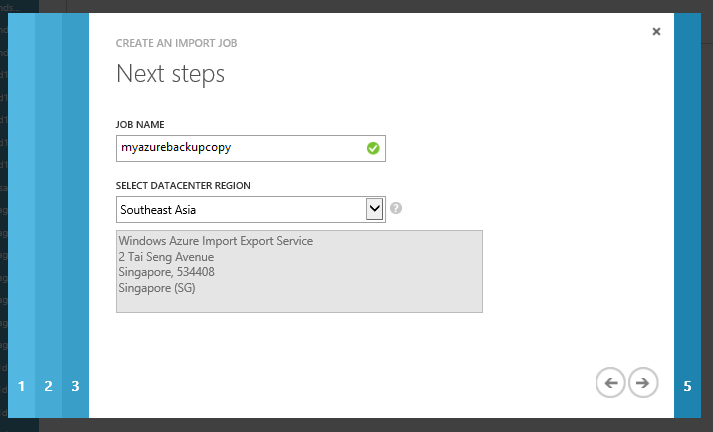
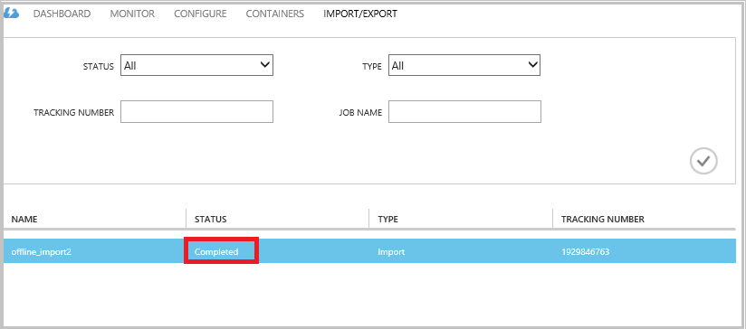

<properties
    pageTitle="Azure 备份 - 使用 Azure 导入/导出服务进行脱机备份或初始种子设定 | Azure"
    description="了解如何在 Azure 备份中使用 Azure 导入/导出服务离线发送数据。本文介绍如何使用 Azure 导入导出服务来脱机设定初始备份数据的种子。"
    services="backup"
    documentationcenter=""
    author="saurabhsensharma"
    manager="shivamg"
    editor="" />
<tags
    ms.assetid="ada19c12-3e60-457b-8a6e-cf21b9553b97"
    ms.service="backup"
    ms.devlang="na"
    ms.topic="article"
    ms.tgt_pltfrm="na"
    ms.workload="storage-backup-recovery"
    ms.date="11/28/2016"
    wacn.date="01/24/2017"
    ms.author="jimpark;saurabhsensharma;nkolli;trinadhk" />  

# Azure 备份中的脱机备份工作流
Azure 备份有多个可提升效率的内置功能，可在将数据初始完整备份到 Azure 期间节省网络和存储成本。初始完整备份通常会传输大量数据，且需要较多网络带宽，相比之下，后续备份只传输差异/增量部分。Azure 备份可压缩初始备份。通过脱机种子设定过程，Azure 备份可以使用磁盘将压缩后的初始备份数据脱机上载到 Azure。

Azure 备份的脱机种子设定过程与 [Azure 导入/导出服务](/documentation/articles/storage-import-export-service/)紧密集成，允许使用磁盘将数据传输到 Azure。如果要通过高延迟、低带宽网络传输 TB 计的初始备份数据，可以使用脱机种子设定工作流将一个或多个硬盘驱动器中的初始备份副本传送到 Azure 数据中心。本文概述完成此工作流所要执行的步骤。

## 概述
借助 Azure 备份的脱机种子设定功能及 Azure 导入/导出，可以简单直接地通过磁盘将数据脱机上载到 Azure。不是通过网络传输初始的完整副本，而是将备份数据写入“暂存位置”。使用 Azure 导入/导出工具完成复制到暂存位置的操作后，此数据将写入一个或多个 SATA 驱动器（取决于数据量）。这些驱动器最终将寄送到最近的 Azure 数据中心。

[Azure 备份 2016 年 8 月更新版（和更高版本）](http://go.microsoft.com/fwlink/?LinkID=229525)包含名为 AzureOfflineBackupDiskPrep 的 *Azure 磁盘准备工具*：

- 可帮助使用 Azure 导入/导出工具为驱动器做好运行 Azure 导入的准备。
- 可在 [Azure 经典管理门户](https://manage.windowsazure.cn)上自动创建 Azure 导入/导出服务的 Azure 导入作业，而不是像旧版 Azure 备份一样通过手动方式创建相同的作业。

将备份数据上载到 Azure 之后，Azure 备份将备份数据复制到备份保管库，并计划增量备份。

> [AZURE.NOTE]
若要使用 Azure 磁盘准备工具，请确保已安装 Azure 备份 2016 年 8 月更新版（或更高版本），然后使用该软件执行工作流的所有步骤。如果使用旧版 Azure 备份，可以使用本文后续部分详述的 Azure 导入/导出工具来准备 SATA 驱动器。
> 
> 

## 先决条件
- [熟悉 Azure 导入/导出工作流](/documentation/articles/storage-import-export-service/)。
- 在启动工作流之前，请确保已做好以下准备：
  - 已创建 Azure 备份保管库。
  - 已下载保管库凭据。
  - 已在 Windows Server/Windows 客户端或 System Center Data Protection Manager 服务器上安装 Azure 备份代理，并已向 Azure 备份保管库注册计算机。
- 在打算从中备份数据的计算机上，[下载 Azure 发布文件设置](https://manage.windowsazure.cn/publishsettings)。
- 准备一个暂存位置，可以是网络共享或计算机上的其他驱动器。暂存位置是暂时性的存储，在执行此工作流期间暂时使用。确保暂存位置具有足够的磁盘空间来保存你的初始副本。例如，如果尝试备份 500 GB 文件服务器，请确保暂存区域至少有 500 GB 空间。（由于压缩，实际使用量更少）。
- 确保使用受支持的驱动器。只支持对 3.5 英寸 SATA II/III 硬盘驱动器使用导入/导出服务。不支持大于 8 TB 的硬盘驱动器。可以使用 SATA II/III USB 适配器在外部将 SATA II/III 磁盘连接到大多数计算机。查看 Azure 导入/导出文档，了解服务支持的最新驱动器集。
- 在 SATA 驱动器写入器连接到的计算机上启用 BitLocker。
- 将 Azure 导入/导出工具下载到 SATA 驱动器写入器连接到的计算机上。如果已下载并安装 Azure 备份 2016 年 8 月更新版（或更高版本），则不需要执行此步骤。

## 工作流
本部分中的信息可帮助完成脱机备份工作流，将数据传递到 Azure 数据中心，并上载到 Azure 存储。如有关于导入服务或流程的任何方面的问题，请参阅上面提到的[导入服务概述](/documentation/articles/storage-import-export-service/)文档。

### 启动脱机备份
1. 计划备份时，会看到以下屏幕（在 Windows Server、Windows 客户端或 System Center Data Protection Manager 中）。
   
      

   
    下面是 System Center Data Protection Manager 中的相应屏幕：  
    
   
    输入的说明如下：
   
    - **暂存位置** - 初始备份副本写入到的临时存储位置。可以是在网络共享或本地计算机。如果副本计算机与源计算机不同，建议指定暂存位置的完整网络路径。
    - **Azure 导入作业名称**：Azure 导入服务和 Azure 备份在跟踪磁盘上发送到 Azure 的数据的传输活动时使用的唯一名称。
    - **Azure 发布设置**：包含订阅配置文件相关信息的 XML 文件。该文件中还包含与订阅关联的安全凭据。可以[下载该文件](https://manage.windowsazure.cn/publishsettings)。提供发布设置文件的本地路径。
    - **Azure 订阅 ID**：计划在其中启动 Azure 导入作业的 Azure 订阅的 ID。如果有多个 Azure 订阅，请使用要与导入作业关联的订阅的 ID。
    - **Azure 存储帐户**：提供的 Azure 订阅中与 Azure 导入作业关联的经典类型存储帐户。
    - **Azure 存储容器**：Azure 存储帐户中导入此作业数据的目标存储 Blob 的名称。
     
    > [AZURE.NOTE]
    如果已通过 [Azure 门户预览](https://portal.azure.cn)在 Azure 恢复服务保管库中为备份注册了服务器，并且不是在云解决方案提供商 (CSP) 订阅上，则仍可以通过 Azure 门户预览创建经典类型的存储帐户，然后将它用于脱机备份工作流。
    > 
    > 
     
     请保存所有这些信息，因为在后续步骤中需要再次输入这些信息。如果使用 Azure 磁盘准备工具来准备磁盘，则只需要*暂存位置*。
2. 完成工作流，然后在 Azure 备份管理控制台中选择“立即备份”，启动脱机备份复制。作为此步骤的一部分，初始备份会写入到暂存区域。
   
      

   
    若要在 System Center Data Protection Manager 中完成相应的工作流，请右键单击“保护组”并选择“创建恢复点”选项。然后选择“联机保护”选项。
   
      

   
    操作完成后，暂存位置已准备就绪，可用于准备磁盘。
   
      

### 使用 Azure 磁盘准备工具准备 SATA 驱动器并创建 Azure 导入作业
Azure 磁盘准备工具可在恢复服务代理（2016 年 8 月更新版和更高版本）的安装目录中获取，其路径如下。

   *\\Microsoft* *Azure* *Recovery* *Services* *Agent\\Utils*

1. 转到该目录，将 **AzureOfflineBackupDiskPrep** 目录复制到装载了要准备的驱动器的副本计算机上。确保满足以下与副本计算机相关的要求：
   
    - 副本计算机可使用在**启动脱机备份**工作流中提供的相同网络路径，访问脱机种子设定工作流的暂存位置。
    - 已在计算机上启用 BitLocker。
    - 计算机可以访问 Azure 门户预览。
     
    必要时，副本计算机可与源计算机相同。
2. 在副本计算机上以 Azure 磁盘准备工具目录作为当前目录来打开提升权限的命令提示符，并运行以下命令：
   
    `*.\AzureOfflineBackupDiskPrep.exe*   s:<*Staging Location Path*>   [p:<*Path to PublishSettingsFile*>]`  

    | 参数 | 说明 |
    | --- | --- |
    | s:&lt;*暂存位置路径*&gt; |必需的输入，用于提供在**启动脱机备份**工作流中所输入的暂存位置路径。 |
    | p:&lt;*PublishSettingsFile 路径*&gt; |可选的输入，用于提供在**启动脱机备份**工作流中所输入的 **Azure 发布设置**文件路径。 |

    > [AZURE.NOTE]
    复制计算机与源计算机不同时，&lt;发布设置文件的路径&gt; 值是必需的。
    > 
    > 

    运行该命令时，该工具将请求选择与需要准备的驱动器对应的 Azure 导入作业。如果只有一个与提供的暂存位置关联的导入作业，将显示如下所示的屏幕。

      
3. 输入想要准备传输到 Azure 的已装载磁盘的驱动器号（不要包含尾部的冒号）。出现提示时，确认格式化驱动器。

    工具随后便开始使用备份数据准备磁盘。可能需要工具的提示附加其他磁盘，以免提供的磁盘没有足够空间来容纳备份数据。 

    在工具成功执行结束时，所提供的一个或多个磁盘便已准备好可以寄送到 Azure。此外，Azure 经典管理门户上创建以在创建**启动脱机备份**工作流期间提供的名称来命名的导入作业。最后，工具上还显示磁盘所要寄送到的 Azure 数据中心的寄送地址，以及用于找到 Azure 经典管理门户上的导入作业的链接。

    

4. 将磁盘寄送到工具提供的地址，保留跟踪号码供日后参考。 

5. 转到此工具显示的链接时，可以看到在**启动脱机备份**工作流中指定的 Azure 存储帐户。可以在存储帐户的“导入/导出”选项卡中看到新建的导入作业。
   
    

6. 单击页面底部的“寄送信息”更新联系人详细信息，如以下屏幕所示。导入作业完成后，Microsoft 使用此信息寄回磁盘。

    

7. 在下一个屏幕中输入寄送详细信息。提供寄送到 Azure 数据中心的磁盘的对应“快递承运人”和“跟踪号”详细信息。
   
    

### 完成工作流
导入作业完成后，存储帐户中的初始备份数据可供使用。然后，恢复服务代理将此帐户中的数据内容复制到备份保管库或恢复服务保管库（根据何者较合适）。在下一个计划备份时间，Azure 备份代理针对初始备份副本执行增量备份。

> [AZURE.NOTE]
以下部分适用于无法访问 Azure 磁盘准备工具的旧版 Azure 备份用户。
> 
> 

### 准备 SATA 驱动器
1. 将 Azure 导入/导出工具下载到副本计算机。请确保暂存位置可从打算运行下一组命令的计算机进行访问。必要时，副本计算机可与源计算机相同。

2. 解压缩 WAImportExport.zip 文件。运行 WAImportExport 工具，它将格式化 SATA 驱动器，将备份数据写入到 SATA 驱动器并对其进行加密。在运行以下命令之前，请确保在计算机上启用了 BitLocker。 
   
    `*.\WAImportExport.exe PrepImport /j:<*JournalFile*>.jrn /id: <*SessionId*> /sk:<*StorageAccountKey*> /BlobType:**PageBlob** /t:<*TargetDriveLetter*> /format /encrypt /srcdir:<*staging location*> /dstdir: <*DestinationBlobVirtualDirectory*>/*`  

   
    > [AZURE.NOTE]
    如果已安装 Azure 备份的 2016 年 8 月更新版（或更高版本），请确保输入的暂存位置与“立即备份”屏幕上的位置相同，且包含 AIB 和基本 Blob 文件。
    > 
    > 

| 参数 | 说明 |
| --- | --- |
| /j:<*JournalFile*> |日志文件的路径。每个驱动器必须正好有一个日志文件。日志文件不能在目标驱动器上。日志文件的扩展名是 .jrn，并作为运行此命令的一部分创建。 |
| /id:<*SessionId*> |会话 ID 标识复制会话。它用于确保准确恢复中断的复制会话。复制会话中复制的文件将存储在以目标驱动器上的会话 ID 命名的目录中。 |
| /sk:<*StorageAccountKey*> |数据导入到的存储帐户的帐户密钥。该密钥需与创建备份策略/保护组期间输入的密钥相同。 |
| /BlobType |Blob 的类型。仅当已指定 **PageBlob** 时，此工作流才成功。这不是默认选项，并应在此命令中提及。 |
| /t:<*TargetDriveLetter*> |当前复制会话的目标硬盘驱动器的驱动器号（不带尾随冒号）。 |
| /format |用于格式化驱动器的选项。在需要格式化驱动器时指定此参数；否则，请将其忽略。在对驱动器进行格式化之前，该工具将提示通过控制台进行确认。若不希望显示该确认，请指定 /silentmode 参数。 |
| /encrypt |用于加密驱动器的选项。在尚未使用 BitLocker 对驱动器进行加密但需要使用此工具进行加密时，指定此参数。如果已使用 BitLocker 对驱动器进行加密，则忽略此参数并指定 /bk 参数，同时提供现有 BitLocker 密钥。如果指定 /format 参数，则还必须指定 /encrypt 参数。 |
| /srcdir:<*SourceDirectory*> |包含要复制到目标驱动器中的文件的源目录。确保指定的目录名称包含完整路径而不是相对路径。 |
| /dstdir:<*DestinationBlobVirtualDirectory*> |Azure 存储帐户中的目标虚拟目录的路径。在指定目标虚拟目录或 Blob 时，请确保使用有效的容器名称。请记住，容器名称必须是小写的。此容器名称应与创建备份策略/保护组期间输入的名称相同。 |

> [AZURE.NOTE]
将捕获整个工作流的信息的 WAImportExport 文件夹中创建日志文件。在 Azure 门户预览中创建导入作业时，需要此文件。
> 
> 

    

### 在 Azure 门户预览中创建导入作业
1. 在 [Azure 经典管理门户](https://manage.windowsazure.cn/)中转到存储帐户，单击“导入/导出”，然后单击任务窗格中的“创建导入作业”。
   
      

2. 在向导的步骤 1 中，指示已准备好了驱动器并且具有可用的驱动器日志文件。

3. 在向导的步骤 2 中，提供负责该导入作业的人员的联系信息。

4. 在步骤 3 中，上载在上一部分获取的驱动器日记文件。

5. 在步骤 4 中，为导入作业输入一个描述性的名称，该名称已在创建备份策略/保护组的过程中输入过。输入的名称只能包含小写字母、数字、连字符和下划线，必须以字母开头并且不得包含空格。在作业进行中以及作业完成后，将使用所选名称来跟踪作业。

6. 接下来，从列表中选择数据中心区域。数据中心区域会指示必须将包裹寄送到的数据中心和地址。
   
      

7. 在步骤 5 中，从列表中选择回程快递商，输入承运人帐户号码。导入作业完成后，Microsoft 将使用此帐户寄回驱动器。

8. 运送磁盘，然后输入要跟踪的发货状态的跟踪号。磁盘抵达数据中心后，将其复制到存储帐户并更新状态。
   
      

### 完成工作流
存储帐户中提供初始备份数据后，Azure 恢复服务代理将此帐户中的数据内容复制到备份保管库或恢复服务保管库（根据何者较合适）。在下一个计划备份时间，Azure 备份代理针对初始的备份副本来执行增量备份。

## 后续步骤
- 如有任何关于 Azure 导入/导出工作流的问题，请参阅 [Use the Azure Import/Export service to transfer data to Blob storage](/documentation/articles/storage-import-export-service/)（使用 Azure 导入/导出服务可将数据传输到 Blob 存储中）。
- 如有工作流方面的任何问题，请参阅 Azure 备份 [FAQ](/documentation/articles/backup-azure-backup-faq/)（常见问题）的“脱机备份”部分。

<!---HONumber=Mooncake_0116_2017-->
<!---Update_Description: wording update -->
