<properties
    pageTitle="使用 Azure 备份服务器保护 VMware 服务器 | Azure"
    description="使用 Azure 备份服务器将 VMware 服务器备份到 Azure 或磁盘。 参考本文保护 VMware 工作负荷。"
    services="backup"
    documentationcenter=""
    author="markgalioto"
    manager="carmonm" />
<tags
    ms.assetid="6b131caf-de85-4eba-b8e6-d8a04545cd9d"
    ms.service="backup"
    ms.devlang="na"
    ms.topic="article"
    ms.tgt_pltfrm="na"
    ms.workload="storage-backup-recovery"
    ms.date="03/28/2017"
    ms.author="markgal;"
    wacn.date="05/15/2017"
    ms.translationtype="Human Translation"
    ms.sourcegitcommit="3ff18e6f95d8bbc27348658bc5fce50c3320cf0a"
    ms.openlocfilehash="f5a982ca12672217774803e2c19ce845deb3a8eb"
    ms.contentlocale="zh-cn"
    ms.lasthandoff="05/15/2017" />

# 将 VMware 服务器备份到 Azure

本文介绍如何将 VMware 服务器连接到 Azure 备份服务器，以便可以将 VMware 服务器内容备份到云中。 本文假设已安装 Azure 备份服务器。

## 与 VMware 服务器建立安全连接

若要保护 VMware 服务器，Azure 备份服务器必须能够安全连接到 VMware 服务器。 若要启用安全连接，请在 VMware 服务器和 Azure 备份服务器上安装有效的证书。

连接到 VMware 服务器时，如果 URL 不安全，则你需要导出证书，以便与站点建立安全连接。

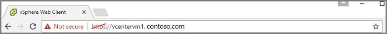

1. 单击“https”（带删除线），然后在弹出菜单中单击“详细信息”链接。

    根据所用的浏览器，可能需要单击“设置” > “更多工具” > “开发人员工具”，然后选择“安全”选项卡。

    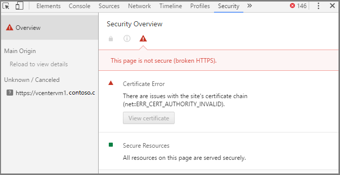

2. 在“安全”选项卡上的详细信息中，单击“查看证书”。

    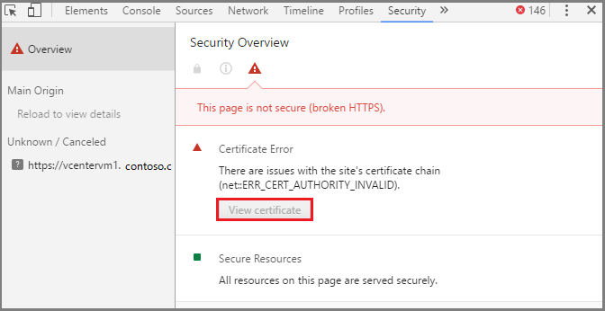

    此时将打开“证书”对话框。

3. 在“证书”对话框中，单击“证书路径”选项卡。  

    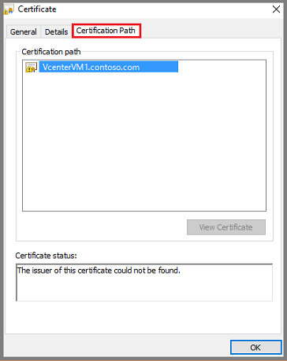

    突出显示的证书不受信任，因为找不到此证书的颁发者。 可能还有其他原因导致该证书不受信任。

4. 若要将证书导出到本地计算机，请单击“详细信息”选项卡，然后单击“复制到文件”。

    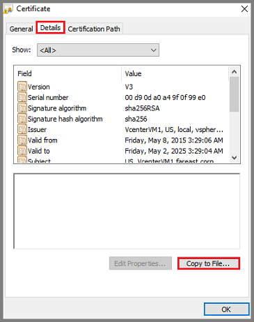

    此时将打开“证书导出向导”。

    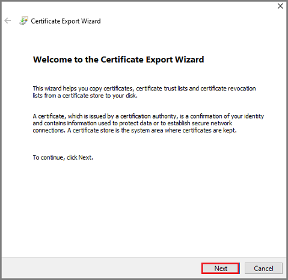

    单击“下一步”在向导中继续操作。

5. 在“导出文件格式”屏幕上，指定偏好使用的证书格式。 如果你并不偏好使用某种格式，请接受证书的默认文件格式，然后单击“下一步”。

    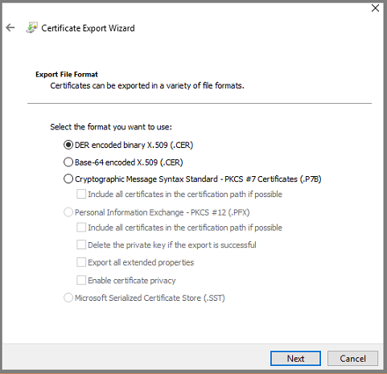

6. 在“要导出的文件”屏幕上，为证书指定一个名称，然后单击“浏览”，在本地计算机上选择用于存储证书的位置。 请将证书保存在可以方便找到它的位置。

    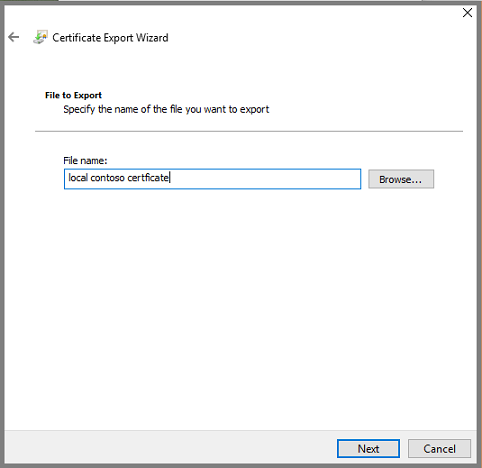

7. 导出证书后，请转到其保存位置，右键单击该证书，然后从菜单中选择“安装证书”。

    此时将打开“证书导入向导”。

    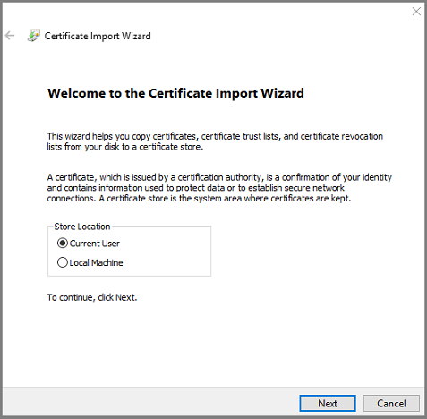

8. 在“证书导入向导”中，选择“本地计算机”作为证书的目标，然后单击“下一步”继续。

9. 在“证书存储”屏幕上，选择“将所有的证书都放入下列存储”，然后单击“浏览”。

    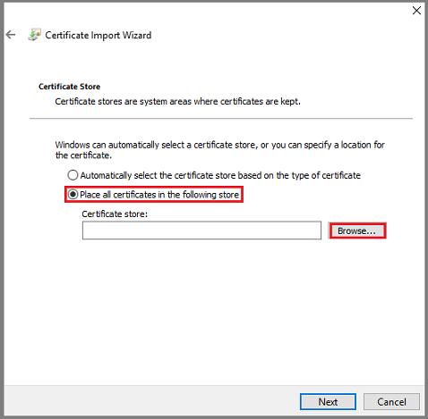

    此时将打开“选择证书存储”对话框。

    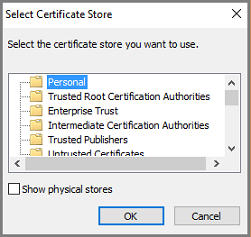

    选择证书的目标文件夹，然后单击“确定”。 如果你不知道要使用哪个文件夹，请选择“受信任的根证书颁发机构”。 选择的目标文件夹将显示在“证书存储”对话框中。 单击“下一步”导入证书。

10. 在“正在完成证书导入向导”屏幕上，检查该证书是否出现在所需的文件夹中，然后单击“完成”完成向导。

    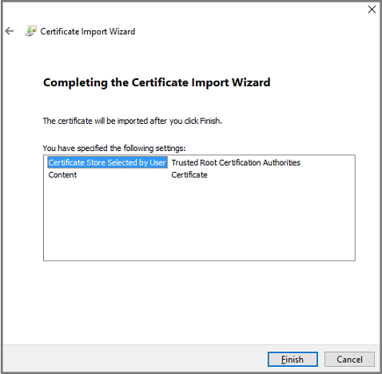

    此时将显示一个对话框，告知导入是否成功。

11. 登录到 VMware VM，检查是否与 VMware 服务器建立了安全连接。 Azure 备份服务器通过安全的 HTTPs 通道连接到 VMware 服务器。 如果你在组织中创建了安全边界并且不想要启用 HTTPs 协议，可以通过注册表禁用安全通信。 但是，我们建议在 Azure 备份服务器和 VMware 服务器上安装证书，以启用安全通信。

## 在 VMware 服务器上创建角色和用户帐户

Azure 备份服务器通过对指定 VMware 用户的凭据进行身份验证来与远程 VMware 服务器通信。 执行所有备份操作时，Azure 备份服务器都会对该 VMware 用户的凭据进行身份验证。 使用 Azure 备份服务器的“添加生产服务器”向导来启用 Azure 备份服务器与 VMware 服务器之间的安全通信。 通过“添加生产服务器”向导设置 Azure 备份服务器与 

- 创建拥有分配的特权的用户角色
- 创建具有凭据（用户名和密码）的用户帐户
- 将 VMware 服务器用户帐户添加到 Azure 备份服务器

之间的关系时，需要完成三个阶段。 用户名和密码以凭据的形式存储。

### 创建用户角色并添加特权
在 Azure 备份服务器凭据中指定的 VMware 用户帐户必须拥有某些关联的特权。 但是，特权与用户角色关联，因此，我们首先需要创建用户角色，然后将特定的特权添加到该角色。 与用户角色关联的特权属于备份管理员。

1. 若要创建新的 VMware 用户角色，请登录到 VMware 服务器，然后在“导航器”面板单击“管理”。

    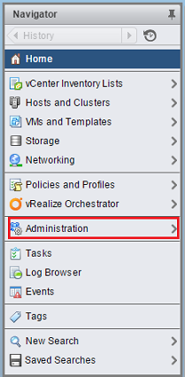

2. 若要创建新角色，请在“管理”部分中选择“角色”，然后在“角色”面板中单击“添加角色”图标（加号）。

    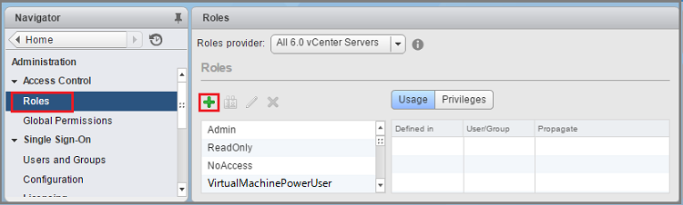

    此时将打开“创建角色”对话框。

    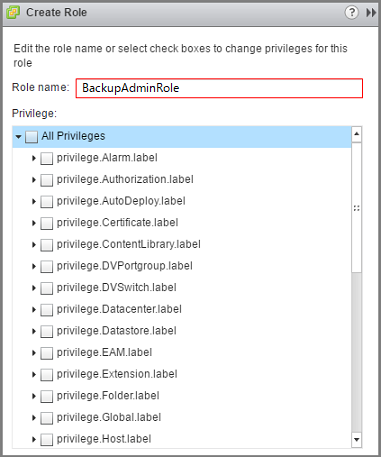

3. 在“创建角色”对话框中的“角色名称”字段内，键入角色的名称。 在本示例中，我们使用了名称 *BackupAdminRole*。 角色名称可以是所需的任何内容，但该名称应该能够帮助识别该角色。

4. 选择特权，以便将其应用到用户角色。 在以下列表中选择特权。 选择特权时，请单击父标签上的 V 形图标展开父级并查看子特权。 不需要选择父特权中的所有子特权。

    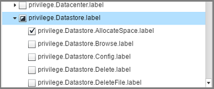

  - Privilege.Datastore.AllocateSpace.label
  - Privilege.Global.ManageCustomerFields.label
  - privilege.Network.Assign.label
  - Privilege.VirtualMachine.Config.AddNewDisk.label
  - Privilege.VirtualMachine.Config.AdvanceConfig.label
  - Privilege.VirtualMachine.Config.ChangeTracking.label
  - Privilege.VirtualMachine.Config.HostUSBDevice.label
  - Privilege.VirtualMachine.Config.SwapPlacement.label  
  - Privilege.VirtualMachine.Interact.PowerOff.label
  - Privilege.VirtualMachine.Inventory.Create.label
  - Privilege.VirtualMachine.Provisioning.DiskRandomRead.summary
  - Privilege.VirtualMachine.State.CreateSnapshot.label
  - Privilege.VirtualMachine.State.RemoveSnapshot.label
 

  选择特权后，单击“确定”。 新角色随即显示在“角色”窗格中的列表内。

### 创建用户帐户并分配权限

定义拥有特权的用户角色后，请创建用户帐户。 创建用户帐户时，请将它分配到特定的用户角色，以便为该帐户提供关联的特权。 用户帐户具有名称和密码（提供用于身份验证的凭据）。

1. 若要在 VMware 服务器上创建新用户帐户，请在“导航器”窗格中单击“用户和组”。

    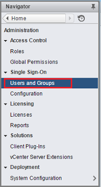

    此时将显示“用户和组”面板。

    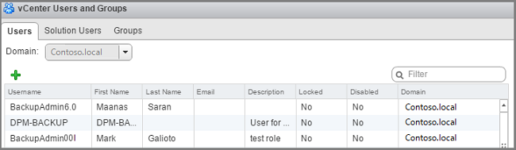

2. 在 VMware“用户和组”面板中的“用户”选项卡上，单击“添加用户”图标（加号）。

    此时将打开“新建用户”对话框。

3. 创建的用户帐户包含用作凭据的用户名与密码对。 填写“新建用户”对话框中的字段，然后单击“确定”。

    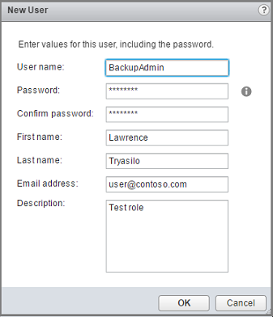

    新用户帐户随即显示在列表中。

4. 创建用户帐户后，请将它与（拥有所需权限的）用户角色相关联。 在“导航器”窗格中，单击“全局权限”。 在“全局权限”面板中单击“管理”选项卡，然后单击“添加”图标（加号）。

    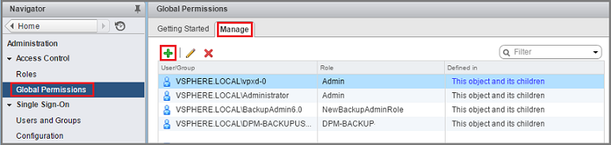

    此时将打开“全局权限 Root - 添加权限”对话框。

5. 在“全局权限 Root - 添加权限”对话框中，单击“添加”选择用户或组。

    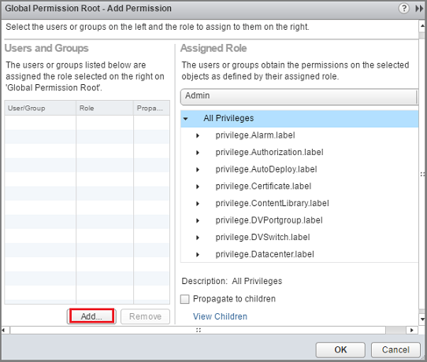

    此时将打开“选择用户/组”对话框。

6. 在“选择用户/组”对话框中，选择创建的用户帐户，然后单击“添加”。 选定的用户帐户随即显示在“用户”字段中。 用户名以“*域*`\`*用户名*”的格式显示在“用户”字段中。

    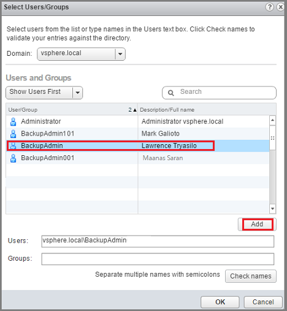

    单击“确定”，将选定的用户添加到“添加权限”对话框中。

7. 确定用户后，请将该用户分配到角色。 在“分配角色”区域中，从下拉菜单中选择角色，然后单击“确定”。

    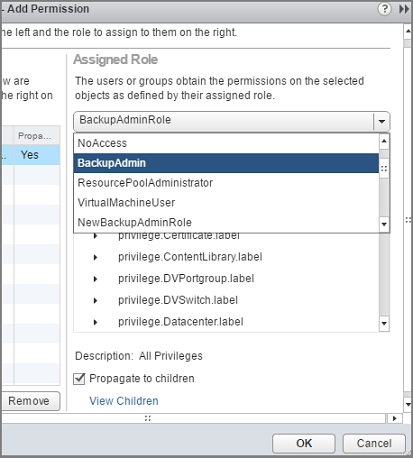

    新用户帐户和关联的角色将显示在“全局权限”的“管理”选项卡上的列表中。

### 将 VMware 用户帐户凭据添加到 Azure 备份服务器

在将 VMware 服务器添加到 Azure 备份服务器之前，请确保已安装 [Azure 备份服务器 Update 1](https://support.microsoft.com/zh-cn/help/3175529/update-1-for-microsoft-azure-backup-server)。

1. 单击以下图标（位于服务器桌面上）打开 Azure 备份服务器控制台。

    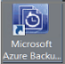

    如果在桌面上找不到该图标，可以从已安装应用列表打开 Azure 备份服务器。 在已安装应用列表中，Azure 备份服务器应用的名称为“Azure 备份”。

2. 在 Azure 备份服务器控制台中，依次单击“管理”、“生产服务器”，然后在工具功能区中单击“管理 VMware”。

    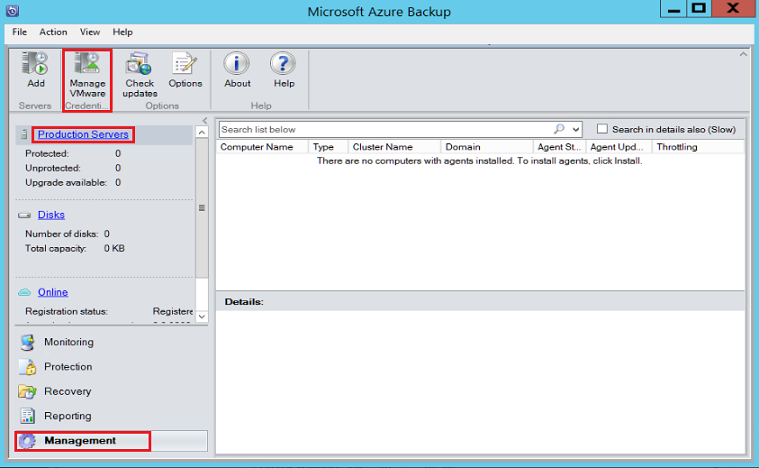

    此时将打开“管理凭据”对话框。

    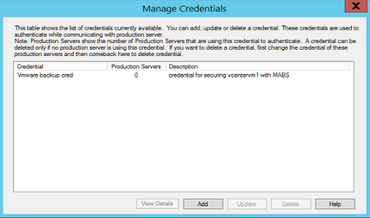

3. 在“管理凭据”对话框中，单击“添加”打开“添加凭据”对话框。

4. 在“添加凭据”对话框中，键入新凭据的名称和说明。 用户名和密码应该与在 VMware 服务器中创建用户帐户时使用的用户名和密码相同。

    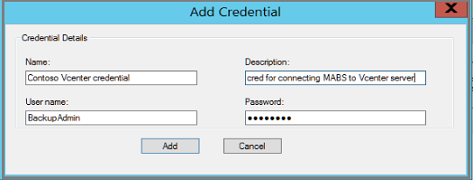

    单击“添加”，将新凭据添加到 Azure 备份服务器。 新凭据随即显示在“管理凭据”对话框中的列表内。
    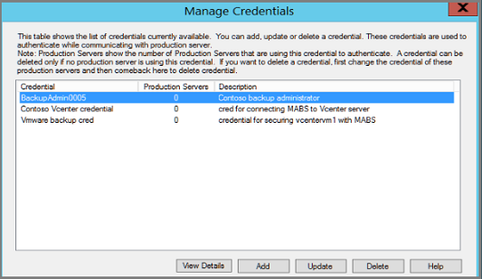

5. 单击右上角的“X”关闭“管理凭据”对话框。

## 将 VMware 服务器添加到 Azure 备份服务器

打开“添加生产服务器”向导

1. 在 Azure 备份服务器控制台中，依次单击“管理”、“生产服务器”、“添加”。

    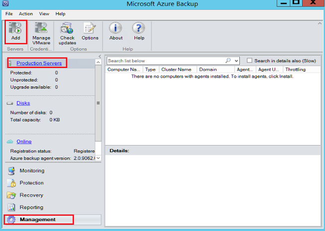

    此时将打开“添加生产服务器”向导。

    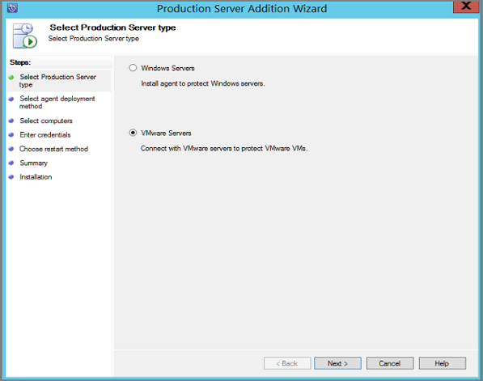

2. 在“选择生产服务器类型”屏幕上选择“VMware 服务器”，然后单击“下一步”。

3. 在“服务器名称/IP 地址”中，指定 VMware 服务器的完全限定域名 (FQDN) 或 IP 地址。 如果所有 ESXi 服务器由同一个 Vcenter 管理，则你可以输入 VMware 名称。

    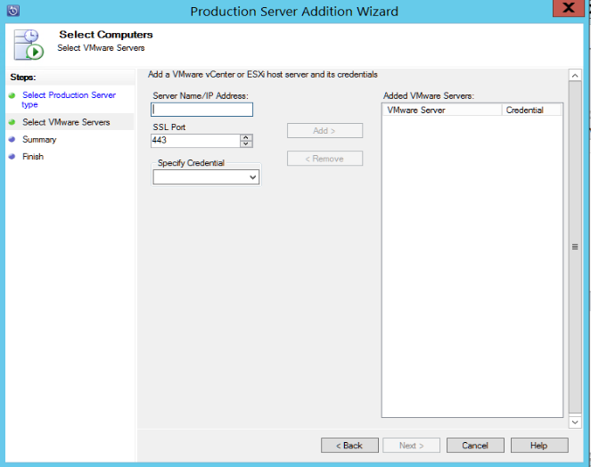

4. 在“SSL 端口”对话框中，输入用来与 VMware 服务器通信的端口。 除非你确定需要使用其他端口，否则请使用默认端口 443。

5. 在“指定凭据”对话框中，可以创建新凭据或选择现有凭据。 你已在上一部分中创建凭据。 请选择此凭据。

    如果没有可用的凭据，或者需要创建新凭据，请单击“添加新凭据”来创建新凭据，然后单击“确定”。

    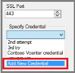

6. 单击“添加”将 VMware 服务器添加到“添加的 VMware 服务器”列表，然后单击“下一步”转到向导中的下一个屏幕。

    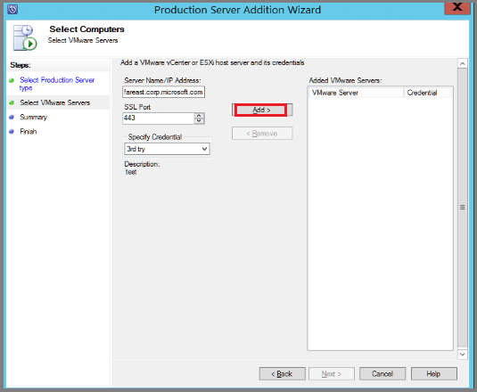

7. 在“任务”屏幕中单击“添加”，将指定的 VMware 服务器添加到 Azure 备份服务器。

    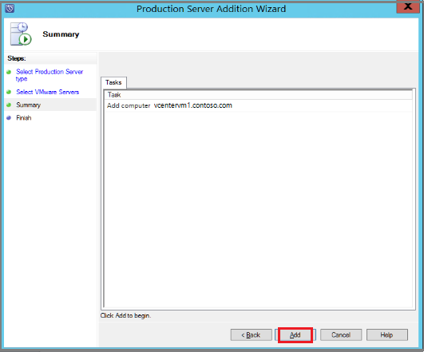

    由于 VMware 服务器备份是不使用代理的备份，因此在数秒内就会添加新服务器。 可以重复本部分中的上述步骤，将多个 VMware 服务器添加到 Azure 备份服务器。

将 VMware 服务器添加到 Azure 备份服务器后，下一步是创建保护组。 保护组指定有关短期或长保留的各种详细信息，并且是定义和应用备份策略的位置。 备份策略是规定何时创建备份以及要备份哪些内容的计划。

## 配置保护组用于备份 VMware 服务器

如果你以前没有用过 System Center Data Protection Manager 或 Azure 备份服务器，请参阅主题[规划磁盘备份](https://technet.microsoft.com/zh-cn/library/hh758026.aspx)来准备硬件环境。 确认已准备好适当的存储后，使用“创建新保护组”向导添加特定的 VM。

1. 在 Azure 备份服务器控制台中单击“保护”，然后在工具功能区中，单击“新建”打开“创建新保护组”向导。

    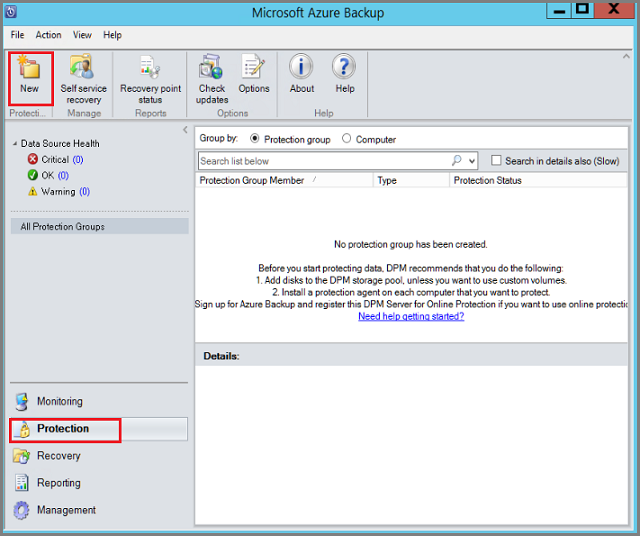

    此时将打开“创建新保护组”向导。

    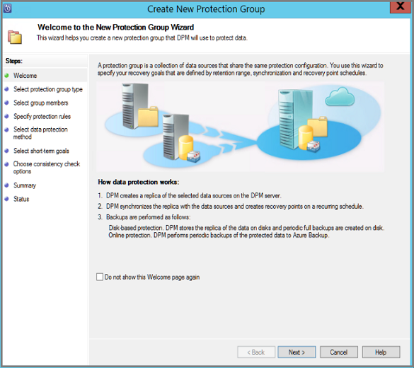

    单击“下一步”转到“选择保护组类型”屏幕。

2. 在“选择保护组类型”屏幕上，选择“服务器”并单击“下一步”。

3. 在“选择组成员”屏幕上，可以看到可用成员和已选择的成员。 选择要保护的成员，然后单击“下一步”。

    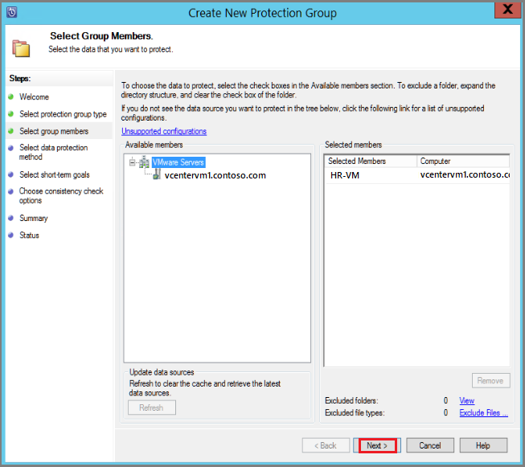

    选择成员时，如果选择某个包含其他文件夹或 VM 的文件夹，则也会选择这些子文件夹和 VM。 在父文件夹中包含文件夹和 VM 称为文件夹级保护。 可以通过取消选中相应的复选框排除任意文件夹或 VM。

    如果某个 VM 或者包含某个 VM 的文件夹已在 Azure 中受保护，则你无法再次选择该 VM。 也就是说，在 Azure 中保护某个 VM 后，无法再次对它进行保护，这是为了防止从一个 VM 创建重复的恢复点。 如果想要查看哪个 Azure 备份服务器已在保护某个成员，请将鼠标悬停在该成员上，这样即可查看保护服务器的名称。

4. 在“选择数据保护方法”屏幕上，键入保护组的名称。 然后，针对“保护方法”选择要将数据备份到的位置。 若要实施短期保护，可将数据备份到磁盘。 若要实施长期保护，可将数据备份到云 (Azure) 中。 单击“下一步”，继续提供短期保护时间范围信息。

    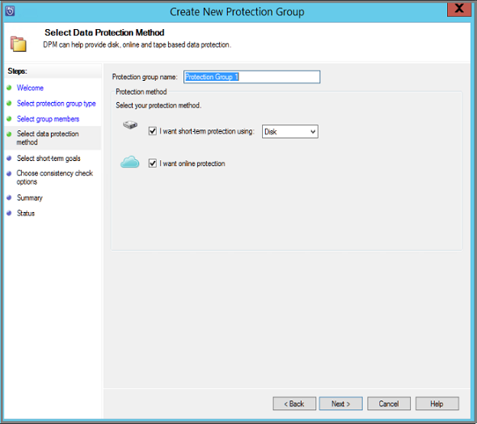

5. 在“指定短期目标”屏幕上，为“保留期”指定*磁盘中存储的*恢复点的保留天数。 如果想要更改恢复点的创建时间和日期，请单击“修改”。 短期恢复点是完整备份， 而不是增量备份。 如果对短期目标感到满意，请单击“下一步”。

    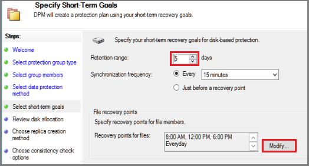

6. 在“检查磁盘分配”屏幕上，检查 VM 的磁盘空间并根据需要进行修改。 建议的磁盘分配基于前一屏幕中指定的保留期、工作负荷的类型，以及受保护数据的大小（在步骤 3 中确定）。  

  - 数据大小 - 保护组中数据的大小。
  - 磁盘空间 - 为保护组建议的磁盘空间量。 如果想要修改此设置，应该分配比预计每个数据源会增长的空间量略大的总空间。
  - 归置数据 - 如果启用归置，受保护的多个数据源可以映射到单个副本和恢复点卷。 并非所有工作负荷都支持归置。
  - 自动增长 - 如果启用此设置，当受保护组中的数据增长率超过初始分配时，DPM 会尝试将磁盘大小增加 25%。
  - 存储池详细信息 - 显示存储池的当前状态，包括总磁盘大小和剩余磁盘大小。

    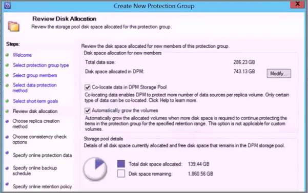

    完成后，请单击“下一步”。

7. 在“选择副本创建方法”屏幕上，指定如何为 Azure 备份服务器上的受保护数据生成初始副本。

    默认设置为“自动通过网络”和“立即”。 如果你使用默认设置，我们建议指定非高峰时间。 选择“稍后”并指定日期和时间。

    如果数据量很大或者网络状态欠佳，请考虑使用可移动媒体脱机复制数据。

    做出选择后，请单击“下一步”。

    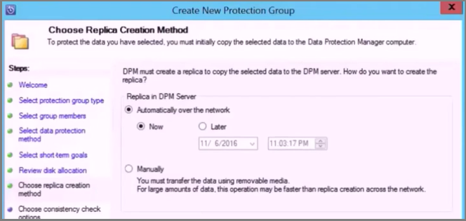

8. 在“一致性检查选项”屏幕上，选择如何以及何时自动执行一致性检查。 当副本数据变得不一致时，可以运行一致性检查；也可以根据设置的计划运行该检查。

    如果不想要配置自动一致性检查，可以随时运行手动检查，方法是：在 Azure 备份服务器控制台的“保护”区域中右键单击保护组，然后选择“执行一致性检查”。

    单击“下一步”转到下一屏幕。

9. 在“指定在线保护数据”屏幕上，选择要保护的数据源。 可以选择单个成员，或者单击“全选”选择所有成员。 选择成员后，请单击*“下一步”。

    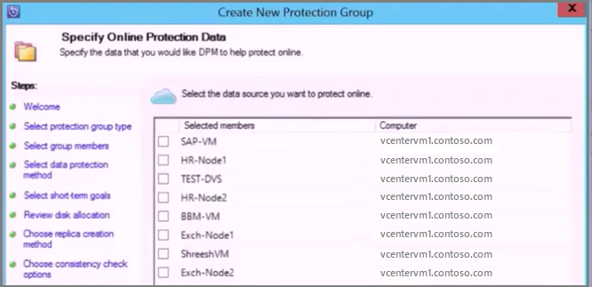

10. 在“指定联机备份计划”屏幕上，指定用于从磁盘备份生成恢复点的计划。 生成恢复点后，该恢复点将传输到 Azure 中的恢复服务保管库。 如果对联机备份计划感到满意，请单击“下一步”。

    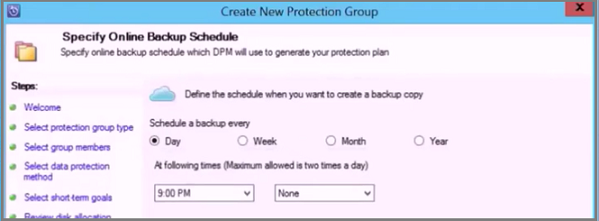

11. 在“指定联机保留策略”屏幕上，指定要在 Azure 中将备份数据保留多久。 定义策略后，请单击“下一步”。

    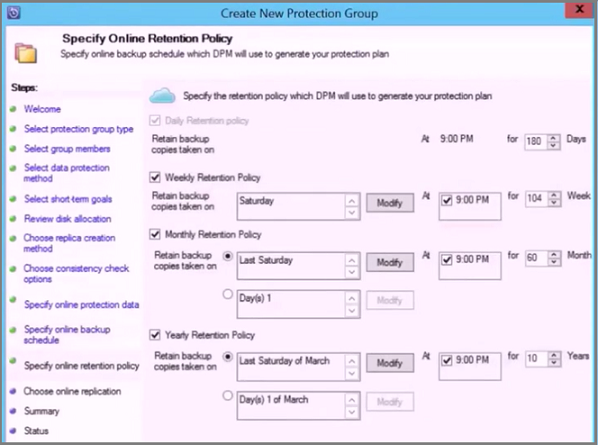

    在 Azure 中保留数据的时间长短没有限制。 在 Azure 中存储恢复点数据时，唯一的限制就是不能为每个受保护的实例存储 9999 个以上的恢复点。 在本示例中，受保护的实例是 VMware 服务器。

12. 在“摘要”屏幕上，检查保护组的详细信息。 请注意组成员和设置。 如果对设置感到满意，请单击“创建组”。

    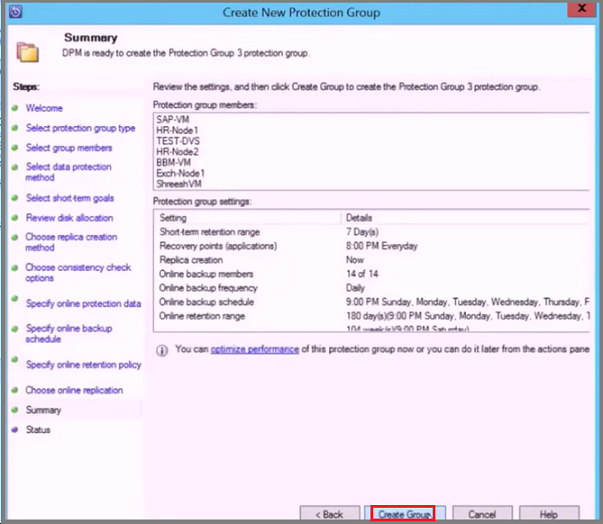

## 后续步骤
可以使用 Azure 备份服务器保护的 VMware 工作负荷包括 [Microsoft Exchange Server](/documentation/articles/backup-azure-exchange-mabs/)、[Microsoft SharePoint 场](/documentation/articles/backup-azure-backup-sharepoint-mabs/)或 [SQL Server](/documentation/articles/backup-azure-sql-mabs/)。

有关如何解决代理注册、保护组配置和备份作业问题的信息，请参阅[排查 Azure 备份服务器问题](/documentation/articles/backup-azure-mabs-troubleshoot/)。

