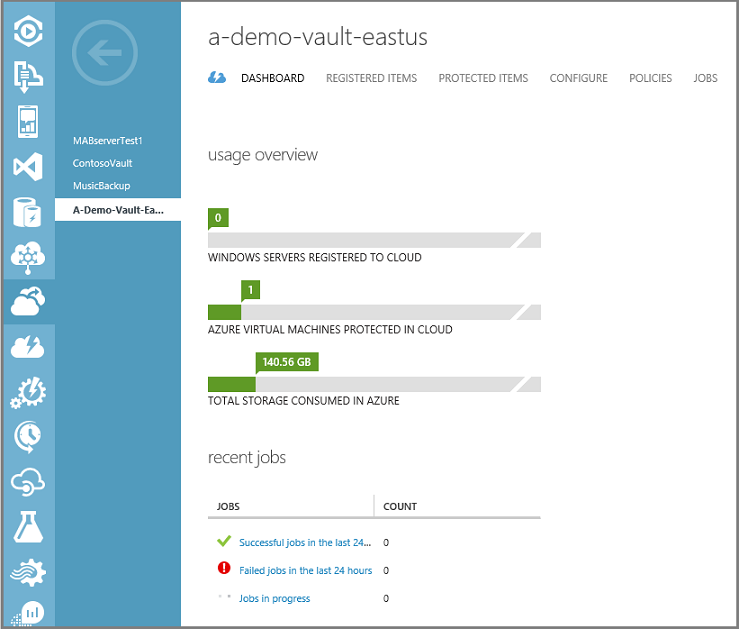
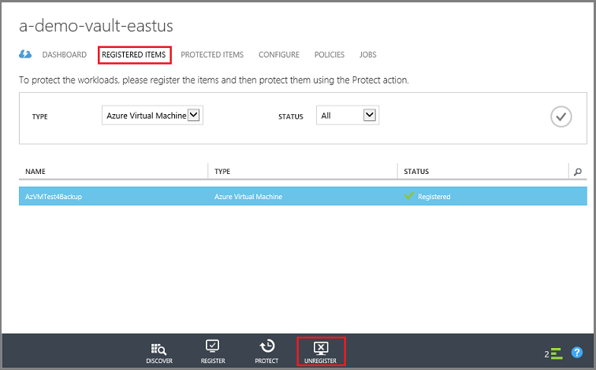

<properties
   pageTitle="删除 Azure 备份保管库 | Azure"
   description="如何删除 Azure 备份保管库。排查为何无法删除备份保管库。"
   services="service-name"
   documentationCenter="dev-center-name"
   authors="markgalioto"
   manager="cfreeman"
   editor=""/>  

<tags
   ms.service="backup"
   ms.devlang="na"
   ms.topic="article"
   ms.tgt_pltfrm="na"
   ms.workload="storage-backup-recovery"
   ms.date="08/29/2016"
   wacn.date="10/26/2016"
   ms.author="markgal;trinadhk"/>  

# 删除 Azure 备份保管库

Azure 备份服务具有两种类型的保管库：备份保管库和恢复服务保管库。首先使用备份保管库。然后使用恢复服务保管库支持扩展的资源管理器部署。由于扩展的功能和信息依赖项必须存储在保管库中，删除恢复服务保管库比想像得要难。

|**部署类型**|**门户**|**保管库名称**|
|--------------|----------|---------|
|经典|经典|备份保管库|
|资源管理器|Azure|恢复服务保管库|

> [AZURE.NOTE] 备份保管库无法保护使用资源管理器部署的解决方案。但是，可以使用恢复服务保管库保护使用经典部署的服务器和 VM。

本文中使用“保管库”一词来泛指备份保管库或恢复服务保管库。需要区分保管库时，则使用正式名称“备份保管库”或“恢复服务保管库”。

## 删除备份保管库

以下说明适用于在经典管理门户中删除备份保管库。删除备份保管库和恢复服务保管库的过程相同：在删除保管库之前，需先删除项和保留的数据。

1. 打开经典管理门户。

2. 从备份保管库列表中，选择要删除的保管库。

      

    此时将打开保管库仪表板。查看与该保管库关联的 Windows Server 和/或 Azure 虚拟机数目。另外，请查看 Azure 中消耗的存储总量。在删除保管库之前，需要停止所有备份作业，然后删除现有数据。

3. 单击“受保护的项”选项卡上，然后单击“停止保护”

      

    此时将显示“停止保护 ‘保管库’”对话框。

4. 在“停止保护 ‘保管库’”对话框中，选中“删除关联的备份数据”，然后单击 。 （可选）可以选择停止保护的原因并提供备注。

      

    删除保管库中的项后，该保管库是空的。

      

5. 在选项卡列表中，单击“已注册的项”。选择保管库中注册的每个项，然后单击“取消注册”。

      

6. 在选项卡列表中，单击“仪表板”打开该选项卡。检查是否不再有已注册的服务器，或者在云中受保护的 Azure 虚拟机。另外，请检查存储中是否没有任何数据。单击“删除”，删除该保管库。

      

    此时将打开“确认删除备份保管库”屏幕。选择一个选项解释为何要删除该保管库，然后单击 。 

      

    该保管库随即已删除，界面返回到经典管理门户仪表板。

<!---HONumber=Mooncake_1017_2016-->
