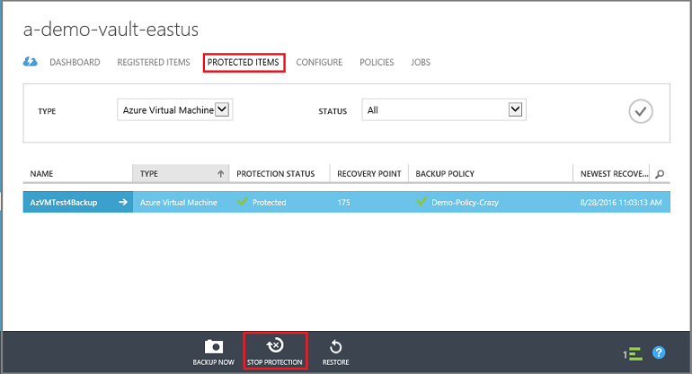

<properties
    pageTitle=" 删除 Azure 中的备份保管库 | Azure "
    description="如何删除 Azure 备份和恢复服务保管库。 备份保管库可以称为 Azure 云保管库或 Azure 恢复保管库。 在经典管理门户无法删除备份保管库时对问题进行故障排除。"
    services="service-name"
    documentationcenter="dev-center-name"
    author="markgalioto"
    manager="carmonm"
    editor=""
    translationtype="Human Translation" />
<tags
    ms.assetid="5fa08157-2612-4020-bd90-f9e3c3bc1806"
    ms.service="backup"
    ms.devlang="na"
    ms.topic="article"
    ms.tgt_pltfrm="na"
    ms.workload="storage-backup-recovery"
    ms.date="3/14/2017"
    wacn.date="04/24/2017"
    ms.author="markgal;trinadhk"
    ms.sourcegitcommit="a114d832e9c5320e9a109c9020fcaa2f2fdd43a9"
    ms.openlocfilehash="89a728b2ede78b04ef58beca7b2545bf505a965d"
    ms.lasthandoff="04/14/2017" />

# 删除 Azure 备份保管库
Azure 备份服务具有两种类型的保管库：备份保管库和恢复服务保管库。 首先使用备份保管库。 随后是恢复服务保管库，用于支持扩展的资源管理器部署。 由于扩展的功能和信息依赖项必须存储在保管库中，删除备份或恢复服务保管库可能会令人感到困惑。 本文介绍如何在经典管理门户中删除保管库。  

| **部署类型** | **门户** | **保管库名称** |
| --- | --- | --- |
| 经典 |经典 |备份保管库 |
| 资源管理器 |Azure |恢复服务保管库 |

> [AZURE.NOTE]
> 备份保管库无法保护使用资源管理器部署的解决方案。 但是，可以使用恢复服务保管库保护使用经典部署的服务器和 VM。  
>
>

本文中使用“保管库”一词来泛指备份保管库或恢复服务保管库。 需要区分保管库时，则使用正式名称“备份保管库”或“恢复服务保管库”。

## 在经典管理门户中删除备份保管库
以下说明适用于在经典管理门户中删除备份保管库。 在删除备份保管库之前，必须删除恢复点或备份项，并删除已注册的服务器。 已注册的服务器为注册到保管库的 Windows Server、工作站或虚拟机。

1. 打开[经典管理门户](https://manage.windowsazure.cn)。

2. 从备份保管库列表中，选择要删除的保管库。

    

    此时将打开保管库仪表板。 查看与该保管库关联的 Windows Server 和/或 Azure 虚拟机数目。 另外，请查看 Azure 中消耗的存储总量。 在删除保管库之前停止所有备份作业并删除所有数据。

3. 单击“**受保护的项**”选项卡上，然后单击“**停止保护**”

    

    此时将显示“**停止保护 ‘保管库’**”对话框。
4. 在“**停止保护‘保管库’**”对话框中，选中“**删除关联的备份数据**”，然后单击。  
   （可选）可以选择停止保护的原因并提供备注。

    

    删除保管库中的项后，该保管库是空的。

    

5. 在选项卡列表中，单击“**已注册的项**”。 在“类型”下拉菜单中可选择注册到保管库的服务器类型。 类型可以是 Windows Server 或 Azure 虚拟机。 在以下示例中，选择注册到保管库的虚拟机，然后单击“取消注册”。

    

    如果要删除 Windows Server 的注册，请从“类型”下拉菜单中选择“Windows Server”，单击以刷新屏幕，然后单击“删除”。  

    

6. 在选项卡列表中，单击“**仪表板**”打开该选项卡。 检查是否不再有已注册的服务器，或者在云中受保护的 Azure 虚拟机。 另外，请检查存储中是否没有任何数据。 单击“**删除**”，删除该保管库。

    

    此时将打开“确认删除备份保管库”屏幕。 选择一个选项解释为何要删除该保管库，然后单击 。  

    

    该保管库随即已删除，界面返回到经典管理门户仪表板。

<!---Update_Description: wording update -->