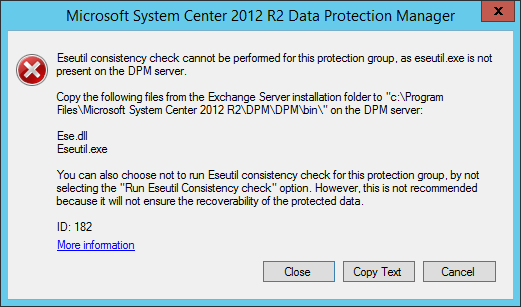
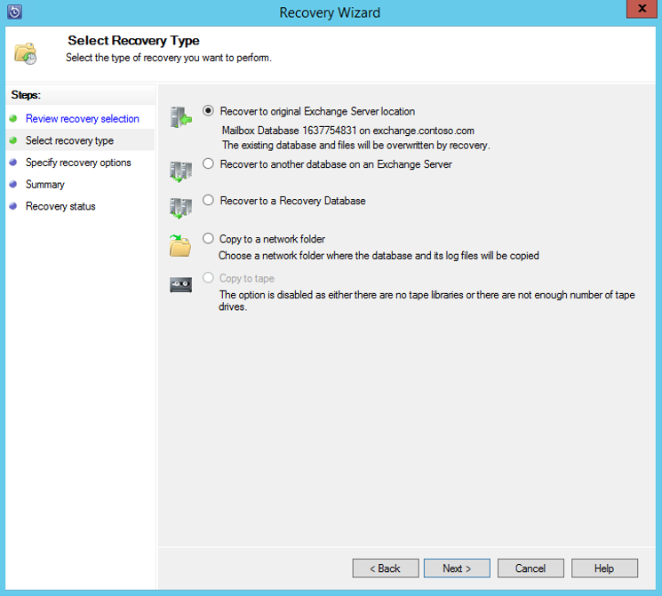

<properties
    pageTitle="使用 Azure 备份服务器将 Exchange Server 备份到 Azure 备份 | Azure"
    description="了解如何使用 Azure 备份服务器将 Exchange Server 备份到 Azure 备份"
    services="backup"
    documentationcenter=""
    author="pvrk"
    manager="shivamg"
    editor="" />
<tags
    ms.assetid="e46557e8-2eaf-4ee0-99ea-00fbb8687dca"
    ms.service="backup"
    ms.workload="storage-backup-recovery"
    ms.tgt_pltfrm="na"
    ms.devlang="na"
    ms.topic="article"
    ms.date="03/24/2017"
    ms.author="pullabhk"
    wacn.date="05/15/2017"
    ms.translationtype="Human Translation"
    ms.sourcegitcommit="3ff18e6f95d8bbc27348658bc5fce50c3320cf0a"
    ms.openlocfilehash="6de56914a49bcbc07fef485edc045ca2a691ecbf"
    ms.contentlocale="zh-cn"
    ms.lasthandoff="05/15/2017" />

# 使用 Azure 备份服务器将 Exchange Server 备份到 Azure 备份
本文说明如何配置 Azure 备份服务器 (MABS)，将 Microsoft Exchange Server 备份到 Azure。  

## 先决条件
在继续之前，请确保 Azure 备份服务器[已安装且已准备好](/documentation/articles/backup-azure-microsoft-azure-backup-classic/)。

## MABS 保护代理
若要在 Exchange Server 上安装 MABS 保护代理，请遵循以下步骤：

1. 确保已正确配置防火墙。 请参阅[配置代理的防火墙异常](https://technet.microsoft.com/zh-cn/library/Hh758204.aspx)。
2. 通过在 MABS 管理员控制台中单击“管理”>“代理”>“安装”，在 Exchange Server 上安装代理。 有关详细步骤，请参阅[安装 MABS 保护代理](https://technet.microsoft.com/zh-cn/library/hh758186.aspx?f=255&MSPPError=-2147217396)。

## 为 Exchange Server 创建保护组
1. 在 MABS 管理员控制台中，单击“保护”，然后单击工具功能区上的“新建”，打开“新建保护组”向导。
2. 在向导的“**欢迎**”屏幕上单击“**下一步**”。
3. 在“**选择保护组类型**”屏幕上，选择“**服务器**”并单击“**下一步**”。
4. 选择想要保护的 Exchange Server 数据库，然后单击“**下一步**”。

    > [AZURE.NOTE]
    > 如果要保护 Exchange 2013，请检查 [Exchange 2013 先决条件](https://technet.microsoft.com/zh-cn/library/dn751029.aspx)。
    >
    >

    下例中选择了Exchange 2010 数据库。

    
5. 选择数据保护方法。

    为保护组命名，然后选择以下两个选项：

   - 我想要使用磁盘提供短期保护。
   - 我想要使用在线保护。
6. 单机“下一步”
7. 如果想要检查 Exchange Server 数据库的完整性，请选择“**运行 Eseutil 以检查数据完整性**”选项。

    选择此选项后，将在 MABS 服务器上运行备份一致性检查，以避免由于在 Exchange Server 上运行 **eseutil** 命令而产生的 I/O 流量。

    > [AZURE.NOTE]
    > 若要使用此选项，必须将 Ese.dll 和 Eseutil.exe 文件复制到 MAB 服务器上的 C:\Program Files\Azure Backup\DPM\DPM\bin 目录中。 否则会触发以下错误：  
    > 
    >
    >
8. 单机“下一步”
9. 选择“**复制备份**”的数据库，然后单击“**下一步**”。

    > [AZURE.NOTE]
    > 如果未针对数据库的至少一个 DAG 副本选择“完全备份”，则不会截断日志。
    >
    >
10. 配置“**短期备份**”的目标，然后单击“**下一步**”。
11. 检查可用磁盘空间，然后单击“**下一步**”。
12. 选择 MAB 服务器创建初始复制的时间，然后单击“下一步”。
13. 选择一致性检查选项，然后单击“**下一步**”。
14. 选择要备份到 Azure 数据库，然后单击“**下一步**”。 例如：

    
15. 定义“**Azure 备份**”的计划，然后单击“**下一步**”。 例如：

    

    > [AZURE.NOTE]
    > 请注意，在线恢复点基于快速完全恢复点。 因此，必须将在线恢复点安排在针对快速完全恢复点指定的时间之后。
    >
    >
16. 配置“**Azure 备份**”的保留策略，然后单击“**下一步**”。
17. 选择在线复制选项并单击“**下一步**”。

    如果你有大型数据库，通过网络创建初始备份所需的时间会很长。 可以通过创建脱机备份避免此问题。  

    
18. 确认设置，然后单击“**创建组**”。
19. 单击“**关闭**”。

## 恢复 Exchange 数据库
1. 若要恢复 Exchange 数据库，请在 MABS 管理员控制台中单击“恢复”。
2. 找到要恢复的 Exchange 数据库。
3. 从“*恢复时间*”下拉列表中选择在线恢复点。
4. 单击“**恢复**”启动“**恢复向导**”。

在线恢复点有五种恢复类型：

- **恢复到原始 Exchange Server 位置：** 数据将恢复到原始 Exchange Server。
- **恢复到 Exchange Server 上的其他数据库：**数据将恢复到其他 Exchange Server 上的其他数据库。
- **恢复到恢复数据库：**数据将恢复到 Exchange 恢复数据库 (RDB)。
- **复制到网络文件夹：**数据将恢复到网络文件夹。
- **复制到磁带：**如果 MABS 上附加并配置了磁带库或独立的磁带驱动器，则恢复点将复制到可用的磁带。

    

## 后续步骤
- [Azure 备份常见问题](/documentation/articles/backup-azure-backup-faq/)

