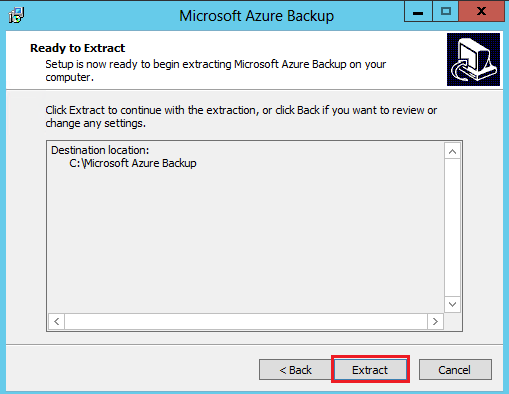
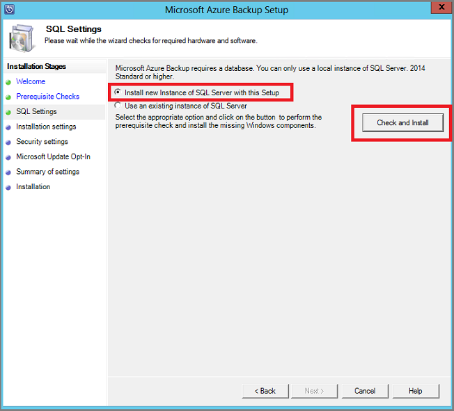
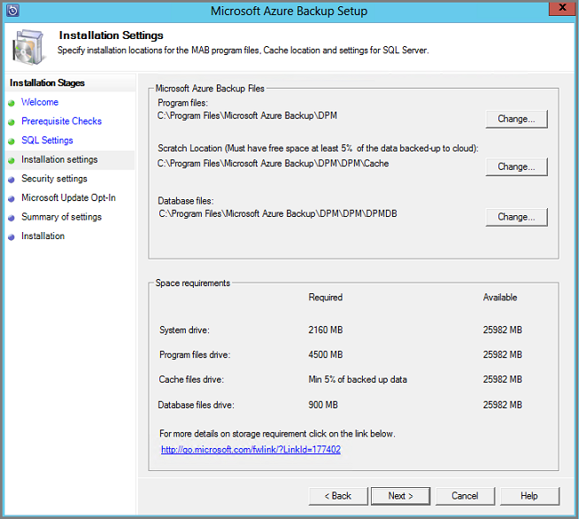
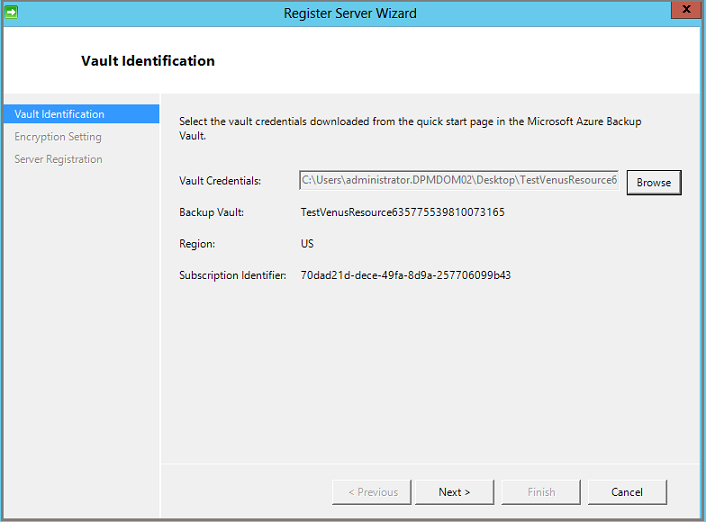

<properties
  pageTitle="准备环境以使用 Azure 备份服务器来备份工作负荷 | Azure"
  description="确保正确准备好你的环境，以使用 Azure 备份服务器来备份工作负荷"
  services="backup"
  documentationCenter=""
  authors="trinadhk"
  manager="shreeshd"
  editor=""
  keywords="azure 备份的服务器;备份保管库"/>

<tags
  ms.service="backup"
  ms.workload="storage-backup-recovery"
  ms.tgt_pltfrm="na"
  ms.devlang="na"
  ms.topic="article"
  ms.date="01/10/2017"
  wacn.date="03/31/2017"
  ms.author="jimpark;trinadhk;pullabhk;markgal"/>

# 准备使用 Azure 备份服务器来备份工作负荷

> [AZURE.SELECTOR]
- [Azure 备份服务器（经典）](/documentation/articles/backup-azure-microsoft-azure-backup-classic/)
- [SCDPM（经典）](/documentation/articles/backup-azure-dpm-introduction-classic/)

本文介绍如何准备环境，以使用 Azure 备份服务器来备份工作负荷。

> [AZURE.NOTE] Azure 有两种用于创建和使用资源的部署模型：[Resource Manager 和经典部署模型](/documentation/articles/resource-manager-deployment-model/)。本文提供有关还原使用 Resource Manager 模型部署的 VM 的信息和过程。

使用 Azure 备份服务器，可以从单个控制台保护应用程序工作负荷，例如 Hyper-V VM、Microsoft SQL Server、SharePoint Server、Microsoft Exchange 和 Windows 客户端。

>[AZURE.WARNING] Azure 备份服务器继承了 Data Protection Manager (DPM) 的工作负荷备份功能。本文提供了其中一些功能的 DPM 文档链接。不过，Azure 备份服务器不能在磁带上提供保护，也没有与 System Center 集成。

## 1\.Windows Server 计算机

若要启动并运行 Azure 备份服务器，第一个步骤是部署一台 Windows Server 计算机。

| 位置 | 最低要求 | 其他说明 |
| -------- | -------------------- | ----------------------- |
| Azure | Azure IaaS 虚拟机  A2 标准：双核，3.5GB RAM | 可以先从 Windows Server 2012 R2 Datacenter 的简单库映像着手。[使用 Azure 备份服务器 (DPM) 保护 IaaS 工作负荷](https://technet.microsoft.com/zh-cn/library/jj852163.aspx)有许多细节需要注意。部署计算机之前，请务必阅读相关文章。 |
| 本地 | Hyper-V VM、 VMWare VM  或物理主机  双核，4GB RAM | 可以使用 Windows Server 重复数据删除来删除 DPM 存储中的重复数据。了解有关在 Hyper-V VM 中部署时，[DPM 和重复数据删除](https://technet.microsoft.com/zh-cn/library/dn891438.aspx)如何配合工作的详细信息。 |

> [AZURE.NOTE] 建议在包含 Windows Server 2012 R2 Datacenter 的计算机上安装 Azure 备份服务器。最新版本的 Windows 操作系统会自动安装许多必备组件。

如果你打算在将来某个时间将此服务器加入域中，建议在安装 Azure 备份服务器之前完成域加入活动。部署之后，不支持将现有 Azure 备份服务器计算机移到新域中。

## 2\.恢复服务保管库

1. 首先使用以下命令行登录你的 Azure 订阅。

        Login-AzureRmAccount -EnvironmentName AzureChinaCloud

1. 如果你是首次使用 Azure 备份，则必须使用 **[Register-AzureRMResourceProvider](https://msdn.microsoft.com/zh-cn/library/mt603685.aspx)** cmdlet 注册用于订阅的 Azure 恢复服务提供程序。

        Register-AzureRmResourceProvider -ProviderNamespace "Microsoft.RecoveryServices"

2. 恢复服务保管库是一种 Resource Manager 资源，因此需要将它放在资源组中。你可以使用现有的资源组，也可以使用 **[New-AzureRmResourceGroup](https://msdn.microsoft.com/zh-cn/library/mt603739.aspx)** cmdlet 创建新的资源组。创建新的资源组时，请指定资源组的名称和位置。

        New-AzureRmResourceGroup –Name "test-rg" –Location "China North"

3. 使用 **[New-AzureRmRecoveryServicesVault](https://msdn.microsoft.com/zh-cn/library/mt643910.aspx)** cmdlet 创建新的保管库。确保为保管库指定的位置与用于资源组的位置是相同的。

        New-AzureRmRecoveryServicesVault -Name "testvault" -ResourceGroupName " test-rg" -Location "West US"

4. 指定要使用的存储冗余类型；你可以使用[本地冗余存储 (LRS)](/documentation/articles/storage-redundancy/#locally-redundant-storage) 或[异地冗余存储 (GRS)](/documentation/articles/storage-redundancy/#geo-redundant-storage)。以下示例显示，testVault 的 -BackupStorageRedundancy 选项设置为 GeoRedundant。

        $vault1 = Get-AzureRmRecoveryServicesVault –Name "testVault"
        Set-AzureRmRecoveryServicesBackupProperties  -Vault $vault1 -BackupStorageRedundancy GeoRedundant

## 3\.软件包

### 下载软件包
1. 使用以下 PowerShell 脚本下载保管库凭据。

        $vault1 = Get-AzureRmRecoveryServicesVault –Name “testVault”
        $credspath = "C:\downloads"
        $credsfilename = Get-AzureRmRecoveryServicesVaultSettingsFile -Backup -Vault $vault1 -Path  $credspath

1. 点击[这里](https://go.microsoft.com/fwLink/?LinkID=626082&clcid=0x0409)下载软件包。

8. 选择所有文件，然后单击“下一步”。下载 Microsoft Azure 备份下载页中的所有文件，并将所有文件放在同一个文件夹中。

    

    由于所有文件的下载大小合计超过了 3G，在 10Mbps 下载链路上可能需要 60 分钟才能完成下载。

### 解压缩软件包

下载所有文件之后，单击“MicrosoftAzureBackupInstaller.exe”。这将启动“Microsoft Azure 备份安装向导”，并将安装程序文件解压缩到指定的位置。继续运行向导，然后单击“解压缩”按钮开始解压缩过程。

> [AZURE.WARNING] 至少需要有 4GB 的可用空间才能解压缩安装程序文件。

解压缩过程完成后，请选中相应的框，以启动刚刚解压缩的 *setup.exe* 来开始安装 Microsoft Azure 备份服务器，然后单击“完成”按钮。

### 安装软件包

1. 单击“Microsoft Azure 备份”以启动安装向导。

    

2. 在“欢迎”屏幕上单击“下一步”按钮。随后你将转到“先决条件检查”部分。在此屏幕上单击“检查”按钮，以确定是否符合 Azure 备份服务器的硬件和软件先决条件。如果完全符合所有先决条件，将有一条消息指出计算机符合要求。单击“下一步”按钮。

    

3. Microsoft Azure 备份服务器需要 SQL Server Standard，而 Azure 备份服务器安装包会根据需要随附相应的 SQL Server 二进制文件。在开始全新安装 Azure 备份服务器时，应该选择“在此安装程序中安装新的 SQL Server 实例”，然后单击“检查并安装”按钮。成功安装必备组件后，单击“下一步”。

    

    如果发生故障并且系统建议重新启动计算机，请按说明操作，然后单击“再次检查”。

    > [AZURE.NOTE] Azure 备份服务器不能与远程 SQL Server 实例配合使用。Azure 备份服务器使用的实例需在本地。

4. 提供 Microsoft Azure 备份服务器文件的安装位置，然后单击“下一步”。

    

    备份到 Azure 需要有暂存位置。请确保暂存位置的空间至少为要备份到云的数据的 5%。在磁盘保护方面，安装完成之后需要配置独立的磁盘。有关存储池的详细信息，请参阅[配置存储池和磁盘存储](https://technet.microsoft.com/zh-cn/library/hh758075.aspx)。

5. 为受限的本地用户帐户提供强密码，然后单击“下一步”。

    

6. 选择是否要使用 Microsoft 更新来检查更新，然后单击“下一步”。

    >[AZURE.NOTE] 我们建议让 Windows 更新重定向到 Microsoft 更新，此网站为 Windows 和 Microsoft Azure 备份服务器等其他产品提供了安全更新与重要更新。

    

7. 复查“设置摘要”，然后单击“安装”。

    

8. 安装将会分阶段进行。第一个阶段，将在服务器上安装 Microsoft Azure 恢复服务代理。向导还会检查 Internet 连接。如果可以连接到 Internet，则你可以继续安装，否则需要提供代理详细信息以连接到 Internet。

    下一个步骤是配置 Microsoft Azure 恢复服务代理。在配置过程中，必须提供保管库凭据，以向恢复服务保管库注册计算机。还需要提供通行短语来加密/解密 Azure 与本地之间发送的数据。你可以自动生成通行短语，或提供自己的通行短语（最少包含 16 个字符）。请继续运行向导，直到代理已完成配置。

    

9. Microsoft Azure 备份服务器注册成功完成后，整个安装向导将继续安装和配置 SQL Server 及 Azure 备份服务器的组件。SQL Server 组件安装完成后，将安装 Azure 备份服务器组件。

    

安装步骤完成后，会一同创建产品的桌面图标。双击该图标即可启动该产品。

### 添加备份存储

第一个备份副本保存在已附加到 Azure 备份服务器计算机的存储中。有关添加磁盘的详细信息，请参阅[配置存储池和磁盘存储](https://technet.microsoft.com/zh-cn/library/hh758075.aspx)。

> [AZURE.NOTE] 即使你打算将数据发送到 Azure，也需要添加备份存储。在当前的 Azure 备份服务器体系结构中，Azure 备份保管库将保存数据的第二个副本，而本地存储将保存第一个（必需的）备份副本。

## 4\.网络连接

Azure 备份服务器需要连接到 Azure 备份服务才能成功运行。若要验证计算机是否已连接到 Azure，请在Azure 备份服务器 PowerShell 控制台中使用 `Get-DPMCloudConnection` cmdlet。如果该 cmdlet 的输出为 TRUE，则表示已建立连接，否则表示未建立连接。

同时，Azure 订阅必须处于正常运行状态。若要了解订阅的状态并对其进行管理，请登录到[订阅门户](https://account.windowsazure.cn/Subscriptions)。

了解 Azure 连接和 Azure 订阅的状态后，可以使用下表来确定提供的备份/还原功能受到了哪些影响。

| 连接状态 | Azure 订阅 | 备份到 Azure| 备份到磁盘 | 从 Azure 还原 | 从磁盘还原 |
| -------- | ------- | --------------------- | ------------------- | --------------------------- | ----------------------- |
| 已连接 | 活动 | 允许 | 允许 | 允许 | 允许 |
| 已连接 | 已过期 | 已停止 | 已停止 | 允许 | 允许 |
| 已连接 | 已取消预配 | 已停止 | 已停止 | 已停止且已删除 Azure 恢复点 | 已停止 |
| 连接断开超过 15 天 | 活动 | 已停止 | 已停止 | 允许 | 允许 |
| 连接断开超过 15 天 | Expired | 已停止 | 已停止 | 允许 | 允许 |
| 连接断开超过 15 天 | 已取消预配 | 已停止 | 已停止 | 已停止且已删除 Azure 恢复点 | 已停止 |

### 连接断开后进行恢复
如果你的防火墙或代理导致无法访问 Azure，需要将防火墙/代理配置文件中的以下域地址列入允许列表：

- www.msftncsi.com
- \*.Microsoft.com
- \*.WindowsAzure.com
- \*.microsoftonline.com
- \*.windows.net

在 Azure 备份服务器计算机上还原与 Azure 的连接之后，可执行的操作取决于 Azure 订阅状态。上表详细列出了有关计算机在“连接”之后允许的操作的信息。

### 处理订阅状态

可以将 Azure 订阅从“已过期”或“已取消预配”状态更改为“活动”状态。但是，当状态不是“活动”时，此操作对产品的行为会造成某些影响：

- “已取消预配”的订阅在取消预配的这段期间将失去功能。切换为“活动”后，将恢复产品的备份/还原功能。此外，只要以够长的保留期来保存本地磁盘上的备份数据，则还可以检索这些数据。但是，一旦订阅进入“已取消预配”状态，Azure 中的备份数据便会无可挽回地丢失。
- “已过期”的订阅只会在恢复“活动”状态之前失去功能。在订阅处于“已过期”期间计划的任何备份都不会运行。

## 故障排除

如果 Microsoft Azure 备份服务器在安装阶段（或者备份或还原时）失败并出现错误，请参阅此[错误代码文档](https://support.microsoft.com/kb/3041338)以获取详细信息。
此外，还可以参考 [Azure 备份相关的常见问题](/documentation/articles/backup-azure-backup-faq/)

## 后续步骤

可以在 Microsoft TechNet 站点上获取有关[为 DPM 准备环境](https://technet.microsoft.com/zh-cn/library/hh758176.aspx)的详细信息。其中还包含有关可在其上部署和使用 Azure 备份服务器的受支持配置的信息。

请参阅这些文章，以深入了解如何使用 Microsoft Azure 备份服务器来保护工作负荷。

- [SQL Server 备份](/documentation/articles/backup-azure-backup-sql/)
- [SharePoint Server 备份](/documentation/articles/backup-azure-backup-sharepoint/)
- [备用服务器备份](/documentation/articles/backup-azure-alternate-dpm-server/)

<!---HONumber=Mooncake_0808_2016-->