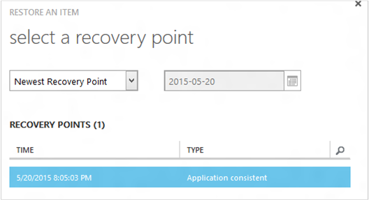
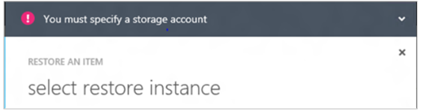
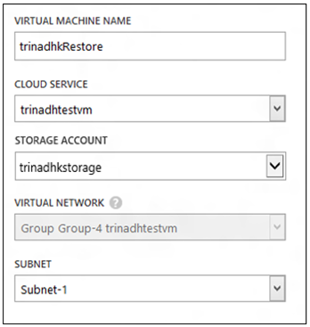
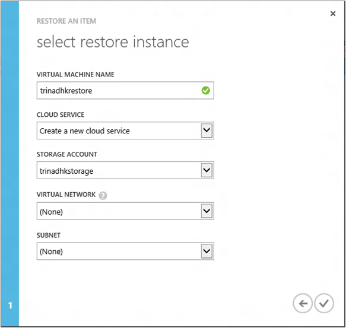
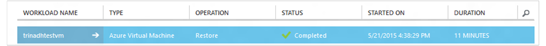

<properties
	pageTitle="从备份中还原虚拟机 | Azure"
	description="了解如何从恢复点还原 Azure 虚拟机"
	services="backup"
	documentationCenter=""
	authors="trinadhk"
	manager="shreeshd"
	editor=""
	keywords="还原备份; 如何还原; 恢复点;"/>

<tags
	ms.service="backup"
	ms.date="05/06/2016"
	wacn.date="06/06/2016"/>

# 还原 Azure 中的虚拟机

执行以下步骤，通过存储在 Azure 备份保管库中的备份将虚拟机还原到新的 VM。

## 还原工作流
### 1\.选择要还原的项

1. 导航到“受保护的项”选项卡，然后选择你要还原到新 VM 的虚拟机。

    

    “受保护的项”页中的“恢复点”字段显示了虚拟机的恢复点数目。“最新恢复点”字段显示了可从中还原虚拟机的最近备份。

2. 单击“还原”打开“还原项”向导。

    

### 2\.选择恢复点

1. 在“选择恢复点”屏幕中，你可以从最新的恢复点进行恢复，或者从以前的某个时间点进行恢复。向导打开时默认选择的选项是“最新恢复点”。

    

2. 若要选择更早的时间点，请在下拉列表中选择“选择日期”选项，并通过单击**日历图标**，在日历控件中选择一个日期。在控件中，所有具有恢复点的日期以浅灰色阴影填充，并可供用户选择。

    

    在你单击日历控件中的日期后，该日可用的恢复点将显示在下面的恢复点表中。“时间”列指示生成快照的时间。“类型”列显示恢复点的[一致性](/documentation/articles/backup-azure-vms/#consistency-of-recovery-points)。表标题在括号中显示该日期可用的恢复点数目。

    

3. 从“恢复点”表中选择恢复点，然后单击“下一步”箭头转到下一个屏幕。

### 3\.指定目标位置

1. 在“选择还原实例”屏幕中，指定有关要将虚拟机还原到何处的详细信息。

  - 指定虚拟机名称：在指定的云服务中，虚拟机名称应该是唯一的。不支持覆盖现有 VM。 
  - 选择 VM 的云服务：这是创建 VM 的必要步骤。你可以选择使用现有的云服务，或创建新的云服务。

        无论选取怎样的云服务名称，云服务名称都应是全局唯一的。通常，云服务名称与 [cloudservice].chinacloudapp.net 形式的面向公众的 URL 关联。如果该名称已被使用，Azure 不会允许你创建新的云服务。如果你选择创建新的云服务，它将被提供与虚拟机相同的名称，在这种情况下，选取的 VM 名称应具有充分的唯一性才能应用到关联的云服务。

        我们仅在还原实例详细信息中显示与任何地缘组未关联的云服务和虚拟网络。[了解详细信息](/documentation/articles/virtual-networks-migrate-to-regional-vnet/)。

2. 选择 VM 的存储帐户：这是创建 VM 的必要步骤。你可以选择与 Azure 备份保管库位于相同区域的现有存储帐户。不支持区域冗余或高级存储类型的存储帐户。

    如果没有受支持配置的存储帐户，请在启动还原操作之前创建一个具有受支持配置的存储帐户。

    

3. 选择虚拟网络：在创建 VM 时应该已经选择了虚拟机的虚拟网络 (VNET)。还原 UI 将显示此订阅中所有可用的 VNET。为已还原的 VM 选择 VNET 不是必要步骤 – 即使不应用 VNET，你也可以通过 Internet 连接到已还原的虚拟机。

    如果选择的云服务与虚拟网络关联，则你无法更改虚拟网络。

    

4. 选择子网：如果 VNET 有子网，默认选择的选项为第一个子网。从下拉选项中选择你想要的子网。有关子网详细信息，请转到[经典管理门户主页](https://manage.windowsazure.cn/)中的“网络”扩展，然后转到“虚拟网络”并在选择虚拟网络后，向下钻取到“配置”以查看子网详细信息。

    

5. 在向导中单击“提交”图标以提交详细信息并创建还原作业。

## 跟踪还原操作
在还原向导中输入所有信息并提交后，Azure 备份将尝试创建一个作业来跟踪还原操作。

如果成功创建作业，会出现一条 toast 通知，指出作业已创建。你可以单击“查看作业”按钮进入“作业”选项卡，以获取更多详细信息。

还原操作完成后，系统将在“作业”选项卡中将其标记为已完成。

还原虚拟机后，你可能需要重新安装原始 VM 上的扩展，并在 Azure 经典管理门户中为虚拟机[修改终结点](/documentation/articles/virtual-machines-set-up-endpoints/)。

## 备份已还原的 VM
如果将 VM 还原到的云服务与最初备份 VM 时所在的云服务同名，则还原之后，会继续备份该 VM。如果将 VM 还原到了不同的云服务或者为还原的 VM 指定了不同的名称，则系统会将此 VM 视为新 VM，因此你需要为还原的 VM 设置备份。

## 在发生 Azure 数据中心灾难期间还原 VM
如果运行已备份 VM 的主数据中心遇到灾难性故障，并且你已将备份保管库配置为异地冗余，则 Azure 备份允许将该 VM 还原到配对的数据中心。在这种情况下，需要选择一个在配对数据中心内存在的存储帐户，而余下的还原过程将保持不变。Azure 备份使用配对地区中的计算服务来创建还原的虚拟机。

## 还原域控制器 VM
Azure 备份支持对域控制器 (DC) 虚拟机进行备份的方案。但在还原过程中，你必须谨慎操作。在单 DC 配置中，域控制器 VM 的还原体验大大不同于多 DC 配置中的 VM。

### 单 DC
可以通过 Azure 经典管理门户或 PowerShell 还原该 VM（与任何其他 VM 一样）。

### 多 DC
当你的环境为多 DC 环境时，域控制器有自己的数据同步方式。在不提供相应预防措施的情况下还原较旧的备份点时，USN 回退过程可能会在多 DC 环境中造成破坏。恢复此类 VM 的正确方法是在 DSRM 模式下启动它。

需要解决的难题是，DSRM 模式不存在于 Azure 中。因此若要还原此类 VM，不能使用 Azure 经典管理门户。唯一支持的还原机制是使用 PowerShell 进行基于磁盘的还原。

>[AZURE.WARNING]对于多 DC 环境中的域控制器 VM，请勿使用 Azure 经典管理门户来还原！ 仅支持基于 PowerShell 的还原

阅读更多内容，了解 [USN 回退问题](https://technet.microsoft.com/library/dd363553)以及建议的问题解决策略。

## 还原采用特殊网络配置的 VM
Azure 备份支持备份虚拟机的以下特殊网络配置。

- 采用负载平衡器的 VM（内部和外部）
- 具有多个保留 IP 的 VM
- 具有多个 NIC 的 VM

还原这些配置时，必须注意以下事项。

>[AZURE.TIP]还原后，请使用基于 PowerShell 的还原流程来重新创建 VM 的特殊网络配置。

### 从 UI 还原：
从 UI 还原时，请**始终选择新的云服务**。请注意，由于经典管理门户在执行还原流程时只接受强制参数，因此使用 UI 还原的 VM 将会丢失它们拥有的特殊网络配置。也就是说，还原后的 VM 将会是普通的 VM，而没有负载平衡器配置、多个 NIC 或多个保留 IP。

### 从 PowerShell 还原：
PowerShell 能够只从备份还原 VM 磁盘，而不建立虚拟机。当还原需要上述特殊网络配置的虚拟机时，此方法很有用。

若要在还原磁盘后完全重新创建虚拟机，请执行以下步骤：

1. 使用 [Azure 备份 PowerShell](/documentation/articles/backup-azure-vms-automation/#restore-an-azure-vm) 从备份保管库还原磁盘

2. 使用 PowerShell cmdlet 创建负载平衡器/多个 NIC/多个保留 IP 所需的 VM 配置，并使用该配置创建具有所需配置的 VM。
	- 创建具有[多个 NIC](/documentation/articles/virtual-networks-multiple-nics/) 的 VM
	- 具有[多个保留 IP](/documentation/articles/virtual-networks-reserved-public-ip/) 的 VM
  

## 后续步骤
- [排查错误](/documentation/articles/backup-azure-vms-troubleshoot/#restore)
- [管理虚拟机](/documentation/articles/backup-azure-manage-vms/)

<!---HONumber=Mooncake_0530_2016-->