<properties
    pageTitle="使用经典部署模型将数据还原到 Windows Server 或 Windows 客户端 | Azure"
    description="了解如何从 Windows Server 或 Windows 客户端还原。"
    services="backup"
    documentationcenter=""
    author="saurabhsensharma"
    manager="shivamg"
    editor="" />
<tags
    ms.assetid="85585dfc-c764-4e8c-8f0e-40b969640ac2"
    ms.service="backup"
    ms.workload="storage-backup-recovery"
    ms.tgt_pltfrm="na"
    ms.devlang="na"
    ms.topic="article"
    ms.date="1/31/2017"
    wacn.date="03/20/2017"
    ms.author="saurse;trinadhk;markgal;" />  

# 使用经典部署模型将文件还原到 Windows Server 或 Windows 客户端计算机

> [AZURE.SELECTOR]
- [资源管理器模型](/documentation/articles/backup-azure-restore-windows-server/)
- [经典部署模型](/documentation/articles/backup-azure-restore-windows-server-classic/)

本文介绍如何从备份保管库还原数据。若要还原数据，请在 Azure 恢复服务 (MARS) 代理中使用“恢复数据”向导。还原数据时，可以采用以下方式：

- 将数据还原到备份时所在的同一台计算机。
- 将数据还原到备用计算机。

2017 年 1 月，Microsoft 发布了 MARS 代理的预览版更新。除 Bug 修复外，此更新还启用了“即时还原”，允许用户将可写入的恢复点快照装载为恢复卷。随后即可浏览恢复卷，并将文件复制到本地计算机，从而选择性地还原文件。

> [AZURE.NOTE]
若要使用“即时还原”还原数据，必须安装 [2017 年 1 月 Azure 备份更新](https://support.microsoft.com/zh-cn/help/3216528?preview)。此外，必须在支持文章所列区域中的保管库内保护备份数据。请查阅 [2017 年 1 月 Azure 备份更新](https://support.microsoft.com/zh-cn/help/3216528?preview)，获取支持“即时还原”的区域的最新列表。“即时还原”目前**并非**在所有区域都可用。
>

“即时还原”可以在经典管理门户的备份保管库中使用。如果要使用“即时还原”，请下载 MARS 更新，并按照提及“即时还原”的过程进行操作。

## 使用“即时还原”将数据恢复到同一台计算机

如果你意外删除了某个文件并想要在同一台计算机（备份位置）中还原文件，以下步骤可帮助你恢复数据。

1. 打开 **Azure 备份**管理单元。 如果不知道该管理单元的安装位置，请在计算机或服务器中搜索“Azure 备份”。

    该桌面应用应会显示在搜索结果中。

2. 单击“恢复数据”启动向导。

      

3. 若要将数据还原到同一台服务器或计算机，请在“开始”窗格中选择“此服务器(`<server name>`)”，然后单击“下一步”。

    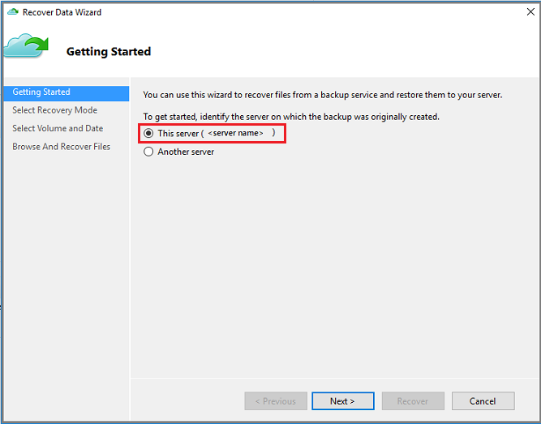  

4. 在“选择恢复模式”窗格中选择“单个文件和文件夹”，然后单击“下一步”。

      

5. 在“选择卷和日期”窗格中，选择包含想要还原的文件和/或文件夹的卷。

    在日历中选择恢复点。可从任意恢复时间点还原。以**粗体**显示的日期表示至少有一个可用的恢复点。选择日期后，如果有多个恢复点可用，请从“时间”下拉菜单中选择特定的恢复点。

    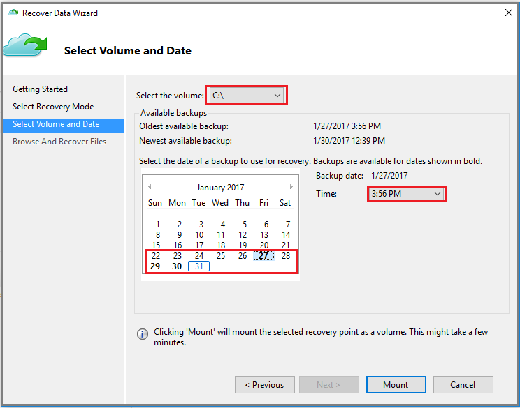  

6. 选择要还原的恢复点后，单击“装载”。

    Azure 备份将装载本地恢复点，并将其用作恢复卷。

7. 在“浏览和恢复文件”窗格中，单击“浏览”打开 Windows 资源管理器并找到所需的文件和文件夹。

    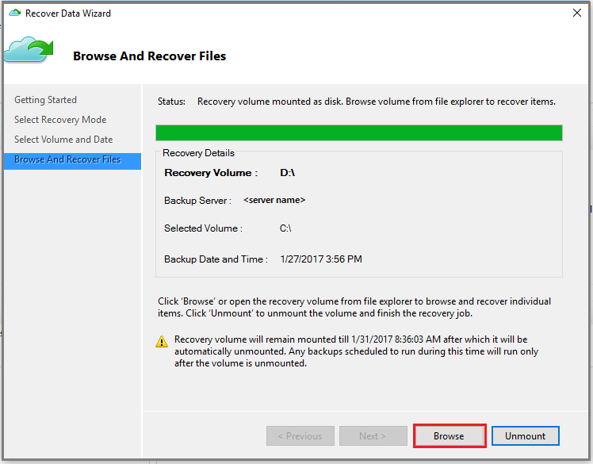  

8. 在 Windows 资源管理器中，复制想要还原的文件和/或文件夹，将其粘贴到服务器或计算机本地的任何位置。可以从恢复卷直接打开或流式传输文件，然后验证是否恢复了正确的版本。

    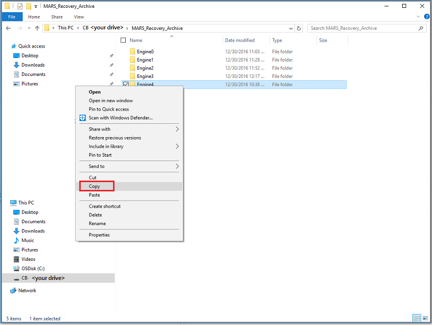  

9. 文件和/或文件夹还原完毕后，在“浏览和恢复文件”窗格中单击“卸载”。然后单击“是”，确认要卸载该卷。

    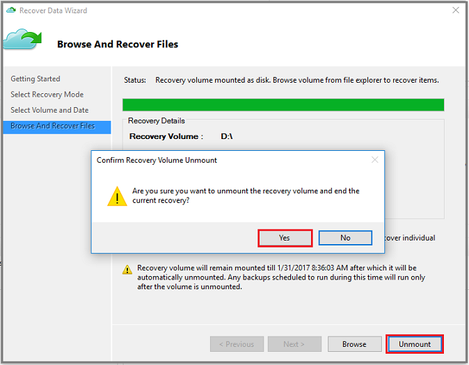  

    > [!重要事项] 如果不单击“卸载”，恢复卷将保持装载六个小时（从装载时算起）。装载卷时，不会运行任何备份操作。计划为在装载卷时运行的任何备份操作将在卸载恢复卷后运行。
    >

## 将数据恢复到同一台计算机
如果你意外删除了某个文件并想要在同一台计算机（备份位置）中还原文件，以下步骤可帮助你恢复数据。

1. 打开 **Azure 备份**管理单元。
2. 单击“恢复数据”以启动工作流。

    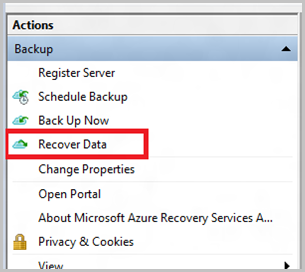
3. 选择“此服务器(*你的计算机名称*)”选项，以便在同一台计算机上还原已备份的文件。

    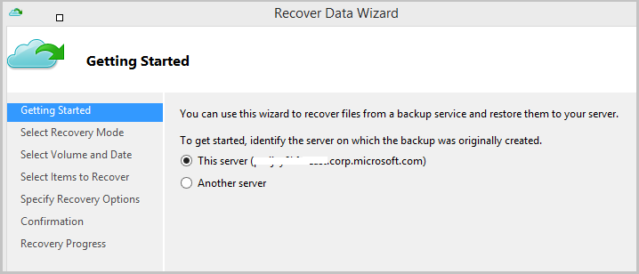
4. 选择“浏览文件”或“搜索文件”。

    若要还原已知路径的一个或多个文件，请保留默认选项。如果你不确定文件夹的结构，但想要搜索文件，请选择“搜索文件”选项。对于本部分，我们将使用默认选项继续操作。

    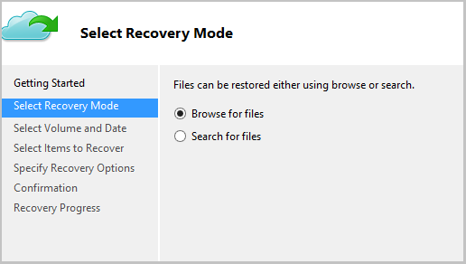
5. 选择要从中还原文件的卷。

    可以从任意时间点还原。日历控件中以“粗体”显示的日期指明了还原点的可用性。选择日期后，根据你的备份计划（和备份操作的成功与否），可以从“时间”下拉列表中选择一个时间点。

    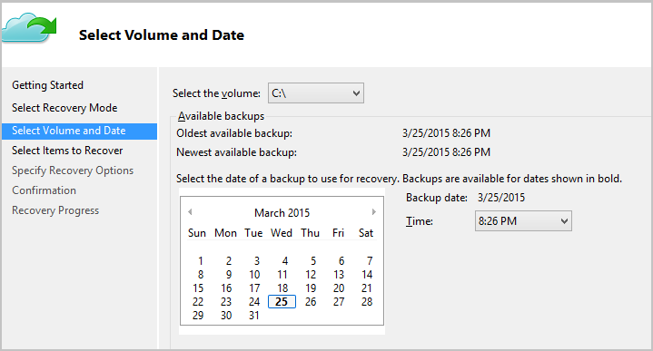
6. 选择要恢复的项。可以选择多个要还原的文件夹/文件。

    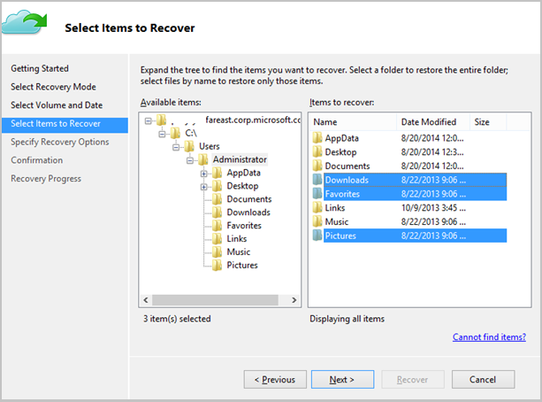
7. 指定恢复参数。

    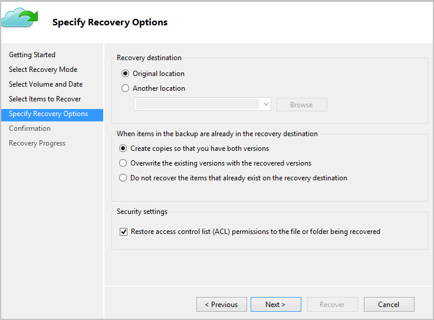

   - 可选择还原到原始位置（将覆盖其中的文件/文件夹），或者同一台计算机中的另一位置。
   - 如果要还原的文件/文件夹在目标位置存在，可创建副本（同一文件的两个版本）、覆盖目标位置的文件，或者跳过目标中存在文件的恢复。
   - 强烈建议保留要恢复的文件相关 ACL 的还原默认选项。
8. 提供这些输入后，单击“下一步”。将文件还原到此计算机的恢复工作流将会开始。

## 恢复到备用计算机
如果整个服务器断开连接，仍可将 Azure 备份中的数据恢复到另一台计算机。下面的步骤演示了工作流。

这些步骤中使用的术语包括：

- *源计算机* - 从其中创建备份并且当前不可用的原始计算机。
- *目标计算机* - 要将数据恢复到其中的计算机。
- *示例保管库* - *源计算机*和*目标计算机*注册到其中的备份保管库。 

> [AZURE.NOTE]
从一台计算机创建的备份无法在运行更低版本操作系统的计算机上还原。例如，如果备份是从 Windows 7 计算机创建的，它可以在 Windows 8 或更高版本的计算机上还原。但是，如果反过来则无法还原。
>
>

1. 在“目标计算机”中打开“Azure 备份”管理单元。
2. 确保“目标计算机”和“源计算机”已还原到同一个备份保管库。
3. 单击“恢复数据”以启动工作流。

    
4. 选择“另一台服务器”

    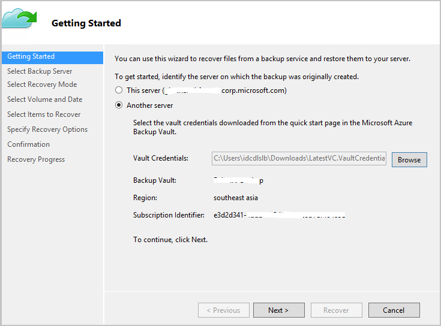
5. 提供对应于“示例保管库”的保管库凭据文件。如果保管库凭据文件无效（或已过期），请在 Azure 经典管理门户中从“示例保管库”下载新的保管库凭据文件。提供保管库凭据文件后，系统将根据保管库凭据文件显示备份保管库。
6. 从显示的计算机列表中选择“源计算机”。

    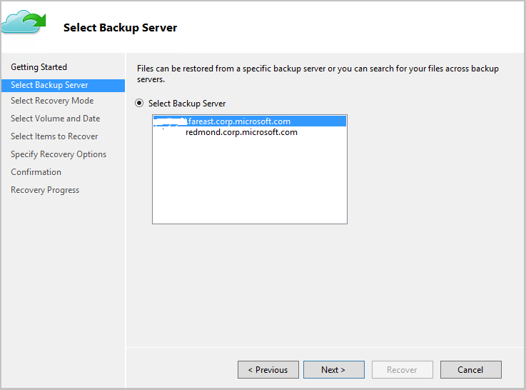
7. 选择“搜索文件”或“浏览文件”选项。对于本部分，我们将使用“搜索文件”选项。

    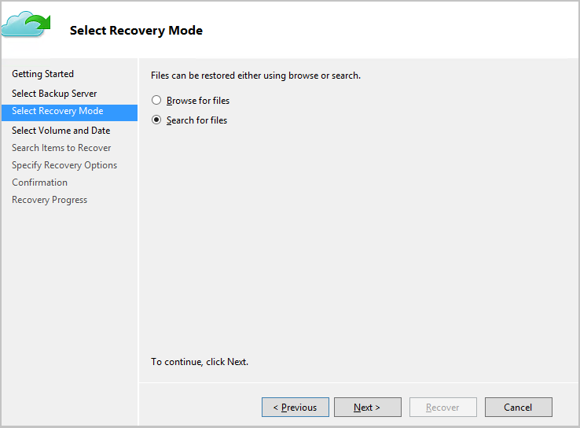
8. 在下一屏幕中选择卷和日期。搜索要还原的文件夹/文件的名称。

    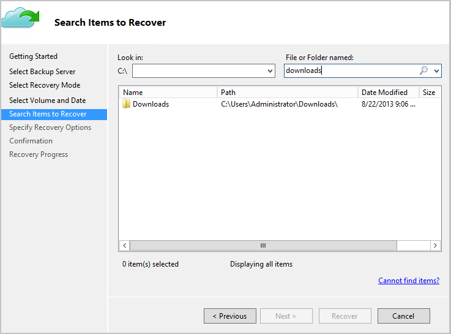
9. 选择这些文件需要还原到的位置。

    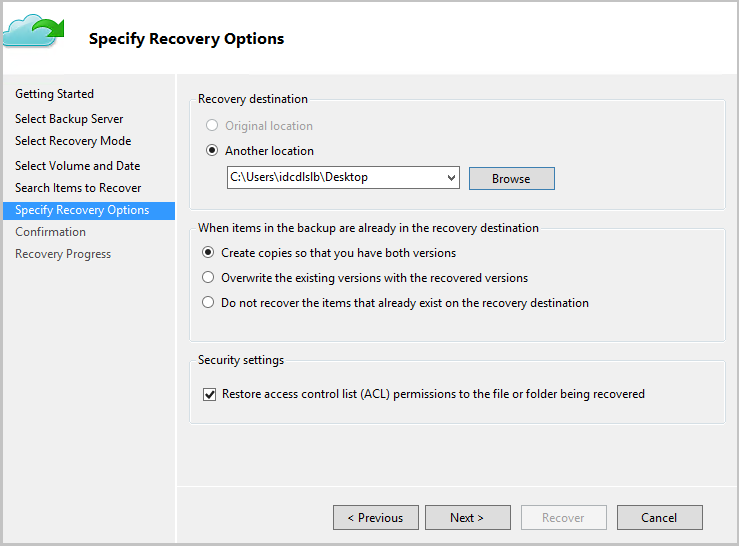
10. 提供在将“源计算机”注册到示例保管库期间所用的加密通行短语。

    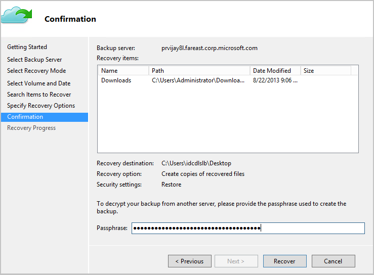
11. 提供输入后，单击“恢复”，随即将会触发在提供的目标中还原备份文件的操作。

## 使用“即时还原”将数据还原到备用计算机
如果整个服务器断开连接，仍可将 Azure 备份中的数据恢复到另一台计算机。下面的步骤演示了工作流。

这些步骤中使用的术语包括：

- *源计算机* - 从其中创建备份并且当前不可用的原始计算机。
- *目标计算机* - 要将数据恢复到其中的计算机。
- *示例保管库* - *源计算机*和*目标计算机*注册到其中的恢复服务保管库。 

> [AZURE.NOTE]
不能将备份还原到运行早期版本的操作系统的目标计算机。例如，在 Windows 7 计算机中创建的备份可以还原到 Windows 8 或更高版本的计算机。但是，在 Windows 8 计算机上创建的备份无法还原到 Windows 7 计算机。
>
>

1. 在“目标计算机”中打开“Azure 备份”管理单元。

2. 确保“目标计算机”和“源计算机”已注册到同一个恢复服务保管库。

3. 单击“恢复数据”打开“恢复数据向导”。

      

4. 在“开始”窗格中选择“另一台服务器”

    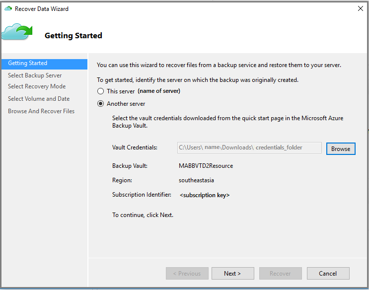  

5. 提供对应于“示例保管库”的保管库凭据文件，然后单击“下一步”。

    如果保管库凭据文件无效（或已过期），请在 Azure 门户预览中从“示例保管库”下载新的保管库凭据文件。提供有效的保管库凭据后，将显示相应备份保管库的名称。

6. 在“选择备份服务器”窗格中，从显示的计算机列表中选择“源计算机”并提供通行短语。然后单击“下一步”。

    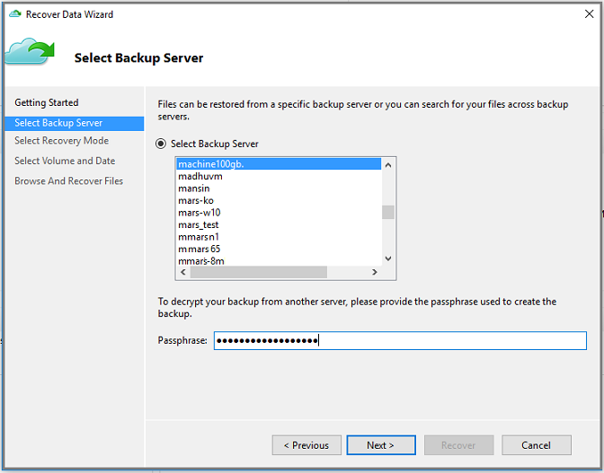  

7. 在“选择恢复模式”窗格中选择“单个文件和文件夹”，然后单击“下一步”。

    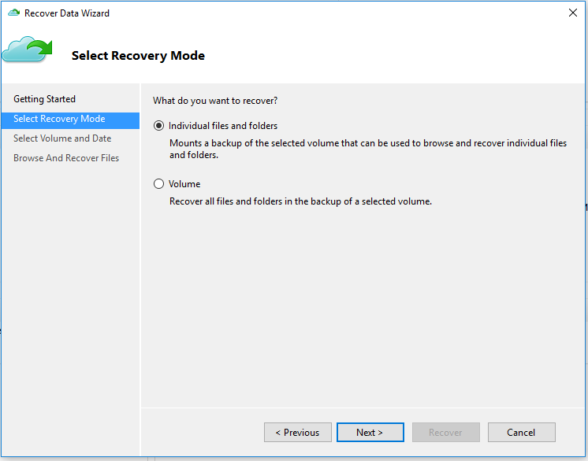  

8. 在“选择卷和日期”窗格中，选择包含想要还原的文件和/或文件夹的卷。

    在日历中选择恢复点。可从任意恢复时间点还原。以**粗体**显示的日期表示至少有一个可用的恢复点。选择日期后，如果有多个恢复点可用，请从“时间”下拉菜单中选择特定的恢复点。

    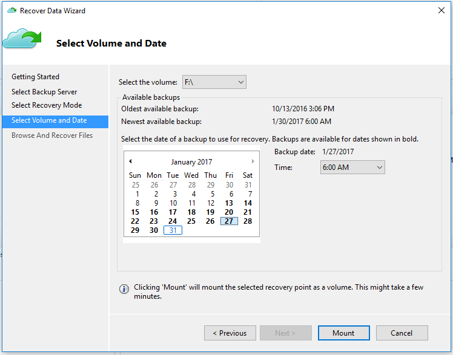  

9. 单击“装载”，将恢复点本地装载为*目标计算机*上的恢复卷。

10. 在“浏览和恢复文件”窗格中，单击“浏览”打开 Windows 资源管理器并找到所需的文件和文件夹。

    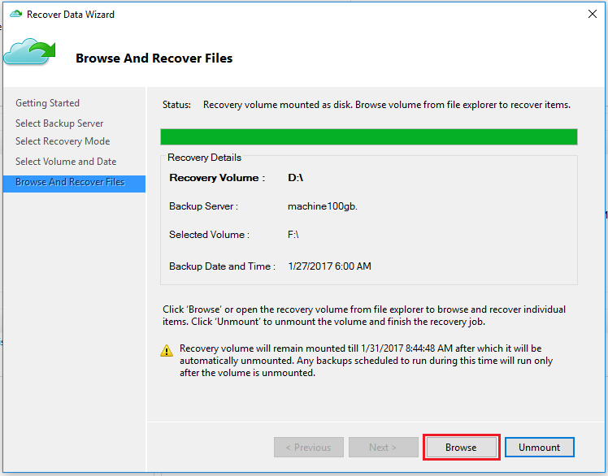  

11. 在 Windows 资源管理器中，从恢复卷复制文件和/或文件夹，并将其粘贴到“目标计算机”位置。可以从恢复卷直接打开或流式传输文件，然后验证是否恢复了正确的版本。

    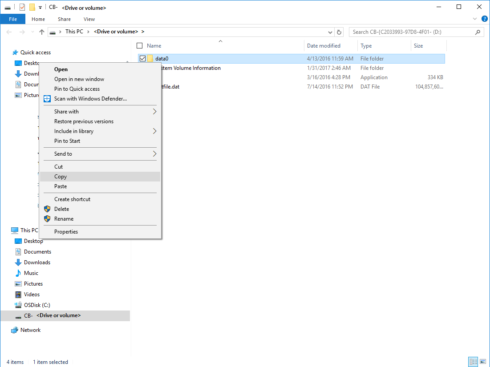  

12. 文件和/或文件夹还原完毕后，在“浏览和恢复文件”窗格中单击“卸载”。然后单击“是”，确认要卸载该卷。

    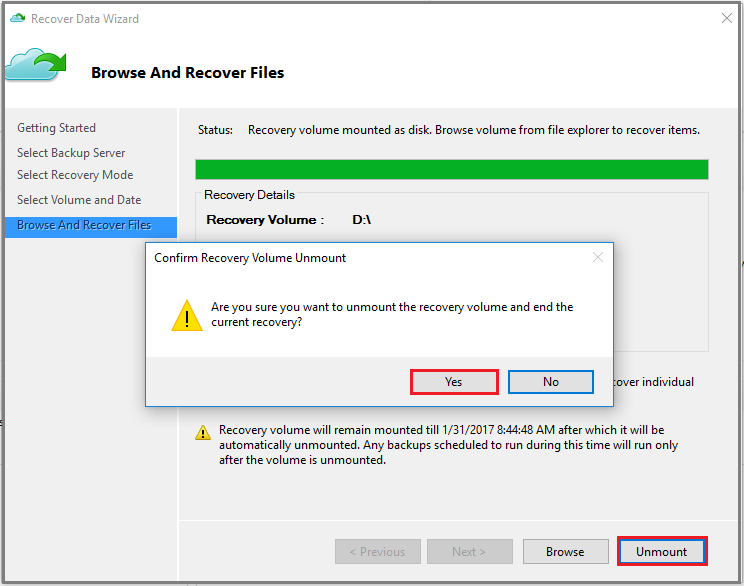  

    > [AZURE.IMPORTANT] 如果不单击“卸载”，恢复卷将保持装载六个小时（从装载时算起）。装载卷时，不会运行任何备份操作。计划为在装载卷时运行的任何备份操作将在卸载恢复卷后运行。
    >

## 后续步骤
- [Azure 备份常见问题](/documentation/articles/backup-azure-backup-faq/)
- 访问 [Azure 备份论坛](http://go.microsoft.com/fwlink/p/?LinkId=290933)。

## 了解详细信息
- [Azure 备份概述](http://go.microsoft.com/fwlink/p/?LinkId=222425)
- [备份 Azure 虚拟机](/documentation/articles/backup-azure-vms-introduction/)
- [备份 Microsoft 工作负荷](/documentation/articles/backup-azure-dpm-introduction-classic/)

<!---HONumber=Mooncake_0313_2017-->
<!--Update_Description: wording update-->