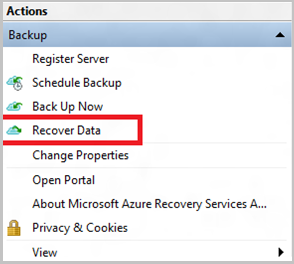
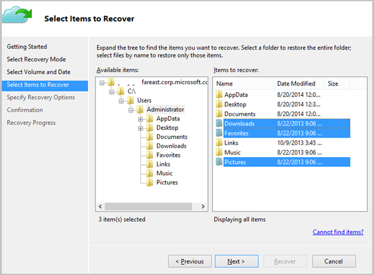
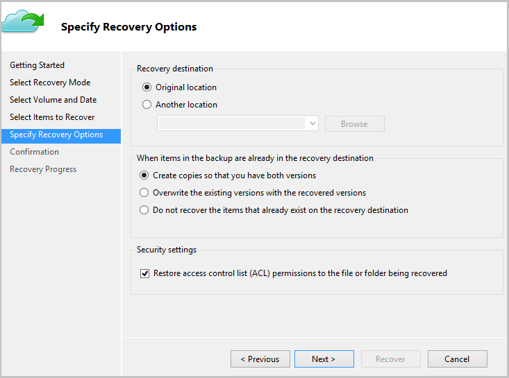

<properties
   pageTitle="使用 Resource Manager 部署模型将数据还原到 Windows Server 或 Windows 客户端 | Azure"
   description="了解如何从 Windows Server 或 Windows 客户端还原。"
   services="backup"
   documentationCenter=""
   authors="Jim-Parker"
   manager="jwhit"
   editor=""/>

<tags
	ms.service="backup"
	ms.date="01/25/2016"
	wacn.date="04/12/2016"/>

# 将文件还原到 Windows Server 或 Windows 客户端计算机
本文介绍执行两种还原操作所需的步骤：

- 将数据还原到备份时所在的同一台计算机。
- 将数据还原到其他任何计算机。

在这两种情况下，都将从 Azure 备份保管库检索数据。

## 将数据恢复到同一台计算机
如果你意外删除了某个文件并想要在同一台计算机（备份位置）中还原文件，以下步骤可帮助你恢复数据。

1. 打开“Microsoft Azure 备份”管理单元。
2. 单击“恢复数据”以启动工作流。

    

3. 选择“此服务器(你的计算机名称)”选项，以便在同一台计算机上还原已备份的文件。

    

4. 选择“浏览文件”或“搜索文件”。

    如果你想要还原路径已知的一个或多个文件，请保留默认选项。如果你不确定文件夹的结构，但想要搜索文件，请选择“搜索文件”选项。对于本部分，我们将使用默认选项继续操作。

    

5. 选择你要从中还原文件的卷。

    可以从任意时间点还原。日历控件中以“粗体”显示的日期指明了还原点的可用性。选择日期后，根据你的备份计划（和备份操作的成功与否），可以从“时间”下拉列表中选择一个时间点。

    

6. 选择要恢复的项。可以选择多个要还原的文件夹/文件。

    

7. 指定恢复参数。

    

  - 你可以选择还原到原始位置（将覆盖其中的文件/文件夹），或者同一台计算机中的另一个位置。
  - 如果要还原的文件/文件夹在目标位置存在，则你可以创建副本（同一文件的两个版本）、覆盖目标位置中的文件，或者跳过目标中存在的文件的恢复。
  - 强烈建议你保留所要恢复的文件中的 ACL 还原默认选项。

8. 提供这些输入后，单击“下一步”。将文件还原到此计算机的恢复工作流将会开始。

## 恢复到备用计算机
如果整个服务器断开连接，你仍可以将 Azure 备份中的数据恢复到另一台计算机。下面的步骤演示了工作流。

这些步骤中使用的术语包括：

- 源计算机 – 从中创建备份并且当前不可用的原始计算机。
- 目标计算机 – 要将数据恢复到的计算机。
- 示例保管库 – 源计算机和目标计算机注册到的备份保管库。 

> [AZURE.NOTE] 从一台计算机创建的备份无法在运行更低版本操作系统的计算机上还原。例如，如果备份是从 Windows 7 计算机创建的，它可以在 Windows 8 或更高版本的计算机上还原。但是，如果反过来则无法还原。

1. 在“目标计算机”中打开“Microsoft Azure 备份”管理单元。
2. 确保“目标计算机”和“源计算机”已还原到同一个备份保管库。
3. 单击“恢复数据”以启动工作流。

    

4. 选择“另一台服务器”

    

5. 提供对应于“示例保管库”的保管库凭据文件。如果保管库凭据文件无效（或已过期），请在 Azure 经典管理门户中从“示例保管库”下载新的保管库凭据文件。提供保管库凭据文件后，系统将根据保管库凭据文件显示备份保管库。

6. 从显示的计算机列表中选择“源计算机”。

    

7. 选择“搜索文件”或“浏览文件”选项。对于本部分，我们将使用“搜索文件”选项。

    

8. 在下一屏幕中选择卷和日期。搜索你要还原的文件夹/文件名称。

    

9. 选择这些文件需要还原到的位置。

    

10. 提供在将“源计算机”注册到示例保管库期间所用的加密通行短语。

    

11. 提供输入后，单击“恢复”，随即将会触发在提供的目标中还原备份文件的操作。

## 后续步骤
- [Azure 备份常见问题](/documentation/articles/backup-azure-backup-faq/)
- 访问 [Azure 备份论坛](http://go.microsoft.com/fwlink/p/?LinkId=290933)。

## 了解详细信息
- [Azure 备份概述](/documentation/articles/backup-introduction-to-azure-backup/)
- [备份 Azure 虚拟机](/documentation/articles/backup-azure-vms-introduction/)
- [备份 Microsoft 工作负荷](/documentation/articles/backup-azure-dpm-introduction/)

<!---HONumber=Mooncake_0405_2016-->