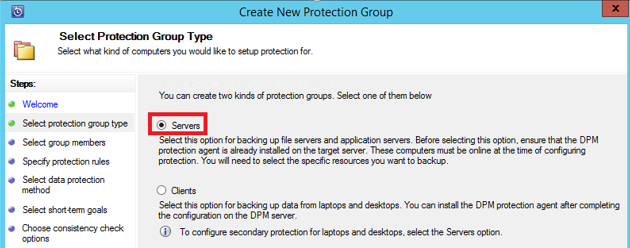
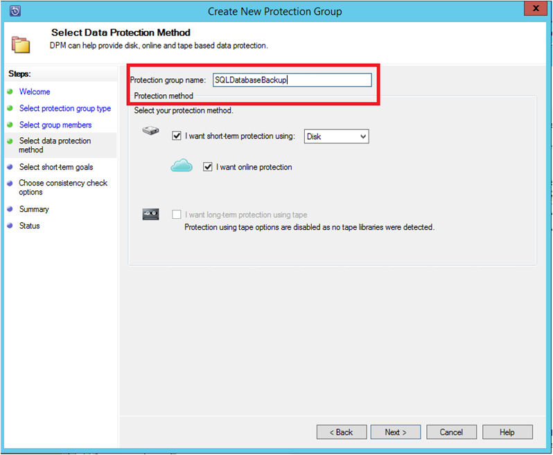
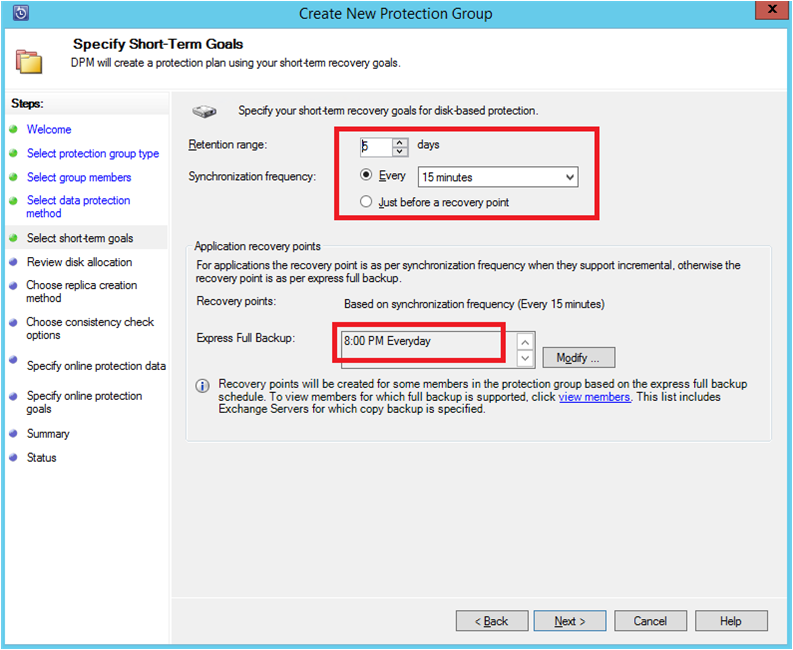

<properties
    pageTitle="使用 Azure 备份服务器为 SQL Server 工作负荷配置 Azure 备份 | Azure"
    description="使用 Azure 备份服务器备份 SQL Server 数据库简介"
    services="backup"
    documentationcenter=""
    author="pvrk"
    manager="Shivamg"
    editor="" />
<tags
    ms.assetid="c8b1f7ec-26b1-4ef0-a3f2-91aec959daea"
    ms.service="backup"
    ms.workload="storage-backup-recovery"
    ms.tgt_pltfrm="na"
    ms.devlang="na"
    ms.topic="article"
    ms.date="03/24/2017"
    ms.author="pullabhk"
    wacn.date="05/15/2017"
    ms.translationtype="Human Translation"
    ms.sourcegitcommit="3ff18e6f95d8bbc27348658bc5fce50c3320cf0a"
    ms.openlocfilehash="bc56e629b0e90d9703168aa05fc040d0b364f927"
    ms.contentlocale="zh-cn"
    ms.lasthandoff="05/15/2017" />

# 使用 Azure 备份服务器将 SQL Server 备份到 Azure
本文将引导你使用 Azure 备份服务器 (MABS) 来完成 SQL Server 数据库的备份配置步骤。

向 Azure 备份以及从 Azure 恢复 SQL Server 数据库的管理工作涉及三个步骤：

1. 创建备份策略来保护要备份到 Azure 的 SQL Server 数据库。
2. 创建要备份到 Azure 的按需备份副本。
3. 从 Azure 恢复数据库。

## 开始之前
在开始之前，请确保[已安装并准备好 Azure 备份服务器](/documentation/articles/backup-azure-microsoft-azure-backup-classic/)。

## 创建备份策略以保护要备份到 Azure 的 SQL Server 数据库
1. 在 Azure 备份服务器 UI 中，单击“保护”工作区。
2. 单击“**新建**”创建新的保护组。

    
3. MABS 会显示开始屏幕，其中包含有关如何创建**保护组**的指南。 单机“下一步”
4. 选择“**服务器**”。

    
5. 展开要备份的数据库所在的 SQL Server 计算机。 MABS 会显示各种可以从该服务器备份的数据源。 展开“**所有 SQL 共享**”，选择要备份的数据库（在本示例中，我们选择了 ReportServer$MSDPM2012 和 ReportServer$MSDPM2012TempDB）。 单机“下一步”

    
6. 提供保护组的名称，并选中“**我需要在线保护**”复选框。

    
7. 在“**指定短期目标**”屏幕中，提供创建磁盘备份点所需的输入。

    在这里我们可以看到，“**保留期**”设置为“*5 天*”，“**同步频率**”设置为“*每 15 分钟一次*”，这也是进行备份的频率。 “**快速完整备份**”设置为“*晚上 8:00*”。

    

    > [AZURE.NOTE]
    > 在每天晚上 8:00（根据屏幕输入），将会创建一个备份点，以便传输自前一天晚上 8:00 的备份点以来进行了修改的数据。 此过程称为 **快速完整备份**。 虽然事务日志每 15 分钟同步一次，但如果需要在晚上 9:00 恢复数据库，则会重播自上一个快速完整备份点（在本示例中为晚上 8 点）以来的日志，从而创建备份点。
    >
    >

8. 单击“下一步” 

    MABS 会显示可用的总存储空间以及能够使用的磁盘空间。

    

    默认情况下，MABS 将针对每个数据源（SQL Server 数据库）创建一个用于初始备份副本的卷。 使用此方法时，逻辑磁盘管理器 (LDM) 会限制 MABS 最多只能保护 300 个数据源（SQL Server 数据库）。 若要解决此限制，请选择“**在 DPM 存储池中共置数据**”选项。 如果使用此选项，MABS 会对多个数据源使用单个卷，这可以让 MABS 保护多达 2000 个 SQL 数据库。

    如果选择了“自动增大卷”选项，MABS 可以随着生产数据的增长考虑增大备份卷。 如果未选择“自动增大卷”选项，则 MABS 会限制保护组中用于备份数据源的备份存储的大小。
9. 管理员可以选择手动传输此初始备份（脱离网络），以免网络出现带宽拥塞现象。 管理员还可以配置初始传输发生的时间。 单机“下一步”

    

    初始备份副本需要将整个数据源（SQL Server 数据库）从生产服务器（SQL Server 计算机）传输到 MABS。 此类数据可能会非常大，通过网络传输此类数据可能会超过带宽限制。 出于这个原因，管理员可以选择通过以下方式传输初始备份：“**手动**”（使用可移动媒体），以免网络出现带宽拥塞现象；或“**自动通过网络**”（于指定时间）。

    初始备份完成后，其余的备份都是初始备份副本的增量备份。 增量备份往往比较小，能轻松地通过网络传输。
10. 选择需要运行一致性检查的时间，然后单击“**下一步**”。

    

    MABS 可以通过执行一致性检查来检查备份点的完整性。 它会计算生产服务器（在本方案中为 SQL Server 计算机）上的备份文件和 MABS 上该文件的已备份数据的校验和。 如果有冲突，则会认为 MABS 上的备份文件已损坏。 MABS 会发送与校验和不匹配部分相对应的块以纠正备份的数据。 由于一致性检查是对性能影响很大的操作，因此管理员可以选择是按计划来运行还是自动运行一致性检查。
11. 若要指定对数据源进行在线保护，请选择要通过 Azure 进行保护的数据库，然后单击“**下一步**”。

    
12. 管理员可以选择适合组织策略的备份计划和保留策略。

    

    在本示例中，备份会在一天的中午 12:00 和晚上 8:00 各进行一次（参见屏幕底部）

    > [AZURE.NOTE]
    > 最好是在磁盘上设置几个短期恢复点，以便进行快速恢复。 这些恢复点适用于“操作恢复”。 Azure 具有较高的 SLA，其可用性也可以得到保证，因此可作为理想的非现场位置。
    >
    >

    **最佳实践**：确保在使用 DPM 完成本地磁盘备份后安排好 Azure 备份。 这样就可以将最新磁盘备份复制到 Azure。

13. 选择保留策略计划。 有关保留策略工作原理的详细信息，请参阅[使用 Azure 备份来取代磁带基础结构文章](/documentation/articles/backup-azure-backup-cloud-as-tape/)。

    

    在本示例中：

    - 备份会在一天的中午 12:00 和晚上 8:00 各进行一次（参见屏幕底部），并且会保留 180 天。
    - 在星期六中午 12:00 进行的备份 会保留 104 周
    - 在最后一个星期六中午 12:00 进行的备份 会保留 60 个月
    - 在 3 月的最后一个星期六中午 12:00 进行的备份 会保留 10 年
14. 单击“**下一步**”，选择相应的选项将初始备份副本传输到 Azure。 你可以选择“**自动通过网络**”或“**脱机备份**”。

    - “**自动通过网络**”会根据为备份选择的计划将备份数据传输到 Azure。
    - “**脱机备份**”的工作原理详见 [Azure 备份中的脱机备份工作流](/documentation/articles/backup-azure-backup-import-export/)。

    选择将初始备份副本发送到 Azure 的相关传输机制，然后单击“**下一步**”。
15. 在“**摘要**”屏幕中查看策略详细信息以后，单击“**创建组**”按钮即可完成工作流的操作。 你可以单击“**关闭**”按钮，然后即可在“监视”工作区中监视作业进度。

    

## SQL Server 数据库的按需备份
虽然前述步骤创建了备份策略，但“恢复点”仅在进行首个备份的时候创建。 如果不想等待计划程序进行计划，则以下步骤可触发手动创建恢复点。

1. 在创建恢复点之前，请等待数据库的保护组状态显示为“**正常**”。

    
2. 右键单击该数据库，然后选择“**创建恢复点**”。

    
3. 在下拉列表中选择“**在线保护**”，然后单击“**确定**”。 此时会在 Azure 中创建恢复点。

    
4. 你可以在“**监视**”工作区中查看作业进度，在该工作区中，你会发现一个正在进行的作业，正如下图中描述的那样。

    

## 从 Azure 恢复 SQL Server 数据库
若要从 Azure 中恢复受保护的实体（SQL Server 数据库），必须执行以下步骤。

1. 打开 DPM 服务器管理控制台。 导航到“**恢复**”工作区，你可以在其中查看通过 DPM 备份的服务器。 浏览所需的数据库（在本示例中为 ReportServer$MSDPM2012）。 选择“**恢复方式**”，例如“**在线**”。

    
2. 右键单击数据库名称，然后单击“**恢复**”。

    
3. DPM 会显示恢复点的详细信息。 单机“下一步” 选择恢复类型“**恢复到 SQL Server 的原始实例**”。 单机“下一步”

    

    在此示例中，DPM 允许将数据库恢复到另一个 SQL Server 实例或独立的网络文件夹。
4. 在“**指定恢复选项**”屏幕上，你可以选择恢复选项（例如“网络带宽使用限制”），以便限制恢复操作所使用的带宽。 单机“下一步”
5. 在“**摘要**”屏幕上，你会看到目前提供的所有恢复配置。 单击“**恢复**”。

    恢复状态显示数据库正在恢复。 你可以单击“**关闭**”关闭向导，然后在“**监视**”工作区中查看进度。

    

    完成恢复操作后，还原的数据库在应用程序级别将是一致的。

### 后续步骤：
•    [Azure 备份常见问题解答](/documentation/articles/backup-azure-backup-faq/)

