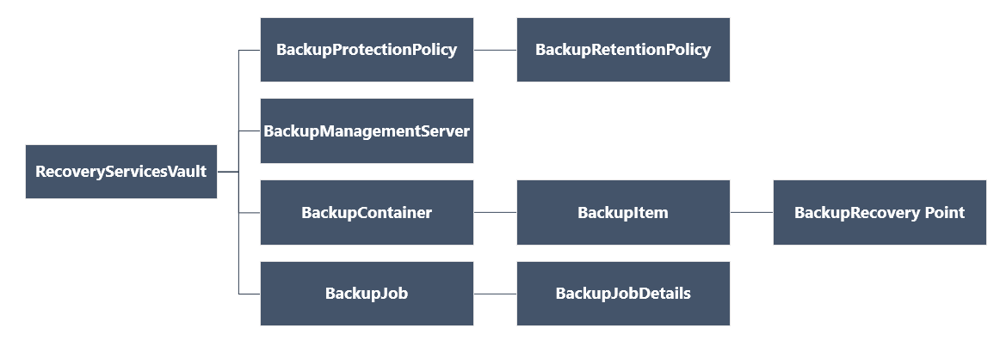

<properties
   pageTitle="使用 PowerShell 部署和管理 Resource Manager 部署型 VM 的备份 | Azure"
   description="使用 PowerShell 在 Azure 中部署和管理 Resource Manager 部署型 VM 的备份"
   services="backup"
   documentationCenter=""
   authors="markgalioto"
   manager="cfreeman"
   editor=""/>

<tags
   ms.service="backup"
   ms.devlang="na"
   ms.topic="article"
   ms.tgt_pltfrm="na"
   ms.workload="storage-backup-recovery"
   ms.date="08/03/2016"
   wacn.date="09/05/2016"
   ms.author="markgal; trinadhk"/>

# 使用 PowerShell 部署和管理 Resource Manager 部署型 VM 的备份

> [AZURE.SELECTOR]
- [资源管理器](/documentation/articles/backup-azure-vms-automation/)
- [经典](/documentation/articles/backup-azure-vms-classic-automation/)

本文说明如何使用 Azure PowerShell cmdlet 从恢复服务保管库备份和恢复 Azure 虚拟机 (VM)。恢复服务保管库是一种 Azure Resource Manager 资源，用于保护 Azure 备份和 Azure Site Recovery 服务中的数据与资产。可以使用恢复服务保管库来保护 Azure Service Manager 部署型 VM 以及 Azure Resource Manager 部署型 VM。

>[AZURE.NOTE] Azure 有两种用于创建和使用资源的部署模型：[Resource Manager 部署模型和经典部署模型](/documentation/articles/resource-manager-deployment-model/)。本文的内容与使用 Resource Manager 模型创建的 VM 有关。

本文将逐步指导你使用 PowerShell 来保护 VM，以及从恢复点还原数据。

## 概念

如果你不熟悉 Azure 备份服务，请查看[什么是 Azure 备份？](/documentation/articles/backup-introduction-to-azure-backup/)，即可大致了解该服务。 在开始之前，请确保你已掌握与系统必备组件相关的基础知识（这些必备组件是使用 Azure 备份所必需的），并了解当前 VM 备份解决方案的限制。

为了提高 PowerShell 使用效率，必须了解对象的层次结构以及从何处开始。

若要查看 AzureRmRecoveryServicesBackup PowerShell cmdlet 参考，请参阅 Azure 库中的 [Azure Backup - Recovery Services Cmdlets](https://msdn.microsoft.com/zh-cn/library/mt723320.aspx)（Azure 备份 - 恢复服务 Cmdlet）。
若要查看 AzureRmRecoveryServicesVault PowerShell cmdlet 参考，请参阅 [Azure Recovery Service Cmdlets](https://msdn.microsoft.com/zh-cn/library/mt643905.aspx)（Azure 恢复服务 Cmdlet）。

## 设置和注册

开始时，请执行以下操作：

1. [下载最新版本的 PowerShell](https://github.com/Azure/azure-powershell/releases)（所需的最低版本：1.4.0）

2. 键入以下命令查找可用的 Azure 备份 PowerShell cmdlet：

		PS C:\> Get-Command *azurermrecoveryservices*
		
		CommandType     Name                                               Version    Source
		-----------     ----                                               -------    ------
		Cmdlet          Backup-AzureRmRecoveryServicesBackupItem           1.4.0      AzureRM.RecoveryServices.Backup
		Cmdlet          Disable-AzureRmRecoveryServicesBackupProtection    1.4.0      AzureRM.RecoveryServices.Backup
		Cmdlet          Enable-AzureRmRecoveryServicesBackupProtection     1.4.0      AzureRM.RecoveryServices.Backup
		Cmdlet          Get-AzureRmRecoveryServicesBackupContainer         1.4.0      AzureRM.RecoveryServices.Backup
		Cmdlet          Get-AzureRmRecoveryServicesBackupItem              1.4.0      AzureRM.RecoveryServices.Backup
		Cmdlet          Get-AzureRmRecoveryServicesBackupJob               1.4.0      AzureRM.RecoveryServices.Backup
		Cmdlet          Get-AzureRmRecoveryServicesBackupJobDetails        1.4.0      AzureRM.RecoveryServices.Backup
		Cmdlet          Get-AzureRmRecoveryServicesBackupManagementServer  1.4.0      AzureRM.RecoveryServices.Backup
		Cmdlet          Get-AzureRmRecoveryServicesBackupProperties        1.4.0      AzureRM.RecoveryServices
		Cmdlet          Get-AzureRmRecoveryServicesBackupProtectionPolicy  1.4.0      AzureRM.RecoveryServices.Backup
		Cmdlet          Get-AzureRMRecoveryServicesBackupRecoveryPoint     1.4.0      AzureRM.RecoveryServices.Backup
		Cmdlet          Get-AzureRmRecoveryServicesBackupRetentionPolic... 1.4.0      AzureRM.RecoveryServices.Backup
		Cmdlet          Get-AzureRmRecoveryServicesBackupSchedulePolicy... 1.4.0      AzureRM.RecoveryServices.Backup
		Cmdlet          Get-AzureRmRecoveryServicesVault                   1.4.0      AzureRM.RecoveryServices
		Cmdlet          Get-AzureRmRecoveryServicesVaultSettingsFile       1.4.0      AzureRM.RecoveryServices
		Cmdlet          New-AzureRmRecoveryServicesBackupProtectionPolicy  1.4.0      AzureRM.RecoveryServices.Backup
		Cmdlet          New-AzureRmRecoveryServicesVault                   1.4.0      AzureRM.RecoveryServices
		Cmdlet          Remove-AzureRmRecoveryServicesProtectionPolicy     1.4.0      AzureRM.RecoveryServices.Backup
		Cmdlet          Remove-AzureRmRecoveryServicesVault                1.4.0      AzureRM.RecoveryServices
		Cmdlet          Restore-AzureRMRecoveryServicesBackupItem          1.4.0      AzureRM.RecoveryServices.Backup
		Cmdlet          Set-AzureRmRecoveryServicesBackupProperties        1.4.0      AzureRM.RecoveryServices
		Cmdlet          Set-AzureRmRecoveryServicesBackupProtectionPolicy  1.4.0      AzureRM.RecoveryServices.Backup
		Cmdlet          Set-AzureRmRecoveryServicesVaultContext            1.4.0      AzureRM.RecoveryServices
		Cmdlet          Stop-AzureRmRecoveryServicesBackupJob              1.4.0      AzureRM.RecoveryServices.Backup
		Cmdlet          Unregister-AzureRmRecoveryServicesBackupContainer  1.4.0      AzureRM.RecoveryServices.Backup
		Cmdlet          Unregister-AzureRmRecoveryServicesBackupManagem... 1.4.0      AzureRM.RecoveryServices.Backup
		Cmdlet          Wait-AzureRmRecoveryServicesBackupJob              1.4.0      AzureRM.RecoveryServices.Backup

使用 PowerShell 可以自动化以下任务：

- 创建恢复服务保管库
- 备份或保护 Azure VM
- 触发备份作业
- 监视备份作业
- 还原 Azure VM

## 创建恢复服务保管库

以下步骤引导你创建恢复服务保管库。恢复服务保管库不同于备份保管库。

1. 如果你是首次使用 Azure 备份，则必须使用 **[Register-AzureRMResourceProvider](https://msdn.microsoft.com/zh-cn/library/mt603685.aspx)** cmdlet 注册用于订阅的 Azure 恢复服务提供程序。

		PS C:\> Register-AzureRmResourceProvider -ProviderNamespace "Microsoft.RecoveryServices"

2. 恢复服务保管库是一种 Resource Manager 资源，因此需要将它放在资源组中。你可以使用现有的资源组，也可以使用 **[New-AzureRmResourceGroup](https://msdn.microsoft.com/zh-cn/library/mt603739.aspx)** cmdlet 创建新的资源组。创建新的资源组时，请指定资源组的名称和位置。

		PS C:\> New-AzureRmResourceGroup -Name "test-rg" -Location "China North"

3. 使用 **[New-AzureRmRecoveryServicesVault](https://msdn.microsoft.com/zh-cn/library/mt643910.aspx)** cmdlet 创建新的保管库。确保为保管库指定的位置与用于资源组的位置是相同的。

		PS C:\> New-AzureRmRecoveryServicesVault -Name "testvault" -ResourceGroupName " test-rg" -Location "China North"

4. 指定要使用的存储冗余类型；你可以使用[本地冗余存储 (LRS)](/documentation/articles/storage-redundancy/#locally-redundant-storage) 或[异地冗余存储 (GRS)](/documentation/articles/storage-redundancy/#geo-redundant-storage)。以下示例显示，testVault 的 -BackupStorageRedundancy 选项设置为 GeoRedundant。

		PS C:\> $vault1 = Get-AzureRmRecoveryServicesVault -Name "testVault"
		PS C:\> Set-AzureRmRecoveryServicesBackupProperties  -Vault $vault1 -BackupStorageRedundancy GeoRedundant

	> [AZURE.TIP] 许多 Azure 备份 cmdlet 要求使用恢复服务保管库对象作为输入。出于此原因，在变量中存储备份恢复服务保管库对象可提供方便。

## 在订阅中查看保管库
使用 **[Get-AzureRmRecoveryServicesVault](https://msdn.microsoft.com/zh-cn/library/mt643907.aspx)** 查看当前订阅中所有保管库的列表。可以使用此命令来查看是否创建了新的保管库，或者查看订阅中的可用保管库。

运行 Get-AzureRmRecoveryServicesVault 命令即可列出订阅中的所有保管库。

	PS C:\> Get-AzureRmRecoveryServicesVault
	Name              : Contoso-vault
	ID                : /subscriptions/1234
	Type              : Microsoft.RecoveryServices/vaults
	Location          : ChinaNorth
	ResourceGroupName : Contoso-docs-rg
	SubscriptionId    : 1234-567f-8910-abc
	Properties        : Microsoft.Azure.Commands.RecoveryServices.ARSVaultProperties

## 备份 Azure VM
现在，你已经创建了恢复服务保管库，因此可以使用它来保护虚拟机。但是，在应用保护之前，必须设置保管库上下文，并且需验证保护策略。保管库上下文定义了保管库中受保护的数据类型。保护策略是指对备份作业的运行时间以及每个备份快照的保留时长进行计划。

在 VM 上启用保护之前，必须设置保管库上下文。该上下文将应用到所有后续 cmdlet。

	PS C:\> Get-AzureRmRecoveryServicesVault -Name testvault | Set-AzureRmRecoveryServicesVaultContext

### 创建保护策略

当你创建新保管库时，它附带了一个默认策略。此策略会在每天的指定时间触发备份作业。根据默认策略，备份快照将保留 30 天。可以使用默认策略快速保护你的 VM，以后再使用不同的详细信息编辑该策略。

若要查看保管库中的可用策略列表，请使用 **[Get-AzureRmRecoveryServicesBackupProtectionPolicy](https://msdn.microsoft.com/zh-cn/library/mt723300.aspx)**：

	PS C:\> Get-AzureRmRecoveryServicesBackupProtectionPolicy -WorkloadType AzureVM
	Name                 WorkloadType       BackupManagementType BackupTime                DaysOfWeek
	----                 ------------       -------------------- ----------                ----------
	DefaultPolicy        AzureVM            AzureVM              4/14/2016 5:00:00 PM

> [AZURE.NOTE] PowerShell 中 BackupTime 字段的时区是 UTC。

一个备份保护策略至少与一个保留策略相关联。保留策略定义在 Azure 备份中保留恢复点的时限。使用 **Get-AzureRmRecoveryServicesBackupRetentionPolicyObject** 可以查看默认保留策略。同理，可以使用 **Get-AzureRmRecoveryServicesBackupSchedulePolicyObject** 获取默认计划策略。计划和保留策略对象将用作 **New-AzureRmRecoveryServicesBackupProtectionPolicy** cmdlet 的输入。

备份保护策略定义对某个项目进行备份的时间和频率。New-AzureRmRecoveryServicesBackupProtectionPolicy cmdlet 创建用于保存备份策略信息的 PowerShell 对象。该备份策略用作 Enable-AzureRmRecoveryServicesBackupProtection cmdlet 的输入。

	PS C:\> $schPol = Get-AzureRmRecoveryServicesBackupSchedulePolicyObject -WorkloadType "AzureVM"
	PS C:\>  $retPol = Get-AzureRmRecoveryServicesBackupRetentionPolicyObject -WorkloadType "AzureVM"
	PS C:\>  New-AzureRmRecoveryServicesBackupProtectionPolicy -Name "NewPolicy" -WorkloadType AzureVM -RetentionPolicy $retPol -SchedulePolicy $schPol
	Name                 WorkloadType       BackupManagementType BackupTime                DaysOfWeek
	----                 ------------       -------------------- ----------                ----------
	NewPolicy           AzureVM            AzureVM              4/24/2016 1:30:00 AM

### 启用保护

启用保护涉及两个对象 - 项和策略。需要提供这两个对象才能为保管库启用保护。将策略与保管库关联之后，将在策略计划中定义的时间触发备份工作流。

在非加密型 ARM VM 上启用保护

	PS C:\> $pol=Get-AzureRmRecoveryServicesBackupProtectionPolicy -Name "NewPolicy"
	PS C:\> Enable-AzureRmRecoveryServicesBackupProtection -Policy $pol -Name "V2VM" -ResourceGroupName "RGName1"

若要在加密型 VM 上启用保护[使用 BEK 和 KEK 加密]，需提供相应权限，允许 Azure 备份服务读取密钥保管库中的密钥和机密。

	PS C:\> Set-AzureRmKeyVaultAccessPolicy -VaultName 'KeyVaultName' -ResourceGroupName 'RGNameOfKeyVault' -PermissionsToKeys backup,get,list -PermissionsToSecrets get,list -ServicePrincipalName 262044b1-e2ce-469f-a196-69ab7ada62d3
	PS C:\> $pol=Get-AzureRmRecoveryServicesBackupProtectionPolicy -Name "NewPolicy"
	PS C:\> Enable-AzureRmRecoveryServicesBackupProtection -Policy $pol -Name "V2VM" -ResourceGroupName "RGName1"

对于基于 ASM 的 VM

	PS C:\>  $pol=Get-AzureRmRecoveryServicesBackupProtectionPolicy -Name "NewPolicy"
	PS C:\>  Enable-AzureRmRecoveryServicesBackupProtection -Policy $pol -Name "V1VM" -ServiceName "ServiceName1"

### 修改保护策略

若要修改策略，请修改 BackupSchedulePolicyObject 或 BackupRetentionPolicy 对象，并使用 Set-AzureRmRecoveryServicesBackupProtectionPolicy 修改策略

以下示例将保留计数更改为 365。

	PS C:\> $retPol = Get-AzureRmRecoveryServicesBackupRetentionPolicyObject -WorkloadType "AzureVM"
	PS C:\> $retPol.DailySchedule.DurationCountInDays = 365
	PS C:\> $pol= Get-AzureRmRecoveryServicesBackupProtectionPolicy -Name NewPolicy
	PS C:\> Set-AzureRmRecoveryServicesBackupProtectionPolicy -Policy $pol  -RetentionPolicy  $RetPol

## 运行初始备份

在首次备份项时，备份计划将触发完整备份。对于后续备份，备份形式为增量复制。若要强制初始备份在某个时间发生甚至立刻发生，可以使用 **[Backup-AzureRmRecoveryServicesBackupItem](https://msdn.microsoft.com/zh-cn/library/mt723312.aspx)** cmdlet：

	PS C:\> $namedContainer = Get-AzureRmRecoveryServicesBackupContainer -ContainerType "AzureVM" -Status "Registered" -Name "V2VM"
	PS C:\> $item = Get-AzureRmRecoveryServicesBackupItem -Container $namedContainer -WorkloadType "AzureVM"
	PS C:\> $job = Backup-AzureRmRecoveryServicesBackupItem -Item $item
	WorkloadName     Operation            Status               StartTime                 EndTime                   JobID
	------------     ---------            ------               ---------                 -------                   ----------
	V2VM              Backup               InProgress            4/23/2016 5:00:30 PM                       cf4b3ef5-2fac-4c8e-a215-d2eba4124f27

> [AZURE.NOTE]：PowerShell 中的 StartTime 和 EndTime 字段时区为 UTC。

## 监视备份作业

在 Azure 备份中，大多数长时间运行的操作都是作为作业来建模的。

若要获取正在进行的作业的最新状态，请使用 Get-AzureRmRecoveryservicesBackupJob cmdlet。

	PS C:\ > $joblist = Get-AzureRmRecoveryservicesBackupJob -Status InProgress
	PS C:\ > $joblist[0]
	WorkloadName     Operation            Status               StartTime                 EndTime                   JobID
	------------     ---------            ------               ---------                 -------                   ----------
	V2VM        Backup               InProgress            4/23/2016 5:00:30 PM           cf4b3ef5-2fac-4c8e-a215-d2eba4124f27

与其使用额外的不必要的代码来轮询这些作业的完成情况，不如使用 **[Wait-AzureRmRecoveryServicesBackupJob](https://msdn.microsoft.com/zh-cn/library/mt723321.aspx)** cmdlet。该 cmdlet 暂停操作的执行，直到作业完成或达到了指定的超时值。

	PS C:\> Wait-AzureRmRecoveryServicesBackupJob -Job $joblist[0] -Timeout 43200

##  还原 Azure VM

如果使用 PowerShell，则当你从恢复点创建磁盘和配置信息时，还原操作即完成。还原操作不会创建虚拟机。我们提供了从磁盘创建虚拟机的说明。但是，若要完全还原 VM，需要完成以下步骤：

- 选择 VM
- 选择恢复点
- 还原磁盘
- 通过存储磁盘创建 VM

下图显示了从 RecoveryServicesVault 到 BackupRecoveryPoint 的对象层次结构。

若要还原备份数据，请确定已备份项目以及保留了时间点数据的恢复点。然后，请使用 **[Restore-AzureRmRecoveryServicesBackupItem](https://msdn.microsoft.com/zh-cn/library/mt723316.aspx)** cmdlet 将数据从保管库还原到客户的帐户。

### 选择 VM

若要获取用于标识正确备份项的 PowerShell 对象，请从保管库中的容器开始，按对象层次结构进行操作。若要选择代表 VM 的容器，请使用 **[Get-AzureRmRecoveryServicesBackupContainer](https://msdn.microsoft.com/zh-cn/library/mt723319.aspx)** cmdlet，然后通过管道将其传递给 **[Get-AzureRmRecoveryServicesBackupItem](https://msdn.microsoft.com/zh-cn/library/mt723305.aspx)** cmdlet。

	PS C:\> $namedContainer = Get-AzureRmRecoveryServicesBackupContainer  -ContainerType AzureVM -Status Registered -Name 'V2VM'
	PS C:\> $backupitem = Get-AzureRmRecoveryServicesBackupItem -Container $namedContainer  -WorkloadType "AzureVM"

### 选择恢复点

使用 **[Get-AzureRmRecoveryServicesBackupRecoveryPoint](https://msdn.microsoft.com/zh-cn/library/mt723308.aspx)** cmdlet 列出备份项的所有恢复点。然后选择要还原的恢复点。如果你不确定要使用哪个恢复点，则最好是选择列表中 RecoveryPointType = AppConsistent 的最新恢复点。

在以下脚本中，变量 **$rp** 是一个数组，其中包含所选备份项的恢复点。该数组按时间进行反向排序，以最新的恢复点作为索引 0。使用标准 PowerShell 数组索引选取恢复点。例如：$rp[0] 将选择最新的恢复点。

	PS C:\> $startDate = (Get-Date).AddDays(-7)
	PS C:\> $endDate = Get-Date
	PS C:\> $rp = Get-AzureRmRecoveryServicesBackupRecoveryPoint -Item $backupitem -StartDate $startdate.ToUniversalTime() -EndDate $enddate.ToUniversalTime()
	PS C:\> $rp[0]
	RecoveryPointAdditionalInfo :
	SourceVMStorageType         : NormalStorage
	Name                        : 15260861925810
	ItemName                    : VM;iaasvmcontainer;RGName1;V2VM
	RecoveryPointId             : /subscriptions/XX/resourceGroups/ RGName1/providers/Microsoft.RecoveryServices/vaults/testvault/backupFabrics/Azure/protectionContainers/IaasVMContainer;iaasvmcontainer;RGName1;V2VM/protectedItems/VM;iaasvmcontainer; RGName1;V2VM
	                              /recoveryPoints/15260861925810
	RecoveryPointType           : AppConsistent
	RecoveryPointTime           : 4/23/2016 5:02:04 PM
	WorkloadType                : AzureVM
	ContainerName               : IaasVMContainer;iaasvmcontainer; RGName1;V2VM
	ContainerType               : AzureVM
	BackupManagementType        : AzureVM

### 还原磁盘

使用 **[Restore-AzureRmRecoveryServicesBackupItem](https://msdn.microsoft.com/zh-cn/library/mt723316.aspx)** cmdlet 将备份项的数据和配置还原到某个恢复点。确定某个恢复点后，即可使用它作为 **-RecoveryPoint** 参数的值。在以前的示例代码中，选择了 **$rp[0]** 作为要使用的恢复点。在下面的示例代码中，指定了 **$rp[0]** 作为还原到磁盘时要使用的恢复点。

还原磁盘和配置信息

	PS C:\> $restorejob = Restore-AzureRmRecoveryServicesBackupItem -RecoveryPoint $rp[0] -StorageAccountName DestAccount -StorageAccountResourceGroupName DestRG
	PS C:\> $restorejob
	WorkloadName     Operation          Status               StartTime                 EndTime            JobID
	------------     ---------          ------               ---------                 -------          ----------
	V2VM              Restore           InProgress           4/23/2016 5:00:30 PM                        cf4b3ef5-2fac-4c8e-a215-d2eba4124f27

还原作业完成后，可以使用 **[Get-AzureRmRecoveryServicesBackupJobDetails](https://msdn.microsoft.com/zh-cn/library/mt723310.aspx)** cmdlet 获取还原操作的详细信息。JobDetails 属性提供重建 VM 所需的信息。

	PS C:\> $restorejob = Get-AzureRmRecoveryServicesBackupJob -Job $restorejob
	PS C:\> $details = Get-AzureRmRecoveryServicesBackupJobDetails

还原磁盘以后，即可转到下一部分以了解如何创建 VM。

### 从还原的磁盘创建 VM

还原磁盘以后，即可通过以下步骤从磁盘创建和配置虚拟机。

1. 查询已还原磁盘属性以获取作业详细信息。

	    PS C:\> $properties = $details.properties
	    PS C:\> $storageAccountName = $properties["Target Storage Account Name"]
	    PS C:\> $containerName = $properties["Config Blob Container Name"]
	    PS C:\> $blobName = $properties["Config Blob Name"]

2. 设置 Azure 存储上下文和还原 JSON 配置文件。

	    PS C:\> Set-AzureRmCurrentStorageAccount -Name $storageaccountname -ResourceGroupName testvault
	    PS C:\> $destination_path = "C:\vmconfig.json"
	    PS C:\> Get-AzureStorageBlobContent -Container $containerName -Blob $blobName -Destination $destination_path
	    PS C:\> $obj = ((Get-Content -Path $destination_path -Encoding Unicode)).TrimEnd([char]0x00) | ConvertFrom-Json

3. 使用 JSON 配置文件来创建 VM 配置。

	PS C:\> $vm = New-AzureRmVMConfig -VMSize $obj.HardwareProfile.VirtualMachineSize -VMName "testrestore"

4. 附加 OS 磁盘和数据磁盘。

      对于非加密型 VM，
	    
	       PS C:\> Set-AzureRmVMOSDisk -VM $vm -Name "osdisk" -VhdUri $obj.StorageProfile.OSDisk.VirtualHardDisk.Uri -CreateOption "Attach"
	       PS C:\> $vm.StorageProfile.OsDisk.OsType = $obj.StorageProfile.OSDisk.OperatingSystemType foreach($dd in $obj.StorageProfile.DataDisks)
	       {
	       $vm = Add-AzureRmVMDataDisk -VM $vm -Name "datadisk1" -VhdUri $dd.VirtualHardDisk.Uri -DiskSizeInGB 127 -Lun $dd.Lun -CreateOption Attach
	       }

      对于加密型 VM，需在附加磁盘前指定[密钥保管库信息](https://msdn.microsoft.com/zh-cn/library/dn868052.aspx)。
      
	      PS C:\> Set-AzureRmVMOSDisk -VM $vm -Name "osdisk" -VhdUri $obj.StorageProfile.OSDisk.VirtualHardDisk.Uri -DiskEncryptionKeyUrl "https://ContosoKeyVault.vault.chinacloudapi.cn:443/secrets/ContosoSecret007" -DiskEncryptionKeyVaultId "/subscriptions/abcdedf007-4xyz-1a2b-0000-12a2b345675c/resourceGroups/ContosoRG108/providers/Microsoft.KeyVault/vaults/ContosoKeyVault" -KeyEncryptionKeyUrl "https://ContosoKeyVault.vault.chinacloudapi.cn:443/keys/ContosoKey007" -KeyEncryptionKeyVaultId "subscriptions/abcdedf007-4xyz-1a2b-0000-12a2b345675c/resourceGroups/ContosoRG108/providers/Microsoft.KeyVault/vaults/ContosoKeyVault" -CreateOption "Attach" -Windows
	      PS C:\> $vm.StorageProfile.OsDisk.OsType = $obj.StorageProfile.OSDisk.OperatingSystemType foreach($dd in $obj.StorageProfile.DataDisks)
	       {
	       $vm = Add-AzureRmVMDataDisk -VM $vm -Name "datadisk1" -VhdUri $dd.VirtualHardDisk.Uri -DiskSizeInGB 127 -Lun $dd.Lun -CreateOption Attach
	       }

5. 设置网络设置。

	    PS C:\> $nicName="p1234"
	    PS C:\> $pip = New-AzureRmPublicIpAddress -Name $nicName -ResourceGroupName "test" -Location "ChinaNorth" -AllocationMethod Dynamic
	    PS C:\> $vnet = Get-AzureRmVirtualNetwork -Name "testvNET" -ResourceGroupName "test"
	    PS C:\> $nic = New-AzureRmNetworkInterface -Name $nicName -ResourceGroupName "test" -Location "ChinaNorth" -SubnetId $vnet.Subnets[$subnetindex].Id -PublicIpAddressId $pip.Id
	    PS C:\> $vm=Add-AzureRmVMNetworkInterface -VM $vm -Id $nic.Id

6. 创建虚拟机。

	    PS C:\> $vm.StorageProfile.OsDisk.OsType = $obj.StorageProfile.OSDisk.OperatingSystemType
	    PS C:\> New-AzureRmVM -ResourceGroupName "test" -Location "ChinaNorth" -VM $vm

## 后续步骤

如果你更愿意使用 PowerShell 来处理 Azure 资源，则请查看有关如何保护 Windows Server 的 PowerShell 文章：[为 Windows Server 部署和管理备份](/documentation/articles/backup-client-automation/)。此外还有一篇有关如何管理 DPM 备份的 PowerShell 文章：[为 DPM 部署和管理备份](/documentation/articles/backup-dpm-automation/)。这两篇文章都为 Resource Manager 部署和经典部署提供了一个版本。

<!---HONumber=Mooncake_0829_2016-->