<properties
	pageTitle="初步了解：使用备份保管库保护 Azure VM | Azure"
	description="使用备份保管库保护 Azure VM。本教程介绍如何在 Azure 中创建保管库、注册 VM、创建策略和保护 VM。"
	services="backup"
	documentationCenter=""
	authors="markgalioto"
	manager="cfreeman"
	editor=""/>  

<tags
	ms.service="backup"
	ms.workload="storage-backup-recovery"
	ms.tgt_pltfrm="na"
	ms.devlang="na"
	ms.topic="hero-article"
	ms.date="09/15/2016"
	wacn.date="10/26/2016"
	ms.author="markgal; jimpark"/>  

# 先睹为快：备份 Azure 虚拟机

本教程引导完成将 Azure 虚拟机 (VM) 备份到 Azure 备份保管库的步骤。本文介绍用于备份 VM 的经典模型或 Service Manager 部署模型。若要顺利完成本教程，必须满足以下先决条件：

- 已在 Azure 订阅中创建 VM。
- VM 已连接到 Azure 公共 IP 地址。有关其他信息，请参阅[网络连接](/documentation/articles/backup-azure-vms-prepare/#network-connectivity/)。

若要备份 VM，需要执行五个主要步骤：

创建一个备份保管库，或指定现有的备份保管库。 
使用 Azure 经典管理门户来发现并注册虚拟机。 
安装 VM 代理。 
创建用于保护虚拟机的策略。 
运行备份。

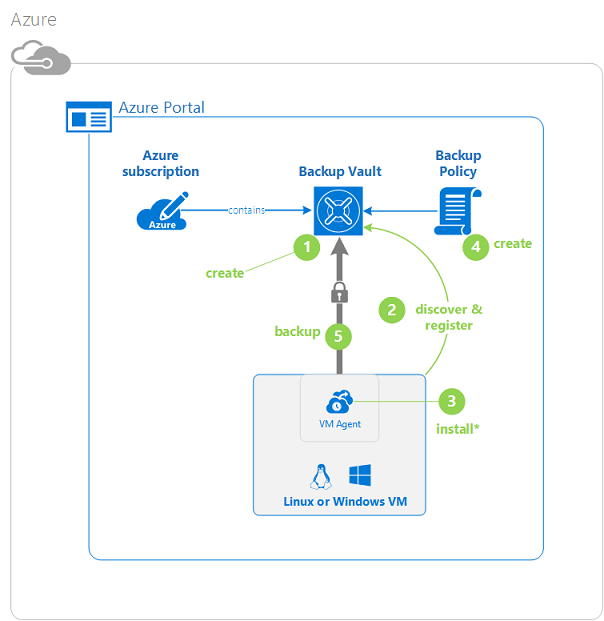  

>[AZURE.NOTE] Azure 有两种用于创建和使用资源的部署模型：[资源管理器部署模型和经典部署模型](/documentation/articles/resource-manager-deployment-model/)。本教程适用于可在 Azure 经典管理门户中创建的 VM。Azure 备份服务支持基于资源管理器的 VM。

## 步骤 1 - 为 VM 创建备份保管库

备份保管库是存储所有按时间创建的备份和恢复点的实体。备份保管库还包含将应用到要备份的虚拟机的备份策略。

1. 登录 [Azure 经典管理门户](http://manage.windowsazure.cn/)。

2. 在 Azure 门户预览的左下角单击“新建”

      

3. 在“快速创建”向导中，单击“数据服务”>“恢复服务”>“备份保管库”>“快速创建”。

      

    向导将提示输入“名称”和“区域”。如果管理多个订阅，将出现一个用于选择订阅的对话框。

4. 对于“名称”，请输入一个友好名称以标识保管库。名称对于 Azure 订阅需要是唯一的。

5. 在“区域”中，为保管库选择地理区域。保管库**必须**与要保护的虚拟机位于同一区域中。

    如果不知道 VM 所在的区域，请关闭此向导，然后单击 Azure 服务列表中的“虚拟机”。“位置”列提供区域的名称。如果你在多个区域中具有虚拟机，请在每个区域中创建备份保管库。

6. 如果向导中没有“订阅”对话框，请跳到下一个步骤。如果使用多个订阅，请选择要与新备份保管库关联的订阅。

    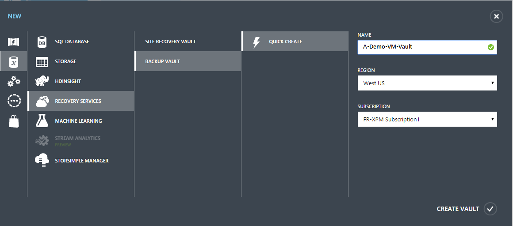  

7. 单击“创建保管库”。创建备份保管库可能需要一段时间。可以在门户底部监视状态通知。

      

    将出现一条消息确认保管库已成功创建。该保管库在“恢复服务”页中以“活动”状态列出。

      

8. 在“恢复服务”页的保管库列表中，选择创建的保管库以启动“快速启动”页。

    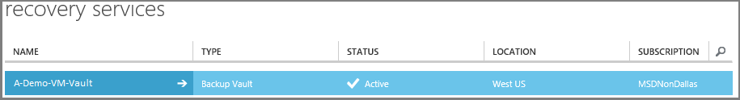  

9. 在“快速启动”页上，单击“配置”打开存储复制选项。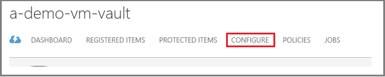

10. 在“存储复制”选项中，选择保管库的复制选项。

    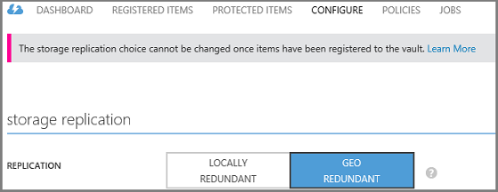  

    默认情况下，保管库具有异地冗余存储。如果这是你的主要备份，请选择异地冗余存储。如果你想要一个更便宜、但持久性不太高的选项，请选择本地冗余存储。阅读 [Azure 存储复制概述](/documentation/articles/storage-redundancy/)，了解有关异地冗余和本地冗余存储选项的详细信息。

选择好保管库的存储选项后，可以开始将 VM 与保管库相关联。若要开始关联，请发现及注册 Azure 虚拟机。

## 步骤 2 - 发现并注册 Azure 虚拟机
向保管库注册 VM 之前，请运行发现过程以识别所有新 VM。随后将返回订阅中虚拟机的列表和其他信息，例如云服务名称和区域。

1. 登录 [Azure 经典管理门户](http://manage.windowsazure.cn/)

2. 在 Azure 经典管理门户中，单击“恢复服务”打开恢复服务保管库列表。
    

3. 从保管库列表中，选择要备份 VM 的保管库。

    选择保管库时，它将在“快速启动”页中打开

4. 在保管库菜单中，单击“已注册项”。

      

5. 在“类型”菜单中选择“Azure 虚拟机”。

    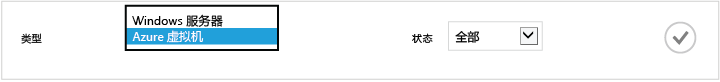  

6. 单击页面底部的“发现”。

    发现过程可能会需要几分钟，将以表格显示虚拟机。屏幕底部有一个通知，让你知道系统正在运行发现过程。

      

    发现过程完成后，该通知会变化。

    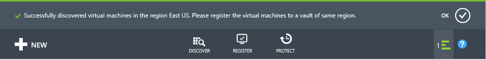  

7. 单击页面底部的“注册”。

8. 在“注册项”快捷菜单中，选择你要注册的虚拟机。

    >[AZURE.TIP] 可以一次注册多个虚拟机。

    为每一个选定的虚拟机创建一个作业。

9. 单击通知中的“查看作业”，转到“作业”页。

      

    虚拟机还会出现在注册项列表中，并会显示注册操作的状态。

    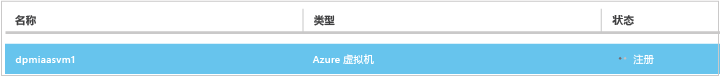  

    操作完成后，状态会更改，以反映*已注册*状态。

      

## 步骤 3 - 在虚拟机中安装 VM 代理

Azure VM 代理必须安装在 Azure 虚拟机上，备份扩展才能运行。如果你的 VM 是从 Azure 库创建的，则该 VM 上已包含 VM 代理。可以跳到[保护 VM](/documentation/articles/backup-azure-vms-first-look/#step-4-protect-azure-virtual-machines/)。

如果你的 VM 是从本地数据中心迁移的，则该 VM 上可能尚未安装 VM 代理。必须先在虚拟机上安装 VM 代理，然后才能继续保护 VM。有关安装 VM 代理的详细步骤，请参阅[“备份 VM”一文中的“VM 代理”部分](/documentation/articles/backup-azure-vms-prepare/#vm-agent/)。

## 步骤 4 - 创建备份策略
在触发初始备份作业之前，请设置计划来规定何时创建备份快照。规定备份快照创建时间以及快照保留时长的计划就是备份策略。保留期信息基于祖父-父-子备份轮转方案。

1. 导航到 Azure 经典管理门户中“恢复服务”下的备份保管库，然后单击“已注册项”。
2. 从下拉菜单中选择“Azure 虚拟机”。

    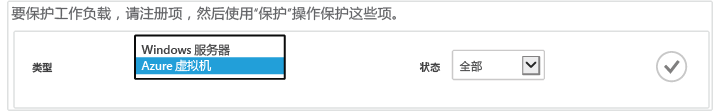  

3. 单击页面底部的“保护”。

    此时将显示**受保护的项向导**，其中*只*列出了已注册但未受保护的虚拟机。

    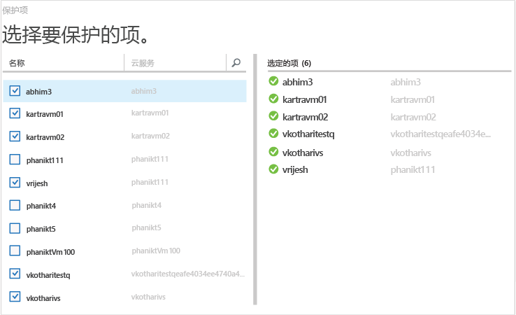  

4. 选择要保护的虚拟机。

    如果存在两个以上的同名虚拟机，请使用云服务来区别虚拟机。

5. 在“配置保护”菜单中，选择现有策略或创建新策略，以保护标识的虚拟机。

    新备份保管库与一个默认策略相关联。此策略在每天晚上创建每日快照，该每日快照将保留 30 天。每个备份策略可以有多个关联的虚拟机。但无论何时，该虚拟机只能与一个策略相关联。

    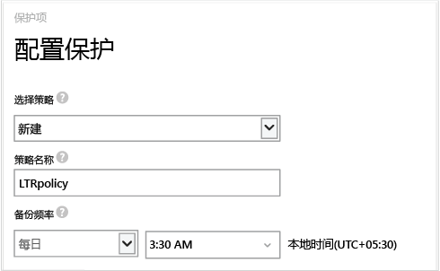  

    >[AZURE.NOTE] 备份策略包括计划备份的保留期方案。如果选择现有的备份策略，则不能修改下一步的保留期选项。

6. 在“保留期”中，定义特定备份点的每日、每周、每月和每年范围。

    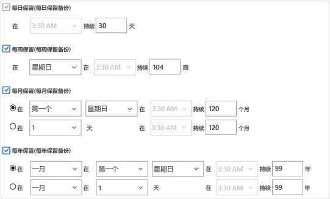  

    保留策略指定存储备份的时间长短。你可以根据备份的时间指定不同的保留策略。

7. 单击“作业”查看“配置保护”作业的列表。

    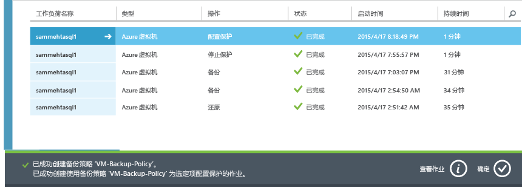  

    现在你已创建策略，接下来请转到下一步骤，运行初始备份。

## 步骤 5 - 初始备份

在虚拟机受到策略保护后，可以在“受保护的项”选项卡上查看该关系。在执行初始备份之前，“保护状态”将显示为“受保护 - (等待初始备份)”。默认情况下，第一个计划的备份是*初始备份*。

  

若要立即开始初始备份，请执行以下操作：

1. 在“受保护的项”页底部，单击“立即备份”。
    

    Azure 备份服务将为初始备份操作创建备份作业。

2. 单击“作业”选项卡查看作业列表。

    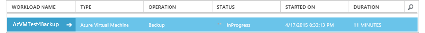  

    完成初始备份后，“受保护的项”选项卡中的虚拟机状态将显示为“受保护”。

    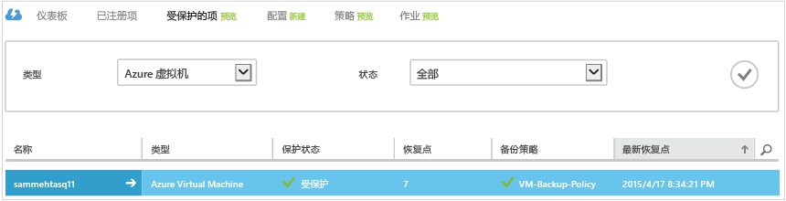  

    >[AZURE.NOTE] 备份虚拟机是在本地完成的过程。你不能将一个区域的虚拟机备份到另一个区域的备份保管库。因此，对于每个需要备份 VM 的 Azure 区域，需要在该区域中至少创建一个备份保管库。

## 后续步骤
成功备份 VM 后，你可能需要执行几个相关的步骤。最合理的步骤是熟悉将数据还原到 VM 的操作。但是，有几个管理任务可帮助了解如何确保数据安全和最大限度地降低成本。

- [管理和监视你的虚拟机](/documentation/articles/backup-azure-manage-vms-classic/)
- [恢复虚拟机](/documentation/articles/backup-azure-restore-vms/)
- [故障排除指南](/documentation/articles/backup-azure-vms-troubleshoot/)

## 有疑问？
如果你有疑问，或者希望包含某种功能，请[给我们反馈](http://aka.ms/azurebackup_feedback)。

<!---HONumber=Mooncake_1017_2016-->
