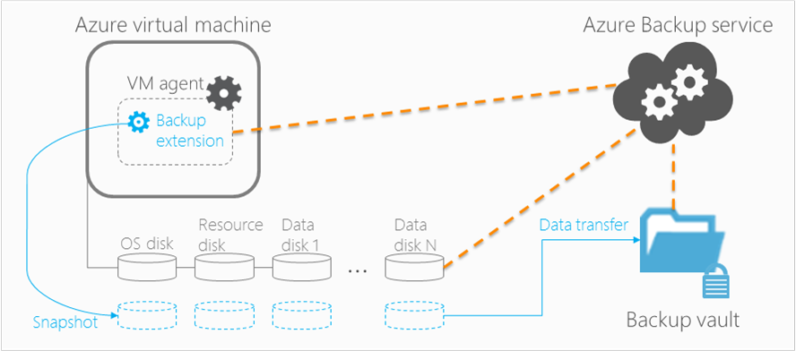

<properties
    pageTitle="在 Azure 中规划 VM 备份基础结构 | Azure"
    description="规划在 Azure 中备份虚拟机时的重要注意事项"
    services="backup"
    documentationcenter=""
    author="markgalioto"
    manager="carmonm"
    editor=""
    keywords="备份 vm, 备份虚拟机"
    translationtype="Human Translation" />
<tags
    ms.assetid="19d2cf82-1f60-43e1-b089-9238042887a9"
    ms.service="backup"
    ms.workload="storage-backup-recovery"
    ms.tgt_pltfrm="na"
    ms.devlang="na"
    ms.topic="article"
    ms.date="3/1/2017"
    wacn.date="04/24/2017"
    ms.author="markgal;trinadhk"
    ms.sourcegitcommit="a114d832e9c5320e9a109c9020fcaa2f2fdd43a9"
    ms.openlocfilehash="6ce02a9ee0aa0e68e9ce0e135c000f355d9bdd6e"
    ms.lasthandoff="04/14/2017" />

# 在 Azure 中计划 VM 备份基础结构
本文提供性能和资源建议，帮助规划 VM 备份基础结构。 文中还定义了备份服务的主要方面；这些方面对于决定体系结构、容量规划和计划安排至关重要。 如果已[准备好环境](/documentation/articles/backup-azure-vms-prepare/)，请首先进行此规划，然后再开始[备份 VM](/documentation/articles/backup-azure-vms/)。 如需有关 Azure 虚拟机的详细信息，请参阅[虚拟机文档](/documentation/services/virtual-machines/)。

## Azure 虚拟机备份原理
当 Azure 备份服务在计划的时间启动备份作业时，它将触发进行时间点快照拍摄所需的备份扩展。 创建快照时，将借助卷影复制服务 (VSS) 来获取虚拟机中磁盘的一致性快照，不必关闭该虚拟机。

拍摄快照后，数据将由 Azure 备份服务传输到备份保管库中。 为了使备份过程更加高效，服务只标识并传输自上次备份后已更改的数据块。

数据传输完成后，将会删除快照并创建恢复点。

> [AZURE.NOTE]
> 提取备份时，Azure 备份不包括附加到虚拟机的临时磁盘。 有关详细信息，请参阅[临时磁盘](https://blogs.msdn.microsoft.com/mast/2013/12/06/understanding-the-temporary-drive-on-windows-azure-virtual-machines/)
>
>

### 数据一致性
备份和还原业务关键型数据十分复杂，因为需要在生成数据的应用程序仍在运行时备份业务关键型数据。 为了解决此问题，Azure 备份对 Microsoft 工作负荷进行应用程序一致性备份，使用 VSS 来确保将数据正确写入到存储中。

> [AZURE.NOTE]
> Linux 虚拟机只能使用文件一致性备份，因为 Linux 没有与 VSS 相当的平台。
>
>

Azure 备份将在 Windows VM 上创建 VSS 完整备份（深入了解 [VSS 完整备份](http://blogs.technet.com/b/filecab/archive/2008/05/21/what-is-the-difference-between-vss-full-backup-and-vss-copy-backup-in-windows-server-2008.aspx)）。 若要启用 VSS 复制备份，需要在 VM 上设置以下注册表项。

    [HKEY_LOCAL_MACHINE\SOFTWARE\MICROSOFT\BCDRAGENT]
    "USEVSSCOPYBACKUP"="TRUE"

此表介绍了一致性类型，以及在 Azure VM 备份和还原过程中，这些一致性类型会在何种条件下出现。

| 一致性 | 基于 VSS | 解释和详细信息 |
| --- | --- | --- |
| 应用程序一致性 |是 |应用程序一致性非常适合 Microsoft 工作负荷，因为它可确保：<ol><li> VM *启动*。 <li>无数据损坏。 <li>无数据丢失。<li> 对于使用数据的应用程序，数据将保持一致，因为备份时会使用 VSS 将应用程序纳入考虑。</ol> 大多数 Microsoft 工作负荷都有 VSS 写入器，负责执行与数据一致性相关的工作负荷特定操作。 例如，Microsoft SQL Server 的 VSS 编写器可确保正确写入事务日志文件和数据库。   对于 Azure VM 备份，若要创建应用程序一致恢复点，备份扩展必须调用 VSS 工作流且需在获取 VM 快照前完成调用。 若要确保 Azure VM 快照准确性，则也必须完成所有 Azure VM 应用程序的 VSS 编写器。  （了解 [VSS 基本信息](http://blogs.technet.com/b/josebda/archive/2007/10/10/the-basics-of-the-volume-shadow-copy-service-vss.aspx)，并深入了解其[工作原理](https://technet.microsoft.com/zh-cn/library/cc785914%28v=ws.10%29.aspx)详细信息）。 |
| 文件系统一致性 |是 - 对于基于 Windows 的计算机 |在两种情况下，恢复点可做到文件系统一致：<ul><li>在 Azure 中备份 Linux VM，因为 Linux 没有与 VSS 等效的平台。<li>在 Azure 中备份 Windows VM 时出现 VSS 故障。</li></ul> 在这两种情况下，最佳做法是确保： <ol><li> VM *启动*。 <li>无数据损坏。<li>无数据丢失。</ol> 应用程序需要对还原的数据实施自己的“修复”机制。 |
| 崩溃一致性 |否 |这种情况相当于虚拟机“崩溃”（通过软重置或硬重置）。 崩溃一致性通常出现在 Azure 虚拟机在备份期间关闭时。 无论是从操作系统还是应用程序角度而言，崩溃一致性恢复点皆无法保证存储媒体上数据的一致性。 仅会捕获和备份备份时磁盘上已存在的数据。     尽管并无保证，但通常情况下，会启动操作系统，并在之后进行 chkdsk 等磁盘检查过程来修复任何损坏错误。 任何未传输到磁盘的内存中数据或写入都将丢失。 如果需要执行数据回滚，应用程序通常会接着执行其自身的验证机制。   例如，如果事务日志中的条目不在数据库中，则数据库软件将执行回滚，直到数据一致。 当数据分散在多个虚拟磁盘上时（例如跨区卷），崩溃一致恢复点不保证数据的正确性。 |

## 性能和资源利用率
与本地部署的备份软件一样，在 Azure 中备份 VM 时，应在容量和资源利用率方面进行需求规划。 [Azure 存储限制](/documentation/articles/azure-subscription-service-limits/#storage-limits/)定义如何构建 VM 部署，以获得最大性能并对运行中工作负荷造成最小影响。

规划备份性能时，请注意以下 Azure 存储限制：

- 每个存储帐户的最大传出
- 每个存储帐户的总请求速率

### 存储帐户限制
从存储帐户复制备份数据时，会计入该存储帐户的每秒输入/输出操作数 (IOPS) 和出口（或吞吐量）度量值。 同时，虚拟机会消耗 IOPS 与吞吐量。 其目的是确保备份流量和虚拟机流量不会超过存储帐户限制。

### 磁盘数目
备份过程会尝试尽可能快地完成备份作业。 在此情况下，它会占用尽可能多的资源。 但是， *单个 Blob 的目标吞吐量*实施 I/O 操作总次数限制为每秒 60 MB。 为了最大限度加快速度，备份过程会尝试并行备份每个 VM 磁盘。 如果 VM 有 4 个磁盘，则服务会尝试并行备份所有 4 个磁盘。 确定从客户存储帐户传出备份流量的最重要因素是备份的**磁盘数**。

### 备份计划
影响性能的另一因素是 **备份计划**。 如果将策略配置为让所有 VM 同时进行备份，则会导致流量拥塞。 备份过程会尝试并行备份所有磁盘。 减少存储帐户备份流量的一种方法是，确保在一天的不同时间备份不同 VM，且备份时间不会重叠。

## 容量规划
综合上述因素来看，用户需规划存储帐户使用需求。 请下载 [VM 备份容量规划 Excel 电子表格](https://gallery.technet.microsoft.com/Azure-Backup-Storage-a46d7e33)，以了解磁盘和备份计划选择所造成的影响。

### 备份吞吐量
对于每个要备份的磁盘，Azure 备份将读取磁盘上的块，并只存储更改的数据（增量备份）。 下表显示了备份服务吞吐量平均值。 使用以下数据可以估算备份给定大小的磁盘所需的时间。

| 备份操作 | 最优吞吐量 |
| --- | --- |
| 初始备份 |160 Mbps |
| 增量备份 (DR) |640 Mbps    如果更改数据（需要进行备份的数据）分散在磁盘，则吞吐量会显著下降。|

## VM 备份总时间
尽管大部分备份时间花在读取和复制数据上，但其他一些操作也会影响到备份 VM 所需的总时间：

- 花费在[安装或更新备份扩展](/documentation/articles/backup-azure-vms/)上的时间。
- 快照时间，即触发某个快照所花费的时间。 接近计划的备份时间时触发快照。
- 队列等待时间。 由于备份服务要处理来自多个客户的备份，可能不会立即将备份数据从快照复制到备份或恢复服务保管库。 在负载高峰期，由于要处理的备份数过多，等待时间可能会长达 8 小时。 但是，每日备份策略规定的 VM 备份总时间不会超过 24 小时。
- 数据传输时间，备份服务计算上一备份中的增量更改并将更改传输到保管库存储所需的时间。

### 为什么会看到较长的备份时间（超过 15 小时）？
备份包含两个阶段：获取快照和将快照传输到保管库。 备份服务针对存储进行相关优化。 将快照数据传输到保管库时，服务仅传输上一个快照的增量更改。  为确定增量更改，服务会计算块的校验和。 如果一个块发生更改，则该块会被标识为要发送到保管库的块。 然后服务进一步钻取到每个已标识块，寻找机会尽量减少要传输的数据。 评估所有已更改块后，服务将联合更改并将其发送到保管库。 对于一些旧版应用程序，不适宜存储小的分段写入。 如果快照包含很多小的分段写入，则服务会花费额外时间处理应用程序编写的数据。 对于在 VM 内部运行的应用程序，Azure 中建议的应用程序写入块的最小值是 8 KB。 如果应用程序使用大小小于 8 KB 的块，则备份性能会受影响。 有关调整应用程序以提高备份性能的帮助信息，请参阅[调整应用程序以实现 Azure 存储的最佳性能](/documentation/articles/storage-premium-storage-performance/)。 尽管有关备份性能的本文使用了高级存储示例，但是本指南同样适用于标准存储磁盘。

## 总还原时间
还原操作包括两个主要的子任务：将数据从保管库复制回所选的客户存储帐户和创建虚拟机。 从保管库复制回数据取决于 Azure 中内部存储备份的位置以及存储客户存储帐户的位置。 复制数据所花的时间取决于：
- 队列等待时间 - 由于服务同时处理来自多个客户的还原作业，因此还原请求会排入队列中。
- 数据复制时间 - 如果需要，会首先将数据从保管库复制到客户存储帐户。 如果必须在备份服务从保管库写入数据前将数据复制到客户存储帐户，则复制时间会增加。 若要减少还原过程期间的复制时间，请选择一个未加载其他应用程序写入和读取的存储帐户。

## 最佳实践
我们建议在为虚拟机配置备份时遵循以下做法：

- 请勿计划同时备份同一云服务中 10 个以上的经典 VM。 若要备份同一云服务中的多个 VM，建议将备份开始时间错开一小时。
- 请勿计划同时备份 40 个以上的 VM。
- 请在非高峰时间计划 VM 备份，以便备份服务可通过 IOPS 将数据从客户存储帐户传输到备份或恢复服务保管库。
- 请确保策略已应用于分布在不同存储帐户中的 VM。 建议不要使用同一备份计划保护单个存储帐户中总数超过 20 个的磁盘。 如果存储帐户中的磁盘超过 20 个，可将这些 VM 分散到多个策略中，以便在备份过程的传输阶段能够获得所需的 IOPS。
- 不要将运行在高级存储上的 VM 还原到同一存储帐户。 如果还原操作过程与备份操作一致，则会减少备份的可用 IOPS。
- 建议将每个高级 VM 运行在不同的高级存储帐户上，确保优化备份性能。

## 数据加密
在备份过程中，Azure 备份不会加密数据。 但是，可以在 VM 中加密数据，然后无缝备份保护的数据（阅读有关[加密数据备份](/documentation/articles/backup-azure-vms-encryption/)的详细信息）。

## 计算受保护实例的成本
通过 Azure 备份进行备份的 Azure 虚拟机的收费依据 [Azure 备份定价](/pricing/details/backup/)。 受保护的实例计算基于虚拟机的实际大小，即虚拟机中除“资源磁盘”外的所有数据之和。

VM 备份计费不是基于附加到虚拟机的每个数据磁盘的最大支持大小。 该项计费基于数据磁盘中存储的实际数据。 与此类似，备份存储空间的收费是根据通过 Azure 存储空间存储的数据容量，即每个恢复点中实际数据之和。

以 A2 标准大小的虚拟机为例，该虚拟机有两个额外的数据磁盘，总大小为 1TB。 下表提供了其中每个磁盘上存储的实际数据：

| 磁盘类型 | 最大大小 | 实际存在的数据 |
| --- | --- | --- |
| 操作系统磁盘 |1023 GB |17 GB |
| 本地磁盘/资源磁盘 |135 GB |5 GB（不包括在备份中） |
| 数据磁盘 1 |1023 GB |30 GB |
| 数据磁盘 2 |1023 GB |0 GB |

此示例中，虚拟机的实际大小为 17 GB + 30 GB + 0 GB = 47 GB。 此受保护实例大小 (47 GB) 成为按月计费的基础。 随着虚拟机中数据量的增长，用于计费的受保护实例大小也会相应变化。

第一个备份成功完成后才会开始计费。 存储和受保护的实例也会在此同时开始计费。 只要虚拟机包含 Azure 备份存储的任何备份数据，就会持续计费。 如果保留备份数据，执行“停止保护”操作将不会停止计费。

指定的虚拟机只有在停止保护和删除全部备份数据后才会停止计费。 没有活动的备份作业（停止保护时）时﹐上次成功备份时的虚拟机大小成为新的受保护实例大小（用作按月计费的基础）。

## 有疑问？
如果你有疑问，或者希望包含某种功能，请 [给我们反馈](http://aka.ms/azurebackup_feedback)。

## 后续步骤
- [备份虚拟机](/documentation/articles/backup-azure-vms/)
- [管理虚拟机备份](/documentation/articles/backup-azure-manage-vms-classic/)
- [恢复虚拟机](/documentation/articles/backup-azure-restore-vms/)
- [解决 VM 备份问题](/documentation/articles/backup-azure-vms-troubleshoot/)

<!---Update_Description: wording update -->