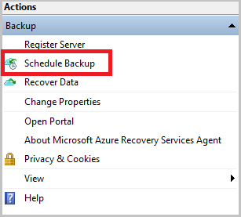
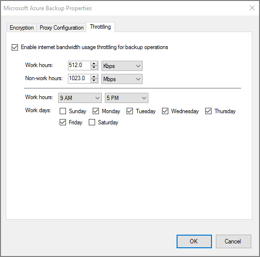

<properties
    pageTitle="通过资源管理器部署模型使用 Azure 备份将 Windows Server 或客户端备份到 Azure | Azure"
    description="通过创建备份保管库、下载凭据、安装备份代理并完成文件和文件夹的初始备份，将 Windows 服务器或客户端备份到 Azure。"
    services="backup"
    documentationcenter=""
    author="markgalioto"
    manager="cfreeman"
    editor=""
    keywords="备份保管库; 备份 Windows 服务器; 备份 windows;" />  

<tags
    ms.assetid="7f5b1943-b3c1-4ddb-8fb7-3560533c68d5"
    ms.service="backup"
    ms.workload="storage-backup-recovery"
    ms.tgt_pltfrm="na"
    ms.devlang="na"
    ms.topic="article"
    ms.date="11/16/2016"
    wacn.date="01/06/2017"
    ms.author="jimpark; trinadhk; markgal" />  

# 通过资源管理器部署模型将 Windows Server 或客户端备份到 Azure

> [AZURE.SELECTOR]
- [资源管理器](/documentation/articles/backup-configure-vault/)
- [经典部署模型](/documentation/articles/backup-configure-vault-classic/)

本文介绍如何通过资源管理器部署模型使用 Azure 备份将 Windows Server（或 Windows 客户端）文件和文件夹备份到 Azure。

[AZURE.INCLUDE [了解部署模型](../../includes/backup-deployment-models.md)]

  

## 开始之前
若要将服务器或客户端备份到 Azure，你需要一个 Azure 帐户。如果没有帐户，只需几分钟的时间就能创建一个[试用帐户](/pricing/1rmb-trial/)。

## 步骤 1：创建恢复服务保管库
恢复服务保管库是存储所有按时间创建的备份和恢复点的实体。恢复服务保管库还包含应用到受保护文件和文件夹的备份策略。在创建恢复服务保管库时，你还应选择适当的存储冗余选项。

### 创建恢复服务保管库

1. 首先使用以下命令行登录你的 Azure 订阅。

        Login-AzureRmAccount -EnvironmentName AzureChinaCloud

1. 如果你是首次使用 Azure 备份，则必须使用 **[Register-AzureRMResourceProvider](https://msdn.microsoft.com/zh-cn/library/mt603685.aspx)** cmdlet 注册用于订阅的 Azure 恢复服务提供程序。

        Register-AzureRmResourceProvider -ProviderNamespace "Microsoft.RecoveryServices"

2. 恢复服务保管库是一种 Resource Manager 资源，因此需要将它放在资源组中。你可以使用现有的资源组，也可以使用 **[New-AzureRmResourceGroup](https://msdn.microsoft.com/zh-cn/library/mt603739.aspx)** cmdlet 创建新的资源组。创建新的资源组时，请指定资源组的名称和位置。

        New-AzureRmResourceGroup –Name "test-rg" –Location "China North"

3. 使用 **[New-AzureRmRecoveryServicesVault](https://msdn.microsoft.com/zh-cn/library/mt643910.aspx)** cmdlet 创建新的保管库。确保为保管库指定的位置与用于资源组的位置是相同的。

        New-AzureRmRecoveryServicesVault -Name "testvault" -ResourceGroupName " test-rg" -Location "West US"

4. 指定要使用的存储冗余类型；你可以使用[本地冗余存储 (LRS)](/documentation/articles/storage-redundancy/) 或[异地冗余存储 (GRS)](/documentation/articles/storage-redundancy/#geo-redundant-storage)。以下示例显示，testVault 的 -BackupStorageRedundancy 选项设置为 GeoRedundant。

        $vault1 = Get-AzureRmRecoveryServicesVault –Name "testVault"
        Set-AzureRmRecoveryServicesBackupProperties  -Vault $vault1 -BackupStorageRedundancy GeoRedundant

## 步骤 2 - 下载文件

>[AZURE.NOTE] 通过 Azure 门户预览启用备份功能即将推出。目前，可以使用本地 Azure 恢复服务代理备份文件和文件夹。

#### 下载恢复服务代理

点击[这里](https://go.microsoft.com/fwLink/?LinkID=288905&clcid=0x0409)下载 Windows Server 或 Windows 客户端的代理。

#### 下载保管库凭据

使用以下 PowerShell 脚本下载保管库凭据。

    $vault1 = Get-AzureRmRecoveryServicesVault –Name “testVault”
    $credspath = "C:\downloads"
    $credsfilename = Get-AzureRmRecoveryServicesVaultSettingsFile -Backup -Vault $vault1 -Path  $credspath

## 步骤 3 - 安装并注册代理
1. 在 Downloads 文件夹（或其他保存位置）中找到并双击 **MARSagentinstaller.exe**。
2. 完成 Azure 恢复服务代理安装向导。若要完成该向导，你需要：

   - 选择安装和缓存文件夹的位置。
   - 如果使用代理服务器来连接 Internet，请提供代理服务器信息。
   - 如果使用经过身份验证的代理，请提供用户名和密码详细信息。
   - 提供已下载的保管库凭据
   - 将加密通行短语保存在安全的位置。

    >[AZURE.NOTE] 如果你丢失或忘记了通行短语，Microsoft 无法帮助你恢复备份数据。请将文件保存在安全的位置。还原备份时需要用到此文件。

现已安装代理，且已向保管库注册计算机。接下来可以配置和计划备份。

## 步骤 4：完成初始备份
初始备份包括两个关键任务：

- 计划备份
- 首次备份文件和文件夹

若要完成初始备份，请使用 Azure 备份代理。

### 计划备份
1. 打开 Azure 备份代理。可以通过在计算机中搜索“Azure 备份”找到该代理。

    
2. 在“备份代理”中，单击“计划备份”。

    
3. 在计划备份向导的“开始使用”页上，单击“下一步”。
4. 在“选择要备份的项”页上，单击“添加项”。
5. 选择要备份的文件和文件夹，然后单击“确定”。
6. 单击“下一步”。
7. 在“指定备份计划”页上指定**备份计划**，然后单击“下一步”。

    可以计划每日（频率为一天最多三次）或每周备份。

      

    >[AZURE.NOTE] 有关如何指定备份计划的详细信息，请参阅[使用 Azure 备份来取代磁带基础结构](/documentation/articles/backup-azure-backup-cloud-as-tape/)一文。

8. 在“选择保留策略”页上，为备份复制选择“保留策略”。

    保留策略指定备份可以存储的时间长短。你可以根据备份的创建时间指定不同的保留策略，而不只是为所有备份点指定一个“通用的策略”。你可以根据需要修改每日、每周、每月和每年保留策略。
9. 在“选择初始备份类型”页上，选择初始备份类型。将“自动通过网络”选项保持选中状态，然后单击“下一步”。

    你可以通过网络自动备份，或者脱机备份。本文的余下部分将介绍自动备份过程。
10. 在“确认”页上复查信息，然后单击“完成”。
11. 在向导完成创建备份计划后，请单击“关闭”。

### 启用网络限制
备份代理提供网络限制。限制功能将控制数据传输期间的网络带宽使用方式。如果需要在上班时间内备份数据，但不希望备份程序干扰其他 Internet 流量，此控制机制很有帮助。限制适用于备份和还原活动。

>[AZURE.NOTE] 网络限制在 Windows Server 2008 R2 SP1、Windows Server 2008 SP2 或 Windows 7（带 Service Pack）上不可用。Azure 备份网络限制功能需要在本地操作系统上使用服务质量 (QoS)。虽然 Azure 备份可以保护这些操作系统，但这些平台上的可用 QoS 版本不兼容 Azure 备份网络限制。网络限制可用于所有其他[支持的操作系统](/documentation/articles/backup-azure-backup-faq/)。

**启用网络限制**

1. 在“备份代理”中，单击“更改属性”。

    
2. 在“限制”选项卡上，选中“为备份操作启用 Internet 带宽使用限制”复选框。

    
3. 启用限制后，指定在“工作时间”和“非工作时间”允许使用多少带宽进行备份数据传输。

    带宽值从每秒 512 千字节 (Kbps) 开始，最高可为每秒 1,023 兆字节 (MBps)。你还可以指定“工作时间”的开始和结束时间，以及一周中有哪几天被视为工作日。指定的工作时间以外的时间视为非工作时间。
4. 单击**“确定”**。

### 首次备份文件和文件夹
1. 在“备份代理”中单击“立即备份”，以通过网络完成初始种子设定。

      

2. 在“确认”页上复查“立即备份向导”用于备份计算机的设置。然后单击“备份”。
3. 单击“关闭”以关闭向导。如果你在备份过程完成之前执行此操作，向导将继续在后台运行。

完成初始备份后，备份控制台中将显示“作业已完成”状态。

  

## 有疑问？
如果你有疑问，或者希望包含某种功能，请[给我们反馈](http://aka.ms/azurebackup_feedback)。

## 后续步骤
有关备份 VM 或其他工作负荷的详细信息，请参阅：

- 如果需要还原备份，请参阅[将文件还原到 Windows 计算机](/documentation/articles/backup-azure-restore-windows-server/)一文。

<!---HONumber=Mooncake_1212_2016-->
