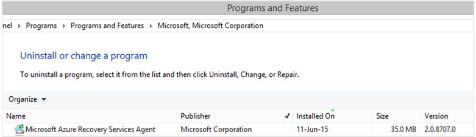

<properties
    pageTitle="Azure 备份 - 使用 PowerShell 备份 DPM 工作负荷 | Microsoft 文档"
    description="了解如何使用 PowerShell 部署和管理 Data Protection Manager (DPM) 的 Azure 备份"
    services="backup"
    documentationcenter=""
    author="NKolli1"
    manager="shreeshd"
    editor=""
    translationtype="Human Translation" />
<tags
    ms.assetid="e9bd223c-2398-4eb1-9bf3-50e08970fea7"
    ms.service="backup"
    ms.workload="storage-backup-recovery"
    ms.tgt_pltfrm="na"
    ms.devlang="na"
    ms.topic="article"
    ms.date="1/23/2017"
    wacn.date="04/24/2017"
    ms.author="adigan;anuragm;trinadhk;markgal"
    ms.sourcegitcommit="a114d832e9c5320e9a109c9020fcaa2f2fdd43a9"
    ms.openlocfilehash="52170dbfe01aaade9de2ffc73fcf3660e42c68ec"
    ms.lasthandoff="04/14/2017" />

# <a name="deploy-and-manage-backup-to-azure-for-data-protection-manager-dpm-servers-using-powershell"></a>使用 PowerShell 部署和管理 Data Protection Manager (DPM) 服务器的 Azure 备份
> [AZURE.SELECTOR]
- [ARM](/documentation/articles/backup-dpm-automation/)
- [经典](/documentation/articles/backup-dpm-automation-classic/)

本文说明如何使用 PowerShell 在 DPM 服务器上设置 Azure 备份，以及管理备份和恢复。

## <a name="setting-up-the-powershell-environment"></a>设置 PowerShell 环境
[AZURE.INCLUDE [learn-about-deployment-models](../../includes/learn-about-deployment-models-include.md)]

在可以使用 PowerShell 管理 Data Protection Manager 的 Azure 备份之前，需要在 PowerShell 中设置适当的环境。 在 PowerShell 会话开始时，请确保运行以下命令，以便导入正确的模块以及正确引用 DPM cmdlet：

    PS C:> & "C:\Program Files\Microsoft System Center 2012 R2\DPM\DPM\bin\DpmCliInitScript.ps1"

    Welcome to the DPM Management Shell!

    Full list of cmdlets: Get-Command
    Only DPM cmdlets: Get-DPMCommand
    Get general help: help
    Get help for a cmdlet: help <cmdlet-name> or <cmdlet-name> -?
    Get definition of a cmdlet: Get-Command <cmdlet-name> -Syntax
    Sample DPM scripts: Get-DPMSampleScript

## <a name="setup-and-registration"></a>设置和注册
开始时，请执行以下操作：

1. [下载最新的 PowerShell](https://github.com/Azure/azure-powershell/releases)（要求的最低版本：1.0.0）
2. 通过 **Switch-AzureMode** commandlet 切换到 *AzureResourceManager* 模式，从而启用 Azure 备份 commandlet：

    PS C:\> Switch-AzureMode AzureResourceManager

使用 PowerShell 可以自动化以下设置和注册任务：

- 创建恢复服务保管库
- 安装 Azure 备份代理
- 注册到 Azure 备份服务
- 网络设置
- 加密设置

## <a name="create-a-recovery-services-vault"></a>创建恢复服务保管库
以下步骤将引导用户创建恢复服务保管库。 恢复服务保管库不同于备份保管库。

1. 如果是首次使用 Azure 备份，则必须使用 **Register-AzureRMResourceProvider** cmdlet 将 Azure 恢复服务提供程序注册到订阅。

        PS C:\> Register-AzureRmResourceProvider -ProviderNamespace "Microsoft.RecoveryServices"

2. 恢复服务保管库是一种 ARM 资源，因此需要将它放在资源组中。 可以使用现有资源组，也可以创建新组。 创建新的资源组时，请指定资源组的名称和位置。  

        PS C:\> New-AzureRmResourceGroup -Name "test-rg" -Location "China North"

3. 使用 **New-AzureRmRecoveryServicesVault** cmdlet 创建新的保管库。 确保为保管库指定的位置与用于资源组的位置是相同的。

        PS C:\> New-AzureRmRecoveryServicesVault -Name "testvault" -ResourceGroupName " test-rg" -Location "China North"

4. 指定要使用的存储冗余类型；你可以使用[本地冗余存储 (LRS)](/documentation/articles/storage-redundancy/#locally-redundant-storage/) 或[异地冗余存储 (GRS)](/documentation/articles/storage-redundancy/#geo-redundant-storage/)。 以下示例显示，testVault 的 -BackupStorageRedundancy 选项设置为 GeoRedundant。

    > [AZURE.TIP]
    > 许多 Azure 备份 cmdlet 要求使用恢复服务保管库对象作为输入。 因此，在变量中存储备份恢复服务保管库对象可提供方便。
    >
    >

        PS C:\> $vault1 = Get-AzureRmRecoveryServicesVault -Name "testVault"
        PS C:\> Set-AzureRmRecoveryServicesBackupProperties  -vault $vault1 -BackupStorageRedundancy GeoRedundant

## <a name="view-the-vaults-in-a-subscription"></a>在订阅中查看保管库
使用 **Get-AzureRmRecoveryServicesVault** 查看当前订阅中所有保管库的列表。 可以使用此命令来查看是否创建了新的保管库，或者查看订阅中的可用保管库。

运行 Get-AzureRmRecoveryServicesVault 命令即可列出订阅中的所有保管库。

    PS C:\> Get-AzureRmRecoveryServicesVault
    Name              : Contoso-vault
    ID                : /subscriptions/1234
    Type              : Microsoft.RecoveryServices/vaults
    Location          : ChinaNorth
    ResourceGroupName : Contoso-docs-rg
    SubscriptionId    : 1234-567f-8910-abc
    Properties        : Microsoft.Azure.Commands.RecoveryServices.ARSVaultProperties

## <a name="installing-the-azure-backup-agent-on-a-dpm-server"></a>在 DPM 服务器上安装 Azure 备份代理
在安装 Azure 备份代理之前，必须先将安装程序下载到 Windows Server 上。 可以从 [Microsoft 下载中心](http://aka.ms/azurebackup_agent)或恢复服务保管库的“仪表板”页获取最新版本的安装程序。 将安装程序保存到方便访问的位置，例如 *C:\Downloads\*。

若要安装代理，请**在 DPM 服务器上**已提升权限的 PowerShell 控制台中运行以下命令：

    PS C:\> MARSAgentInstaller.exe /q

这将以所有默认选项安装代理。 将在后台执行安装几分钟。 如果你没有指定 */nu* 选项，则安装结束时，会打开“Windows Update”窗口，以检查是否有任何更新。

代理在已安装程序列表中显示。 若要查看已安装的程序列表，请转到“**控制面板**”“ > **程序** > ”“**程序和功能**”。



### <a name="installation-options"></a>安装选项
若要查看可通过命令行运行的所有选项，请使用以下命令：

    PS C:\> MARSAgentInstaller.exe /?

可用选项包括：

| 选项 | 详细信息 | 默认 |
| --- | --- | --- |
| /q |静默安装 |- |
| /p:"location" |Azure 备份代理的安装文件夹路径。 |C:\Program Files\Microsoft Azure Recovery Services Agent |
| /s:"location" |Azure 备份代理的缓存文件夹路径。 |C:\Program Files\Microsoft Azure Recovery Services Agent\Scratch |
| /m |选择启用 Microsoft 更新 |- |
| /nu |安装完成后不要检查更新 |- |
| /d |卸载 Azure 恢复服务代理 |- |
| /ph |代理主机地址 |- |
| /po |代理主机端口号 |- |
| /pu |代理主机用户名 |- |
| /pw |代理密码 |- |

## <a name="registering-dpm-to-a-recovery-services-vault"></a>将 DPM 注册到恢复服务保管库
创建恢复服务保管库后，请下载最新的代理和保管库凭据，并将其存储在一个方便访问的位置（如 C:\Downloads）。

    PS C:\> $credspath = "C:\downloads"
    PS C:\> $credsfilename = Get-AzureRmRecoveryServicesVaultSettingsFile -Backup -Vault $vault1 -Path  $credspath
    PS C:\> $credsfilename
    C:\downloads\testvault\_Sun Apr 10 2016.VaultCredentials

在 DPM 服务器上，运行 [Start-OBRegistration](https://technet.microsoft.com/zh-cn/library/hh770398%28v=wps.630%29.aspx) cmdlet，将计算机注册到保管库。

    PS C:\> $cred = $credspath + $credsfilename
    PS C:\> Start-OBRegistration-VaultCredentials $cred -Confirm:$false
    CertThumbprint      :7a2ef2caa2e74b6ed1222a5e89288ddad438df2
    SubscriptionID      : ef4ab577-c2c0-43e4-af80-af49f485f3d1
    ServiceResourceName: testvault
    Region              :China North
    Machine registration succeeded.

### <a name="initial-configuration-settings"></a>初始配置设置
DPM 服务器在注册到恢复服务保管库后，会使用默认的订阅设置启动。 这些订阅设置包括网络、加密和临时区域。 若要更改订阅设置，需要先使用 [Get-DPMCloudSubscriptionSetting cmdlet](https://technet.microsoft.com/zh-cn/library/jj612793) 获取现有（默认）设置中的句柄：

    $setting = Get-DPMCloudSubscriptionSetting -DPMServerName "TestingServer"

所有修改都会对此本地 PowerShell 对象 ```$setting``` 进行，然后使用 [Set-DPMCloudSubscriptionSetting](https://technet.microsoft.com/zh-cn/library/jj612791) cmdlet 将整个对象提交到 DPM 和 Azure 备份以进行保存。 需要使用 ```-Commit``` 标志来确保持久保存所做的更改。 除非已提交，否则 Azure 备份不会应用和使用这些设置。

    PS C:\> Set-DPMCloudSubscriptionSetting -DPMServerName "TestingServer" -SubscriptionSetting $setting -Commit

## <a name="networking"></a>联网
如果 DPM 计算机与 Internet 上 Azure 备份服务的连接是通过代理服务器建立的，则只有提供代理服务器设置，才能成功备份。 为此，可以结合 ```-ProxyServer``` 和 ```-ProxyPort```、 ```-ProxyUsername```和 ```ProxyPassword``` 参数使用 [Set-DPMCloudSubscriptionSetting](https://technet.microsoft.com/zh-cn/library/jj612791) cmdlet。 此示例未使用代理服务器，因此我们要显式清除任何代理相关的信息。

    PS C:\> Set-DPMCloudSubscriptionSetting -DPMServerName "TestingServer" -SubscriptionSetting $setting -NoProxy

你也可以针对给定的一组星期日期，使用 ```-WorkHourBandwidth``` 和 ```-NonWorkHourBandwidth``` 选项来控制带宽使用。 本示例未设置任何限制。

    PS C:\> Set-DPMCloudSubscriptionSetting -DPMServerName "TestingServer" -SubscriptionSetting $setting -NoThrottle

## <a name="configuring-the-staging-area"></a>配置过渡区域
在 DPM 服务器上运行的 Azure 备份代理需要使用临时存储来存放从云还原的数据（本地过渡区域）。 可以使用 [Set-DPMCloudSubscriptionSetting](https://technet.microsoft.com/zh-cn/library/jj612791) cmdlet 和 ```-StagingAreaPath``` 参数来配置过渡区域。

    PS C:\> Set-DPMCloudSubscriptionSetting -DPMServerName "TestingServer" -SubscriptionSetting $setting -StagingAreaPath "C:\StagingArea"

在上述示例中，过渡区域将在 PowerShell 对象 ```$setting``` 中设置为 *C:\StagingArea*。 请确保指定的文件夹已存在，否则订阅设置的最终提交将会失败。

### <a name="encryption-settings"></a>加密设置
发送到 Azure 备份的备份数据将会加密，以保护数据的机密性。 加密通行短语是在还原时用于解密数据的“密码”。 必须妥善保管设置好的通行短语，并保证其安全。

在以下示例中，第一个命令会将字符串 ```passphrase123456789``` 转换为安全字符串，并将安全字符串分配给名为 ```$Passphrase``` 的变量。 第二个命令会将 ```$Passphrase``` 中的安全字符串设置为加密备份的密码。

    PS C:\> $Passphrase = ConvertTo-SecureString -string "passphrase123456789" -AsPlainText -Force

    PS C:\> Set-DPMCloudSubscriptionSetting -DPMServerName "TestingServer" -SubscriptionSetting $setting -EncryptionPassphrase $Passphrase

> [AZURE.IMPORTANT]
> 请妥善保管设置好的通行短语，并保证其安全。 如果没有此通行短语，则无法从 Azure 还原数据。
>
>

此时，你应该已对 ```$setting``` 对象做出了全部所需的更改。 请记得提交更改。

    PS C:\> Set-DPMCloudSubscriptionSetting -DPMServerName "TestingServer" -SubscriptionSetting $setting -Commit

## <a name="protect-data-to-azure-backup"></a>在 Azure 备份中保护数据
在本部分中，你要将生产服务器添加到 DPM，然后分别在本地 DPM 存储和 Azure 备份中保护数据。 在示例中，我们将演示如何备份文件和文件夹。 你可以轻松地延伸这种思路，以备份 DPM 支持的任何数据源。 所有 DPM 备份均受保护组 (PG) 控制，该组由四个部分构成：

1. **组成员**是你要在相同的保护组中保护的所有可保护对象的列表（在 DPM 中也称为*数据源*）。 例如，你可能想要保护一个保护组中的生产 VM 与另一个保护组中的 SQL Server 数据库，因为它们可能有不同的备份要求。 在可以备份生产服务器上的任何数据源之前，需要确保 DPM 代理已安装在服务器上并受 DPM 的管理。 遵循[安装 DPM 代理](https://technet.microsoft.com/zh-cn/library/bb870935.aspx)的步骤，并将代理链接到相应的 DPM 服务器。
2. **数据保护方法** 指定目标备份位置 - 磁带、磁盘和云。 在本示例中，我们将在本地磁盘和云中保护数据。
3. **备份计划** ，用于指定需要进行备份的时间，以及应该在 DPM 服务器和生产服务器之间同步数据的频率。
4. **保留计划** ，用于指定要在 Azure 中保留恢复点的时长。

### <a name="creating-a-protection-group"></a>创建保护组
首先，使用 [New-DPMProtectionGroup](https://technet.microsoft.com/zh-cn/library/hh881722) cmdlet 创建新的保护组。

    PS C:\> $PG = New-DPMProtectionGroup -DPMServerName " TestingServer " -Name "ProtectGroup01"

上述 cmdlet 将创建名为 *ProtectGroup01*的保护组。 也可以稍后修改现有的保护组，以将备份添加到 Azure 云中。 不过，若要对保护组（新的或现有的）进行任何更改，我们需要使用 [Get-DPMModifiableProtectionGroup](https://technet.microsoft.com/zh-cn/library/hh881713) cmdlet 来获取 *modifiable* 对象上的句柄。

    PS C:\> $MPG = Get-ModifiableProtectionGroup $PG

### <a name="adding-group-members-to-the-protection-group"></a>将组成员添加到保护组
每个 DPM 代理知道它安装所在服务器上数据源列表。 若要将数据源添加到保护组，DPM 代理需要先将数据源列表发回给 DPM 服务器。 然后选择一个或多个数据源，并将其添加到保护组。 实现此目的需要执行的 PowerShell 步骤包括：

1. 通过 DPM 代理获取 DPM 管理的所有服务器的列表。
2. 选择特定的服务器。
3. 获取该服务器上所有数据源的列表。
4. 选择一个或多个数据源，并将其添加到保护组

使用 [Get-DPMProductionServer](https://technet.microsoft.com/zh-cn/library/hh881600) cmdlet 获取安装 DPM 代理并由 DPM 服务器管理的服务器的列表。 在本示例中，我们将进行筛选，并只为备份配置名为 *productionserver01* 的 PS。

    PS C:\> $server = Get-ProductionServer -DPMServerName "TestingServer" | where {($_.servername) -contains "productionserver01"

现在使用 [Get-DPMDatasource](https://technet.microsoft.com/zh-cn/library/hh881605) cmdlet 获取 ```$server``` 上的数据源列表。 在本示例中，我们将筛选要为备份配置的卷 *D:\*。 然后，使用 [Add-DPMChildDatasource](https://technet.microsoft.com/zh-cn/library/hh881732) cmdlet 将此数据源添加到保护组。 请记得使用 *modifiable* 保护组对象 ```$MPG``` 来完成添加。

    PS C:\> $DS = Get-Datasource -ProductionServer $server -Inquire | where { $_.Name -contains "D:\" }

    PS C:\> Add-DPMChildDatasource -ProtectionGroup $MPG -ChildDatasource $DS

视需要重复此步骤多次，直到已将选择的所有数据源添加到保护组。 你也可以只从一个数据源开始，完成创建保护组的工作流，然后将更多的数据源添加到保护组。

### <a name="selecting-the-data-protection-method"></a>选择数据保护方法
将数据源添加到保护组后，下一步是使用 [Set-DPMProtectionType](https://technet.microsoft.com/zh-cn/library/hh881725) cmdlet 指定保护方法。 在本示例中，为本地磁盘和云备份设置保护组。 还需使用带 -Online 标志的 [Add-DPMChildDatasource](https://technet.microsoft.com/zh-cn/library/hh881732.aspx) cmdlet 指定想要将其送到云中进行保护的数据源。

    PS C:\> Set-DPMProtectionType -ProtectionGroup $MPG -ShortTerm Disk -LongTerm Online
    PS C:\> Add-DPMChildDatasource -ProtectionGroup $MPG -ChildDatasource $DS -Online

### <a name="setting-the-retention-range"></a>设置保留范围
使用 [Set-DPMPolicyObjective](https://technet.microsoft.com/zh-cn/library/hh881762) cmdlet 设置备份点保留。 尽管在定义备份计划之前设置保留点看起来有点奇怪，但使用 ```Set-DPMPolicyObjective``` cmdlet 会自动设置稍后可修改的默认备份计划。 始终可以先设置备份计划，然后再设置保留策略。

以下示例中的 cmdlet 将设置磁盘备份的保留参数。 这会将备份保留 10 天，并每隔 6 小时在生产服务器和 DPM 服务器之间同步数据。 ```SynchronizationFrequencyMinutes``` 不会定义创建备份点的频率，只会定义数据复制到 DPM 服务器的频率。  此设置可防止备份变得太大。

    PS C:\> Set-DPMPolicyObjective -ProtectionGroup $MPG -RetentionRangeInDays 10 -SynchronizationFrequencyMinutes 360

为了将备份转移到 Azure（DPM 将此称为联机备份），可将保留期配置为[使用祖父-父-子方案 (GFS) 的长期保留](/documentation/articles/backup-azure-backup-cloud-as-tape/)。 也就是说，你可以定义组合保留策略，其中包括每日、每周、每月和每年保留策略。 在此示例中，我们将创建一个用于表示所需复杂保留配置的数组，然后使用 [Set-DPMPolicyObjective](https://technet.microsoft.com/zh-cn/library/hh881762) cmdlet 配置保留范围。

    PS C:\> $RRlist = @()
    PS C:\> $RRList += (New-Object -TypeName Microsoft.Internal.EnterpriseStorage.Dls.UI.ObjectModel.OMCommon.RetentionRange -ArgumentList 180, Days)
    PS C:\> $RRList += (New-Object -TypeName Microsoft.Internal.EnterpriseStorage.Dls.UI.ObjectModel.OMCommon.RetentionRange -ArgumentList 104, Weeks)
    PS C:\> $RRList += (New-Object -TypeName Microsoft.Internal.EnterpriseStorage.Dls.UI.ObjectModel.OMCommon.RetentionRange -ArgumentList 60, Month)
    PS C:\> $RRList += (New-Object -TypeName Microsoft.Internal.EnterpriseStorage.Dls.UI.ObjectModel.OMCommon.RetentionRange -ArgumentList 10, Years)
    PS C:\> Set-DPMPolicyObjective -ProtectionGroup $MPG -OnlineRetentionRangeList $RRlist

### <a name="set-the-backup-schedule"></a>设置备份计划
如果你使用 ```Set-DPMPolicyObjective``` cmdlet 指定保护目标，DPM 会自动设置默认的备份计划。 若要更改默认计划，请依序使用 [Get-DPMPolicySchedule](https://technet.microsoft.com/zh-cn/library/hh881749) cmdlet 和 [Set-DPMPolicySchedule](https://technet.microsoft.com/zh-cn/library/hh881723) cmdlet。

    PS C:\> $onlineSch = Get-DPMPolicySchedule -ProtectionGroup $mpg -LongTerm Online
    PS C:\> Set-DPMPolicySchedule -ProtectionGroup $MPG -Schedule $onlineSch[0] -TimesOfDay 02:00
    PS C:\> Set-DPMPolicySchedule -ProtectionGroup $MPG -Schedule $onlineSch[1] -TimesOfDay 02:00 -DaysOfWeek Sa,Su -Interval 1
    PS C:\> Set-DPMPolicySchedule -ProtectionGroup $MPG -Schedule $onlineSch[2] -TimesOfDay 02:00 -RelativeIntervals First,Third -DaysOfWeek Sa
    PS C:\> Set-DPMPolicySchedule -ProtectionGroup $MPG -Schedule $onlineSch[3] -TimesOfDay 02:00 -DaysOfMonth 2,5,8,9 -Months Jan,Jul
    PS C:\> Set-DPMProtectionGroup -ProtectionGroup $MPG

在上例中，```$onlineSch``` 是带有四个元素的数组，其中包含采用 GFS 方案的保护组的现有联机保护计划：

1. ```$onlineSch[0]``` 包含每日计划
2. ```$onlineSch[1]``` 包含每周计划
3. ```$onlineSch[2]``` 包含每月计划
4. ```$onlineSch[3]``` 包含每年计划

因此，如果你需要修改每周计划，需要引用 ```$onlineSch[1]```。

### <a name="initial-backup"></a>初始备份
第一次备份数据源时，DPM 需要创建初始副本，该初始副本用于创建要在 DPM 副本卷上保护的数据源的完整副本。 此活动可以安排在特定的时间，或使用 [Set-DPMReplicaCreationMethod](https://technet.microsoft.com/zh-cn/library/hh881715) cmdlet 并结合参数 ```-NOW``` 手动触发。

    PS C:\> Set-DPMReplicaCreationMethod -ProtectionGroup $MPG -NOW

### <a name="changing-the-size-of-dpm-replica--recovery-point-volume"></a>更改 DPM 副本和恢复点卷的大小
还可以使用 [Set-DPMDatasourceDiskAllocation](https://technet.microsoft.com/zh-cn/library/hh881618.aspx) cmdlet 更改 DPM 副本卷和卷影复制卷的大小，如以下示例所示：
	
	Get-DatasourceDiskAllocation -Datasource $DS 
	Set-DatasourceDiskAllocation -Datasource $DS -ProtectionGroup $MPG -manual -ReplicaArea (2gb) -ShadowCopyArea (2gb)

### <a name="committing-the-changes-to-the-protection-group"></a>将更改提交到保护组
最后，需要提交更改，然后 DPM 才可以根据每个新保护组配置进行备份。 这可以使用 [Set-DPMProtectionGroup](https://technet.microsoft.com/zh-cn/library/hh881758) cmdlet 来实现。

    PS C:\> Set-DPMProtectionGroup -ProtectionGroup $MPG

## <a name="view-the-backup-points"></a>查看备份点
可以使用 [Get-DPMRecoveryPoint](https://technet.microsoft.com/zh-cn/library/hh881746) cmdlet 来获取数据源的所有恢复点列表。 在本示例中，我们将：

- 获取 DPM 服务器上的和存储在数组 ```$PG```
- 获取对应于 ```$PG[0]```
- 获取数据源的所有恢复点。

    PS C:\> $PG = Get-DPMProtectionGroup -DPMServerName "TestingServer"
    PS C:\> $DS = Get-DPMDatasource -ProtectionGroup $PG[0]
    PS C:\> $RecoveryPoints = Get-DPMRecoverypoint -Datasource $DS[0] -Online

## <a name="restore-data-protected-on-azure"></a>还原 Azure 上受保护的数据
还原数据是 ```RecoverableItem``` 对象和 ```RecoveryOption``` 对象的组合结果。 在上一部分中，我们已获取数据源的备份点列表。

在以下示例中，我们将演示如何通过组合备份点与恢复目标，从 Azure 备份还原 Hyper-V 虚拟机。 此示例包括：

- 使用 [New-DPMRecoveryOption](https://technet.microsoft.com/zh-cn/library/hh881592) cmdlet 创建恢复选项。
- 使用 ```Get-DPMRecoveryPoint``` cmdlet 获取备份点的数组。
- 选择要从中还原的备份点。

    PS C:\> $RecoveryOption = New-DPMRecoveryOption -HyperVDatasource -TargetServer "HVDCenter02" -RecoveryLocation AlternateHyperVServer -RecoveryType Recover -TargetLocation "C:\VMRecovery"

    PS C:\> $PG = Get-DPMProtectionGroup -DPMServerName "TestingServer"
    PS C:\> $DS = Get-DPMDatasource -ProtectionGroup $PG[0]
    PS C:\> $RecoveryPoints = Get-DPMRecoverypoint -Datasource $DS[0] -Online

    PS C:\> Restore-DPMRecoverableItem -RecoverableItem $RecoveryPoints[0] -RecoveryOption $RecoveryOption

可针对任何数据源类型轻松扩展这些命令。

## <a name="next-steps"></a>后续步骤
- 有关 DPM 到 Azure 备份的详细信息，请参阅 [DPM 备份简介](/documentation/articles/backup-azure-dpm-introduction-classic/)

<!---Update_Description: wording update -->