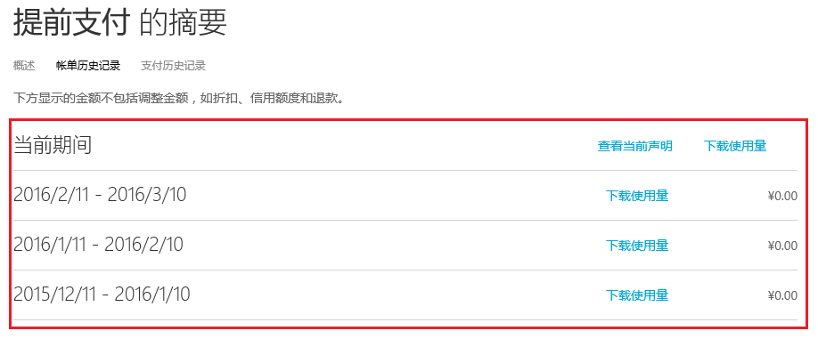
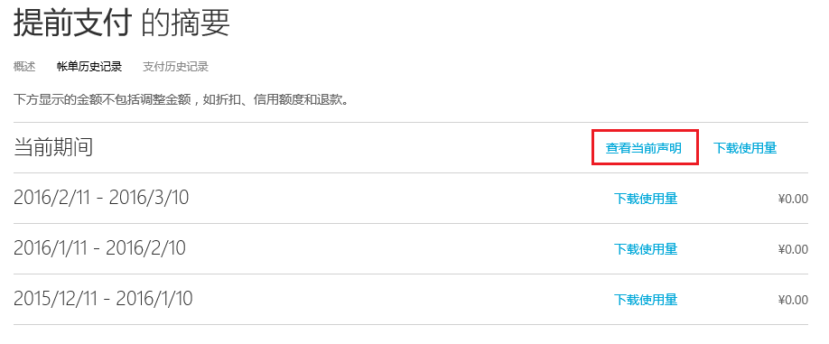
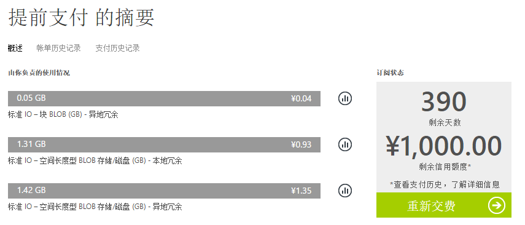
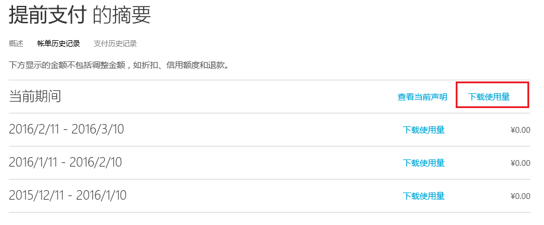
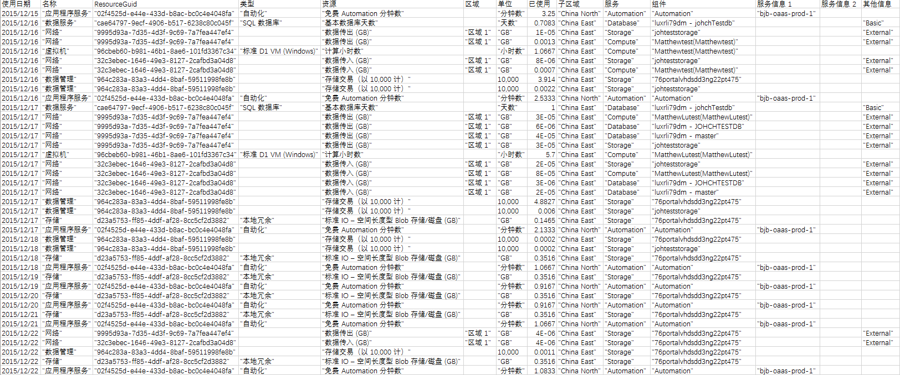

<properties
   pageTitle="了解你的 Azure 帐单"
   description="了解你的 Azure 帐单"
   services=""
   documentationCenter="Azure"
   authors="kareni"
   manager="jocho"
   editor=""
   tags="billing"/>

<tags
   ms.service="billing"
   ms.date="07/06/2015"
   wacn.date="10/3/2015"/>

# 了解 Microsoft Azure 帐单

Microsoft Azure 订阅的费用因资费套餐而异。某些资费套餐（例如 Visual Studio Ultimate with MSDN）包含你可以根据需要用于 Azure 服务的每月信用额度。

请注意，先前计费期间的最多 24 小时潜在使用量可以纳入你的当前计费期间。

有关耗用量、使用量以及资费套餐的详细信息，请参阅[“Microsoft Azure 购买选项”页](/pricing/purchase-options/)。

## 内容：

本主题将帮助你在查看帐单时完成以下任务。

-  查看或下载 Azure 帐单
-  客户信息
-  了解发票汇总
-  了解当前费用
-  页脚信息
-  了解其他信息
-  了解详细的使用费
-  分析每日使用数据

### 查看或下载 Microsoft Azure 帐单：

在“使用量和计费门户”中，您可以查看当前的帐单，并能下载过去的帐单。

查看或下载帐单：

1. 使用您的 Microsoft 帐户 ID 或者工作或学校帐户 ID，登录“使用量和计费门户”。

2. 单击你要查看其详细信息和使用量的订阅。

3. 单击“帐单”

    

4. “帐单”部分中列出了您最近 6 个计费周期（外加当前的未计费周期）的对帐单。当前期间的对帐单是生成估算值时的估计费用。此信息每天只会更新一次，而且可能不包含截到本日为止的所有使用量。你的每月帐单可能与这项估计有所不同。

    

5. 单击“查看当前对帐单”，查看截至估算生成时的估计费用。此信息每天只会更新一次，而且可能不包含截到本日为止的所有使用量。你的每月帐单可能与这项估计有所不同。

    

    

6. 单击“下载发票”，查看先前帐单的副本。

    

**以下是 Microsoft Azure 上提供的两种不同产品/服务的一些示例对帐单。**

 **产品/服务类型** | **说明** | **下载** |
 :--------- |:-------- | :-------|
即用即付 | 每月应付欠款 | [示例文件](https://azurepricing.blob.core.chinacloudapi.cn/sampleinvoices/Microsoft_Azure_ccinvoice_Sample.pdf)
承诺产品/服务 | 从预付承诺扣减的费用 | [示例文件](https://azurepricing.blob.core.chinacloudapi.cn/sampleinvoices/Microsoft_Azure_invoice_Sample.pdf)

## 页眉 - 客户信息

“客户信息”部分中指明了与使用量和配置文件相关的信息。

### 发票号
用于跟踪的唯一发票标识符。

### 计费周期
发生使用量的时间范围。

### 发票日期
生成发票的日期。

### 付款方式
在帐户中使用的付款类型（例如“发票”或“信用卡”）。

### 帐单邮寄地址
Microsoft Azure 付款地址。

### 订阅产品/服务
购买的订阅产品/服务的类型（即，即用即付、MSDN-Vidual Studio Ultimate 等）

### 帐户所有者电子邮件地址
注册 Microsoft Azure 帐户时使用的帐户电子邮件地址。

## 了解发票汇总
帐单的“发票汇总”部分汇总了上次帐单之后的交易以及当前的使用费。

帐单的“结余、付款和其他信用额度”部分汇总了上次帐单之后的交易。

### 前期结余
前期结余是上次帐单中结余的总金额。

### 付款
付款是应用到上次帐单的总付款金额。

### 未付余额（从上一计费周期）
上次帐单之后应用到你帐户的任何帐单调整（信用额度或结余）。

## 了解当前费用
帐单的“当前费用”部分包含有关每月费用的详细信息。链接已组织成以下小节。

### 使用费
使用费是订阅的每月总费用。我们会根据你过去一个月的使用量事后向你收取费用。

### 折扣
你的使用量服务折扣会反映在应用到当前帐单的这个行项目中。

### 调整
杂项调整是应用到当前帐单的其他信用额度或未付费用。例如，如果你享有 Visual Studio Ultimate with MSDN 优惠，你会在这个行项目中看到每月信用额度。如果你取消订阅，你会看到超过你优惠所含每月信用额度（从你当前计费期开始到订阅帐户取消日期为止）的每月使用费。

## 页脚信息

## 了解其他信息
“其他信息”页面提供可让了解发票的其他资源参考、用于查看你使用量的链接，以及帐单的其他相关信息。

### 详细使用情况
“详细使用情况”下面的描述中提供了一个链接，单击该链接可定向到“Azure 使用量和计费门户”，你可以在其中查看此订阅的详细使用情况。现在有两个版本可供下载：**.csv 版本 1** 包含旧的命名约定和使用量字段，而 **.csv 版本 2** 则包含每个类别的客户易记名称，以及其他有助于您了解在 Microsoft Azure 上使用的服务的字段。

### 其他信息和有用资源
此部分包含有关计算实例大小、SQL DB 费用等简单问题的链接，以及可帮助你进一步回答问题的有用链接。

### 买方
已预先填充了帐户的配置文件地址。

### 付款说明
此部分包含当你的付款方式是发票时，有关寄送支票、电汇或隔天送达支票等付款说明。

## 了解详细的使用费

我们一直在不断努力，以帮助客户轻松管理 Azure 使用量。我们已对报告 Azure 服务使用量和费用的下载使用量文件进行了改进。下载链接包含两个版本的使用量文件：**版本 1** 使用预先存在的格式；**版本 2** 包括其他信息和“每日使用量”部分中的更新后的列名称。

使用费是订阅的**每月**总费用扣除任何信用额度或折扣。我们会根据你过去一个月的使用量事后向你收取费用。文件的顶部显示在上月的计费周期内您要支付费用的服务的详细信息。下表列出了每个.csv 版本文件的列名称。

**版本 1** | **版本 2** | **说明**|
:---------------| :---------------- | --------|
计费周期 | 计费周期 | 使用资源时的计费周期。
Name | 测定仪类别 | 列出该次使用所属的最上层服务。
类型 | 测定仪子类别 | Azure 服务可能会在此列中按类型进一步定义，这可能会影响费率。
资源 | 测定仪名称 | 列出耗用资源的度量单位。
区域 | 测定仪区域 | 指明某些服务的数据中心的位置，这些服务根据数据中心位置进行定价。
SKU | SKU | 指明每个 Azure 资源的唯一系统标识符。
计价单位 | 计价单位 | 指明服务的计价单位。例如，GB、小时、10,000 秒。
已耗用 | 已耗用数量 | 包含计费期间所耗用的资源量。
附送 | 附送数量 | 包含当前计费周期免费提供的资源量。
可计费 | 超额数量 | 如果已耗用数量超过所提供的数量，则此数据行会显示差异。我们会针对此数量向你收费。对于不附送任何数量的即用即付产品/服务，此总数与已耗用数量相同。
在承诺额范围内 | 在承诺额范围内 | 包含从您的 6 或 12 个月产品/服务相关承诺用量中缩减的资源费用。请注意，你的资源费用依时间先后顺序从承诺用量中进行递减。
货币 | 货币 | 指明当前计费周期反映的货币。
超额 | 超额 | 包含超过您的 6 或 12 个月产品/服务相关承诺用量的资源费用。
承诺费率 | 承诺费率 | 包含基于您的 6 或 12 个月产品/服务相关总承诺用量的承诺费率。
费率 | 费率 | 费率会显示根据每个可计费单位向你收费的费率。
值 | 值 | 显示可计费列乘以费率列的结果。如果已耗用数量未超过所提供的数量，则此数据行中将不会有任何费用。

## 分析每日使用数据
可能会有数千行的日常使用数据，具体取决于你的使用情况。如果您想分析此数据，请单击“下载使用量”，然后选择逗号分隔变量文件 (.csv) 版本，以查看相应计费周期内的每日使用量数据。您可以下载每个版本的示例 .csv 文件，以供您参考。

 名称 | 下载 |
 :----------:| :-------: |
 详细的使用量 .csv 版本 1| [示例文件](https://azurepricing.blob.core.chinacloudapi.cn/sampleinvoices/Micorosft_Azure_Detailed_Usage_v1.csv)
 详细的使用量 .csv 版本 2 | [示例文件](https://azurepricing.blob.core.chinacloudapi.cn/sampleinvoices/Micorosft_Azure_Detailed_Usage_v2.csv)

在 .csv 文件中，项目会进行细分，以显示当前计费周期内每个资源的耗用量清单。

以下列显示了在开始计费期间时影响费率的详细信息：

**版本 1** | **版本 2** | **说明** |
:---------------| :----------------| -----|
使用日期 | 使用日期 | 资源的发出日期。
Name | 测定仪类别 | 列出该次使用所属的最上层服务。
资源 GUID | 测定仪 ID | 计费测定仪标识符。此标识符用于进行计费使用定价。
类型 | 测定仪子类别 | Azure 服务可能会在此列中按类型进一步定义，这可能会影响费率。
资源 | 测定仪名称 | 列出耗用资源的度量单位。
区域 | 测定仪区域 | 指明某些服务的数据中心的位置，这些服务根据数据中心位置进行定价。
计价单位 | 计价单位 | 指明服务的计价单位。例如，GB、小时、10,000 秒。
已耗用 | 已耗用数量 | 包含当日已耗用的资源量。
子区域 | 资源位置 | 指明资源正在其中运行的数据中心。
服务 | 已耗用的服务 | 你可以利用这个列来跟踪可能无法在名称列中特别列出的单个 Azure 平台服务。此服务列将指出与使用有关的特定服务。
不适用 | 资源组 | _**添加新列。**_ 部署的资源正在其中运行的资源组。请参阅 http://www.windowsazure.cn/documentation/articles/resource-group-overview/
组件 | 实例 ID | 正在运行的资源的标识符。此标识符包含您在资源创建时为其指定的名称。
不适用 | 标记 | _**添加新列。**_ Azure 中的新资源类型，允许您标记资源。请参阅 http://www.windowsazure.cn/zh-CN/updates/organize-your-azure-resources-with-tags/
其他信息 | 其他信息 | 与服务相关的其他元数据。
服务信息 1 | 服务信息 1 | 此列包含订阅上服务所属的项目名称。
服务信息 2 | 服务信息 2 | 这是一个旧字段，可以捕获可选的服务特定元数据。

除了一些新字段和对 csv 版本 2 的名称更改之外，将对以下字段中的数据进行标准格式化：

- **实例 ID**：“实例 ID”字段表示用户为已预配的服务指定的标识符。目前，有两种格式的实例 ID：资源名称或完全限定的资源 ID。Microsoft Azure 服务正在转换为对实例 ID 使用标准化的完全限定的资源 ID 格式 _**(/subscriptions/<subscription id>/resourcegroups/<resourcegroupname>/providers/<providername>/<resourcename>)**_。在服务转换为采用新格式时，您会看到“实例 ID”数据字段从仅包含资源名称更改为包含资源 ID。资源 ID 是 [Azure 资源管理器 API](https://msdn.microsoft.com/library/azure/dn790567.aspx) 用来标识订阅中资源的格式。

- **其他信息**：使用量 .csv 中的“其他信息”列指定了服务特定元数据。例如，VM 的图像类型。目前，服务会发出以下多个列中的服务特定元数据：“其他信息”、“服务信息 1”和“服务信息 2”字段。Microsoft Azure 服务仅对“其他信息”列中的发出服务特定元数据进行标准化。请参阅以下标准化格式快照：

- **标记**：此列包含用户指定的资源标记。标记可用于对计费记录进行分组。例如，您可以使用标记按使用服务的部门分配费用。详细了解如何[使用标记整理 Azure 资源](/resource-group-using-tags.md/)。支持发出标记的服务包括：
    - 虚拟机
    - 存储空间；以及
    - 使用 [Azure 资源管理器 API](https://msdn.microsoft.com/library/azure/dn790567.aspx) 预配的网络服务

有关每个服务的详细信息，请参阅其他来源。这些文件每月更新一次，将于下个月的 25 号发布（从 **2015 年 5 月**开始提供 .csv 版本 1，从 **2015 年 6 月**开始提供 .csv 版本 2）。以下是服务下载字段的基本文件 URL：

>>  https://azurepricing.blob.core.chinacloudapi.cn/supplemental/MOSPServices_v1_MMYYYY.xlsx https://azurepricing.blob.core.chinacloudapi.cn/supplemental/MOSPServices_v2_MMYYYY.xlsx

若要查找最新版本，请输入年份和月份（若要查找 2015 年 5 月的文件，请在上述 URL 的_**“MMYYYY”**_部分中输入 **052015**）。此电子表格列出了**使用量下载报告**中服务相关字段的所有可能组合。

## 更多资源
导航到**管理帐户、订阅和管理员角色**部分（在[管理服务](https://msdn.microsoft.com/library/azure/dn578292.aspx)下方），您会看到一些非常有用的链接：

- [管理付款方式](https://msdn.microsoft.com/library/azure/dn736054.aspx)

- [编辑现有信用卡的付款信息](https://msdn.microsoft.com/library/azure/dn736053.aspx)

- [添加新信用卡用作付款方式](https://msdn.microsoft.com/library/azure/dn736057.aspx)

- [更改 Microsoft Azure 帐户上的信用卡](https://msdn.microsoft.com/library/azure/dn736050.aspx)

- [如果我的 Azure 订阅被禁用，该怎么办？](https://msdn.microsoft.com/library/azure/dn736049.aspx)

<!--Image references-->

<!---HONumber=71-->