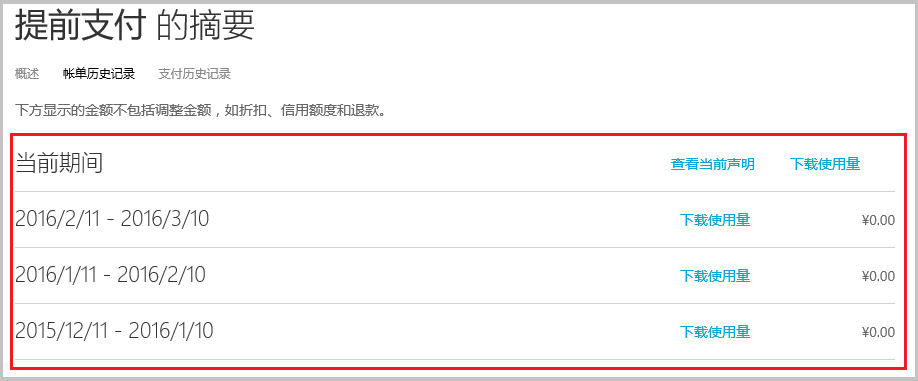
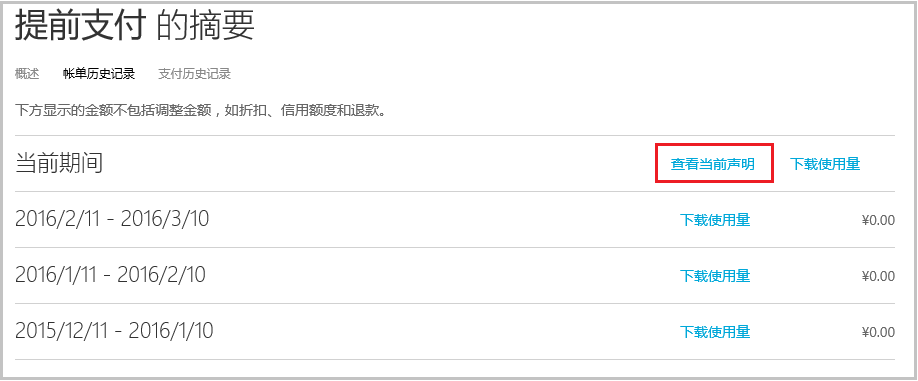
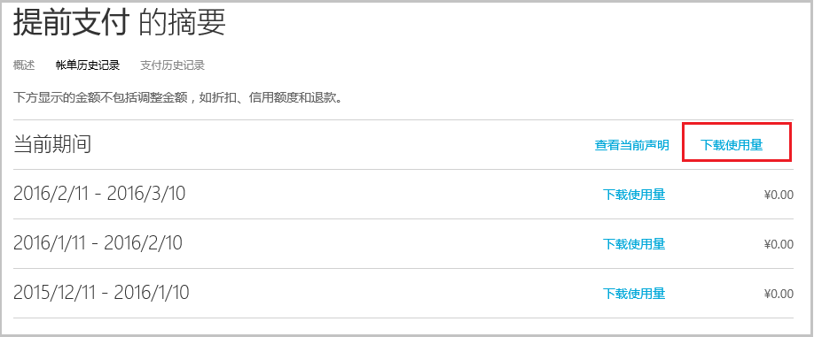

<properties
   pageTitle="了解你的 Azure 帐单"
   description="了解你的 Azure 帐单"
   services=""
   documentationCenter="Azure"
   authors="erihur"
   manager="stevenpo"
   editor=""
   tags="billing"/>

<tags
   ms.service="billing"
   ms.date="04/13/2016"
   wacn.date="05/12/2016"/>

# 了解你的 Azure 帐单

Azure 订阅的费用因资费套餐而异, 请注意，先前计费期间的最多 24 小时潜在使用量可以纳入你的当前计费期间。

## 查看 Azure 帐单：

在 [Azure 帐户门户](https://account.windowsazure.cn/subscriptions)中，你可以查看当前的帐单。

查看帐单：

1. 使用你的组织 ID 登录到[帐户门户](https://account.windowsazure.cn/subscriptions)。

2. 单击你要查看其详细信息和使用量的订阅。

3. 单击“帐单历史记录”。

    

4. “帐单”部分中列出了您最近 6 个计费周期（外加当前的未计费周期）的对帐单。当前期间的对帐单是生成估算值时的估计费用。此信息每天只会更新一次，而且可能不包含截到本日为止的所有使用量。你的每月帐单可能与这项估计有所不同。

    

5. 单击“查看当前声明”，查看截至估算生成时的估计费用。此信息每天只会更新一次，而且可能不包含截到本日为止的所有使用量。你的每月帐单可能与这项估计有所不同。

    

    

## 了解详细的使用费

我们一直在不断努力，以帮助客户轻松管理 Azure 使用量。我们已对报告 Azure 服务使用量和费用的下载使用量文件进行了改进。

使用费是订阅的**每月**总费用扣除任何信用额度或折扣。我们会根据你过去一个月的使用量事后向你收取费用。文件的顶部显示在上月的计费周期内您要支付费用的服务的详细信息。下表列出了 csv 文件的列名称。

**名称** | **说明** |
:---------------| :---------------- | --------|
计费期间 | 使用资源时的计费周期。
名称 | 列出该次使用所属的最上层服务。
类型 | Azure 服务可能会在此列中按类型进一步定义，这可能会影响费率。
资源 | 列出耗用资源的度量单位。
区域 | 指明某些服务的数据中心的位置，这些服务根据数据中心位置进行定价。
SKU | 指明每个 Azure 资源的唯一系统标识符。
单位 | 指明服务的计价单位。例如，GB、小时、10,000 秒。
已使用 | 包含计费期间所耗用的资源量。
已包括 | 包含当前计费周期免费提供的资源量。
可计费 | 如果已使用数量超过所提供的数量，则此数据行会显示差异。我们会针对此数量向你收费。对于不附送任何数量的即用即付产品/服务，此总数与已使用数量相同。
在承诺额范围内 | 包含从您的 6 或 12 个月产品/服务相关承诺用量中缩减的资源费用。请注意，你的资源费用依时间先后顺序从承诺用量中进行递减。
货币 | 指明当前计费周期反映的货币。
超额 | 包含超过您的 6 或 12 个月产品/服务相关承诺用量的资源费用。
承诺费率 | 包含基于您的 6 或 12 个月产品/服务相关总承诺用量的承诺费率。
费率 | 费率会显示根据每个可计费单位向你收费的费率。
值 | 显示可计费列乘以费率列的结果。如果已使用数量未超过所提供的数量，则此数据行中将不会有任何费用。

## 分析每日使用数据
可能会有数千行的日常使用数据，具体取决于您的使用情况。如果您想分析此数据，请单击“下载使用量”，以查看相应计费周期内的每日使用量数据。

在 .csv 文件中，项目会进行细分，以显示当前计费周期内每个资源的耗用量清单。

以下列显示了在开始计费期间时影响费率的详细信息：

**名称** | **说明** |
:---------------| :----------------| -----|
使用日期 | 资源的发出日期。
名称 | 列出该次使用所属的最上层服务。
ResourceGuid | 计费测定仪标识符。此标识符用于进行计费使用定价。
类型 | Azure 服务可能会在此列中按类型进一步定义，这可能会影响费率。
资源 | 列出耗用资源的度量单位。
区域 | 指明某些服务的数据中心的位置，这些服务根据数据中心位置进行定价。
单位 | 指明服务的计价单位。例如，GB、小时、10,000 秒。
已使用 | 包含当日已使用的资源量。
子区域 | 指明资源正在其中运行的数据中心。
服务 | 你可以利用这个列来跟踪可能无法在名称列中特别列出的单个 Azure 平台服务。此服务列将指出与使用有关的特定服务。
组件 | 正在运行的资源的标识符。此标识符包含您在资源创建时为其指定的名称。
服务信息 1 | 此列包含订阅上服务所属的项目名称。
服务信息 2 | 这是一个旧字段，可以捕获可选的服务特定元数据。
其他信息 | 与服务相关的其他元数据。

<!--Image references-->

<!---HONumber=Mooncake_0503_2016-->