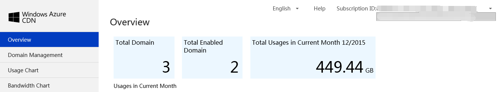

<properties linkid="dev-net-common-tasks-cdn" urlDisplayName="CDN" pageTitle="Azure Content Delivery Network FAQs: Azure feature guide" metaKeywords="Azure CDN, Azure CDN, Azure blobs, Azure caching, Azure add-ons, CDN FAQ, CDN FAQS, origin traffic, ICP record number, CDN default cache rules, origin domain name, subscribe, CNAME, download acceleration, Web acceleration, website acceleration, live streaming acceleration, VOD acceleration, video on demand acceleration, CDN price, CDN fees, technical documentation, help files" description="Find answers to common service consulting questions or inquiries related to Azure Content Delivery Network" metaCanonical="" services="" documentationCenter=".NET" title="" authors="" solutions="" manager="" editor="" />
<tags ms.service="cdn_en"
    ms.date=""
    wacn.date="2/23/2016"
    wacn.lang="en"
    />
> [AZURE.LANGUAGE]
- [中文](/documentation/articles/cdn-faq-service-inquiry/)
- [English](/documentation/articles/cdn-enus-faq-service-inquiry/) 
#FAQs – Consulting

+ [Azure CDN price consulting](#step1)
+ [The concept and role of Azure Content Delivery Network](#step2)
+ [What is a CNAME？](#step3)
+ [The relationship between Content Delivery Network traffic and return-to-source traffic](#step4)
+ [How long is the domain name verification period?](#step5)
+ [Why do you need to have an ICP number to use the Content Delivery Network?](#step6)
+ [Do second-level domain names need to be filed?](#step7)
+ [Can I use the Content Delivery Network if the domain name is redirected?](#step8)
+ [Is there a limit on the number of accelerated domain names you can add to a single account?](#step9)
+ [What types of acceleration does Azure CDN support?](#step10)
+ [What are the specific differences between the web acceleration, VoD acceleration, live streaming media acceleration, and HTTPS acceleration in the Content Delivery Network acceleration type options?](#step11)
+ [What are the default cache rules for Content Delivery Network?](#step12)
+ [Can cache rules be configured for wildcard domain names?](#step13)
+ [Are cache refresh operations supported if the custom domain name is a wildcard domain name?](#step14)
+ [Can wildcard domain names be used with preloading?](#step15)
+ [What is the difference between the “Origin Domain” and the “Origin Host Header”?](#step16)
+ [How to fill in Host Header?](#step17)
+ [What are the differences between the Standard and Premium version of CDN?](#step18)
+ [If I use Content Delivery Network acceleration with a blob, do I directly use the blob address, rather than the custom domain name? Does it need ICP number and why?](#step19)
+ [If there are multiple subscriptions, how do I switch between them?](#step20)

##**Price consulting**

### **Is all data transferred charged at a higher rate once the amount of data transferred each month exceeds 10 terabytes (TB)?**

No. Usage that falls under each level will be charged at the rate for that level. For example, if you generate 50 TB of standard-version Content Delivery Network data transfers in region 1, the first 10 TB will be charged at ¥0.45/gigabyte (GB), and the remaining 40 TB will be charged at ¥0.41/GB.

### **Do Content Delivery Network fees include performing storage requests, i.e., the costs of retrieving data and transferring data from storage to the network location?**

No, this is not included. When Content Delivery Network receives a request for an object that is not located in an edge location, it sends Azure Storage a request to obtain the data. The operations to fetch data from storage and transfer data from storage to Content Delivery Network will be charged at standard data transfer rates.

### **How are Content Delivery Network fees calculated?**

Fees for Content Delivery Network are currently calculated on the basis of traffic. Charging by bandwidth is not supported at the moment. For more specific information on pricing, refer to [Pricing details](/home/features/cdn/pricing/).

## **The concept and role of Azure Content Delivery Network**

Azure Content Delivery network adds a new layer of network architecture to the existing Internet by caching the content of websites to the network “edge” nearest to the user. This enables the user to obtain the required content from a closer location, which provides a high-bandwidth, low-latency user experience.

## **What is a CNAME？**

A CNAME (Canonical Name) record is a type of resource record in the Domain Name System (DNS) used to specify that a domain name is an alias for another domain. For example, if a user configures CDN service for his/her website using customer domain www.abc.com, there will be a CDN domain www.abc.com.mschcdn.com. The user must delete the corresponding A record for www.abc.com in his/her domain name registration company and add www.abc.com.mschcdn.com as the CNAME record for the custom domain name. Then, when users access www.abc.com, they will obtain the IP address record of the accelerated node that was parsed by www.abc.com.mschcdn.com.

## **The relationship between Content Delivery Network traffic and return-to-source traffic**

- Content Delivery Network traffic indicates cache hits.
    
- Return-to-source traffic indicates the missed portion.

## **How long is the domain name verification period?**

The process of checking if the custom domain name and ICP number match and are valid takes no more than one business day to complete. If pass the Internet Content Provider (ICP) verification, the Content Delivery Network service will be registered within 60 minutes, so that it can be propagated by the network. At the same time, you also need to configure the CNAME mapping details, as indicated by the notifications in the interface, before the cache content can finally be accessed via the custom domain name.

## **Why do you need to have an ICP number to use the Content Delivery Network?**
 
The IP address parsed after you install Content Delivery Network is the IP address of the network edge node. If the Ministry of Industry and Information Technology (MIIT) discovers that a record has not been filed, it will directly block the IP address. To avoid causing you more trouble in the future, we recommend that you do not use acceleration services for domain names that have no ICP number on file or for which the ICP number has been canceled, until it can be tracked by the MIIT. In terms of the ICP filing requirements, the only requirement is that the custom Content Delivery Network acceleration domain name you use has an ICP. There are no requirements for the origin domain itself, and origin domains both inside and outside China are supported.

## **Do second-level domain names need to be filed?**

Second-level domain names do not need to be filed. For example, if sample.com has been filed, then images.sample.com does not need to be filed, and it is sufficient to provide the ICP number for sample.com when you create the Content Delivery Network acceleration node.

## **Can I use the Content Delivery Network if the domain name is redirected?**

Yes, but we suggest that you accelerate the domain name following the redirect, as it is not necessary to accelerate domain names before the redirect.

##**Is there a limit on the number of accelerated domain names you can add to a single account?**

Azure CDN has no limit on the number of accelerated domain names that can be added to each account.
    
## **What types of acceleration does Azure CDN support?**
  
Currently, Azure CDN principally provides static acceleration, but also includes some dynamic acceleration technologies. Examples include returning to origin by using multiline nodes and Transmission Control Protocol (TCP) optimization. Active webpage acceleration techniques such as PHP, ASP.NET, and JSP are not supported, but more dynamic page acceleration methods will be gradually added in the future.

Acceleration types supported by Azure CDN include web acceleration, Video on Demand (VoD) acceleration, live streaming media (direct broadcast) acceleration, and HTTPS acceleration.
	
## **What are the specific differences between the web acceleration, VoD acceleration, live streaming media acceleration, and HTTPS acceleration in the Content Delivery Network acceleration type options?**

Different Content Delivery Network acceleration types correspond to different usage scenarios:

1. Web acceleration is for accelerating relatively small, static files such as webpages (HTML, CSS, images, or JS).

2. Download acceleration is generally for distributing large files of more than 20 MB in size.

3. VoD acceleration is for HTTP-based VoD.

4. Live streaming media acceleration is for live streaming media (direct broadcast).

5. HTTPS acceleration is for situations with relatively high security requirements and is principally intended for use with smaller types of files.

The differences in terms of how these acceleration types work with the CDN back-end is mainly that each type is powered by different network node equipment, but you do not need to perform any additional configuration.

## **What are the default cache rules for Content Delivery Network?**    

- **The system’s default cache rules for web acceleration are:**
  1. Dynamic files—such as those with the extensions PHP, ASPX, ASP, JSP, DO, DWR, CGI, FCGI, ACTION, ASHX, AXD, and JSON—are not cached.
  2. Files with the extensions SHTML, HTML, HTM, and JS are cached for half a day (720 minutes) by default. 
  3. All other static files are cached for one day (1,440 minutes) by default.

- **The system’s default cache rules for download acceleration are:**
  1. Dynamic files—such as those with the extensions PHP, ASPX, ASP, JSP, and DO—are not cached.
  2. Files with the extensions 7Z, APK, WDF, CAB, DHP, EXE, FLV, GZ, IPA, ISO, MPK, MPQ, PBCV, PXL, QNP, R00, RAR, XY, XY2, ZIP, and CAB are cached for one month.

- **The system’s default cache rules for VoD acceleration are:**
  1. Dynamic files—such as those with the extensions PHP, ASPX, ASP, JSP, and DO—are not cached.
  2. MP3 and WMA files are cached for one day.
  3. MWV, HTML, HTM, SHTML, HML, GIF, SWF, PNG, BMP, and JS files are cached for one hour.
  4. Files with the extensions 7Z, APK, WDF, CAB, DHP, EXE, FLV, GZ, IPA, ISO, MPK, MPQ, PBCV, PXL, QNP, R00, RAR, XY, XY2, ZIP, and CAB are cached for one month.

- **The system’s default cache rules for live streaming media acceleration are:**
  1. TS files are cached for two minutes.
  2. M3U8 files are cached for two seconds. 
	
**Cache rule logic:**

   1. If the user configured no-cache rules, these rules will be applied as top priority. Then, configured cache rules will be applied from top to bottom.

   2. If a particular URL is not matched in either the cache or no-cache rules, CDN default rules will be followed.

## **Can cache rules be configured for wildcard domain names?**

If you have created a wildcard domain name, the cache rules will be set up under the wildcard domain name. Wildcard domain names are mainly used for multiple domain names with the same configuration, to simplify the creation process. They can be created at the same time as real domain names, with the configuration for the real domain name taking priority for matching. For example, if the rule for a1.example.com is different, the customer can create a new endpoint for a1.example.com and create cache rules there. In this situation, the configuration there would have priority over the configuration for *.example.com.

## **Are cache refresh operations supported if the custom domain name is a wildcard domain name?**

If the custom domain name is a wildcard domain name, the refresh URL must specify the subdomain when the cache refresh is submitted. For example, if the custom domain name is *.domain.com and the customer wishes to refresh content under img.domain.com, the subdomain img.domain.com should be specified to perform the cache refresh operation.

## **Can wildcard domain names be used with preloading?**

Preloading requires a subdomain, which must be accessible (The HTTP status code is 200).
	 
## **What is the difference between the “Origin Domain” and the “Origin Host Header”?**

The Origin Domain indicates the actual, accessible origin address, which may be an IP address or a domain name. If it is a domain name, CDN will perform address parsing for the domain name when returning to source. It will then use the parsed IP address to access it.

The Origin Host Header indicates the host field value in the HTTP request header when CDN returns to source. This field value is generally a character string in the form of a domain name. The origin uses this domain name to identify whether it is the same as the domain name that was configured on origin site.

## **How to fill in Host Header?**

When you create CDN in the Azure CDN portal, enter the return-to-source access host header accepted by your origin in the “origin host header.” Once you have entered the custom domain, the system will automatically fill in a default value based on the origin domain type that you selected. To be more specific, if your source station is on Azure, the default value will be the corresponding source station address. If your source station is not on Azure, the default value will be the custom domain that you entered. You can also modify this based on the actual configuration of your source station.

## **What are the differences between the Standard and Premium version of CDN?**
     
First, the pricing is different. See [Pricing details](/home/features/cdn/pricing/) for specifics. Second, the current premium CDN service includes only HTTPS acceleration services, although other advanced acceleration services will gradually be added in the future. If you wish to use HTTPS acceleration services at this time, use the support page to contact the Azure support team to enable HTTPS acceleration services.

## **If I use Content Delivery Network acceleration with a blob, do I directly use the blob address, rather than the custom domain name? Does it need ICP number and why?**

Content Delivery Network is basically a group of network content caching nodes and is not equivalent to a customer’s origin. The caching nodes only incorporate the content that the user has set up for caching, which may  also expire.

The purpose of custom domain names is that they can be given a CNAME so that the cached origin content on CDN edge node is directly returned when source website content is accessed via CDN by using the custom domain name. Otherwise, it may be returned to source. This is the principle of Content Delivery Network.

If the custom domain name and the origin domain name were the same, the results would be:

1. A return-to-source failure because the acceleration node would be accessed again via DNS instead of the source station when returning to source.
2. An access failure because part of the source station content may not be on the acceleration nodes.

The law stipulates that custom domain names are subject to ICP record filing, but there are no requirements for source stations. However, if the second-level domain name for the custom domain name itself has already been filed, it is not necessary to file another application.

## **If there are multiple subscriptions, how do I switch between them?**
   
If you have multiple subscriptions, as shown in the diagram, you can click the triangular drop-down list in the Subscription ID area at the top-right corner of the Azure CDN management portal to select a suitable subscription ID.
    

    

<!---HONumber=CDN_1201_2015-->
