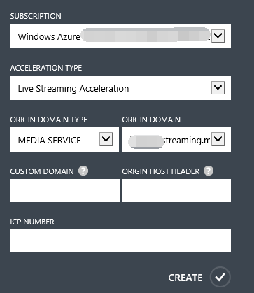
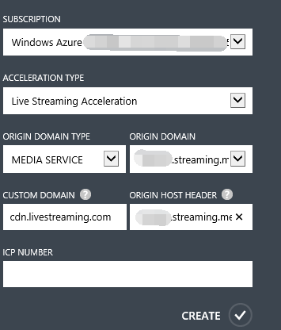
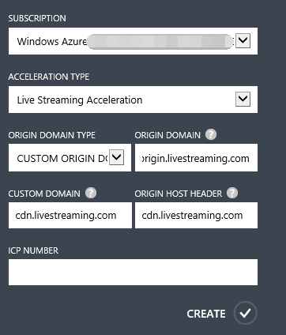
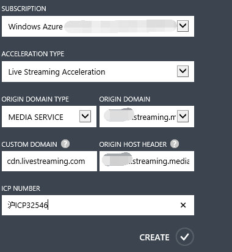

<properties linkid="dev-net-common-tasks-cdn" urlDisplayName="CDN" pageTitle="Create Live Streaming Acceleration-Type CDNs – Azure Feature Guide" metaKeywords="Azure CDN, Azure CDN, Azure blobs, Azure caching, Azure add-on, Live Streaming, streaming acceleration, CDN acceleration, CDN service, mainstream CDN, live streaming acceleration, media service, Azure Media Service, cache rules, HLS, CDN technical documentation, CDN help files, live video streaming acceleration, direct broadcast acceleration" description="Learn how to create Live Streaming Acceleration-type CDNs on Azure Management Portal, and learn about default caching rules for Download CDNs." metaCanonical="" services="" documentationCenter=".NET" title="" authors="" solutions="" manager="" editor="" />
<tags ms.service="cdn_en"
    ms.date="7/7/2016"
    wacn.date="7/7/2016"
    wacn.lang="7/7/2016"
    />
> [AZURE.LANGUAGE]
- [中文](/documentation/articles/cdn-how-to-create-LiveStreaming-CDN-endpoint/)
- [English](/documentation/articles/cdn-enus-how-to-create-LiveStreaming-CDN-endpoint/) 
#Create live streaming acceleration CDN nodes

The Live Streaming Acceleration service is mainly intended to provide acceleration services for online audio and video live broadcasting. The high-speed, real-time properties of online live broadcasting are very popular with users and leads to huge numbers of users accessing services concurrently, putting enormous strain on source station and bandwidth. Such services are also subject to Chinese restrictions on cross-region or cross-carrier traffic, which impose significant requirements on high-quality, high-speed streaming media direct broadcasts. The Azure CDN Live Streaming Acceleration service acquires the source station video stream in real time and delivers it to the CDN edge node closest to the user. It uses intelligent caching and scheduling strategies to calculate and provide the optimal node for the user, reducing the lag and bandwidth pressures caused by link transmissions. It is charged on the basis of data usage, providing users with a high-speed, smooth, high-quality live-streaming real-time viewing experience.

Azure CDN Live Streaming Acceleration is principally based on the HTTP Live Streaming (HLS) protocol and supports Azure’s built-in [Media Services](/home/features/media-services/).

Live Streaming Acceleration is suitable for use with all types of live broadcasting websites, such as online television broadcasts and direct broadcasts of sporting events or major public events.

This article is about creating domain names for Streaming Media Acceleration. You can also refer to [Using Azure CDN](/documentation/articles/cdn-enus-how-to-use/) to find out about the basics of creating Azure CDN acceleration nodes.

###**Default cache rules for live streaming acceleration**
The Azure CDN sets default cache rules (see below) for Live Streaming Acceleration. You can also set custom cache rules according to your own requirements. For specific details, see the Azure CDN Management Portal advanced management help file on “Domain Management.” If the source station content changes or is updated, but the cache time to live (TTL) has not yet expired, you can manually refresh the CDN cache files to synchronize the updated source station content in real time. For specific details, see the Azure CDN Management Portal advanced management help file on “Cache Refresh.”

**The system’s default cache rules for Streaming Media Acceleration**

 1. TS files are cached for 2 minutes.
 2. M3U8 files are cached for 2 seconds. 
      
###**Create streaming media acceleration domain names**

1. In the navigation pane of the Azure Management Portal, click “CDN.”
2. In the function area, click “Create New.” In the “Create New” dialogue box, select “App Services,” “CDN,” and “Quick Create” in that order.
3. Select “Streaming Media Acceleration” from the “Acceleration Type” drop-down list.
4. In the “Origin Domain Type” drop-down list, select cloud service, storage account, web app, media services, or a customized origin domain.
5. In the “Origin Domain” drop-down list, select one option from the list of available media services for use in creating the CDN endpoint. 
 
    

    If the selected “Origin Domain Type” is “Customized Origin Domain,” input your own origin domain address under “Origin Domain.” You can enter one or multiple origin domain IP addresses (separate multiple addresses with semicolons, e.g. “126.1.1.1;172.1.1.1”), or an origin domain name such as “origin.livestreaming.com.”

    

6. In “Custom Domain”, enter the custom domain name you wish to use, e.g. cdn.livestreaming.com. Custom domains support extensive domain name acceleration.
7. In “Origin Host Header,” enter the return to source access host header accepted by your source station. Once you have entered the “Custom Domain,” the system will automatically fill in a default value based on the “Origin Domain Type” you selected. To be more specific, if your source station is on Azure, the default value will be the corresponding source station address. If your source station is not on Azure, the default value will be the “Custom Domain” that you entered. Of course, you can also modify this based on the actual configuration of your source station.

    If the origin domain type is media services, the corresponding return to source host header is:

    
    
    If the origin domain type is a custom origin domain, the corresponding return to source host header is:

    
    
      
8. In “ICP Number,” enter the corresponding ICP record number for the custom domain that you entered (e.g., Jing ICP Bei XXXXXXXX Hao-X).
     
    

9. Click “Create” to create the new endpoint.

Once the endpoint has been created, it will appear in the list of subscribed endpoints. The list view shows the custom domains used to access cached content, as well as the origin domains. 
The origin domain is the original location of the content cached on the CDN. Custom domains are URLs used to access CDN cache content.

>**Note** that configurations created for endpoints cannot be used immediately; they must first pass checks to confirm that the ICP custom domain name matches the ICP number. For more details, see the second half of Step 2: Create new CDN endpoints in [Using Azure CDN](/documentation/articles/cdn-enus-how-to-use/).

<!---HONumber=CDN_1201_2015-->
