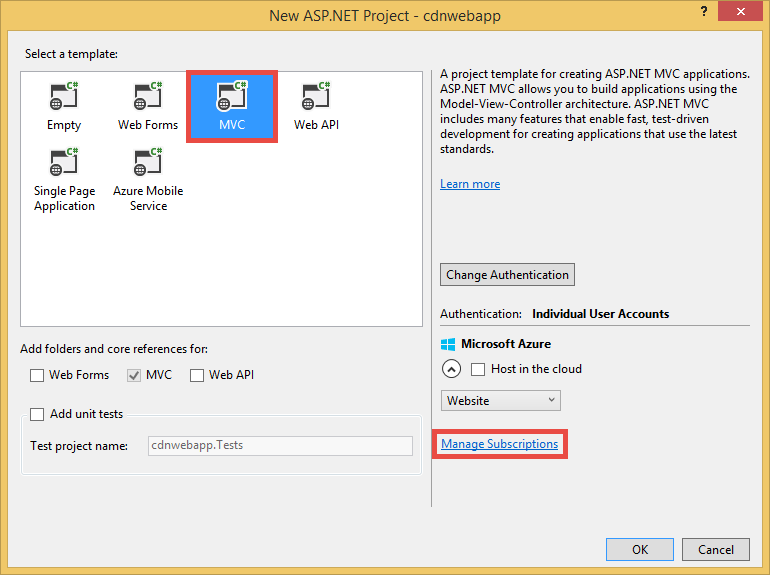
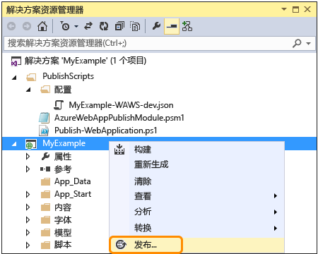
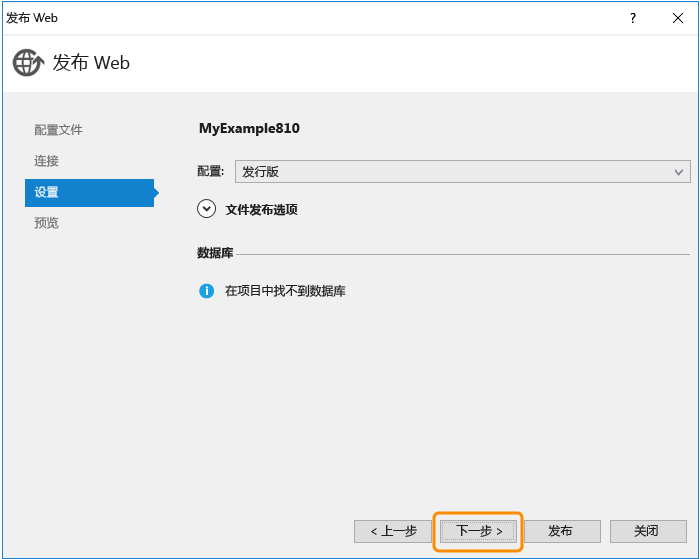

<properties 
	pageTitle="在 Azure Web 应用中使用 Azure CDN" 
	description="本教程演示如何将 Web 应用部署到 Azure，以便从集成的 Azure CDN 终结点提供内容" 
	services="app-service\web,cdn" 
	documentationCenter=".net" 
	authors="cephalin" 
	manager="wpickett" 
	editor="jimbe"/>

<tags
	ms.service="app-service"
	ms.date="02/29/2016"
	wacn.date="05/24/2016"/>

# 在 Azure Web 应用中使用 Azure CDN

[Azure Web 应用](/documentation/services/web-sites/)可以集成 [Azure CDN](/home/features/cdn/)，增强 [Azure Web Apps](/documentation/services/web-sites/) 固有的全局缩放功能。在特定情况下（例如提供静态映像），此集成可以大幅提高 Azure Web Apps 的性能，在全球显著改善 Web 应用的用户体验。

将 Web Apps 与 Azure CDN 集成具有以下优点：

- 在 Web 应用的[部署](/documentation/articles/web-sites-publish-source-control/)过程中集成内容部署（映像、脚本和样式表）
- 轻松升级 Azure 的 Web 应用中的 NuGet 包，例如 jQuery 或 Bootstrap 版本 
- 在同一 Visual Studio 界面中管理 Web 应用程序和 CDN 提供的内容
- 将 ASP.NET 绑定和缩减与 Azure CDN 集成

[AZURE.INCLUDE [app-service-web-to-api-and-mobile](../includes/app-service-web-to-api-and-mobile.md)]

## 要生成的项目 ##

你需要在 Visual Studio 中使用默认的 ASP.NET MVC 模板将一个 Web 应用部署到 Azure，需要添加代码来处理集成 Azure CDN 所提供的内容（例如映像、控制器操作结果、默认的 JavaScript 和 CSS 文件），还需要编写代码来配置回退机制以处理 CDN 脱机时提供的捆绑包。

## 所需的项目 ##

本教程设置了以下前提条件：

-	有效的 [Azure 帐户](/pricing/1rmb-trial/)
-	Visual Studio 2015 with the [Azure SDK for .NET](https://www.microsoft.com/web/handlers/webpi.ashx/getinstaller/VWDOrVs2013AzurePack.appids)。如果你使用 Visual Studio，步骤可能有所不同。

> [AZURE.NOTE] 完成本教程需要有一个 Azure 帐户：
> + 可以[免费建立一个 Azure 帐户](/pricing/1rmb-trial/)：获取可用来试用付费版 Azure 服务的信用额度，甚至在用完信用额度后，你仍可以保留帐户和使用免费的 Azure 服务（如 Web Apps）。

## 将 Web 应用部署到具有集成 CDN 终结点的 Azure ##

在本部分，你需要将 Visual Studio 2015 中的默认 ASP.NET MVC 应用程序模板部署到 Azure Web 应用，然后将其与新的 CDN 终结点相集成。请根据以下说明进行操作：

1. 在 Visual Studio 2015 中转到“文件”>“新建”>“项目”>“Web”>“ASP.NET Web 应用程序”，以便从菜单栏创建新的 ASP.NET Web 应用程序。为该应用程序提供一个名称，然后单击“确定”。

	

3. 选择“MVC”，然后单击“确定”。确保取消选中“在云中托管”

	

	Azure 中国区目前不支持在 Visual Studio 中创建或管理网站。因此，你需要转到[管理门户](https://manage.windowsazure.cn/)创建新的 Azure 网站
	
3. 在管理门户中创建网站后，单击网站的“仪表板”。在“速览”下，单击“下载发布配置文件”。

3. 在 Visual Studio 中，右键单击你的项目并选择“发布”

	

	几秒钟后，将显示“发布 Web”向导。

4. 在“发布配置文件”中单击“导入”，然后选择前面下载的发布配置文件。

	Visual Studio 将项目部署到 Azure 所需的设置随即已导入。可以使用该向导查看和更改这些设置。

8. 在“发布 Web”向导的“连接”选项卡中，单击“下一步”。

	

10. 在“设置”选项卡中，单击“下一步”。

	你可以接受“配置”和“文件发布选项”的默认值。

	你可以通过“配置”下拉列表部署用于远程调试的调试版本。

	

11. 在“预览”选项卡中，单击“发布”。

	如果你想要查看哪些文件将复制到 Azure，可以单击“开始预览”，然后单击“发布”。

	

	单击“发布”后，Visual Studio 开始执行将文件复制到 Azure 服务器的过程。

	发布完成后，你会在浏览器中看到发布的 Web 应用。

1. 若要创建 CDN 终结点，请登录到 [Azure 管理门户](https://manage.windowsazure.cn)。
2. 单击“新建 > 应用服务 > CDN > 快速创建”。选择 **http://*&lt;sitename>*.chinacloudsites.cn/**，然后单击“创建”。

	

	> [AZURE.NOTE] 创建 CDN 终结点以后，管理门户就会向你显示其 URL 以及所集成的源域。不过，需要一定的时间才能将新 CDN 终结点的配置完全传播到所有 CDN 节点位置。

3. 回到管理门户，在“CDN”选项卡中，单击刚创建的 CDN 终结点的名称。

	

3. 单击“启用查询字符串”在 CDN 缓存中启用查询字符串。启用此功能后，通过不同的查询字符串进行访问的同一链接就可以缓存为不同的项。

	

启用此功能后，通过不同的查询字符串进行访问的同一链接就可以缓存为不同的项。

>[AZURE.NOTE] 虽然启用查询字符串对于教程的此部分来说不是必需的，但为方便起见，最好是尽早启用此功能，因为在这里所做的任何更改都需要一定的时间才能传播到所有 CDN 节点，而你并不想让任何非查询字符串支持的内容充斥 CDN 缓存（稍后将讨论如何更新 CDN 内容）。

2. 现在，导航到 CDN 终结点地址。如果终结点已准备就绪，你应该会看到 Web 应用显示。如果收到 **HTTP 404** 错误，则说明 CDN 终结点尚未准备好。CDN 配置传播到所有边缘节点可能需要长达 1 小时的等待。 

	

1. 接下来，可尝试访问 ASP.NET 项目中的 **~/Content/bootstrap.css** 文件。在浏览器窗口中，导航到 **http://*&lt;cdnName>*.azureedge.net/Content/bootstrap.css**。在我的设置中，此 URL 为：

		http://az673227.azureedge.net/Content/bootstrap.css

	这对应于 CDN 终结点的以下源 URL：

		http://cdnwebapp.chinacloudsites.cn/Content/bootstrap.css

	导航到 **http://*&lt;cdnName>*.azureedge.net/Content/bootstrap.css** 时，系统会提示你下载 bootstrap.css，该文件来自你在 Azure 中的 Web 应用。

	

你可以直接通过 CDN 终结点，采用类似方式访问 **http://*&lt;serviceName>*.chinacloudapp.cn/** 中提供的任何可公开访问的 URL。例如：

-	/Script 路径中的 .js 文件
-	/Content 路径中的任何内容文件
-	任何控制器/操作 
-	任何带查询字符串的 URL（如果在你的 CDN 终结点启用了查询字符串功能）
-	整个 Azure Web 应用（如果所有内容都是公共的）

请注意，通过 Azure CDN 提供整个 Azure Web 应用可能并不适合所有情况（或者说，可能并不是通用的作法）。部分注意事项如下：

-	此方法要求你的整个站点都是公共的，因为 Azure CDN 不能提供任何私有内容。
-	如果 CDN 终结点因某种原因而脱机（不管是因为计划的维护，还是因为用户错误），你的整个 Web 应用都会脱机，除非可以将客户重定向到源 URL **http://*&lt;sitename>*.chinacloudsites.cn/**。 
-	即使使用自定义的缓存-控制设置（参见[在Azure Web 应用中配置静态文件的缓存选项](#configure-caching-options-for-static-files-in-your-azure-web-app)），CDN 终结点也不会改善活动度极强的动态内容的性能。请注意，如果你尝试从如上所示的 CDN 终结点加载主页，则第一次操作时至少需要 5 秒钟才能加载默认主页，而该主页是相当简单的主页。想象一下，如果此页包含每分钟必须更新的动态内容，则客户端体验会是一种什么样的情景？从 CDN 终结点提供动态内容要求缓存过期时间短，这会造成在 CDN 终结点处频繁出现缓存未命中的情况。这会损害 Azure Web 应用的性能，与 CDN 的初衷背道而驰。

替代方法是在 Azure Web 应用中按每次的具体情况来判断哪些内容可以由 Azure CDN 提供。就这点来说，我们已向你介绍了如何通过 CDN 终结点访问各个内容文件。我会在[通过 Azure CDN 的控制器操作提供内容](#serve-content-from-controller-actions-through-azure-cdn)中向你演示如何处理通过 CDN 终结点进行的特定控制器操作。

## 在 Azure Web 应用中配置静态文件的缓存选项 ##

通知在 Azure Web 应用中进行 Azure CDN 集成，你可以指定你所希望的在 CDN 终结点中缓存静态内容的方式。为此，请通过某个 ASP.NET 项目（例如 **cdnwebapp**）打开 *Web.config*，然后将 `<staticContent>` 元素添加到 `<system.webServer>`。以下 XML 将缓存配置为 3 天后过期。

    <system.webServer>
      <staticContent>
        <clientCache cacheControlMode="UseMaxAge" cacheControlMaxAge="3.00:00:00"/>
      </staticContent>
      ...
    </system.webServer>

执行完此操作后，Azure Web 应用中的所有静态文件将会遵守 CDN 缓存中的同一规则。若要对缓存设置进行更细致的控制，可将 *Web.config* 文件添加到一个文件夹中，然后在该处添加你的设置。例如，可将 *Web.config* 文件添加到 *\\Content* 文件夹中，然后使用以下 XML 替换其中的内容：

	<?xml version="1.0"?>
	<configuration>
	  <system.webServer>
	    <staticContent>
	      <clientCache cacheControlMode="UseMaxAge" cacheControlMaxAge="15.00:00:00"/>
	    </staticContent>
	  </system.webServer>
	</configuration>

此设置可以让 *\\Content* 文件夹中的所有静态文件缓存 15 天。

有关如何配置 `<clientCache>` 元素的详细信息，请参阅[客户端缓存 &lt;clientCache>](http://www.iis.net/configreference/system.webserver/staticcontent/clientcache)。

在下一部分，我还将向你演示如何针对 CDN 缓存中的控制器操作结果配置缓存设置。

## 通过 Azure CDN 的控制器操作提供内容 ##

将 Web Apps 与 Azure CDN 集成以后，可以相对轻松地通过 Azure CDN 的控制器操作提供内容。同样，如果你决定通过 CDN 提供整个 Azure Web 应用，则根本不需要执行此操作，因为此时所有控制器操作都已经可以通过 CDN 进行访问。不过，出于我在[通过集成 CDN 终结点部署 Azure Web 应用](#deploy-a-web-app-to-azure-with-an-integrated-cdn-endpoint)中指出的原因，你不应该决定执行这样的操作，而应选择需要通过 Azure CDN 来处理的控制器操作。Maarten Balliauw 在[通过 Azure CDN 减少 Web 延迟](http://channel9.msdn.com/events/TechDays/Techdays-2014-the-Netherlands/Reducing-latency-on-the-web-with-the-Windows-Azure-CDN)中向你演示了如何使用有趣的 MemeGenerator 控制器执行该操作。在这里，我将简单地再现该过程。

假设在你的 Web 应用中，你希望根据年轻的 Chuck Norris 的照片（由 [Alan Light](http://www.flickr.com/photos/alan-light/218493788/) 拍摄）来制作一个搞笑的迷因，如下所示：

你提供了一个简单的 `Index` 操作，让客户能够指定照片中的夸张元素，然后待这些元素发布到操作后制作出迷因。由于这是 Chuck Norris，可以想见该页面会在全球热传。这是通过 Azure CDN 提供半动态内容的一个很好的示例。

按照上述步骤设置此控制器操作：

1. 在 *\\Controllers* 文件夹中，创建一个新的名为 *MemeGeneratorController.cs* 的 .cs 文件，然后使用以下代码替换其中的内容。将 `~/Content/chuck.bmp` 替换为你的文件路径，将 `yourCDNName` 替换为你的 CDN 名称。

        using System;
        using System.Collections.Generic;
        using System.Diagnostics;
        using System.Drawing;
        using System.IO;
        using System.Net;
        using System.Web.Hosting;
        using System.Web.Mvc;
        using System.Web.UI;

        namespace cdnwebapp.Controllers
        {
          public class MemeGeneratorController : Controller
          {
            static readonly Dictionary<string, Tuple<string ,string>> Memes = new Dictionary<string, Tuple<string, string>>();

            public ActionResult Index()
            {
              return View();
            }

            [HttpPost, ActionName("Index")]
            public ActionResult Index_Post(string top, string bottom)
            {
              var identifier = Guid.NewGuid().ToString();
              if (!Memes.ContainsKey(identifier))
              {
                Memes.Add(identifier, new Tuple<string, string>(top, bottom));
              }

              return Content("<a href="" + Url.Action("Show", new {id = identifier}) + "">here's your meme</a>");
            }

            [OutputCache(VaryByParam = "*", Duration = 1, Location = OutputCacheLocation.Downstream)]
            public ActionResult Show(string id)
            {
              Tuple<string, string> data = null;
              if (!Memes.TryGetValue(id, out data))
              {
                return new HttpStatusCodeResult(HttpStatusCode.NotFound);
              }

              if (Debugger.IsAttached) // Preserve the debug experience
              {
                return Redirect(string.Format("/MemeGenerator/Generate?top={0}&bottom={1}", data.Item1, data.Item2));
              }
              else // Get content from Azure CDN
              {
                return Redirect(string.Format("http://<yourCDNName>.azureedge.net/MemeGenerator/Generate?top={0}&bottom={1}", data.Item1, data.Item2));
              }
            }

            [OutputCache(VaryByParam = "*", Duration = 3600, Location = OutputCacheLocation.Downstream)]
            public ActionResult Generate(string top, string bottom)
            {
              string imageFilePath = HostingEnvironment.MapPath("~/Content/chuck.bmp");
              Bitmap bitmap = (Bitmap)Image.FromFile(imageFilePath);

              using (Graphics graphics = Graphics.FromImage(bitmap))
              {
                SizeF size = new SizeF();
                using (Font arialFont = FindBestFitFont(bitmap, graphics, top.ToUpperInvariant(), new Font("Arial Narrow", 100), out size))
                {
                    graphics.DrawString(top.ToUpperInvariant(), arialFont, Brushes.White, new PointF(((bitmap.Width - size.Width) / 2), 10f));
                }
                using (Font arialFont = FindBestFitFont(bitmap, graphics, bottom.ToUpperInvariant(), new Font("Arial Narrow", 100), out size))
                {
                    graphics.DrawString(bottom.ToUpperInvariant(), arialFont, Brushes.White, new PointF(((bitmap.Width - size.Width) / 2), bitmap.Height - 10f - arialFont.Height));
                }
              }
              MemoryStream ms = new MemoryStream();
              bitmap.Save(ms, System.Drawing.Imaging.ImageFormat.Png);
              return File(ms.ToArray(), "image/png");
            }

            private Font FindBestFitFont(Image i, Graphics g, String text, Font font, out SizeF size)
            {
              // Compute actual size, shrink if needed
              while (true)
              {
                size = g.MeasureString(text, font);

                // It fits, back out
                if (size.Height < i.Height &&
                     size.Width < i.Width) { return font; }

                // Try a smaller font (90% of old size)
                Font oldFont = font;
                font = new Font(font.Name, (float)(font.Size * .9), font.Style);
                oldFont.Dispose();
              }
            }
          }
        }

2. 右键单击默认的 `Index()` 操作，然后选择“添加视图”。

	

3.  接受下面的设置，然后单击“添加”。

	

4. 打开这个新的 *Views\\MemeGenerator\\Index.cshtml*，将其中的内容替换为下面这个简单的 HTML，以便提交夸张元素：

		<h2>Meme Generator</h2>
		
		<form action="" method="post">
		    <input type="text" name="top" placeholder="Enter top text here" />
		     
		    <input type="text" name="bottom" placeholder="Enter bottom text here" />
		     
		    <input class="btn" type="submit" value="Generate meme" />
		</form>

5. 重新发布到 Azure Web 应用，然后在浏览器中导航到 **http://*&lt;serviceName>*.chinacloudapp.cn/MemeGenerator/Index**。

当你将窗体值提交到 `/MemeGenerator/Index` 时，`Index_Post` 操作方法会返回一个指向 `Show` 操作方法的链接，其中包含相应的输入标识符。单击该链接即可访问以下代码：

    [OutputCache(VaryByParam = "*", Duration = 1, Location = OutputCacheLocation.Downstream)]
    public ActionResult Show(string id)
    {
      Tuple<string, string> data = null;
      if (!Memes.TryGetValue(id, out data))
      {
        return new HttpStatusCodeResult(HttpStatusCode.NotFound);
      }

      if (Debugger.IsAttached) // Preserve the debug experience
      {
        return Redirect(string.Format("/MemeGenerator/Generate?top={0}&bottom={1}", data.Item1, data.Item2));
      }
      else // Get content from Azure CDN
      {
        return Redirect(string.Format("http://<yourCDNName>.azureedge.net/MemeGenerator/Generate?top={0}&bottom={1}", data.Item1, data.Item2));
      }
    }

如果连接了本地调试器，你就可以通过本地重定向获得常规的调试体验。如果是在 Azure Web 应用中运行，则会重定向到：

	http://<yourCDNName>.azureedge.net/MemeGenerator/Generate?top=<formInput>&bottom=<formInput>

这对应于 CDN 终结点的以下源 URL：

	http://<yourSiteName>.chinacloudsites.cn/cdn/MemeGenerator/Generate?top=<formInput>&bottom=<formInput>

由于已应用过 URL 重写规则，缓存到 CDN 终结点的实际文件为：

	http://<yourSiteName>.chinacloudsites.cn/MemeGenerator/Generate?top=<formInput>&bottom=<formInput>

然后，你可以使用 `Generate` 方法的 `OutputCacheAttribute` 属性来指定 Azure CDN 认可的操作结果缓存方式。以下代码指定缓存在 1 小时（3,600 秒）后过期。

    [OutputCache(VaryByParam = "*", Duration = 3600, Location = OutputCacheLocation.Downstream)]

同样，你可以使用所需的缓存选项，在 Azure Web 应用中通过 Azure CDN 的任何控制器操作提供内容。

在下一部分，我将向你演示如何通过 Azure CDN 提供绑定型和缩减型脚本和 CSS。

## 将 ASP.NET 绑定和缩减与 Azure CDN 集成 ##

脚本和 CSS 样式表很少变化，尤其适合 Azure CDN 缓存。若要将绑定和缩减集成到 Azure CDN，最便捷的方式是通过 Azure CDN 提供整个 Web 应用。不过，出于[将 Azure CDN 终结点与 Azure Web 应用集成，通过 Azure CDN 在网页中提供静态内容](#deploy-a-web-app-to-azure-with-an-integrated-cdn-endpoint)中描述的原因，你可能不倾向于选择此方法，因此我会向你演示如何在实现既定目标的同时，保留所需的有关 ASP.NET 绑定和缩减的开发人员体验，例如：

-	理想的调试模式体验
-	简化的部署
-	即时更新客户端，进行脚本/CSS 版本升级
-	在 CDN 终结点故障时适用的回退机制
-	最大程度减少代码修改

在[将 Azure CDN 终结点与 Azure Web 应用集成，通过 Azure CDN 在网页中提供静态内容](#deploy-a-web-app-to-azure-with-an-integrated-cdn-endpoint)部分创建的 ASP.NET 项目中，打开 *App\_Start\\BundleConfig.cs*，然后查看 `bundles.Add()` 方法调用情况。

    public static void RegisterBundles(BundleCollection bundles)
    {
        bundles.Add(new ScriptBundle("~/bundles/jquery").Include(
                    "~/Scripts/jquery-{version}.js"));
        ...
    }

第一个 `bundles.Add()` 语句将脚本捆绑包添加到了虚拟目录 `~/bundles/jquery`。然后，打开 *Views\\Shared\_Layout.cshtml* 以查看脚本捆绑包标记的呈现方式。你应该能够找到以下 Razor 代码行：

    @Scripts.Render("~/bundles/jquery")

当该 Razor 代码在 Azure Web 应用中运行时，它会呈现脚本捆绑包的 `

但是，通过键入 `F5` 而让其在 Visual Studio 中运行时，它会逐一呈现捆绑包中的每个脚本文件（在上面的示例中，捆绑包中只有一个脚本文件）：

    

这样可以让你在开发环境中调试 JavaScript 代码时，减少生产环境中出现的并发客户端连接（绑定），改进文件下载性能（缩减）。这是一项很适合保留在 Azure CDN 集成中的功能。此外，由于呈现的捆绑包已包含自动生成的版本字符串，因此你希望能够复制该功能，这样当你通过 NuGet 更新 jQuery 版本时，就能够尽快在客户端进行相应的更新。

按照以下步骤操作，将 ASP.NET 绑定和缩减功能集成到 CDN 终结点。

1. 回到 *App\_Start\\BundleConfig.cs*，修改 `bundles.Add()` 方法以使用其他[捆绑包构造函数](http://msdn.microsoft.com/zh-cn/library/jj646464.aspx)来指定 CDN 地址。为此，请使用以下代码替换 `RegisterBundles` 方法定义：  
	
        public static void RegisterBundles(BundleCollection bundles)
        {
          bundles.UseCdn = true;
          var version = System.Reflection.Assembly.GetAssembly(typeof(Controllers.HomeController))
            .GetName().Version.ToString();
          var cdnUrl = "http://<yourCDNName>.azureedge.net/{0}?v=" + version;

          bundles.Add(new ScriptBundle("~/bundles/jquery", string.Format(cdnUrl, "bundles/jquery")).Include(
                "~/Scripts/jquery-{version}.js"));

          bundles.Add(new ScriptBundle("~/bundles/jqueryval", string.Format(cdnUrl, "bundles/jqueryval")).Include(
                "~/Scripts/jquery.validate*"));

          // Use the development version of Modernizr to develop with and learn from. Then, when you're
          // ready for production, use the build tool at http://modernizr.com to pick only the tests you need.
          bundles.Add(new ScriptBundle("~/bundles/modernizr", string.Format(cdnUrl, "bundles/modernizr")).Include(
                "~/Scripts/modernizr-*"));

          bundles.Add(new ScriptBundle("~/bundles/bootstrap", string.Format(cdnUrl, "bundles/bootstrap")).Include(
                "~/Scripts/bootstrap.js",
                "~/Scripts/respond.js"));

          bundles.Add(new StyleBundle("~/Content/css", string.Format(cdnUrl, "Content/css")).Include(
                "~/Content/bootstrap.css",
                "~/Content/site.css"));
        }

	请确保将 `<yourCDNName>` 替换为你的 Azure CDN 的名称。

	你将使用纯单词来设置 `bundles.UseCdn = true` 并已经将仔细编写的 CDN URL 添加到了每个捆绑包。例如，代码中的第一个构造函数：

		new ScriptBundle("~/bundles/jquery", string.Format(cdnUrl, "bundles/jquery"))

	相当于：

		new ScriptBundle("~/bundles/jquery", string.Format(cdnUrl, "http://<yourCDNName>.azureedge.net/bundles/jquery?v=<W.X.Y.Z>"))

	进行本地调试时，此构造函数会指示 ASP.NET 绑定和缩减功能呈现各个脚本文件，但会使用指定的 CDN 地址来访问相关脚本。不过，请注意这个仔细编写的 CDN URL 存在两个重要的特征：
	
	- 此 CDN URL 的源是 `http://<yourSiteName>.chinacloudsites.cn/bundles/jquery?v=<W.X.Y.Z>`，这实际上是 Web 应用程序中脚本捆绑包的虚拟目录。
	- 由于你使用的是 CDN 构造函数，因此捆绑包的 CDN 脚本标记不再包含在呈现的 URL 中自动生成的版本字符串。每次对脚本捆绑包进行修改而造成 Azure CDN 中出现缓存未命中的情况时，你都必须手动生成唯一的脚本字符串。同时，这个唯一的版本字符串在部署过程中必须保持不变，以便在捆绑包部署完以后，最大程度地提高 Azure CDN 中的缓存命中率。
	- 查询字符串 v=<W.X.Y.Z> 的功能是从 ASP.NET 项目中的 *Properties\\AssemblyInfo.cs* 进行拉取。你可以建立一个部署工作流，这样当你每次将相关内容发布到 Azure 时，程序集版本就会递增一次。你也可以使用通配符“ * ”直接修改项目中的 *Properties\\AssemblyInfo.cs*，以便每次进行构建时让版本字符串自动递增。例如：

			[assembly: AssemblyVersion("1.0.0.*")]
	
	在这里，你可以使用任何其他的策略来简化部署过程中唯一字符串的生成。

3. 重新发布 ASP.NET 应用程序并访问主页。
 
4. 查看页面的 HTML 代码。每次重新发布对 Azure Web 应用的更改时，你都应该能够看到所呈现的 CDN URL，其中包含唯一版本字符串。例如：
	
        ...
        <link href="http://az673227.azureedge.net/Content/css?v=1.0.0.25449" rel="stylesheet"/>
        
        ...
        
        
        ...

5. 在 Visual Studio 中，键入 `F5` 即可调试 ASP.NET 应用程序。

6. 查看页面的 HTML 代码。你仍然会看到每个脚本文件独立呈现，因此，你在 Visual Studio 中的调试体验是一致的。
	
        ...
        <link href="/Content/bootstrap.css" rel="stylesheet"/>
        <link href="/Content/site.css" rel="stylesheet"/>
        
        ...
        
        
        
        ...    

## CDN URL 的回退机制 ##

你希望你的网页在 Azure CDN 终结点因某种原因而出现故障时，能够表现出相当的智能，即能够访问作为回退选项的源 Web 服务器，以便加载 JavaScript 或 Bootstrap。因 CDN 不可用而丢失 Web 应用上的映像是很严重的问题，但更为严重的是失去脚本和样式表提供的重要页面功能。

[捆绑包](http://msdn.microsoft.com/zh-cn/library/system.web.optimization.bundle.aspx)类包含一个名为 [CdnFallbackExpression](http://msdn.microsoft.com/zh-cn/library/system.web.optimization.bundle.cdnfallbackexpression.aspx) 的属性，该属性可以让你配置回退机制以应对 CDN 故障情况。若要使用此属性，请执行以下步骤：

1. 在 ASP.NET 项目中打开 *App\_Start\\BundleConfig.cs*（你已在其中将 CDN URL 添加到了每个[捆绑包构造函数](http://msdn.microsoft.com/zh-cn/library/jj646464.aspx)），然后将 `CdnFallbackExpression` 代码添加到所示的四个位置，以便将回退机制添加到默认捆绑包中。  
	
        public static void RegisterBundles(BundleCollection bundles)
        {
          var version = System.Reflection.Assembly.GetAssembly(typeof(BundleConfig))
            .GetName().Version.ToString();
          var cdnUrl = "http://cdnurl.azureedge.net/.../{0}?" + version;
          bundles.UseCdn = true;

          bundles.Add(new ScriptBundle("~/bundles/jquery", string.Format(cdnUrl, "bundles/jquery")) 
                { CdnFallbackExpression = "window.jquery" }
                .Include("~/Scripts/jquery-{version}.js"));

          bundles.Add(new ScriptBundle("~/bundles/jqueryval", string.Format(cdnUrl, "bundles/jqueryval")) 
                { CdnFallbackExpression = "$.validator" }
                .Include("~/Scripts/jquery.validate*"));

          // Use the development version of Modernizr to develop with and learn from. Then, when you're
          // ready for production, use the build tool at http://modernizr.com to pick only the tests you need.
          bundles.Add(new ScriptBundle("~/bundles/modernizr", string.Format(cdnUrl, "bundles/modernizer")) 
                { CdnFallbackExpression = "window.Modernizr" }
                .Include("~/Scripts/modernizr-*"));

          bundles.Add(new ScriptBundle("~/bundles/bootstrap", string.Format(cdnUrl, "bundles/bootstrap"))     
                { CdnFallbackExpression = "$.fn.modal" }
                .Include(
                        "~/Scripts/bootstrap.js",
                        "~/Scripts/respond.js"));

          bundles.Add(new StyleBundle("~/Content/css", string.Format(cdnUrl, "Content/css")).Include(
                "~/Content/bootstrap.css",
                "~/Content/site.css"));
        }

	当 `CdnFallbackExpression` 不为 null 时，会将脚本注入 HTML 中以测试捆绑包是否已成功加载，而如果没有成功加载，则会直接从源 Web 服务器访问捆绑包。需要将此属性设置成一个 JavaScript 表达式，以便测试相应的 CDN 捆绑包是否已正确加载。根据内容的不同，测试每个捆绑包所需的表达式也会有所不同。对于上面的默认捆绑包：
	
	- `window.jquery` 在 jquery-{version}.js 中定义
	- `$.validator` 在 jquery.validate.js 中定义
	- `window.Modernizr` 在 modernizer-{version}.js 中定义
	- `$.fn.modal` 在 bootstrap.js 中定义
	
	你可能已注意到，我并没有为 `~/Cointent/css` 捆绑包设置 CdnFallbackExpression。这是因为，目前 [System.Web.Optimization 中的 Bug](https://aspnetoptimization.codeplex.com/workitem/104) 会针对回退 CSS 注入 `

		
 		
		... 
		
		

 		
 		
		...

	请注意，CSS 捆绑包的注入脚本仍包含以下行中 `CdnFallbackExpression` 属性的残存错误：

		}())||document.write('

	不过，由于 || 表达式的第一部分始终会返回 true（在紧邻其上的行中），因此始终不会运行 document.write() 函数。

6. 若要测试该回退脚本是否可正常运行，请回到 CDN 终结点的仪表板，然后单击“禁用终结点”。

	

7. 刷新 Azure Web 应用的浏览器窗口。你现在应该会看到所有脚本和样式表都已正常加载。

## 更多信息 
- [Azure 内容交付网络 (CDN) 概述](/documentation/articles/cdn-overview/)
- [ASP.NET 绑定和缩减](http://www.asp.net/mvc/tutorials/mvc-4/bundling-and-minification)
 

<!---HONumber=Mooncake_0411_2016-->