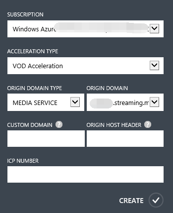
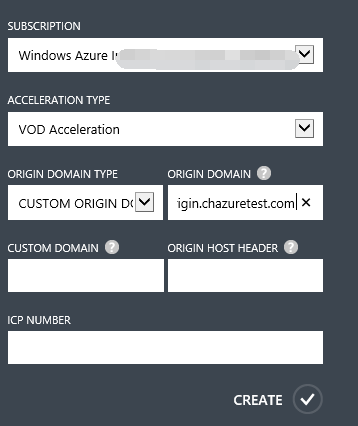
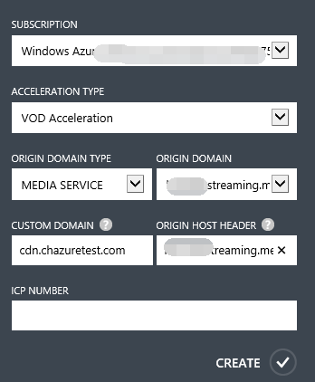
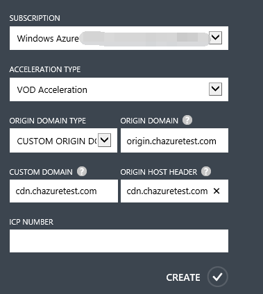
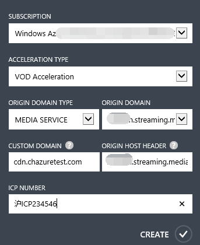

<properties linkid="dev-net-common-tasks-cdn" urlDisplayName="CDN" pageTitle="How to Create VOD Acceleration-Type CDNs – Azure Feature Guide" metaKeywords="Azure CDN, Azure CDN, Azure blobs, Azure caching, Azure add-ons, CDN acceleration, CDN service, mainstream CDN, VOD, video on demand acceleration, VOD acceleration, cache rules, media service, Azure Media Service, CDN technical documentation, CDN help files" description="Learn how to create VOD Acceleration-type CDNs on Azure Management Portal, and learn about default caching rules for VOD CDNs." metaCanonical="" services="" documentationCenter=".NET" title="" authors="" solutions="" manager="" editor="" />
<tags ms.service="cdn_en"
    ms.date="7/7/2016"
    wacn.date="2/23/2016"
    wacn.lang="en"
    />
> [AZURE.LANGUAGE]
- [中文](/documentation/articles/cdn-how-to-create-VOD-CDN-endpoint/)
- [English](/documentation/articles/cdn-enus-how-to-create-VOD-CDN-endpoint/) 
#Create video on demand (VOD) acceleration CDN nodes

The VOD (Video On Demand) Acceleration service is mainly intended to provide acceleration services for online video on demand. With the rise of online video and media services, more and more people are choosing to use Internet platforms to watch videos and listen to audio content. Given the limitations on the Internet environment in China, this places huge demands on the final delivery of audio and video content. The Azure CDN delivers and caches streaming media content such as audio and video on to CDN edge nodes and directs user requests to the optimal node, reducing the load on source station servers and saving on bandwidth resources, thereby providing users with a high-speed, smooth, high-quality online video experience.

Azure CDN VOD Acceleration supports Azure’s built-in [Media Services](/home/features/media-services/).

VOD Acceleration is suitable for use with all types of online audio and video on demand websites, such as media video websites, online education websites and mobile app clients.

This article is about creating domain names for VOD Acceleration. You can also refer to [Using Azure CDN](/documentation/articles/cdn-enus-how-to-use/) to find out about the basics of creating Azure CDN acceleration nodes.

###**Default cache rules for VOD Acceleration**
The Azure CDN sets default cache rules (see below) for VOD Acceleration. You can also set custom cache rules according to your own requirements. For specific details, see the Azure CDN Management Portal advanced management help file on “Domain Management.” If the source station content changes or is updated, but the cache time to live (TTL) has not yet expired, you can manually refresh the CDN cache files to synchronize the updated source station content in real time. For specific details, see the Azure CDN Management Portal advanced management help file on “Cache Refresh.”

**The system’s default cache rules for VOD Acceleration are:**

1. Dynamic files—such as those with the extensions PHP, ASPX, ASP, JSP, and DO—are not cached.
2. MP3 and WMA files are cached for 1 day.
3. MWV, HTML, HTM, SHTML, HML, GIF, SWF, PNG, BMP and JS files are cached for 1 hour.
4. Files with the extensions 7Z, APK, WDF, CAB, DHP, EXE, FLV, GZ, IPA, ISO, MPK, MPQ, PBCV, PXL, QNP, R00, RAR, XY, XY2, ZIP, and CAB are cached for one month.
      
###**Create VOD acceleration domain names**

1. In the navigation pane of the Azure Management Portal, click “CDN.”
2. In the function area, click “Create New.” In the “Create New” dialogue box, select “App Services,” “CDN,” and “Quick Create” in that order.
3. Select “VOD Acceleration” from the “Acceleration Type” drop-down list.
4. In the “Origin Domain Type” drop-down list, select cloud service, storage account, web app, media services, or a customized origin domain.
5. In the “Origin Domain” drop-down list, select one option from the list of available storage accounts and media services for use in creating the CDN endpoint.
  
    

    If the selected “Origin Domain Type” is “Customized Origin Domain,” input your own origin domain address under “Origin Domain.” You can enter one or multiple origin domain IP addresses (separate multiple addresses with semicolons, e.g. “126.1.1.1;172.1.1.1”), or an origin domain name such as “origin.chazuretest.com.”

    

6. In “Custom Domain”, enter the custom domain name you wish to use, e.g. cdn.chazuretest.com. Custom domains support extensive domain name acceleration.
7. In “Origin Host Header,” enter the return to source access host header accepted by your source station. Once you have entered the “Custom Domain,” the system will automatically fill in a default value based on the “Origin Domain Type” you selected. To be more specific, if your source station is on Azure, the default value will be the corresponding source station address. If your source station is not on Azure, the default value will be the “Custom Domain” that you entered. Of course, you can also modify this based on the actual configuration of your source station.

    If the origin domain type is media services, the corresponding return to source host header is:

    
    
    If the origin domain type is a custom origin domain, the corresponding return to source host header is:

    
          
8. In “ICP Number,” enter the corresponding ICP record number for the custom domain that you entered (e.g., Jing ICP Bei XXXXXXXX Hao-X).
     
    

9. Click “Create” to create the new endpoint.

Once the endpoint has been created, it will appear in the list of subscribed endpoints. The list view shows the custom domains used to access cached content, as well as the origin domains. 
The origin domain is the original location of the content cached on the CDN. Custom domains are URLs used to access CDN cache content.

>**Note** that configurations created for endpoints cannot be used immediately; they must first pass checks to confirm that the ICP custom domain name matches the ICP number. For more details, see the second half of Step 2: Create new CDN endpoints in [Using Azure CDN](/documentation/articles/cdn-enus-how-to-use/).

<!---HONumber=CDN_1201_2015-->