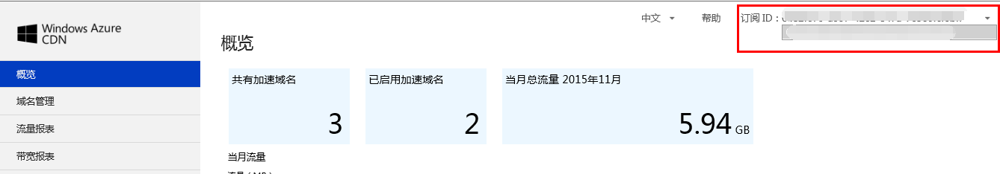

<properties linkid="dev-net-common-tasks-cdn" urlDisplayName="CDN" pageTitle="Azure CDN FAQ - Azure feature guide" metaKeywords="Azure CDN, Azure CDN, Azure blobs, Azure caching, Azure add-ons, CDN FAQ, CDN常见问题, 回源流量, ICP备案号, CDN默认缓存规则, 回源域名, 订阅, CNAME, 下载加速, Web加速, 网站加速, 流媒体直播加速, VOD加速, 视频点播加速, CDN价格, CDN收费, 技术文档, 帮助文档" description="Find answers to common service consulting or inquiries related to Azure CDN" metaCanonical="" services="" documentationCenter=".NET" title="" authors="" solutions="" manager="" editor="" />
<tags ms.service="cdn"
    ms.date="7/7/2016"
    wacn.date="7/7/2016"
    wacn.lang="cn"
    />
> [AZURE.LANGUAGE]
- [中文](/documentation/articles/cdn-faq-service-inquiry/)
- [English](/documentation/articles/cdn-enus-faq-service-inquiry/) 
#常见问题 - 咨询

+ [CDN的概念和作用](#step2)
+ [什么是CNAME](#step3)
+ [CDN流量和回原流量关系](#step4)
+ [影响缓存命中率的因素有哪些？](#step5)
+ [CDN域名创建需要多久？](#step6)
+ [开通CDN一定要有备案号吗？](#step7)
+ [二级域名需要备案吗？](#step8)
+ [备案号失效后，CDN服务还可以用多久？](#step26)
+ [如果域名有跳转是否可以使用CDN？](#step9)
+ [Azure CDN支持哪些类型的加速？](#step11)
+ [CDN加速类型中的“WEB加速”、“下载加速”、“VOD加速”、“流媒体直播加速”、“HTTPS加速”具体有什么区别？](#step12)
+ [Azure CDN默认的缓存规则是什么？](#step13)
+ [CDN节点上的文件最大缓存时长是多少？](#step23)
+ [CDN节点的缓存规则同步时间和缓存文件同步时间是多久？](#step24)
+ [如何让新提交的URL起到提前缓存的效果？](#step27)
+ [可以给泛域名配置缓存规则吗？](#step14)
+ [自定义域名为泛域名时支持缓存刷新操作吗？](#step15)
+ [加载可以使用泛域名吗？](#step16)
+ [源站地址（回源地址）”和“回源域名（回源host header）”的区别是什么](#step17)
+ [Blob使用CDN加速，是否直接使用blob地址，而不使用自定义域名，是否还需要备案，为什么？](#step20)
+ [是否支持HTTP标头gzip功能？](#step25)
+ [如果有多个订阅，如何在不同的订阅间切换？](#step21)
+ [一个账户内是否对本账户添加的加速域名个数有限制？](#step10)
+ [Azure账号过期，如何将CDN迁到另一个Azure账号？](#step22)

## **CDN的概念和作用**

CDN 的全称是 Content Delivery Network，即内容分发网络。CDN通过在现有的 Internet 中添加一层新的网络架构，将网站的内容缓存到离用户最近的网络“边缘”，使用户可以就近取得所需的内容，从而提供高带宽、低延迟的用户体验。 

## **什么是CNAME？**

CNAME(Canonical Name record)，通常是别名指向。例如，假设用户自定义加速域名为www.abc.com，用户配置完成后网站加速里给出的CDN服务域名为www.abc.com.mschcdn.com。用户需要在域名托管服务商那里将www.abc.com对应的A记录删除，添加域名的CNAME记录为www.abc.com.mschcdn.com。这样，用户访问www.abc.com时会去获取www.abc.com.mschcdn.com解析出的加速节点的IP地址记录。

## **CDN流量和回源流量关系**

- CDN流量表示缓存命中
    
- 回原流量表示MISS部分 

## **影响缓存命中率的因素有哪些？**

影响缓存命中率的因素有以下几个：

- 缓存配置，内容预取的设置

- Http Header导致无法缓存 

- 刚添加，缓存的文件还不多 

- 源站类型，可缓存的内容少 

- 网站访问量低，过期时间短，命中的文件少 

## **CDN域名创建需要多久？**

审核所提供的自定义域名和ICP编号是否匹配、有效，这个过程需要最多一个工作日的时间来完成。如果ICP审核通过，CDN服务最多需要 60 分钟时间进行注册以便通过 CDN 网络传播。与此同时，您还需要按照界面上的提示信息配置CNAME映射信息，这样才可以最终通过自定义域名访问CDN缓存内容。

## **开通CDN一定要有备案号吗？**
 
工信部要求使用CDN一定要有备案号。对于具体的ICP备案要求，仅要求所使用的自定义CDN加速域名有ICP，对源站本身没有要求，同时支持源站在国内和国外。

## **二级域名需要备案吗？**

二级域名不需要备案；如果sample.com已经备案，那么images.sample.com则不需要备案，创建CDN加速节点时仅需提供sample.com的备案号即可。

## **备案号失效后，CDN服务还可以用多久？**

备案号失效后，需要客户自己去通信管理局更新。默认未备案7天，强制回源。如果备案周期过长，同时希望使用CDN服务，可以通过开工单的方式联系我们。

## **如果域名有跳转是否可以使用CDN？**

可以，不过建议给跳转后的域名加速，跳转前的域名加速没有必要。
   
## **Azure CDN支持哪些类型的加速？**
  
Azure CDN支持的加速类型包括：Web加速，下载加速，VOD加速，流媒体直播加速和HTTPS加速。

现阶段提供的CDN主要是静态加速，包含一部分动态加速技术。比如：通过多线路节点回源，TCP优化等。不支持对PHP，ASP.NET，JSP等动态网页的加速，后续会逐步增加更多对动态页面的加速。
	
## **CDN加速类型中的“WEB加速”、“下载加速”、“VOD加速”、“流媒体直播加速”、“HTTPS加速”具体有什么区别？**

不同的CDN加速类型对应于不同的使用场景：

1. WEB加速对应于网页等（html, CSS, 图片, JS）比较小的静态文件加速

2. 下载加速一般对应于20MB以上的大文件文件分发

3. VOD加速对应于基于HTTP的视频点播加速

4. 流媒体直播加速对应于流媒体直播加速

5. HTTPS加速针对对安全性要求比较高的情况，加速文件类型以小文件为主。

对应到后端CDN的不同之处主要在于，不同的加速类型由不同的CDN节点设备来支撑，您无需做额外配置。

## **Azure CDN默认的缓存规则是什么？**  

- **Web加速类型，系统默认的缓存规则：**
  1. 对php、aspx、asp、 jsp、 do、 dwr、cgi、 fcgi、action、ashx、axd、json等动态文件不缓存
  2. 对以shtml、html、htm、js结尾的文件，默认缓存半天（720分钟） 
  3. 其他静态文件默认缓存一天（1440分钟）

- **下载加速类型，系统默认的缓存规则：**
  1. 对php、aspx、asp、jsp、do等动态文件不缓存
  2. 对7z、apk、 wdf、 cab、 dhp、exe、flv、gz、ipa、iso、mpk、MPQ、pbcv、pxl、qnp、r00、rar、xy、xy2、zip、CAB等文件缓存一个月

- **VOD视频点播加速类型，系统默认的缓存规则：**
  1. 对php、aspx、asp、jsp、do等动态文件不缓存
  2. 对MP3、wma等缓存1天
  3. 对mwv、html、htm、shtml、hml、gif、swf、png、bmp、js等缓存1小时
  4. 对7z、apk、 wdf、 cab、 dhp、exe、flv、gz、ipa、iso、mpk、MPQ、pbcv、pxl、qnp、r00、rar、xy、xy2、zip、CAB等文件缓存一个月

- **流媒体直播加速类型，系统默认的缓存规则：**
  1. 对ts文件缓存2分钟
  2. 对m3u8 文件缓存2秒钟 
	
**缓存规则逻辑：**

   1. 如果用户配置了不缓存的规则，优先匹配；然后匹配需要缓存的规则；缓存规则自上而下匹配。

   2. 如果某个URL在不缓存、缓存规则里都没有匹配上，那么就遵循CDN默认规则。

## **CDN节点上的文件最大缓存时长是多少？**

CDN节点上的文件最大缓存时长，是根据用户的缓存规则设置的，系统对于时长没有限制。

## **CDN节点的缓存规则同步时间和缓存文件同步时间是多久？**

用户的缓存规则设置完成后，大约十分钟可以完成规则下发，CDN节点上的缓存文件同步时间取决于所设置的缓存规则和文件本身的大小；

## **如何让新提交的URL起到提前缓存的效果？**

CDN不会去主动缓存文件，有用户请求那么节点才会去缓存，如果有些节点一直没有用户去请求的话，那么该部分节点是一直没有缓存的。如果想让新提交的URL起到提前缓存的效果，建议使用Azure CDN管理界面的“内容预取”功能。

## **可以给泛域名配置缓存规则吗？**

可以给泛域名配置缓存规则。建了泛域名的话，缓存规则的设定就是该泛域名之下。泛域名主要是针对多个域名配置相同来使用的，简化了创建的步骤。它可以与真正的域名同时创建，真正的域名的配置会优先匹配。例如，如果有个a1.example.com的规则是不一样的，客户可以新建一个 a1.example.com 的endpoint，并在这里面创建缓存规则，这里面的配置会优先于 *.example.com的配置。

## **自定义域名为泛域名时支持缓存刷新操作吗？**

如果自定义域名为泛域名，提交缓存刷新的时候，刷新URL必须指定子域名。比如：自定义域名为*.domain.com，如果要刷新img.domain.com下的内容，则应指定子域名img.domain.com进行缓存刷新操作。

## **预加载可以使用泛域名吗？**

预加载必须是子域名，并且是能够正常访问的URL（状态码是200的）。
	 
## **“源站地址（回源地址）”和“回源域名（回源host header）”的区别是什么？**	 

回源地址表示源站实际可以被访问到的地址，可以是IP也可以是域名。如果是域名，CDN在回源是会对该域名进行地址解析，然后用解析出来的IP再进行访问。

回源域名表示CDN回源时，HTTP请求头（request header）中的Host字段值。这个字段值一般是域名形式的字符串，被源站用来识别是否与源站服务器上配置的域名相同。

## **Blob使用CDN加速，是否直接使用blob地址，而不使用自定义域名，是否还需要备案，为什么？**
CDN（内容分发网络）说白了就是一组网络内容缓存节点，和客户的源站不是等价的。缓存节点上，只包含用户设置需要缓存的内容，且有可能会过期。

自定义域名是用来被CNAME的，通过自定义域名经过CDN访问源网站内容时，源站缓存命中则直接返回，否则可能回源。这是CDN的原理。

假设，自定义域名和原始域名一样，会造成：

1. 回源失败 – 因为回源的时候可能通过DNS重新访问到加速节点而非源站；
2. 访问失败 – 源站部分内容并不在加速节点。

法律规定自定义域名是ICP备案的，对源站没有要求。但是如果自定义域名本身的二级域名已经备案，则不需要再备案。

## **是否支持HTTP标头gzip功能？**

Azure CDN支持HTTP标头的gzip功能，需要客户提交工单开通该功能。提交工单时请提供加速域名，源站域名，以及需要加速的文件类型。

## **如果有多个订阅，如何在不同的订阅间切换？**
   
如果您有多个订阅，如图所示，可以点击管理门户网站右上角订阅ID处的下拉三角，选择恰当的订阅ID。
    

## **Azure账号过期，如何将CDN迁到另一个Azure账号？**

目前在订阅号之间的域名自动迁移还不支持。客户需要手工迁移。先从过期的订阅删除已有域名，然后在新的订阅中重新创建，并且会对域名重新进行审核。
    
##**一个账户内是否对本账户添加的加速域名个数有限制？**

Azure CDN对每个账户的加速域名个数没有做限制。