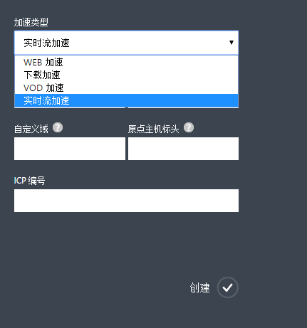
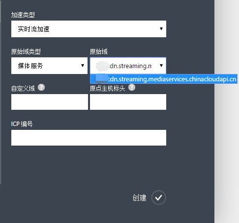
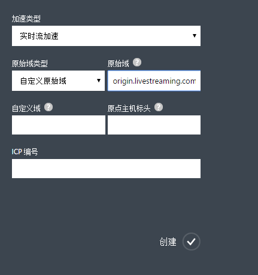
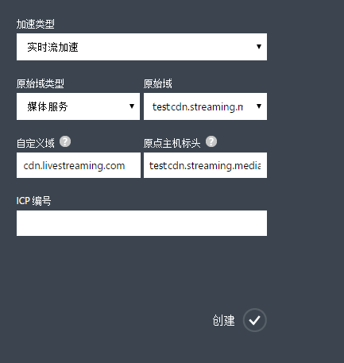
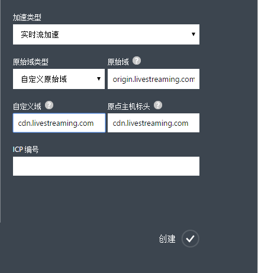
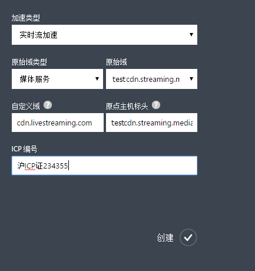
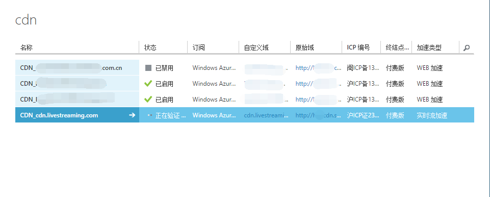

<properties linkid="dev-net-common-tasks-cdn" urlDisplayName="CDN" pageTitle="How to create Live Streaming acceleration type CDN - Azure feature guide" metaKeywords="Azure CDN, Azure CDN, Azure blobs, Azure caching, Azure add-on, Live Streaming, 流媒体加速, CDN加速,CDN服务,主流CDN, 流媒体直播加速, 媒体服务, Azure Media Service, 缓存规则, HLS, CDN技术文档, CDN帮助文档, 视频直播加速, 直播加速" description="Learn How to create Live Streaming acceleration type CDN on Azure Management Portal and default caching rules for Live Streaming CDN" metaCanonical="" services="" documentationCenter=".NET" title="" authors="" solutions="" manager="" editor="" />
<tags ms.service="cdn"
    ms.date="7/7/2016"
    wacn.date="7/7/2016"
    wacn.lang="cn"
    />
> [AZURE.LANGUAGE]
- [中文](/documentation/articles/cdn-how-to-create-LiveStreaming-CDN-endpoint/)
- [English](/documentation/articles/cdn-enus-how-to-create-LiveStreaming-CDN-endpoint/) 
#流媒体直播加速CDN节点创建

流媒体直播加速服务主要针对在线视音频播提供加速服务。网络直播服务快速、实时的特性备受广大用户青睐。直播的实时性导致海量用户并发访问，给源站和带宽资源带来巨大压力，同时受国内网络跨地域跨运营商的限制，对高质量、快速的流媒体直播提出了较高的要求。Azure CDN流媒体加速服务通过实时采集源站视频流并分发到距离用户最近的CDN边缘节点，通过智能缓存和调度策略，为用户提供计算最优节点，减少链路传输造成的延迟和带宽压力，且按使用量付费，给用户提供高速、流畅、高质量的直播观看体验。

Azure CDN 流媒体直播加速主要基于HTTP Live Streaming(HLS)协议，且支持Azure内置的[媒体服务](/home/features/media-services/)。

流媒体直播加速适用于各类流媒体直播网站，如网络电视直播，体育赛事，盛典赛事直播等。

本文是针对流媒体直播加速域名创建，您也可以参考[使用Azure CDN](/documentation/articles/cdn-how-to-use/)了解基本的Azure CDN加速节点创建信息。

###**流媒体直播加速默认缓存规则**
Azure CDN针对流媒体直播加速设置了默认缓存规则（见下文）。您也可以根据需求自定义设置缓存规则，具体请参考Azure CDN管理门户高级管理的帮助文档“域名管理”。如果源站内容更改或者更新，同时设置的缓存生存时间未到期，可以通过手动刷新CDN缓存文件实时同步源站更新的内容，具体请参考Azure CDN管理门户高级管理的帮助文档“缓存刷新”。

**流媒体直播加速系统默认缓存规则**

 1. 对ts文件缓存2分钟
 2. 对m3u8 文件缓存2秒钟 
      
###**创建V流媒体直播加速域名**

1. 在 Azure 管理门户的导航窗格中，单击“CDN”。
2. 在功能区上，单击“新建”。在“新建”对话框上，依次选择“应用服务”、“CDN”和“快速创建”。
3. 在“加速类型”下拉列表中选择“实时流加速”。

    

4. 在“原始域类型”下拉列表中，选择云服务，存储账户，Web应用，媒体服务或者自定义原始域。
5. 在“原始域”下拉列表中，从可用的媒体服务列表中选择一个用于创建CDN终结点。 
 
    

    如果“原始域类型”选择的是“自定义原始域”，那么请在“原始域”里输入您自己的原始域地址。您可以填写一个或者多个原始域ip地址，多个请以“;”分隔，如“126.1.1.1;172.1.1.1），或者原始域名，如origin.livestreaming.com

    

6. 在“自定义域”中输入要使用的自定义域名如：cdn.livestreaming.com。自定义域支持泛域名加速。
7. 在“原点主机标头（origin host header）”中输入您的源站所接受的回源访问host header。当您输入完“自定义域”之后，系统会根据您所选择的“原始域类型”来自动填充一个默认值。具体的规则是，如果您的源站是在Azure上的话，默认值就是相应的源站地址。如果您的源站不在Azure上，默认值是您输入的“自定义域名”，当然您也可以根据自己源站的实际配置情况来修改。

    原始域类型是媒体服务，对应的回源主机标头：

      
    
    原始域类型是自定义原始域对应的回源主机标头：

    
    
      
8. 在“ICP编号”中输入和上一步中所输入的自定义域名相对应的ICP备案号（如：京ICP备XXXXXXXX号-X）。
     
     

9. 单击“创建”按钮以创建新的终结点。

终结点创建后将出现在订阅的终结点的列表中。列表视图显示了用于访问缓存内容的自定义域以及原始域。
原始域是 CDN 所缓存内容的原始位置。自定义域是用于访问CDN缓存内容的URL。

   

>**注意** 为终结点创建的配置将不能立即可用，需要审核所提供的ICP自定义域名和ICP编号是否匹配，详情请参考[使用Azure CDN](/documentation/articles/cdn-how-to-use/)中步骤2：创建新的CDN终结点的后半部分。

