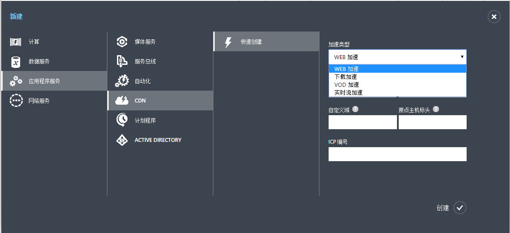
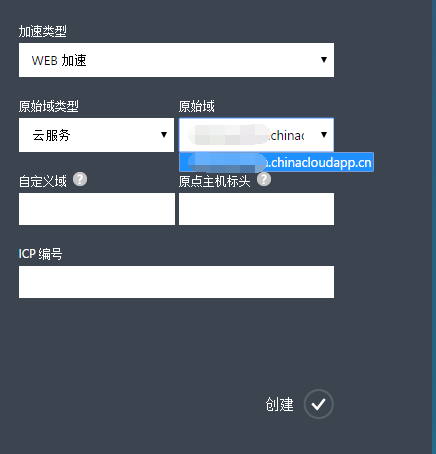
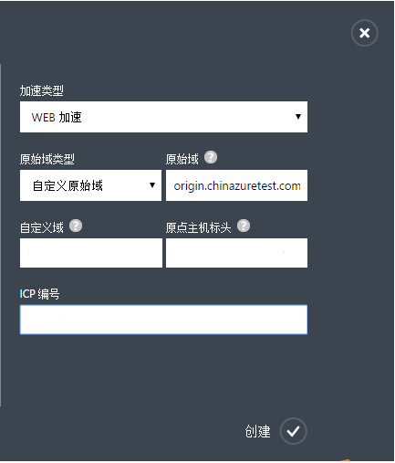
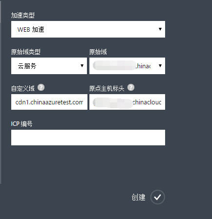
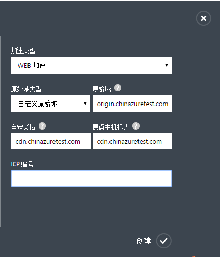
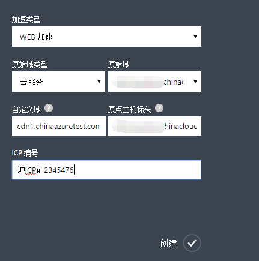

<properties linkid="dev-net-common-tasks-cdn" urlDisplayName="CDN" pageTitle="How to create Web acceleration type CDN - Azure feature guide" metaKeywords="Azure CDN, Azure CDN, Azure blobs, Azure caching, Azure add-ons, CDN加速, CDN服务, 主流CDN, Web加速, Web, 网页加速, 静态加速, 缓存规则, 图片加速, CDN技术文档, CDN帮助文档, 门户网站加速" description="Learn How to create Web acceleration type CDN on Azure Management Portal and default caching rules for Web CDN" metaCanonical="" services="" documentationCenter=".NET" title="" authors="" solutions="" manager="" editor="" />
<tags ms.service="cdn"
    ms.date="7/7/2016"
    wacn.date="7/7/2016"
    wacn.lang="cn"
    />
> [AZURE.LANGUAGE]
- [中文](/documentation/articles/cdn-how-to-create-Web-CDN-endpoint/)
- [English](/documentation/articles/cdn-enus-how-to-create-Web-CDN-endpoint/) 
#Web加速CDN节点创建

WEB加速服务是最基本也是应用最广泛的CDN加速服务，主要针对html文件，CSS，图片，JS，flash动画等更新频率低的小文件加速。通过将这些小文件缓存到Azure CDN的边缘节点，减少源站的访问压力，同时满足用户就近访问网站的需求，提高网站的访问体验，进而带动网站的用户访问量。

Web加速CDN节点适用于面向访问量较大的大中小企业门户类网站。如政府机构网站，企业门户网站等。

本文是针对Web类型加速域名创建，请参考[使用Azure CDN](/documentation/articles/cdn-how-to-use/)了解基本的Azure CDN加速节点创建信息。

###**Web加速默认缓存规则**
Azure CDN针对Web加速设置了默认缓存规则（见下文）。您也可以根据需求自定义设置缓存规则，具体请参考Azure CDN管理门户高级管理的帮助文档“域名管理”。如果源站内容更改或者更新，同时设置的缓存生存时间未到期，可以通过手动刷新CDN缓存文件实时同步源站更新的内容，具体请参考Azure CDN管理门户高级管理的帮助文档“缓存刷新”。

**Web加速系统默认缓存规则**

1. 对php、aspx、asp、 jsp、 do、 dwr、cgi、 fcgi、action、ashx、axd、json等动态文件不缓存
2. 对以shtml、html、htm、js结尾的文件，默认缓存半天（720分钟） 
3. 其他静态文件默认缓存一天（1440分钟）

###**创建Web加速域名**

1. 在 Azure 管理门户的导航窗格中，单击“CDN”。
2. 在功能区上，单击“新建”。在“新建”对话框上，依次选择“应用服务”、“CDN”和“快速创建”。

    

3. 在“加速类型”下拉列表中选择“WEB加速”。
4. 在“原始域类型”下拉列表中，选择云服务，存储账户，WEB应用，或者自定义原始域。**注意**“WEB加速”不支持“媒体服务”原始域类型。
5. 在“原始域”下拉列表中，从可用的云服务，存储帐户，或者WEB应用列表中选择一个用于创建CDN终结点。

    
    
    如果“原始域类型”选择的是“自定义原始域”，那么请在“原始域”里输入您自己的原始域地址。您可以填写一个或者多个原始域ip地址，多个请以“;”分隔，如“126.1.1.1;172.1.1.1），或者原始域名，如origin.chinaazuretest.com。    

       

6. 在“自定义域”中输入要使用的自定义域名如：cdn.chinaazuretest1.com。自定义域支持泛域名加速。**注意**自定义域名不能和原始域名相同。
7. 在“原点主机标头（origin host header）”中输入您的源站所接受的回源访问host header。当您输入完“自定义域”之后，系统会根据您所选择的“原始域类型”来自动填充一个默认值。具体的规则是，如果您的源站是在Azure上的话，默认值就是相应的源站地址。如果您的源站不在Azure上，默认值是您输入的“自定义域名”，当然您也可以根据自己源站的实际配置情况来修改。
    
    原始域类型是云服务，对应的回源主机标头：

      
    
    原始域类型是自定义原始域对应的回源主机标头：

    

8. 在“ICP编号”中输入和上一步中所输入的自定义域名相对应的ICP备案号（如：京ICP备XXXXXXXX号-X）。

    

9. 单击“创建”按钮以创建新的终结点。

终结点创建后将出现在订阅的终结点的列表中。列表视图显示了用于访问缓存内容的自定义域以及原始域。
原始域是 CDN 所缓存内容的原始位置。自定义域是用于访问CDN缓存内容的URL。

   

>**注意** 为终结点创建的配置将不能立即可用，需要审核所提供的ICP自定义域名和ICP编号是否匹配，详情请参考[使用Azure CDN](/documentation/articles/cdn-how-to-use/)中步骤2：创建新的CDN终结点的后半部分。
