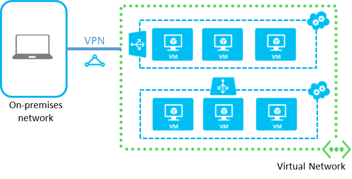

<properties
	pageTitle="连接云服务中的虚拟机 | Azure"
	description="将使用经典部署模型创建的虚拟机连接到 Azure 云服务或虚拟网络。"
	services="virtual-machines"
	documentationCenter=""
	authors="cynthn"
	manager="timlt"
	editor=""
	tags="azure-service-management"/>

<tags
	ms.service="virtual-machines"
	ms.date="10/15/2015"
    wacn.date="02/17/2016"/>

# 如何将虚拟机连接到虚拟网络或云服务

[AZURE.INCLUDE [了解部署模型](../includes/learn-about-deployment-models-classic-include.md)]

使用经典部署模型创建的虚拟机一律放置在云服务中。云服务充当容器，并提供唯一的公用 DNS 名称、公用 IP 地址，以及一组通过 Internet 访问虚拟机的终结点。云服务可以位于虚拟网络中，但这不是必要条件。

如果云服务不在虚拟网络中，就称为*独立* 云服务。独立云服务中的虚拟机只能使用其他虚拟机的公用 DNS 名称与其通信，流量通过 Internet 传送。如果云服务是在虚拟网络中，则该云服务中的虚拟机可与虚拟网络中的其他所有虚拟机通信，而不需要通过 Internet 传送任何流量。

如果你将虚拟机放在相同的独立云服务中，你仍然可以使用负载平衡和可用性集。有关详细信息，请参阅[对虚拟机进行负载平衡](../articles/load-balance-virtual-machines.md)和[管理虚拟机的可用性](../articles/manage-availability-virtual-machines.md)。不过，你无法组织子网上的虚拟机，也无法将独立云服务连接到本地网络。下面是一个示例：

如果将虚拟机放在虚拟网络中，你可以决定要将多少云服务用于负载平衡和可用性集。此外，可以采用与本地网络相同的方式，在子网上组织虚拟机，并将虚拟网络连接到本地网络。下面是一个示例：

若要在 Azure 中连接虚拟机，建议使用虚拟网络。最佳做法是在单独的云服务中配置应用程序的每一层。不过，你可能需要将不同应用程序层的部分虚拟机整合到相同的云服务中，以维持在每个订阅最多 200 个云服务的限制内。若要查看本限制和其他限制，请参阅 [Azure 订阅和服务限制、配额与约束](/documentation/articles/azure-subscription-service-limits)。

## 连接虚拟网络中的 VM

若要连接虚拟网络中的虚拟机，请执行以下步骤：

1.	在 [Azure 管理门户](/documentation/articles/virtual-networks-create-vnet-classic-portal)中创建虚拟网络。
2.	为部署创建一组云服务，以反映可用性集和负载平衡的设计。在 Azure 门户中，针对每一个云服务，单击“新建”>“计算”>“云服务”>“自定义创建”。
3.	若要逐一创建新的虚拟机，请单击“新建”>“计算”>“虚拟机”>“从库中”。为 VM 选择正确的云服务和虚拟网络。如果云服务已加入虚拟网络，系统会为你选定服务名称。

## 连接独立云服务中的 VM

若要连接独立云服务中的虚拟机，请执行以下步骤：

1.	在 [Azure 管理门户](http://manage.windowsazure.cn)中创建云服务。单击“新建”>“计算”>“云服务”>“自定义创建”。或者，当你创建第一个虚拟机时，可以为你的部署创建云服务。
2.	创建虚拟机时，请选择上一个步骤中创建的云服务名称。  

##资源
[对虚拟机进行负载平衡](/documentation/articles/load-balance-virtual-machines)

[管理虚拟机的可用性](/documentation/articles/virtual-machines-manage-availability)

[虚拟网络配置任务](/documentation/services/virtual-machines/)

创建虚拟机后，建议添加数据磁盘，你的服务和工作负荷才有地方存储数据。请参阅下列资源之一：

[如何将数据磁盘附加到 Linux 虚拟机](/documentation/articles/virtual-machines-linux-how-to-attach-disk)

[如何将数据磁盘附加到 Windows 虚拟机](/documentation/articles/storage-windows-attach-disk)

<!---HONumber=Mooncake_1207_2015-->