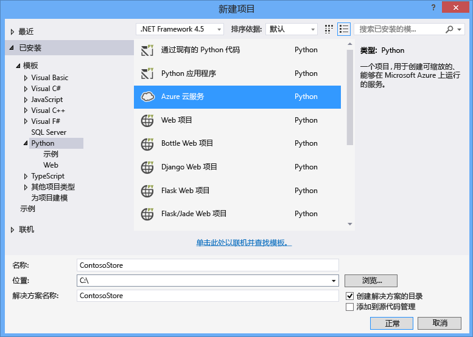
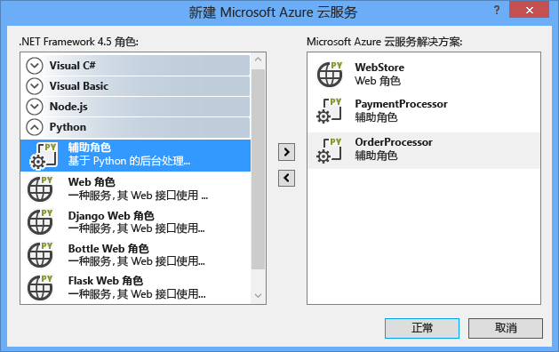
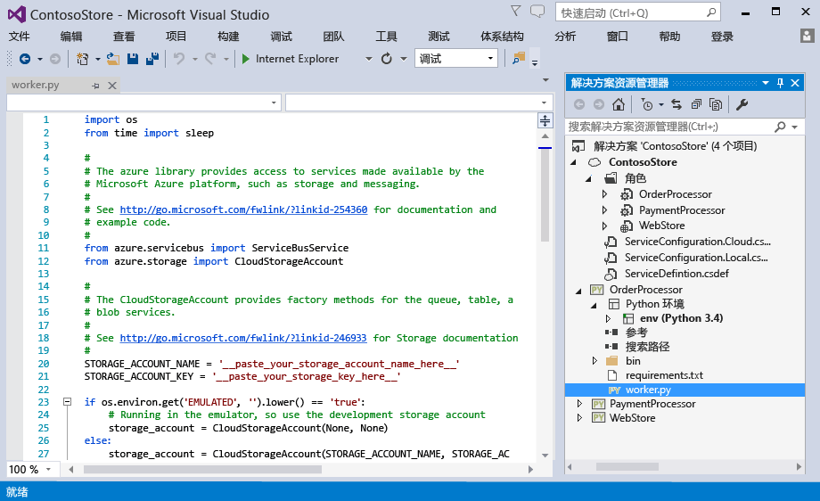
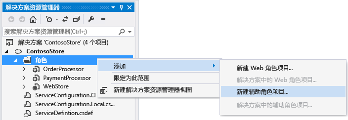
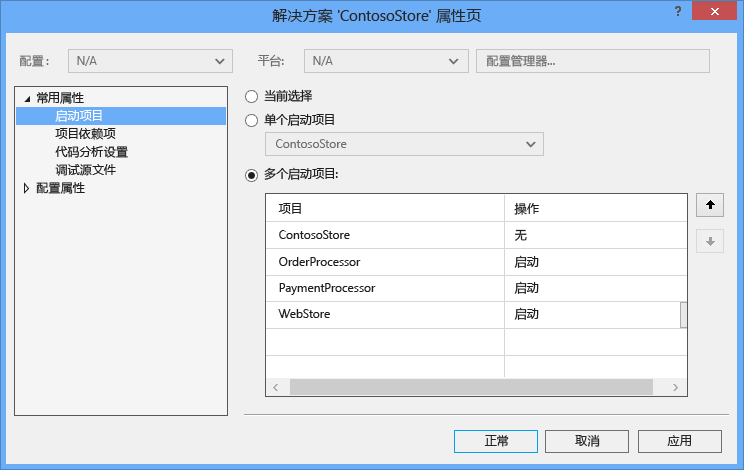
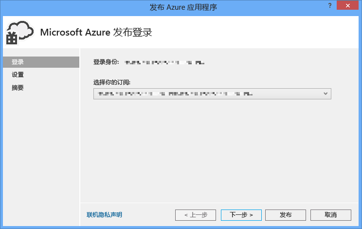
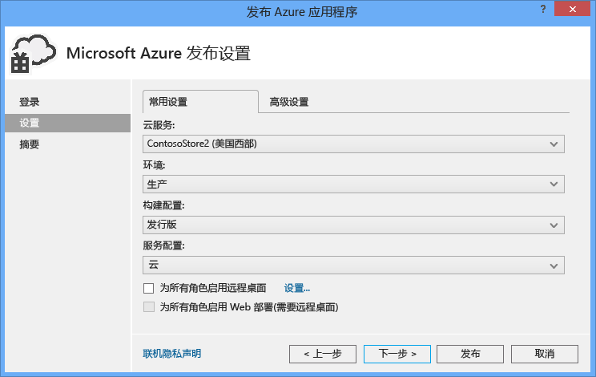
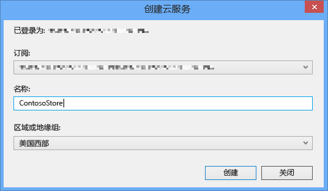
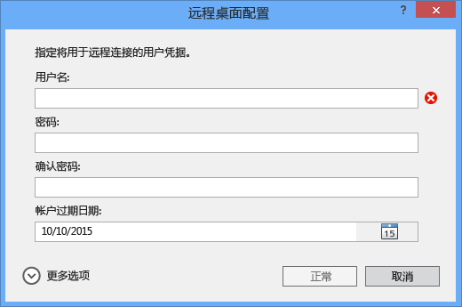
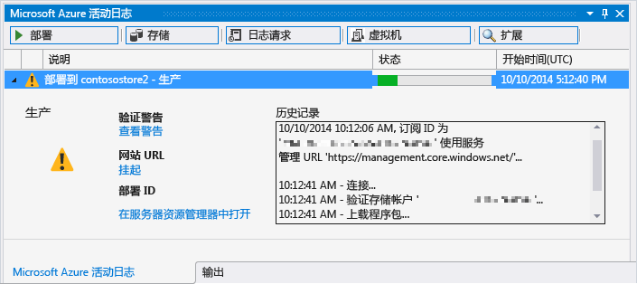

<properties
	pageTitle="Python Tools 2.2 for Visual Studio 中的 Python Web 角色和辅助角色 | Azure"
	description="有关使用 Python Tools for Visual Studio 来创建包括 Web 角色和辅助角色的 Azure 云服务的概述。"
	services=""
	documentationCenter="python"
	authors="huguesv"
	manager="wpickett"
	editor=""/>

<tags
	ms.service="cloud-services"
	ms.date="08/30/2015"
	wacn.date="01/21/2016"/>

# Python Tools 2.2 for Visual Studio 中的 Python Web 角色和辅助角色

本文概述了如何在 [Python Tools for Visual Studio][] 中使用 Python Web 角色和辅助角色。

## 先决条件

 - Visual Studio 2013 或 2015
 - [Python Tools 2.2 for Visual Studio][] (PTVS)
 - [Azure SDK Tools for VS 2013][] 或 [Azure SDK Tools for VS 2015][]
 - [Python 2.7（32 位）][]或 [Python 3.4（32 位）][]

[AZURE.INCLUDE [create-account-and-websites-note](../includes/create-account-and-websites-note.md)]

## 什么是 Python Web 角色和辅助角色？

Azure 提供了三种计算模型用于运行应用程序：[Azure App Service 中的 Web Apps 功能][execution model-web sites]、[Azure 虚拟机][execution model-vms]和 [Azure 云服务][execution model-cloud services]。这三种模型都支持 Python。云服务（包括 Web 角色和辅助角色）提供了*平台即服务 (PaaS)*。在云服务中，Web 角色提供专用的 Internet Information Services (IIS) Web 服务器来托管前端 Web 应用程序，而辅助角色可独立于用户交互或输入运行异步任务、运行时间较长的任务或永久性任务。

有关详细信息，请参阅[什么是云服务？]。

> [AZURE.NOTE]*想要构建一个简单的 Web 应用？* 如果你的方案只涉及一个简单的 Web 应用前端，请考虑使用 Azure App Service 中的轻型 Web Apps 功能。随着您 Web 应用的不断扩大和需求的变化，您可以轻松升级到云服务。请参阅 <a href="/develop/python/">Python 开发人员中心</a>上关于开发 Azure App Service 中的 Web Apps 功能的文章。 

## 创建项目

在 Visual Studio 中，可以选择“新建项目”对话框中“Python”下的“Azure 云服务”。

在 Azure 云服务向导中，可以创建新的 Web 角色和辅助角色。

辅助角色模板包含样板文件代码以连接到 Azure 存储帐户或 Azure 服务总线。

可以随时将 Web 角色或辅助角色添加到现有的云服务。您可以选择在解决方案中添加现有项目或创建新项目。

您的云服务可以包含用不同语言实现的角色。例如，可以使用 Django 实现 Python Web 角色，而用使用 Python 或 C# 实现辅助角色。你可以通过使用服务总线队列或存储队列来轻松地在角色之间进行通信。

## 在本地运行

如果您将云服务项目设置为启动项目并按 F5，云服务将在本地 Azure 仿真程序中运行。

虽然 PTVS 支持在仿真程序中启动，调试（例如断点）将无法工作。

若要调试 Web 角色和辅助角色，可以将角色项目设置为启动项目并对其进行调试。您还可以设置多个启动项目。右键单击解决方案并选择“设置启动项目”。

## 发布到 Azure

若要进行发布，请右键单击解决方案中的云服务项目，然后选择“发布”。

在设置页中，选择要发布到的云服务。

如果您尚无云服务，可以创建一个新的云服务。

启用到计算器的远程桌面连接对于调试失败非常有用。

完成配置设置后，单击**发布**。

某些进度将显示在输出窗口中，然后您将看到“Azure 活动日志”窗口。

部署将需要几分钟才能完成，然后您的 Web 和/或辅助角色将在 Azure 上运行！

## 后续步骤

有关在 Python Tools for Visual Studio 中使用 Web 角色和辅助角色的更多详细信息，请参阅 PTVS 文档：

- [云服务项目][]

有关作为 Web 角色和辅助角色使用 Azure 服务（例如使用 Azure 存储空间或服务总线）的详细信息，请参阅以下文章。

- [Blob 服务][]
- [表服务][]
- [队列服务][]
- [Service Bus 队列][]
- [Service Bus 主题][]

<!--Link references-->

[什么是云服务？]: /documentation/articles/fundamentals-application-models/
[execution model-web sites]: /documentation/articles/fundamentals-application-models/#WebSites
[execution model-vms]: /documentation/articles/fundamentals-application-models/#VMachine
[execution model-cloud services]: /documentation/articles/fundamentals-application-models/#CloudServices
[Python Developer Center]: /develop/python/

[Blob 服务]: /documentation/articles/storage-python-how-to-use-blob-storage/
[队列服务]: /documentation/articles/storage-python-how-to-use-queue-storage/
[表服务]: /documentation/articles/storage-python-how-to-use-table-storage/
[Service Bus 队列]: /documentation/articles/service-bus-python-how-to-use-queues/
[Service Bus 主题]: /documentation/articles/service-bus-python-how-to-use-topics-subscriptions/

<!--External Link references-->

[Python Tools for Visual Studio]: http://aka.ms/ptvs
[Python Tools for Visual Studio Documentation]: http://aka.ms/ptvsdocs
[云服务项目]: http://go.microsoft.com/fwlink/?LinkId=624028
[Python Tools 2.2 for Visual Studio]: http://go.microsoft.com/fwlink/?LinkID=624025
[Azure SDK Tools for VS 2013]: http://go.microsoft.com/fwlink/?LinkId=323510
[Azure SDK Tools for VS 2015]: http://go.microsoft.com/fwlink/?LinkId=518003
[Python 2.7（32 位）]: http://go.microsoft.com/fwlink/?LinkId=517190
[Python 3.4（32 位）]: http://go.microsoft.com/fwlink/?LinkId=517191

<!---HONumber=Mooncake_1207_2015-->