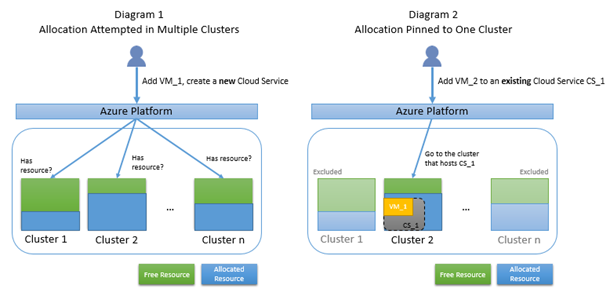

<properties
	pageTitle="排除云服务分配故障 | Microsoft Azure"
	description="对在 Azure 中部署云服务时的分配失败进行故障排除"
	services="azure-service-management, cloud-services"
	documentationCenter=""
	authors="kenazk"
	manager="drewm"
	editor=""
	tags="top-support-issue"/>

<tags
	ms.service="cloud-services"
	ms.date="01/06/2017"
	wacn.date="01/25/2017"/>

# 对在 Azure 中部署云服务时的分配失败进行故障排除

## 摘要
将实例部署到云服务或者添加新的 Web 角色或辅助角色实例时，Microsoft Azure 会分配计算资源。执行这些操作时，即使尚未达到 Azure 订阅限制，也可能偶尔发生错误。本文说明一些常见分配故障的原因，并建议可能的补救方法。规划服务的部署时，本信息可能也有用。

### 背景 - 分配的工作原理
Azure 数据中心的服务器分区成群集。会在多个群集中尝试新的云服务分配请求。将第一个实例部署到云服务时（不管是部署到过渡环境还是生产环境），都会将该云服务固定到某个群集。云服务的任何进一步部署都会发生在同一个群集。在本文中，这种情况称为“固定到群集”。下面的图 1 说明在多个群集中尝试进行一般分配的情况；图 2 说明固定到群集 2（因为现有的云服务 CS\_1 托管于此处）的分配情况。

### 发生分配故障的原因
当分配请求固定到某个群集时，由于可用的资源池仅限于某个群集，很可能找不到可用的资源。此外，如果分配请求固定到某个群集，但该群集不支持你所请求的资源类型，那么，即使该群集有可用的资源，你的请求仍会失败。下面的图 3 说明由于唯一候选群集没有可用的资源，导致已固定的分配失败的情况。图 4 说明由于唯一候选群集不支持所请求的 VM 大小（虽然群集有可用的资源），导致已固定的分配失败的情况。

## 云服务分配失败疑难解答
### 错误消息
你可能会看到以下错误消息：

	"Azure operation '{operation id}' failed with code Compute.ConstrainedAllocationFailed. Details: Allocation failed; unable to satisfy constraints in request. The requested new service deployment is bound to an Affinity Group, or it targets a Virtual Network, or there is an existing deployment under this hosted service. Any of these conditions constrains the new deployment to specific Azure resources. Please retry later or try reducing the VM size or number of role instances. Alternatively, if possible, remove the aforementioned constraints or try deploying to a different region."

### 常见问题
以下是造成分配请求被固定到单个群集的常见分配案例。

- 部署到过渡槽 - 如果某个云服务在任一槽中存在部署，则会将整个云服务固定到特定的群集。这意味着，如果生产槽中已存在部署，则只能将新的过渡部署分配到与生产槽相同的群集中。如果群集已接近容量，则请求可能失败。 
 
- 缩放 - 将新实例添加到现有云服务时，必须在同一群集中进行分配。通常可分配小型缩放请求，但情况并非总是如此。如果群集已接近容量，则请求可能失败。
	
- 地缘组 - 进行新的目标为空云服务的部署时，可以通过该区域任何群集中的结构对部署进行分配，除非已将云服务固定到地缘组。将会在相同的群集中尝试部署到相同的地缘组。如果群集已接近容量，则请求可能失败。
	
- 地缘组 vNet - 旧式虚拟网络已绑定到地缘组而不是区域，而这些虚拟网络中的云服务则会固定到地缘组群集。将会在固定的群集中尝试部署到此类虚拟网络。如果群集已接近容量，则请求可能失败。

## 解决方案

1. 重新部署到新的云服务 - 这种解决方案很可能是最成功的，因为它允许平台从该区域的所有群集中进行选择。
	
   - 将工作负荷部署到新的云服务  
   - 更新 CNAME 或 A 记录，将流量指向新的云服务
   - 没有流量流向旧站点后，即可删除旧的云服务。此解决方案应该不会导致停机。

2. 删除生产槽和过渡槽 - 此解决方案会保留现有的 DNS 名称，但在应用时会导致停机。
	
   - 删除现有云服务的生产槽和过渡槽，使云服务为空，然后 
   - 在现有云服务中创建新部署。这会在该区域的所有群集上重新尝试进行分配。确保云服务未绑定到地缘组。

3. 保留 IP - 此解决方案将保留现有 IP 地址，但在应用时会导致停机。
	
   - 使用 Powershell 针对现有部署创建 ReservedIP 

            New-AzureReservedIP -ReservedIPName {new reserved IP name} -Location {location} -ServiceName {existing service name}
		
   - 按照上面的第 2 种方法进行操作，确保在服务的 CSCFG 中指定新的 ReservedIP。

4. 删除针对新部署的地缘组 - 不再建议使用地缘组。按照上面第 1 种方法的步骤部署新的云服务。确保云服务不在地缘组中。

5. 转变成区域虚拟网络 - 请参阅[如何从地缘组迁移到区域虚拟网络 (VNet)](/documentation/articles/virtual-networks-migrate-to-regional-vnet/)。

<!---HONumber=Mooncake_1207_2015-->
<!--Update_Description:update meta properties-->
