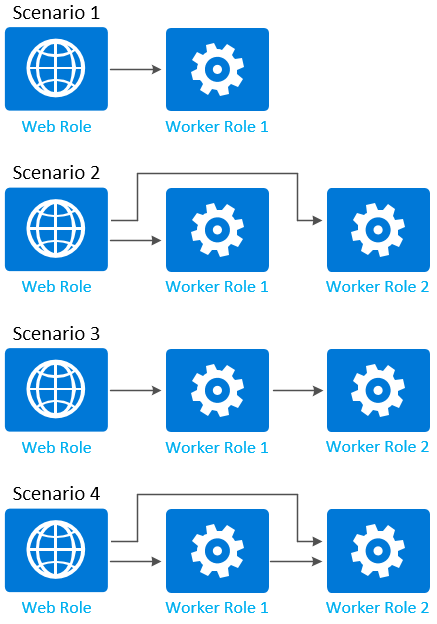

<properties 
pageTitle="云服务中的角色通信 | Azure" 
description="云服务中的角色实例可以定义其终结点（http、https、tcp、udp），以便与外界通信或在其他角色实例之间进行通信。" 
services="cloud-services" 
documentationCenter="" 
authors="Thraka" 
manager="timlt" 
editor=""/>
<tags 
ms.service="cloud-services" 
ms.date="12/07/2015" 
wacn.date="01/15/2016"/>

# 为 Azure 中的角色实例启用通信

云服务角色通过内部和外部连接进行通信。外部连接称为**输入终结点**，内部连接称为**内部终结点**。本主题介绍如何修改[服务定义](/documentation/articles/cloud-services-model-and-package/#csdef)以创建终结点。


## 输入终结点
当你想要向外部公开某个端口时，将使用输入终结点。你可以指定该终结点的协议类型和端口，然后，这些指定值将同时应用到该终结点的外部和内部端口。如果需要，你可以使用 [localPort](https://msdn.microsoft.com/zh-cn/library/azure/gg557552.aspx#InputEndpoint) 属性为终结点指定不同的内部端口。

输入终结点可以使用以下协议：**http、https、tcp、udp**。

若要创建输入终结点，请将 **InputEndpoint** 子元素添加到 Web 角色或辅助角色的 **Endpoints** 元素。

```xml
<Endpoints>
  <InputEndpoint name="StandardWeb" protocol="http" port="80" localPort="80" />
</Endpoints> 
```

## 实例输入终结点
实例输入终结点类似于输入终结点，但允许你通过使用负载平衡器上的端口转发，映射每个角色实例的面向公众的特定端口。你可以指定单个面向公众的端口，也可以指定一系列端口。

实例输入终结点只能使用 **tcp** 或 **udp** 作为协议。

若要创建实例输入终结点，请将 **InstanceInputEndpoint** 子元素添加到 Web 角色或辅助角色的 **Endpoints** 元素。

```xml
<Endpoints>
  <InstanceInputEndpoint name="Endpoint2" protocol="tcp" localPort="10100">
    <AllocatePublicPortFrom>
      <FixedPortRange max="10109" min="10105" />
    </AllocatePublicPortFrom>
  </InstanceInputEndpoint>
</Endpoints>
```

## 内部终结点
内部终结点可用于实例间的通信。端口是可选的，如果省略端口，将为终结点分配动态端口。可以使用端口范围。每个角色的内部终结点数不能超过五个。

内部终结点可以使用以下协议：**http、tcp、udp、任何**。

若要创建内部输入终结点，请将 **InternalEndpoint** 子元素添加到 Web 角色或辅助角色的 **Endpoints** 元素。

```xml
<Endpoints>
  <InternalEndpoint name="Endpoint3" protocol="any" port="8999" />
</Endpoints> 
```

你也可以使用端口范围。

```xml
<Endpoints>
  <InternalEndpoint name="Endpoint3" protocol="any">
    <FixedPortRange max="8995" min="8999" />
  </InternalEndpoint>
</Endpoints>
```


## 辅助角色与Web 角色

当你使用辅助角色和 web 角色时，在终结点方面需要注意一个细微的差别。Web 角色必须至少有一个使用 **HTTP** 协议的输入终结点。

	<Endpoints>
	  <InputEndpoint name="StandardWeb" protocol="http" port="80" localPort="80"/>
	  <!-- more endpoints may be declared after the first InputEndPoint -->
	</Endpoints>

## 使用 .NET SDK 访问终结点
Azure 托管库提供了角色实例在运行时用来通信的方法。可以从角色实例中运行的代码检索有关其他角色实例及其终结点是否存在的信息，以及有关当前角色实例的信息。

> [AZURE.NOTE]你只能检索有关正在你的云服务中运行且定义了至少一个内部终结点的角色实例的信息。无法获取有关其他服务中运行的角色实例的数据。

可以使用 [Instances](https://msdn.microsoft.com/zh-cn/library/azure/microsoft.windowsazure.serviceruntime.role.instances.aspx) 属性检索角色的实例。首先，使用 [CurrentRoleInstance](https://msdn.microsoft.com/zh-cn/library/azure/microsoft.windowsazure.serviceruntime.roleenvironment.currentroleinstance.aspx) 返回对当前角色实例的引用，然后使用 [Role](https://msdn.microsoft.com/zh-cn/library/azure/microsoft.windowsazure.serviceruntime.roleinstance.role.aspx) 属性返回对角色本身的引用。

当你通过 .NET SDK 以编程方式连接到角色实例时，可以相对较容易地访问终结点信息。例如，在连接到特定的角色环境后，你可以使用以下代码获取特定终结点的端口：

```csharp
int port = RoleEnvironment.CurrentRoleInstance.InstanceEndpoints["StandardWeb"].IPEndpoint.Port;
```

**Instances** 属性将返回一个 **RoleInstance** 对象集合。此集合始终包含当前实例。如果角色未定义内部终结点，则集合将包含当前实例，但不包含任何其他实例。如果未为角色定义内部终结点，则集合中的角色实例的数目将始终为 1。如果角色定义了一个内部终结点，则其实例在运行时是可发现的，并且集合中的实例数将与在服务配置文件中为角色指定的实例数对应。

> [AZURE.NOTE]Azure 托管库不提供用来确定其他角色实例的运行状况的方法，但如果你的服务需要此功能，则可以自行实现此类运行状况评估。你可以使用 [Azure Diagnostics](https://msdn.microsoft.com/zh-cn/library/azure/gg433048.aspx) 来获取有关正在运行的角色实例的信息。

若要确定角色实例上的内部终结点的端口号，可以使用 [InstanceEndpoints](https://msdn.microsoft.com/zh-cn/library/azure/microsoft.windowsazure.serviceruntime.roleinstance.instanceendpoints.aspx) 属性来返回 Dictionary 对象，该对象中将包含终结点名称及其对应的 IP 地址和端口。[IPEndpoint](https://msdn.microsoft.com/zh-cn/library/azure/microsoft.windowsazure.serviceruntime.roleinstanceendpoint.ipendpoint.aspx) 属性返回指定终结点的 IP 地址和端口。**PublicIPEndpoint** 属性返回负载平衡终结点的端口。将不使用 **PublicIPEndpoint** 属性的 IP 地址部分。

下面是一个循环访问角色实例的示例。

```csharp
foreach (RoleInstance roleInst in RoleEnvironment.CurrentRoleInstance.Role.Instances)
{
    Trace.WriteLine("Instance ID: " + roleInst.Id);
    foreach (RoleInstanceEndpoint roleInstEndpoint in roleInst.InstanceEndpoints.Values)
    {
        Trace.WriteLine("Instance endpoint IP address and port: " + roleInstEndpoint.IPEndpoint);
    }
}
```

下面的辅助角色示例将获取通过服务定义公开的终结点，然后开始侦听连接。

> [AZURE.WARNING]此代码仅适用于已部署的服务。在 Azure 计算模拟器中运行时，将忽略创建直接端口终结点的服务配置元素（**InstanceInputEndpoint** 元素）。

```csharp
using System;
using System.Diagnostics;
using System.Linq;
using System.Net;
using System.Net.Sockets;
using System.Threading;
using Microsoft.WindowsAzure;
using Microsoft.WindowsAzure.Diagnostics;
using Microsoft.WindowsAzure.ServiceRuntime;
using Microsoft.WindowsAzure.StorageClient;

namespace WorkerRole1
{
  public class WorkerRole : RoleEntryPoint
  {
    public override void Run()
    {
      try
      {
        // Initialize method-wide variables
        var epName = "Endpoint1";
        var roleInstance = RoleEnvironment.CurrentRoleInstance;
        
        // Identify direct communication port
        var myPublicEp = roleInstance.InstanceEndpoints[epName].PublicIPEndpoint;
        Trace.TraceInformation("IP:{0}, Port:{1}", myPublicEp.Address, myPublicEp.Port);

        // Identify public endpoint
        var myInternalEp = roleInstance.InstanceEndpoints[epName].IPEndpoint;
                
        // Create socket listener
        var listener = new Socket(
          myInternalEp.AddressFamily, SocketType.Stream, ProtocolType.Tcp);
                
        // Bind socket listener to internal endpoint and listen
        listener.Bind(myInternalEp);
        listener.Listen(10);
        Trace.TraceInformation("Listening on IP:{0},Port: {1}",
          myInternalEp.Address, myInternalEp.Port);

        while (true)
        {
          // Block the thread and wait for a client request
          Socket handler = listener.Accept();
          Trace.TraceInformation("Client request received.");

          // Define body of socket handler
          var handlerThread = new Thread(
            new ParameterizedThreadStart(h =>
            {
              var socket = h as Socket;
              Trace.TraceInformation("Local:{0} Remote{1}",
                socket.LocalEndPoint, socket.RemoteEndPoint);

              // Shut down and close socket
              socket.Shutdown(SocketShutdown.Both);
              socket.Close();
            }
          ));

          // Start socket handler on new thread
          handlerThread.Start(handler);
        }
      }
      catch (Exception e)
      {
        Trace.TraceError("Caught exception in run. Details: {0}", e);
      }
    }

    public override bool OnStart()
    {
      // Set the maximum number of concurrent connections 
      ServicePointManager.DefaultConnectionLimit = 12;

      // For information on handling configuration changes
      // see the MSDN topic at http://go.microsoft.com/fwlink/?LinkId=166357.
      return base.OnStart();
    }
	}
	}
	```

## 用于控制角色通信的网络流量规则
在定义内部终结点之后，可以根据创建的终结点添加网络流量规则以控制各角色实例之间的通信方式。下图演示了一些用于控制角色通信的常见方案：



以下代码示例演示了上图中显示的角色的角色定义。每个角色定义包含至少一个已定义的内部终结点：

```xml
<ServiceDefinition name="MyService" xmlns="http://schemas.microsoft.com/ServiceHosting/2008/10/ServiceDefinition">
  <WebRole name="WebRole1" vmsize="Medium">
    <Sites>
      <Site name="Web">
        <Bindings>
          <Binding name="HttpIn" endpointName="HttpIn" />
        </Bindings>
      </Site>
    </Sites>
    <Endpoints>
      <InputEndpoint name="HttpIn" protocol="http" port="80" />
      <InternalEndpoint name="InternalTCP1" protocol="tcp" />
    </Endpoints>
  </WebRole>
  <WorkerRole name="WorkerRole1">
    <Endpoints>
      <InternalEndpoint name="InternalTCP2" protocol="tcp" />
    </Endpoints>
  </WorkerRole>
  <WorkerRole name="WorkerRole2">
    <Endpoints>
      <InternalEndpoint name="InternalTCP3" protocol="tcp" />
      <InternalEndpoint name="InternalTCP4" protocol="tcp" />
    </Endpoints>
  </WorkerRole>
</ServiceDefinition>
```

> [AZURE.NOTE]固定端口和自动分配的端口的内部终结点会限制角色之间的通信。

默认情况下，在定义内部终结点后，通信可以从任意角色流动到角色的内部终结点，而不会受到任何限制。若要限制通信，必须将 **NetworkTrafficRules** 元素添加到服务定义文件中的 **ServiceDefinition** 元素。

### 方案 1
仅允许从 **WebRole1** 到 **WorkerRole1** 的网络流量。

```xml
<ServiceDefinition name="MyService" xmlns="http://schemas.microsoft.com/ServiceHosting/2008/10/ServiceDefinition">
  <NetworkTrafficRules>
    <OnlyAllowTrafficTo>
      <Destinations>
        <RoleEndpoint endpointName="InternalTCP2" roleName="WorkerRole1"/>
      </Destinations>
      <AllowAllTraffic/>
      <WhenSource matches="AnyRule">
        <FromRole roleName="WebRole1"/>
      </WhenSource>
    </OnlyAllowTrafficTo>
  </NetworkTrafficRules>
</ServiceDefinition>
```

### 方案 2
仅允许从 **WebRole1** 到 **WorkerRole1** 和 **WorkerRole2** 的网络流量。

```xml
<ServiceDefinition name="MyService" xmlns="http://schemas.microsoft.com/ServiceHosting/2008/10/ServiceDefinition">
  <NetworkTrafficRules>
    <OnlyAllowTrafficTo>
      <Destinations>
        <RoleEndpoint endpointName="InternalTCP2" roleName="WorkerRole1"/>
        <RoleEndpoint endpointName="InternalTCP3" roleName="WorkerRole2"/>
      </Destinations>
      <WhenSource matches="AnyRule">
        <FromRole roleName="WebRole1"/>
      </WhenSource>
    </OnlyAllowTrafficTo>
  </NetworkTrafficRules>
</ServiceDefinition>
```

### 方案 3
仅允许从 **WebRole1** 到 **WorkerRole1** 以及从 **WorkerRole1** 到 **WorkerRole2** 的网络流量。

```xml
<ServiceDefinition name="MyService" xmlns="http://schemas.microsoft.com/ServiceHosting/2008/10/ServiceDefinition">
  <NetworkTrafficRules>
    <OnlyAllowTrafficTo>
      <Destinations>
        <RoleEndpoint endpointName="InternalTCP2" roleName="WorkerRole1"/>
      </Destinations>
      <AllowAllTraffic/>
      <WhenSource matches="AnyRule">
        <FromRole roleName="WebRole1"/>
      </WhenSource>
    </OnlyAllowTrafficTo>
  </NetworkTrafficRules>
  <NetworkTrafficRules>
    <OnlyAllowTrafficTo>
      <Destinations>
        <RoleEndpoint endpointName="InternalTCP3" roleName="WorkerRole2"/>
      </Destinations>
      <WhenSource matches="AnyRule">
        <FromRole roleName="WorkerRole1"/>
      </WhenSource>
    </OnlyAllowTrafficTo>
  </NetworkTrafficRules>
</ServiceDefinition>
```

### 方案 4
仅允许从 **WebRole1** 到 **WorkerRole1**、从 **WebRole1** 到 **WorkerRole2** 以及从 **WorkerRole1** 到 **WorkerRole2** 的网络流量。

```xml
<ServiceDefinition name="MyService" xmlns="http://schemas.microsoft.com/ServiceHosting/2008/10/ServiceDefinition">
  <NetworkTrafficRules>
    <OnlyAllowTrafficTo>
      <Destinations>
        <RoleEndpoint endpointName="InternalTCP2" roleName="WorkerRole1"/>
      </Destinations>
      <AllowAllTraffic/>
      <WhenSource matches="AnyRule">
        <FromRole roleName="WebRole1"/>
      </WhenSource>
    </OnlyAllowTrafficTo>
  </NetworkTrafficRules>
  <NetworkTrafficRules>
    <OnlyAllowTrafficTo >
      <Destinations>
        <RoleEndpoint endpointName="InternalTCP3" roleName="WorkerRole2"/>
      </Destinations>
      <AllowAllTraffic/>
      <WhenSource matches="AnyRule">
        <FromRole roleName="WorkerRole1"/>
      </WhenSource>
    </OnlyAllowTrafficTo>
  </NetworkTrafficRules>
  <NetworkTrafficRules>
    <OnlyAllowTrafficTo >
      <Destinations>
        <RoleEndpoint endpointName="InternalTCP4" roleName="WorkerRole2"/>
      </Destinations>
      <AllowAllTraffic/>
      <WhenSource matches="AnyRule">
        <FromRole roleName="WebRole1"/>
      </WhenSource>
    </OnlyAllowTrafficTo>
  </NetworkTrafficRules>
</ServiceDefinition>
```

可在[此处](https://msdn.microsoft.com/zh-cn/library/azure/gg557551.aspx)找到上面所用元素的 XML 架构参考。

## 后续步骤
阅读有关云服务[模型](/documentation/articles/cloud-services-model-and-package/)的详细信息。

<!---HONumber=Mooncake_0104_2016-->
