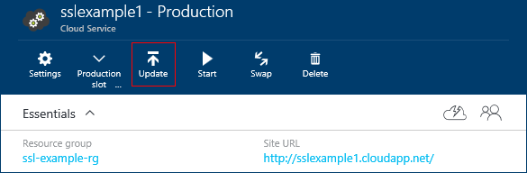
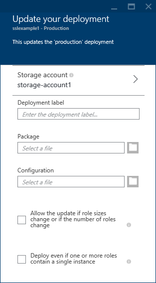
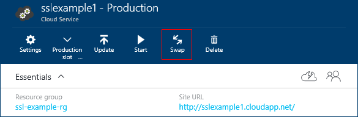
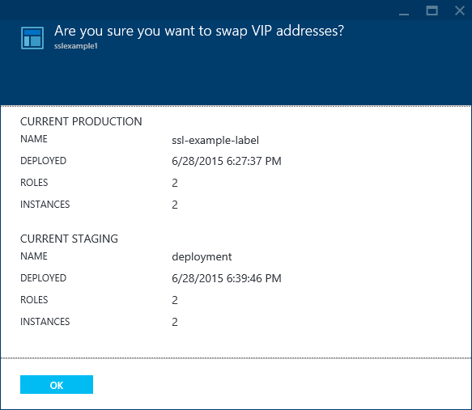
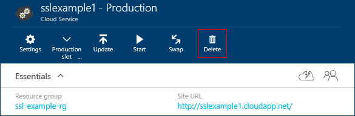
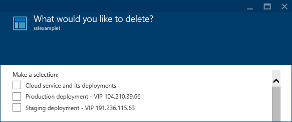

<properties 
	pageTitle="常见的云服务管理任务 | Azure" 
	description="了解如何在 Azure 门户中管理云服务。这些示例使用 Azure 门户。" 
	services="cloud-services" 
	documentationCenter="" 
	authors="Thraka" 
	manager="timlt" 
	editor=""/>  

<tags 
	ms.service="cloud-services" 
	ms.workload="tbd" 
	ms.tgt_pltfrm="na" 
	ms.devlang="na" 
	ms.topic="article" 
	ms.date="11/16/2016" 
	wacn.date="12/26/2016"
	ms.author="adegeo"/>

# 如何管理云服务

> [AZURE.SELECTOR]
- [Azure 门户预览](/documentation/articles/cloud-services-how-to-manage-portal/)
- [Azure 经典管理门户](/documentation/articles/cloud-services-how-to-manage/)

可以在 Azure 门户预览的“云服务(经典)”区域中管理云服务。本文介绍在管理云服务时可以执行的一些常见操作。其中包括更新、删除、扩展过渡部署并将其升级为生产部署。

有关如何扩展云服务的详细信息，请参阅[本文](/documentation/articles/cloud-services-how-to-scale-portal/)。

## 如何：更新云服务角色或部署

如果需要更新云服务的应用程序代码，请使用云服务边栏选项卡上的“更新”。可以更新一个角色或所有角色。若要进行更新，可以上载新服务包或服务配置文件。

1. 在 [Azure 门户预览][]中，选择要更新的云服务。此步骤将打开云服务实例边栏选项卡。

2. 在边栏选项卡中，单击“更新”按钮。

    

3. 使用新服务包文件 (.cspkg) 和服务配置文件 (.cscfg) 更新部署。

    

4. **可选**更新部署标签和存储帐户。

5. 如果任何角色只有一个角色实例，请选择“即使一个或多个角色包含单个实例也进行部署”，以使升级能够继续。

	如果每个角色至少拥有两个角色实例（虚拟机），则 Azure 在云服务更新期间只能保证 99.95% 的服务可用性。因为有两个角色实例，因此其中一个虚拟机可以在另一个虚拟机更新时处理客户端请求。

6. 如果要在包上载完成后应用更新，请选中“开始部署”。

7. 单击“确定”开始更新服务。

## 如何：交换部署以将过渡部署升级为生产环境

如果决定部署云服务的新版本，可以在云服务过渡环境中暂存和测试新版本。使用“交换”将两个部署的 URL 地址互换，并将新版本提升为生产部署。

可以通过“云服务”页面或仪表板交换部署。

1. 在 [Azure 门户预览][]中，选择要更新的云服务。此步骤将打开云服务实例边栏选项卡。

2. 在边栏选项卡中，单击“交换”按钮。

    

3. 将打开以下确认提示。

	

4. 验证部署信息后，单击“确定”交换部署。

	交换部署的速度很快，因为唯一发生更改的是部署使用的虚拟 IP 地址 (VIP)。

	若要节省计算成本，可以在验证生产部署是否能够按预期运行后删除过渡部署。

## 如何：将资源链接到云服务

Azure 门户预览不会像当前 Azure 经典管理门户一样将资源链接在一起。而是将其他资源部署到云服务正在使用的同一资源组。

## 如何：删除部署和云服务

必须先删除每个现有部署，然后才能删除云服务。

若要节省计算成本，可以在验证生产部署是否能够按预期运行后删除过渡部署。停止的已部署角色实例仍会产生计算成本。

可使用以下过程删除部署或云服务。

1. 在 [Azure 门户预览][]中，选择要删除的云服务。此步骤将打开云服务实例边栏选项卡。

2. 在边栏选项卡中，单击“删除”按钮。

    

3. 可以通过选中“云服务及其部署”，或通过选择“生产部署”或“过渡部署”删除整个云服务。

    

4. 单击底部的“删除”按钮。

5. 若要删除云服务，单击“删除云服务”。然后，在出现确认提示时单击“是”。

> [AZURE.NOTE]
删除云服务时，如果已配置详细监视，则必须从存储帐户中手动删除数据。有关在何处查找度量值表的信息，请参阅[此](/documentation/articles/cloud-services-how-to-monitor/)文章。

[Azure 门户预览]: https://portal.azure.cn

## 后续步骤

* [云服务的常规配置](/documentation/articles/cloud-services-how-to-configure-portal/)。
* 了解如何[部署云服务](/documentation/articles/cloud-services-how-to-create-deploy-portal/)。
* 配置[自定义域名](/documentation/articles/cloud-services-custom-domain-name-portal/)。
* 配置 [SSL 证书](/documentation/articles/cloud-services-configure-ssl-certificate-portal/)。

<!---HONumber=Mooncake_Quality_Review_1215_2016-->