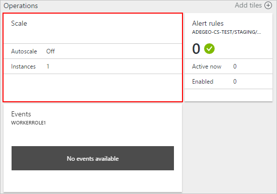

<properties
	pageTitle="在门户中的自动缩放云服务 | Azure"
	description="了解如何使用门户在 Azure 中为云服务 Web 角色或辅助角色配置自动缩放规则。"
	services="cloud-services"
	documentationCenter=""
	authors="Thraka"
	manager="timlt"
	editor=""/>  

<tags
	ms.service="cloud-services"
	ms.workload="tbd"
	ms.tgt_pltfrm="na"
	ms.devlang="na"
	ms.topic="article"
	ms.date="09/06/2016"
	wacn.date="10/24/2016"
	ms.author="adegeo"/>  

# 如何自动缩放云服务

> [AZURE.SELECTOR]
- [Azure 门户预览](/documentation/articles/cloud-services-how-to-scale-portal/)
- [Azure 经典管理门户](/documentation/articles/cloud-services-how-to-scale/)

针对云服务辅助角色设置条件，以触发缩减或扩展操作。针对角色的条件可以基于 CPU、磁盘或角色的网络负载。你也可以基于消息队列或与订阅关联的其他一些 Azure 资源的指标来设置条件。

>[AZURE.NOTE] 本文着重于云服务 Web 和辅助角色。如果你直接创建虚拟机（经典），该虚拟机将托管在云服务中。可以通过将标准虚拟机与[可用性集](/documentation/articles/virtual-machines-windows-classic-configure-availability/)相关联来缩放标准虚拟机，并手动将其打开或关闭。

## 注意事项

在配置应用程序的缩放之前，应考虑以下信息：

- 缩放受内核使用情况影响。角色实例越大，使用的核心越多。你只能在你的订阅的内核限制内缩放应用程序。例如，如果你的订阅的上限是二十个内核，并且你通过两个中等规模的云服务（一共四个内核）运行某个应用程序，则对于订阅中的其他云服务部署，你只能扩展十六个内核。有关大小的详细信息，请参阅 [Cloud Service Sizes](/documentation/articles/cloud-services-sizes-specs/)（云服务的大小）。

- 你可以基于队列消息阈值来进行缩放。有关如何使用队列的详细信息，请参阅 [How to use the Queue Storage Service](/documentation/articles/storage-dotnet-how-to-use-queues/)（如何使用队列存储服务）。

- 你还可以缩放与订阅关联的其他资源。

- 若要启用应用程序的高可用性，你应确保通过两个或更多角色实例来部署它。有关详细信息，请参阅[服务级别协议](/support/legal/sla/)。

##  缩放位置

选择云服务之后，你应会看到云服务边栏选项卡。

1. 在云服务边栏选项卡上的“角色和实例”磁贴中，选择云服务的名称。   
**重要说明**：请务必单击云服务角色，而不是角色下面的角色实例。

      

2. 选择“缩放”磁贴。

    

## 自动缩放

可以使用**手动**或**自动**模式来配置角色的缩放设置。顾名思义，“手动”模式可以设置实例的绝对计数。但是，“自动”模式可让你设置规则来控制缩放的方式和程度。

将“缩放方式”选项设置为“计划和性能规则”。

  

1. 现有的配置文件。
2. 添加父配置文件的规则。
3. 添加另一个配置文件。

选择“添加配置文件”。配置文件确定了用于缩放的模式：**始终**、**定期**和**固定日期**。

配置了配置文件和规则之后，请选择顶部的“保存”图标。

#### 配置文件

配置文件可设置缩放的实例数下限和上限，以及此缩放范围生效的时间。

* **始终**

    始终使此范围的实例数保持可用。

    
    
* **定期**

    选择一组要缩放的星期日期。

      

    
* **固定日期**

    要缩放角色的固定日期范围。

    

配置了配置文件之后，请选择配置文件边栏选项卡底部的“确定”按钮。

#### 规则

规则将添加到配置文件，代表触发缩放的条件。

规则触发器基于云服务的指标（CPU 使用量、磁盘活动或网络活动），你可以在其中添加条件值。此外，你也可以基于消息队列或与订阅关联的其他一些 Azure 资源的指标来设置触发器。

  

配置规则之后，请选择规则边栏选项卡底部的“确定”按钮。

## 返回到手动缩放

导航到“缩放设置”，并将“缩放方式”选项设置为“我手动输入的实例计数”。

  

这会删除角色中的自动缩放，然后你可以直接设置实例计数。

1. 缩放（手动或自动）选项。
2. 角色实例滑块，用于设置要缩放的实例。
3. 要缩放的角色实例。

配置缩放设置后，请选择顶部的“保存”图标。

<!---HONumber=Mooncake_0815_2016-->