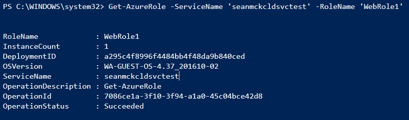
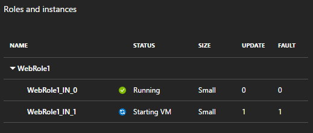
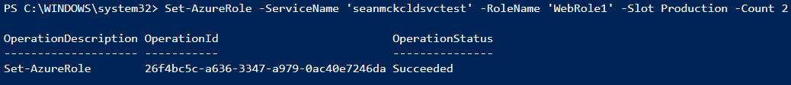

<properties
    pageTitle="在 Windows PowerShell 中缩放 Azure 云服务 | Azure"
    description="（经典）了解如何使用 PowerShell 在 Azure 中缩放 web 角色或辅助角色。"
    services="cloud-services"
    documentationcenter=""
    author="seanmck"
    manager="timlt"
    editor="" />  

<tags
    ms.assetid="ee37dd8c-6714-4c61-adb8-03d6bbf76c9a"
    ms.service="cloud-services"
    ms.workload="tbd"
    ms.tgt_pltfrm="na"
    ms.devlang="na"
    ms.topic="article"
    ms.date="12/01/2016"
    wacn.date="01/03/2017"
    ms.author="seanmck" />  

# 如何在 PowerShell 中缩放云服务

可以使用 Windows PowerShell 通过添加或删除实例来缩放 web 角色或辅助角色。

## 登录到 Azure

若希望通过 PowerShell 对订阅执行任何操作，必须首先登录：

	Add-AzureAccount -Environment $(Get-AzureRmEnvironment -Name AzureChinaCloud)

如果有多个订阅与帐户关联，可能需要根据云服务的所在位置更改当前订阅。若要查看当前订阅，请运行：

	Get-AzureSubscription -Current

如果需要更改当前订阅，请运行：

	Set-AzureSubscription -SubscriptionId <subscription_id>

## 查看角色的当前实例计数

若要查看角色的当前状态，请运行：

	Get-AzureRole -ServiceName '<your_service_name>' -RoleName '<your_role_name>'

应重新获取有关角色的信息，包括其当前 OS 版本和实例计数。在本例中，角色具有单个实例。

  

## 通过添加更多实例来扩展角色

若要扩展角色，请将所需的实例数作为**计数**参数传递给 **Set-AzureRole** cmdlet：

	Set-AzureRole -ServiceName '<your_service_name>' -RoleName '<your_role_name>' -Slot <target_slot> -Count <desired_instances>

当预配并启动新实例时，此 cmdlet 将立即阻止。在此期间，如果打开一个新的 PowerShell 窗口，然后调用 **Get-AzureRole**（如前面所示），将看到新的目标实例计数。如果在门户中查看角色状态，应看到新实例正在启动：

  

新实例启动后，该 cmdlet 将成功返回：

  

## 通过删除实例缩小角色

同样，可通过删除实例缩小角色。将 **Set-AzureRole** 中的**计数**参数设置为缩小操作完成后所需的实例数。

## 后续步骤

不能从 PowerShell 为云服务配置自动缩放。若要实现此操作，请参阅[如何自动缩放云服务](/documentation/articles/cloud-services-how-to-scale/)。

<!---HONumber=Mooncake_1226_2016-->