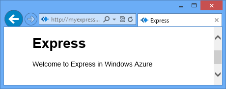
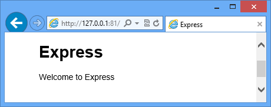
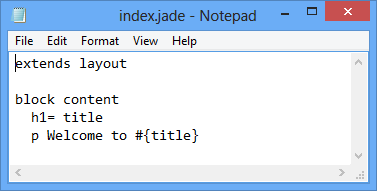
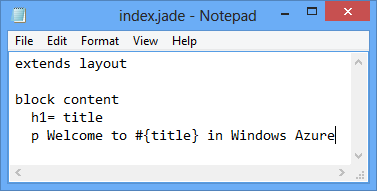

<properties 
	pageTitle="使用 Express 构建 Web 应用程序 (Node.js) | Azure" 
	description="本教程以云服务教程为基础，演示如何使用 Express 模块。" 
	services="cloud-services" 
	documentationCenter="nodejs" 
	authors="rmcmurray" 
	manager="wpickett" 
	editor=""/>

<tags 
	ms.service="cloud-services" 
	ms.date="05/04/2016" 
	wacn.date="05/31/2016"/>

# 使用 Express 在 Azure 云服务中生成 Node.js Web 应用程序

Node.js 包含核心运行时中最小的一个功能集。开发人员在开发 Node.js 应用程序时经常会使用第三方模块来提供额外功能。在本教程中，你将使用 [Express][] 模块新建一个应用程序，该模块可提供用于创建 Node.js Web 应用程序的 MVC 框架。

以下是已完成应用程序的屏幕快照：

##创建云服务项目

执行下列步骤可新建一个名为“expressapp”的云服务项目：

1. 在“开始”菜单或“开始”屏幕中，搜索 **Windows PowerShell**。最后，右键单击“Windows PowerShell”并选择“以管理员身份运行”。

	

	[AZURE.INCLUDE [install-dev-tools](../includes/install-dev-tools.md)]

2. 将目录切换到 **c:\\node** 目录，然后输入下列命令以新建一个名为 **expressapp** 的解决方案和名为 **WebRole1** 的 Web 角色：

		PS C:\node> New-AzureServiceProject expressapp
		PS C:\Node\expressapp> Add-AzureNodeWebRole
		PS C:\Node\expressapp> Set-AzureServiceProjectRole WebRole1 Node 0.10.21

	> [AZURE.NOTE] 默认情况下，**Add-azurenodewebrole** 使用旧版 Node.js。上述 **Set-azureserviceprojectrole** 语句将指示 Azure 使用 v0.10.21 版本的节点。请注意，这些参数区分大小写。通过检查 **WebRole1\\package.json** 中的 **engines** 属性可以验证是否已选择正确的 Node.js 版本。

##安装 Express

1. 通过发出以下命令安装 Express 生成器：

		PS C:\node\expressapp> npm install express-generator -g

	npm 命令的输出应与以下结果类似。

	

2. 将目录切换到 **WebRole1** 目录，然后使用 express 命令生成一个新的应用程序：

        PS C:\node\expressapp\WebRole1> express

	系统将提示你是否覆盖之前创建的应用程序。输入 **y** 或 **yes** 以继续操作。Express 将生成用于生成应用程序的 app.js 文件和一个文件夹结构。

	

5.  若要安装在 package.json 文件中定义的其他依赖项，请输入以下命令：

        PS C:\node\expressapp\WebRole1> npm install

	

6.  使用以下命令将 **bin/www** 文件复制到 **server.js**，这样，云服务便可以找到此应用程序的入口点。

		PS C:\node\expressapp\WebRole1> copy bin/www server.js

	完成此命令后，WebRole1 目录中应会生成一个 **server.js** 文件。

7.  修改 **server.js** 以删除以下行中的“.”字符之一。

		var app = require('../app');

	完成此项修改后，该行应如下所示。

		var app = require('./app');

	之所以需要进行此更改，是因为我们已将文件（以前的 **bin/www**）移到了所需应用程序文件所在的同一个目录。完成此更改后，请保存 **server.js** 文件。

8.  使用以下命令以在 Azure 模拟器中运行应用程序：

        PS C:\node\expressapp\WebRole1> Start-AzureEmulator -launch

	

## 修改视图

现在，你将修改视图以显示消息“Welcome to Express in Azure”。

1.  请输入以下命令来打开 index.jade 文件：

        PS C:\node\expressapp\WebRole1> notepad views/index.jade

    

    Jade 是 Express 应用程序使用的默认视图引擎。有关 Jade 视图引擎的详细信息，请参阅 [http://jade-lang.com][]。

2.  通过追加 **in Azure** 来修改最后一行文本。

	

3.  保存文件并退出记事本。

4.  刷新浏览器，你将看到所做的更改。

	

测试应用程序后，请使用 **Stop-AzureEmulator** cmdlet 停止模拟器。

##将应用程序发布到 Azure

在 Azure PowerShell 窗口中，可使用 **Publish-AzureServiceProject** cmdlet 将应用程序部署到云服务

    PS C:\node\expressapp\WebRole1> Publish-AzureServiceProject -ServiceName myexpressapp -Location "China East" -Launch

在部署操作完成后，浏览器将打开并显示该网页。

## 后续步骤

有关详细信息，请参阅 [Node.js 开发人员中心](/develop/nodejs)。

  [Node.js Web Application]: /documentation/articles/cloud-services-nodejs-develop-deploy-app/
  [Express]: http://expressjs.com/
  [http://jade-lang.com]: http://jade-lang.com

 

<!---HONumber=Mooncake_0523_2016-->
