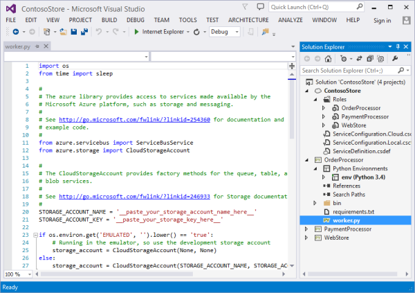
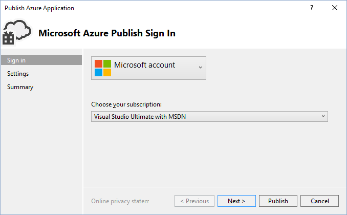
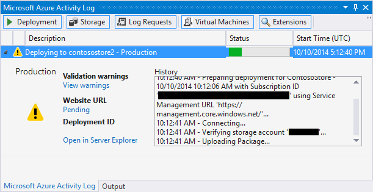

<properties
	pageTitle="Visual Studio 中的 Python Web 角色和辅助角色 | Azure"
	description="有关使用 Python Tools for Visual Studio 来创建包括 Web 角色和辅助角色的 Azure 云服务的概述。"
	services="cloud-services"
	documentationCenter="python"
	authors="thraka"
	manager="timlt"
	editor=""/>

<tags
	ms.service="cloud-services"
	ms.date="08/03/2016"
	wacn.date="09/19/2016"/>


# 用于 Visual Studio 的 Python 工具中的 Python Web 角色和辅助角色

本文概述了如何在 [Python Tools for Visual Studio][] 中使用 Python Web 角色和辅助角色。其中介绍了如何使用 Visual Studio 来创建和部署使用 Python 的基本云服务。

## 先决条件

 - Visual Studio 2013 或 2015
 - [Python Tools for Visual Studio][]（用于 Visual Studio 的 Python 工具，简称 PTVS）
 - [Azure SDK Tools for VS 2013][] 或 [Azure SDK Tools for VS 2015][]
 - [Python 2.7（32 位）][]或 [Python 3.5（32 位）][]

[AZURE.INCLUDE [create-account-and-websites-note](../../includes/create-account-and-websites-note.md)]

## 什么是 Python Web 角色和辅助角色？

Azure 提供了三种计算模型用于运行应用程序：[Azure App Service 中的 Web Apps 功能][execution model-web sites]、[Azure 虚拟机][execution model-vms]和 [Azure 云服务][execution model-cloud services]。这三种模型都支持 Python。云服务（包括 Web 角色和辅助角色）提供了 *平台即服务 (PaaS)* 。在云服务中，Web 角色提供专用的 Internet Information Services (IIS) Web 服务器来托管前端 Web 应用程序，而辅助角色可独立于用户交互或输入运行异步任务、运行时间较长的任务或永久性任务。

有关详细信息，请参阅[什么是云服务？]。

> [AZURE.NOTE] *想要构建一个简单的网站？*
如果你的方案只涉及一个简单的网站前端，请考虑使用 Azure App Service 中的轻型 Web Apps 功能。随着您网站的不断扩大和需求的变化，您可以轻松升级到云服务。请参阅 <a href="/develop/python/">Python 开发人员中心</a>上关于开发 Azure App Service 中的 Web Apps 功能的文章。
<br />


## 创建项目

在 Visual Studio 中，可以选择“新建项目”对话框中“Python”下的“Azure 云服务”。


在 Azure 云服务向导中，可以创建新的 Web 角色和辅助角色。


辅助角色模板包含样板文件代码以连接到 Azure 存储帐户或 Azure 服务总线。



可以随时将 Web 角色或辅助角色添加到现有的云服务。您可以选择在解决方案中添加现有项目或创建新项目。


您的云服务可以包含用不同语言实现的角色。例如，可以使用 Django 实现 Python Web 角色，而用使用 Python 或 C# 实现辅助角色。你可以通过使用服务总线队列或存储队列来轻松地在角色之间进行通信。

## 在云服务上安装 Python

>[AZURE.WARNING] 在本文上次更新时与 Visual Studio 一起安装的安装脚本无法使用。本部分将介绍一种解决方法。

安装脚本的主要问题在于无法安装 Python。首先，请在 [ServiceDefinition.csdef](/documentation/articles/cloud-services-model-and-package/#servicedefinitioncsdef) 文件中定义两个[启动任务](/documentation/articles/cloud-services/cloud-services-startup-tasks/)。第一个任务 (**PrepPython.ps1**) 下载并安装 Python 运行时。第二个任务 (**PipInstaller.ps1**) 运行 pip，安装可能存在的任何依赖项。

以下脚本是针对 Python 3.5 编写的。若要使用 2.x 版 Python，请针对两个启动任务以及运行时任务将 **PYTHON2** 变量文件设置为 **on**：`<Variable name="PYTHON2" value="<mark>on</mark>" />`。


```xml
<Startup>

  <Task executionContext="elevated" taskType="simple" commandLine="bin\ps.cmd PrepPython.ps1">
    <Environment>
      <Variable name="EMULATED">
        <RoleInstanceValue xpath="/RoleEnvironment/Deployment/@emulated" />
      </Variable>
	  <Variable name="PYTHON2" value="off" />
    </Environment>
  </Task>

  <Task executionContext="elevated" taskType="simple" commandLine="bin\ps.cmd PipInstaller.ps1">
    <Environment>
      <Variable name="EMULATED">
        <RoleInstanceValue xpath="/RoleEnvironment/Deployment/@emulated" />
      </Variable>
    </Environment>
	<Variable name="PYTHON2" value="off" />
  </Task>

</Startup>
```

需将 **PYTHON2** 和 **PYPATH** 变量添加到辅助角色启动任务。仅当 **PYTHON2** 变量设置为 **on** 时，才使用 **PYPATH** 变量。

```xml
<Runtime>
  <Environment>
    <Variable name="EMULATED">
      <RoleInstanceValue xpath="/RoleEnvironment/Deployment/@emulated" />
    </Variable>
    <Variable name="PYTHON2" value="off" />
    <Variable name="PYPATH" value="%SystemDrive%\Python27" />
  </Environment>
  <EntryPoint>
    <ProgramEntryPoint commandLine="bin\ps.cmd LaunchWorker.ps1" setReadyOnProcessStart="true" />
  </EntryPoint>
</Runtime>
```

#### ServiceDefinition.csdef 示例

```xml
<?xml version="1.0" encoding="utf-8"?>
<ServiceDefinition name="AzureCloudServicePython" xmlns="http://schemas.microsoft.com/ServiceHosting/2008/10/ServiceDefinition" schemaVersion="2015-04.2.6">
  <WorkerRole name="WorkerRole1" vmsize="Small">
    <ConfigurationSettings>
      <Setting name="Microsoft.WindowsAzure.Plugins.Diagnostics.ConnectionString" />
      <Setting name="Python2" />
    </ConfigurationSettings>
    <Startup>
      <Task executionContext="elevated" taskType="simple" commandLine="bin\ps.cmd PrepPython.ps1">
        <Environment>
          <Variable name="EMULATED">
            <RoleInstanceValue xpath="/RoleEnvironment/Deployment/@emulated" />
          </Variable>
          <Variable name="PYTHON2" value="off" />
        </Environment>
      </Task>
      <Task executionContext="elevated" taskType="simple" commandLine="bin\ps.cmd PipInstaller.ps1">
        <Environment>
          <Variable name="EMULATED">
            <RoleInstanceValue xpath="/RoleEnvironment/Deployment/@emulated" />
          </Variable>
          <Variable name="PYTHON2" value="off" />
        </Environment>
      </Task>
    </Startup>
    <Runtime>
      <Environment>
        <Variable name="EMULATED">
          <RoleInstanceValue xpath="/RoleEnvironment/Deployment/@emulated" />
        </Variable>
        <Variable name="PYTHON2" value="off" />
        <Variable name="PYPATH" value="%SystemDrive%\Python27" />
      </Environment>
      <EntryPoint>
        <ProgramEntryPoint commandLine="bin\ps.cmd LaunchWorker.ps1" setReadyOnProcessStart="true" />
      </EntryPoint>
    </Runtime>
    <Imports>
      <Import moduleName="RemoteAccess" />
      <Import moduleName="RemoteForwarder" />
    </Imports>
  </WorkerRole>
</ServiceDefinition>
```


接下来，在角色的 **./bin** 文件夹中创建 **PrepPython.ps1** 和 **PipInstaller.ps1** 文件。

#### PrepPython.ps1

此脚本将安装 Python。如果 **PYTHON2** 环境变量设置为 **on**，则安装 Python 2.7，否则安装 Python 3.5。

```powershell
$is_emulated = $env:EMULATED -eq "true"
$is_python2 = $env:PYTHON2 -eq "on"
$nl = [Environment]::NewLine

if (-not $is_emulated){
	Write-Host "Checking if python is installed...$nl"
	if ($is_python2) {
		& "${env:SystemDrive}\Python27\python.exe"  -V | Out-Null
	}
	else {
		py -V | Out-Null
	}

	if (-not $?) {

		$url = "https://www.python.org/ftp/python/3.5.2/python-3.5.2-amd64.exe"
		$outFile = "${env:TEMP}\python-3.5.2-amd64.exe"

		if ($is_python2) {
			$url = "https://www.python.org/ftp/python/2.7.12/python-2.7.12.amd64.msi"
			$outFile = "${env:TEMP}\python-2.7.12.amd64.msi"
		}
		
		Write-Host "Not found, downloading $url to $outFile$nl"
		Invoke-WebRequest $url -OutFile $outFile
		Write-Host "Installing$nl"

		if ($is_python2) {
			Start-Process msiexec.exe -ArgumentList "/q", "/i", "$outFile", "ALLUSERS=1" -Wait
		}
		else {
			Start-Process "$outFile" -ArgumentList "/quiet", "InstallAllUsers=1" -Wait
		}

		Write-Host "Done$nl"
	}
	else {
		Write-Host "Already installed"
	}
}
```

#### PipInstaller.ps1

此脚本调用 pip 并安装 **requirements.txt** 文件中的所有依赖项。如果 **PYTHON2** 环境变量设置为 **on**，则使用 Python 2.7，否则使用 Python 3.5。

```powershell
$is_emulated = $env:EMULATED -eq "true"
$is_python2 = $env:PYTHON2 -eq "on"
$nl = [Environment]::NewLine

if (-not $is_emulated){
	Write-Host "Checking if requirements.txt exists$nl"
	if (Test-Path ..\requirements.txt) {
		Write-Host "Found. Processing pip$nl"

		if ($is_python2) {
			& "${env:SystemDrive}\Python27\python.exe" -m pip install -r ..\requirements.txt
		}
		else {
			py -m pip install -r ..\requirements.txt
		}

		Write-Host "Done$nl"
	}
	else {
		Write-Host "Not found$nl"
	}
}
```

#### 修改 LaunchWorker.ps1

**bin\\LaunchWorker.ps1** 最初是为了执行多种准备工作而创建的，但实际上并不起作用。将该文件中的内容替换为以下脚本。

此脚本从 Python 项目调用 **worker.py** 文件。如果 **PYTHON2** 环境变量设置为 **on**，则使用 Python 2.7，否则使用 Python 3.5。

```powershell
$is_emulated = $env:EMULATED -eq "true"
$is_python2 = $env:PYTHON2 -eq "on"
$nl = [Environment]::NewLine

if (-not $is_emulated)
{
	Write-Host "Running worker.py$nl"

	if ($is_python2) {
		cd..
		iex "$env:PYPATH\python.exe worker.py"
	}
	else {
		cd..
		iex "py worker.py"
	}
}
else
{
	Write-Host "Running (EMULATED) worker.py$nl"

	# Customize to your local dev environment

	if ($is_python2) {
		cd..
		iex "$env:PYPATH\python.exe worker.py"
	}
	else {
		cd..
		iex "py worker.py"
	}
}
```

#### ps.cmd

Visual Studio 模板应在 **./bin** 文件夹中创建了一个 **ps.cmd** 文件。此 shell 脚本调用上述 PowerShell 包装脚本，并根据所调用 PowerShell 包装的名称提供日志记录。如果未创建此文件，则请注意，下面是该文件应该包含的内容。

```bat
@echo off

cd /D %~dp0

if not exist "%DiagnosticStore%\LogFiles" mkdir "%DiagnosticStore%\LogFiles"
%SystemRoot%\System32\WindowsPowerShell\v1.0\powershell.exe -ExecutionPolicy Unrestricted -File %* >> "%DiagnosticStore%\LogFiles\%~n1.txt" 2>> "%DiagnosticStore%\LogFiles\%~n1.err.txt"
```


## 在本地运行

如果您将云服务项目设置为启动项目并按 F5，云服务将在本地 Azure 仿真程序中运行。

虽然 PTVS 支持在仿真程序中启动，调试（例如断点）将无法工作。

若要调试 Web 角色和辅助角色，可以将角色项目设置为启动项目并对其进行调试。您还可以设置多个启动项目。右键单击解决方案并选择“设置启动项目”。


## 发布到 Azure

若要进行发布，请右键单击解决方案中的云服务项目，然后选择“发布”。



遵循向导操作。如果需要，请启用远程桌面。需要调试某些功能时，远程桌面会很有用。

完成配置设置后，单击**发布**。

某些进度将显示在输出窗口中，然后您将看到“Microsoft Azure 活动日志”窗口。



部署将需要几分钟才能完成，然后您的 Web 和/或辅助角色将在 Azure 上运行！

### 查看日志

云服务虚拟机启动并安装 Python 后，可以查看日志，找出任何失败消息。这些日志位于 **C:\\Resources\\Directory{role}\\LogFiles** 文件夹中。当脚本尝试检测是否已安装 Python 时，**PrepPython.err.txt** 中至少会包含一个错误，而 **PipInstaller.err.txt** 可能会指出 pip 版本已过时。

## 后续步骤

有关在 Python Tools for Visual Studio 中使用 Web 角色和辅助角色的更多详细信息，请参阅 PTVS 文档：

- [云服务项目][]

有关作为 Web 角色和辅助角色使用 Azure 服务（例如使用 Azure 存储空间或服务总线）的详细信息，请参阅以下文章。

- [Blob 服务][]
- [表服务][]
- [队列服务][]
- [Service Bus 队列][]
- [服务总线主题][]


<!--Link references-->

[什么是云服务？]: /documentation/articles/cloud-services/cloud-services-choose-me/
[execution model-web sites]: /documentation/articles/app-service-web-overview/
[execution model-vms]: /documentation/articles/virtual-machines-windows-about/
[execution model-cloud services]: /documentation/articles/cloud-services-choose-me/
[Python Developer Center]: /develop/python/

[Blob 服务]: /documentation/articles/storage-python-how-to-use-blob-storage/
[队列服务]: /documentation/articles/storage-python-how-to-use-queue-storage/
[表服务]: /documentation/articles/storage-python-how-to-use-table-storage/
[Service Bus 队列]: /documentation/articles/service-bus-python-how-to-use-queues/
[服务总线主题]: /documentation/articles/service-bus-python-how-to-use-topics-subscriptions/


<!--External Link references-->

[Python Tools for Visual Studio]: http://aka.ms/ptvs
[Python Tools for Visual Studio Documentation]: http://aka.ms/ptvsdocs
[云服务项目]: http://go.microsoft.com/fwlink/?LinkId=624028
[Azure SDK Tools for VS 2013]: http://go.microsoft.com/fwlink/?LinkId=323510
[Azure SDK Tools for VS 2015]: http://go.microsoft.com/fwlink/?LinkId=518003
[Python 2.7（32 位）]: https://www.python.org/downloads/
[Python 3.5（32 位）]: https://www.python.org/downloads/

<!---HONumber=Mooncake_0912_2016-->