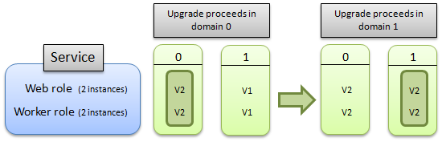

<properties
pageTitle="如何更新云服务 | Azure"
description="了解如何在 Azure 中更新云服务。了解如何云服务上进行更新以确保可用性。"
services="cloud-services"
documentationCenter=""
authors="Thraka"
manager="timlt"
editor=""/>
<tags
ms.service="cloud-services"
ms.workload="tbd"
ms.tgt_pltfrm="na"
ms.devlang="na"
ms.topic="article"
ms.date="11/14/2016"
wacn.date="12/26/2016"
ms.author="adegeo"/>

# 如何更新云服务

## 概述
从较高的层面讲，更新云服务（包括其角色和来宾 OS）是包括三个步骤的过程。首先，必须上载新云服务或 OS 版本的二进制文件和配置文件。其次，Azure 根据新云服务版本的要求，保留云服务的计算资源和网络资源。最后，Azure 执行滚动升级，以增量方式将租户更新到新版本或来宾 OS，同时保留可用性。本文介绍最后一个步骤 - 滚动升级的详细信息。

## 更新 Azure 服务

Azure 将角色实例划分为称为升级域 (UD) 的逻辑组。升级域 (UD) 是角色实例的逻辑集，将以组方式进行更新。Azure 每次更新云服务的一个 UD，使其他 UD 中的实例能够继续处理流量。

升级域的默认数量为 5 个。可以在服务定义文件 (.csdef) 中包含 upgradeDomainCount 属性以指定不同数量的升级域。有关 upgradeDomainCount 属性的详细信息，请参阅 [WebRole 架构](https://msdn.microsoft.com/zh-cn/library/azure/gg557553.aspx)或 [WorkerRole 架构](https://msdn.microsoft.com/zh-cn/library/azure/gg557552.aspx)。

在为服务中的一个或多个角色执行就地更新时，Azure 根据所属的升级域更新角色实例集。Azure 更新给定升级域中的所有实例（停止、更新并将它们重新联机），然后移到下一个升级域。通过仅停止在当前升级域中运行的实例，Azure 确保在执行更新时将对正在运行服务造成的影响降到最低。有关详细信息，请参阅本文后面的[如何进行更新](#howanupgradeproceeds)。

> [AZURE.NOTE] 虽然**更新**和**升级**术语在 Azure 上下文中的含义略有不同，但在本文档中的功能过程和描述中可以互换使用。

服务至少必须定义角色的两个实例，以便就地更新该角色而无需停机。如果服务仅包含一个角色的一个实例，则只有在完成就地更新后才能使用服务。

本主题包含有关 Azure 更新的以下信息：

-   [在更新期间允许进行的服务更改](#AllowedChanges)
-   [如何进行升级](#howanupgradeproceeds)
-   [更新回滚](#RollbackofanUpdate)
-   [在进行的部署上启动多个变动操作](#multiplemutatingoperations)
-   [在升级域之间分配角色](#distributiondfroles)

##  在更新期间允许进行的服务更改
下表显示了在更新期间允许进行的服务更改：

|允许对托管、服务和角色进行的更改|就地更新|过渡（VIP 交换）|删除并重新部署|
|---|---|---|---|
|操作系统版本|是|是|是
|.NET 信任级别|是|是|是|
|虚拟机大小1|是2|是|是|
|本地存储设置|仅限增大2|是|是|
|在服务中添加或删除角色|是|是|是|
|特定角色的实例数|是|是|是|
|服务的终结点数量或类型|是2|否|是|
|配置设置的名称和值|是|是|是|
|配置设置的值（但不包括名称）|是|是|是|
|添加新证书|是|是|是|
|更改现有证书|是|是|是|
|部署新代码|是|是|是|
1大小更改限制为可用于云服务的大小的子集。

2需要 Azure SDK 1.5 或更高版本。

> [AZURE.WARNING] 更改虚拟机大小将会损坏本地数据。

在更新期间，不支持以下操作：

-   更改角色的名称。删除角色，然后使用新名称添加角色。
-   更改升级域计数。
-   减小本地资源的大小。

如果对服务定义进行其他更新（如减小本地资源的大小），则必须执行 VIP 交换更新。有关详细信息，请参阅[交换部署](https://msdn.microsoft.com/zh-cn/library/azure/ee460814.aspx)。

##  如何进行升级
可以决定是要更新服务中的所有角色还是单个角色。在这两种情况下，将停止要进行升级并属于第一个升级域的每个角色的所有实例，进行升级，然后恢复联机。在这些实例恢复联机后，将停止第二个升级域中的实例，进行升级，然后恢复联机。云服务一次最多只能有一个活动升级。始终针对最新版本的云服务执行升级。

下图说明了在升级服务中的所有角色时如何进行升级：

下图说明了在仅升级一个角色时如何进行更新：

在自动更新期间，Azure 结构控制器会定期评估云服务的运行状况，以判断何时可以安全进行下一次 UD。此运行状况评估基于每个角色执行，并且只考虑最新版本中的实例（即 UD 中已步进的实例）。它验证每个角色的最小数量的角色实例是否已达到令人满意的终止状态。

### 角色实例启动超时
结构控制器等待 30 分钟，让每个角色实例达到启动状态。超时期限已过后，结构控制器将继续步进到下一个角色实例。

### 云服务升级期间对驱动器数据的影响

在将服务从单个实例升级到多个实例时，由于 Azure 升级服务的方式，将在执行升级时停止服务。保证服务可用性的服务级别协议仅适用于部署具有多个实例的服务。以下列表描述了每种 Azure 服务升级方案如何影响每个驱动器上的数据：

|方案|C 驱动器|D 驱动器|E 驱动器|
|--------|-------|-------|-------|
|VM 重启|已保留|已保留|已保留|
|门户重启|已保留|已保留|已破坏|
|门户重置映像|已保留|已破坏|已破坏|
|就地升级|已保留|已保留|已破坏|
|节点迁移|已破坏|已破坏|已破坏|

请注意，在上面的列表中，E: 驱动器表示角色的根驱动器，而不应进行硬编码。应改用 **%RoleRoot%** 环境变量表示该驱动器。

要在升级单实例服务时最大限度减少停机时间，请将新的多实例服务部署到过渡服务器中并执行 VIP 交换。

## 更新回滚
在 Azure 结构控制器接受初始更新请求后，Azure 允许对服务启动额外操作，从而在更新期间提供管理服务方面的灵活性。只有在更新（配置更改）或升级在部署上处于**进行中**状态时，才能执行回滚。只要至少有一个服务实例尚未更新到新版本，就认为更新或升级处于进行中状态。要测试是否允许回滚，请检查“获取部署”和“获取云服务属性”操作返回的 RollbackAllowed 标志值是否设置为 true。

> [AZURE.NOTE] 这仅对在**就地**更新或升级上调用 Rollback 有意义，因为 VIP 交换升级涉及将服务的一个完整运行实例替换为另一个实例。

回滚进行中的更新将对部署产生以下影响：

-   不会更新或升级尚未更新或升级到新版本的任何角色实例，因为这些实例已在运行服务的目标版本。
-   对于已更新或升级到新版本的服务包 (*.cscfg) 文件和/或服务配置 (*.cspkg) 文件（或两个文件）的任何角色实例，将恢复为这些文件的升级前版本。

此功能通过下列功能提供：

-   “回滚更新或升级”操作；只要服务中至少有一个实例尚未更新为新版本，就可以在配置更新上调用该操作（通过调用“更改部署配置”触发），或者在升级上调用该操作（通过调用“升级部署”触发）。
-   Locked 和 RollbackAllowed 元素；这是作为“获取部署”和“获取云服务属性”操作响应正文的一部分返回的：
    1.  Locked 元素用于检测何时可以在给定部署上调用变动操作。
    2.  RollbackAllowed 元素用于检测何时可以在给定部署上调用“回滚更新或升级”操作。

    若要执行回滚，不需要检查 Locked 和 RollbackAllowed 元素。只需确认 RollbackAllowed 设置为 true 即可。只有在使用设置为“x-ms-version: 2011-10-01”或更高版本的请求标头调用这些方法时，才会返回这些元素。有关版本控制标头的详细信息，请参阅[服务管理版本控制](https://msdn.microsoft.com/zh-cn/library/azure/gg592580.aspx)。

在某些情况下，不支持回滚更新或升级，这些情况包括：

-   本地资源减少 - 如果更新增加了角色的本地资源，则 Azure 平台不允许进行回滚。
-   配额限制 - 如果更新减少了操作，则可能没有足够的计算配额来完成回滚操作。每个 Azure 订阅都具有与其关联的配额，指定属于该订阅的所有托管服务可以使用的最大核心数。如果执行给定更新的回滚操作导致订阅超过配额，则不会启用回滚。
-   争用情况 - 如果初始更新已完成，则无法进行回滚。

回滚更新可能是非常有用的，其中的一个例子是，在手动模式下使用“升级部署”操作控制为你的 Azure 托管服务部署主要就地升级的速度。

在升级部署期间，你可以在手动模式下调用“升级部署”并开始依次更新升级域。在监视升级时，如果你在某些时候注意到你检查的第一批升级域中的某些角色实例停止响应，你可以在部署上调用“回滚更新或升级”操作，这会将尚未升级的实例保持不变，并将已升级的实例回滚到以前的服务包和配置。

##  在进行的部署上启动多个变动操作
在某些情况下，可能需要在进行的部署上启动多个同时变动操作。例如，可以执行服务更新，并在整个服务中部署更新的同时希望进行一些更改，如回滚更新，应用不同的更新，甚至删除部署。如果服务升级包含可导致升级的角色实例重复崩溃的错误代码，则这种情况可能需要执行此操作。在这种情况下，Azure 结构控制器无法继续应用该升级，因为升级域中的正常实例数不足。这种状态称为*卡住的部署*。可以回滚更新或应用全新的更新以覆盖失败的更新，从而纠正卡住的部署状态。

在 Azure 结构控制器收到更新或升级服务的初始请求后，可以启动后续的变动操作。也就是说，不必等待初始操作完成，即可启动其他变动操作。

在进行第一个更新的同时，启动第二个更新操作将以类似回滚操作的方式执行。如果第二个更新在自动模式下执行，将立即升级第一个升级域，这可能会导致多个升级域中的实例在同一时刻处于离线状态。

变动操作如下：“更改部署配置”、“升级部署”、“更新部署状态”、“删除部署”和“回滚更新或升级”。

“获取部署”和“获取云服务属性”这两个操作返回 Locked 标志，可以检查该标志以确定是否可以在给定部署上调用变动操作。

若要调用返回 Locked 标志的这些方法版本，必须将请求标头设置为“x-ms-version: 2011-10-01”或更高版本。有关版本控制标头的详细信息，请参阅[服务管理版本控制](https://msdn.microsoft.com/zh-cn/library/azure/gg592580.aspx)。

##  在升级域之间分配角色
Azure 在一定数量的升级域之间均匀分配角色实例，可以将升级域数配置为服务定义 (.csdef) 文件的一部分。升级域的最大数量为 20 个，默认值为 5 个。有关如何修改服务定义文件的详细信息，请参阅 [Azure 服务定义架构（.csdef 文件）](/documentation/articles/cloud-services-model-and-package/#csdef)。

例如，如果角色具有 10 个实例，则每个升级域默认包含两个实例。如果角色具有 14 个实例，则四个升级域分别包含 3 个实例，第五个域包含 2 个实例。

使用从零开始的索引标识升级域：第一个升级域的 ID 为 0，第二个升级域的 ID 为 1，依此类推。

下图说明了在服务定义两个升级域时如何分配包含两个角色的服务。该服务正在运行 8 个 Web 角色实例和 9 个辅助角色实例。

> [AZURE.NOTE] 请注意，Azure 控制如何在升级域之间分配实例。无法指定将哪些实例分配给哪个域。

## 后续步骤
- [如何管理云服务](/documentation/articles/cloud-services-how-to-manage/)
- [如何监视云服务](/documentation/articles/cloud-services-how-to-monitor/)
- [如何配置云服务](/documentation/articles/cloud-services-how-to-configure/)

<!---HONumber=Mooncake_Quality_Review_1215_2016-->