<properties 
	pageTitle="中国区 Azure 应用程序开发说明"
	description="本文主要介绍中国区 Azure 与国际版 Azure 应用程序开发上的区别" 
	metaKeywords="中国区 Azure, 开发说明, 境外 Azure, Visual Studio, 资源端点URI, 指南, 云服务, Active Directory, 服务总线, Azure PowerShell, Azure CLI, Azure SDK"
	metaCanonical="" 
	services="" 
	documentationCenter="develop"  
	authors="" 
	solutions="" 
	manager="TK" 
	editor=""/>

<tags 
    ms.service="multiple" 
    ms.date="" 
    wacn.date="04/28/2017"/>

# 中国区 Azure 应用程序开发说明

##文档简介

微软公司为其在境外由微软运营的 Azure 服务（以下简称为 “境外 Azure”），创建和部署云应用程序，提供了相应工具。

在中国，由世纪互联运营的 Microsoft Azure （以下简称为 “中国区 Azure”）是独立的服务平台，由世纪互联公司提供并运营，其数据中心位于中国大陆（不包括香港特别行政区、澳门特别行政区和中国台湾地区）。因此，创建和部署应用程序时，开发人员需先了解中国区 Azure 和境外 Azure 的主要区别，然后再设置编程环境，编写应用程序，部署在中国托管的服务。

本文档概述了这两种服务的区别，并为中国 [Azure 门户](https://www.azure.cn)提供补充信息。同时，官方信息也会通过多个途径发布，例如 Azure [海报](http://www.microsoft.com/zh-cn/download/details.aspx?id=35473)以及博客。本文目标读者为在中国部署、托管数据中心的合作伙伴及开发人员。

有关中国区 Azure 服务功能的更新，请访问中国 [Azure 门户](https://www.azure.cn)。有关当前 Azure 内容信息，请参阅本文档[附录](#appendix)。 
 
##开发人员指南

目前微软公司提供的大部分英文技术文档中，应用程序都针对境外 Azure 开发，而非中国区 Azure，因此开发人员必须了解两者主要区别：

首先，两者存在功能差异，境外 Azure 的某些功能在中国不可用。

其次，中国区 Azure 与境外 Azure 的服务功能存在操作差异，因此使用为境外 Azure 编写的英文文档时，开发人员应该根据需要，自定义示例代码和步骤。

##中国数据中心

目前，中国区 Azure 有两个数据中心，在位置字段中显示为“中国北部”和“中国东部”。

##在 Azure 上创建应用程序的区别

在中国区 Azure 上开发应用程序与在境外 Azure 上开发的主要区别在于，中国区 Azure 端点地址有不同的 URI。 例如，Azure 和 SQL 数据库 URI 通常以 windows.net 结尾。 URI 端点不同时，开发人员必须能够识别，然后配置所需的工具和应用程序，并使用适合的 URI。

##设置开发计算机

Visual Studio 2015 支持在中国区 Azure 上开发，使用 Visual Studio 2015 update 3。[Downloads | Visual Studio Official Site](https://www.visualstudio.com/downloads/)

### 使用 Visual Studio 2015，连接中国区 Azure

步骤如下：

1. 请使用以下注册表文件： 
	
		
	Azure.reg

			Windows Registry Editor Version 5.00

			[HKEY_CURRENT_USER\Software\Microsoft\VSCommon\ConnectedUser]
			"AadInstance"="https://login.chinacloudapi.cn/"
			"adaluri"="https://management.core.chinacloudapi.cn"
			"AzureRMEndpoint"="https://management.chinacloudapi.cn"
			"AzureRMAudienceEndpoint"="https://management.core.chinacloudapi.cn"
			"EnableAzureRMIdentity"="true"
			"GraphUrl"="graph.chinacloudapi.cn"
	

	若要将 Reg 值返回境外 Azure，请使用此处的注册表文件：

	TargetProduction.reg
			
			Windows Registry Editor Version 5.00

			[HKEY_CURRENT_USER\Software\Microsoft\VSCommon\ConnectedUser]
			"Uri"=-
			"AadInstance"=-
			"adaluri"=-
			"AzureRMEndpoint"=-
			"AzureRMAudienceEndpoint"=-
			"EnableAzureRMIdentity"=-
			"GraphUrl"=-
			"AadApplicationTenant"=-

			[HKEY_CURRENT_USER\SOFTWARE\Microsoft\VisualStudio\14.0\MicrosoftAzureServices]
			"Resource Management Audience Endpoint"=-
			"Service Management Endpoint"=-

2. 双击 Azure.reg 文件，同意弹出信息，允许注册表值更改；

3. 注册表值更改后，Visual Studio 的登录信息连接到中国区 Azure 服务。

### 使用 Visual Studio 2017，连接中国区 Azure

[Visual Studio 2017](https://www.visualstudio.com/) 刚刚发布，我们引入了新的方式来连接到中国区 Azure 服务。步骤如下：

新建一个 JSON 文件 **AadProvider.Configuration.json**，文件内容如下：

		{
		"AuthenticationQueryParameters": null,
		"AsmEndPoint": "https://management.core.chinacloudapi.cn",
		"Authority": "https://login.chinacloudapi.cn/",
		"AzureResourceManagementEndpoint": "https://management.chinacloudapi.cn/",
		"AzureResourceManagementAudienceEndpoints": [ "https://management.core.chinacloudapi.cn/" ],
		"ClientIdentifier": "872cd9fa-d31f-45e0-9eab-6e460a02d1f1",
		"EnvironmentName": "Mooncake",
		"GraphEndpoint": "https://graph.chinacloudapi.cn",
		"MsaHomeTenantId": "f577cd82-810c-43f9-a1f6-0cc532871050",
		"NativeClientRedirect": "urn:ietf:wg:oauth:2.0:oob",
		"PortalEndpoint": "http://manage.windowsazure.cn",
		"ResourceEndpoint": "https://management.core.chinacloudapi.cn/",
		"ValidateAuthority": true,
		"VisualStudioOnlineEndpoint": "https://app.vssps.visualstudio.com/",
		"VisualStudioOnlineAudience": "499b84ac-1321-427f-aa17-267ca6975798"
		}

- **连接到中国区 Azure 服务**

	1.	确保已登出并关闭 Visual Studio。
	2.	删除 **%temp%\servicehub** 文件夹（详细路径为 **C:\Users\%USERPROFILE%\AppData\Local\Temp\servicehub**）。
	3.	把前面新建的 JSON 文件 (**AadProvider.Configuration.json**) 拷贝到 **%localappdata%\\.IdentityService\AadConfigurations**（详细路径为 **C:\Users\%USERPROFILE%\AppData\Local\\.IdentityService\AadConfigurations**, **AadConfigurations** 文件夹可能不存在，需要手动创建）。
	4.	重启 VS 并添加中国 Azure 账户即可。

- **切换回 Global Azure**

	1.	确保已登出并关闭 Visual Studio。
	2.	删除文件夹 **%localappdata%\\.IdentityService\AadConfigurations**
	3.	重启 VS 即可连接 Global Azure。

##实用场景示例

###云浏览器

1. 按照说明输入认证信息；

	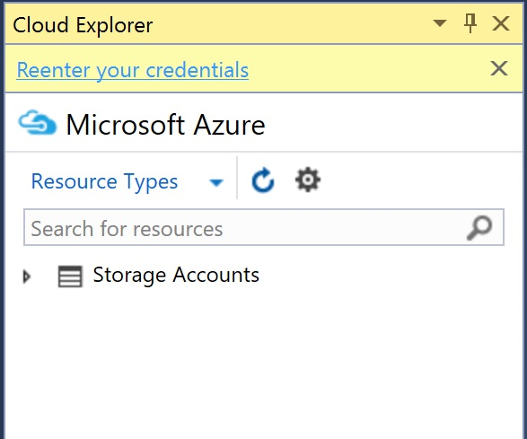

2. 输入登录信息；

	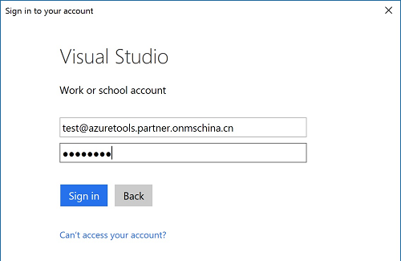

3. 从 Cloud Explorer 查看中国区 Azure 订阅中的资源。

	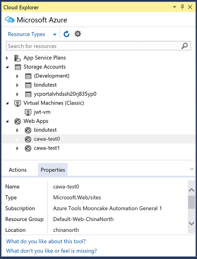

###发布 Web 应用程序

1. 单机右键菜单，选择 “发布” 对话框；

      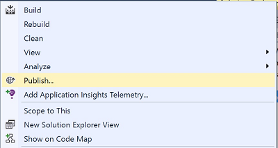

2. 选择 Microsoft Azure App Service；

	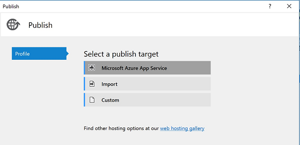

3. 从帐户选择器中选择 Azure 帐户；

	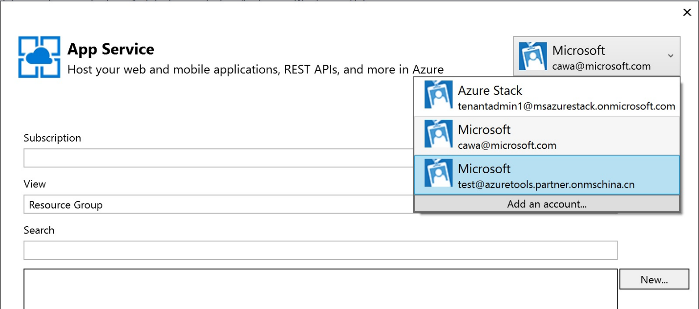
	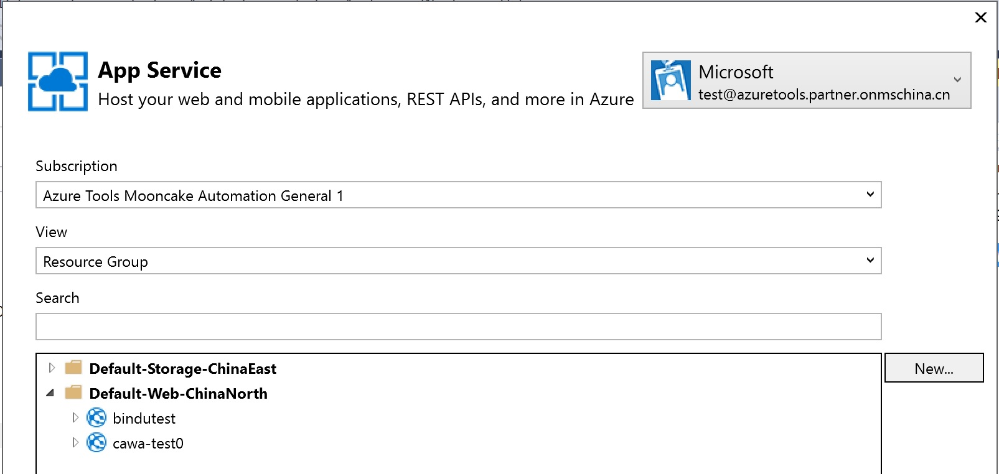
	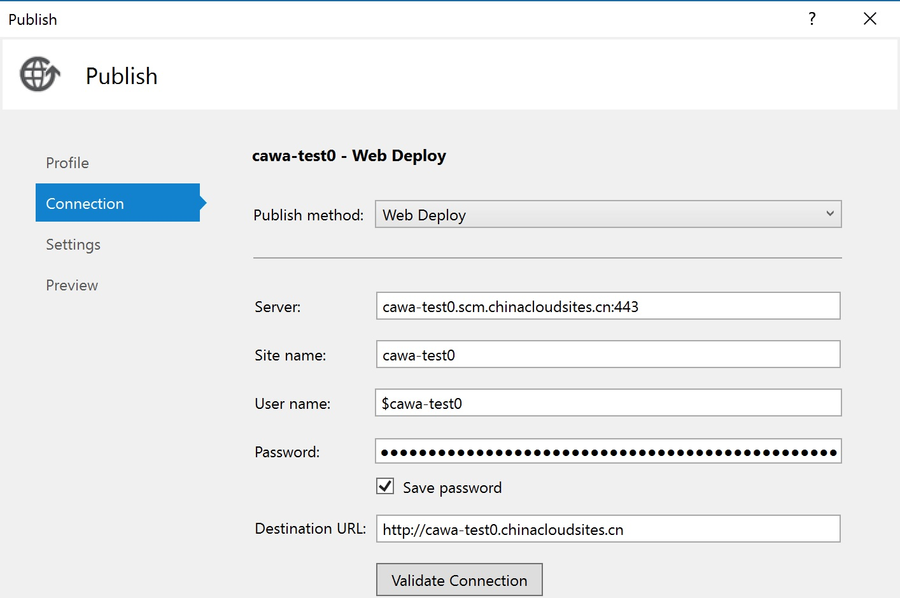

###Azure 资源管理器工具
1. 单机右键菜单，选择 “部署” 对话框；

	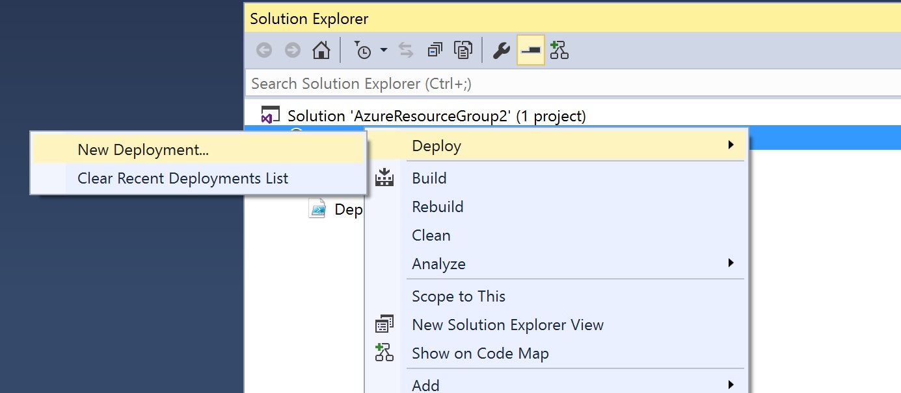

2. 从帐户选择器中选择 Azure 帐户；

	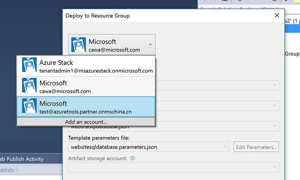

3. 对于在资源模板中出现、但中国区 Azure 不支持的资源，该界面会发出警告；

	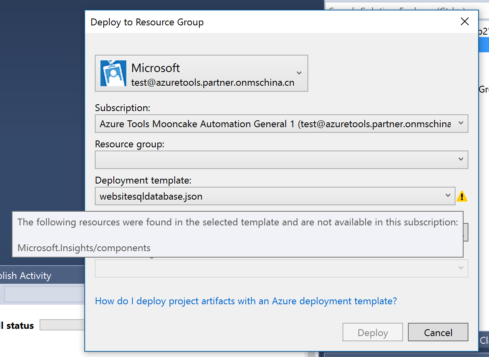

4. 编辑模板参数，继续部署。

其他功能的步骤与此类似。

##中国区 Azure 资源端点URI (供应用程序代码使用)

中国区 Azure 的 URI 与境外 Azure 的 URI 存在差异。 用户需确保，在应用程序代码和配置文件使用适当字符串的前提下，再与中国区 Azure 端点连接。 请注意，如果 Visual Studio 连接到中国区 Azure 订阅，Visual Studio 生成的连接字符串会自动使用中国区 Azure URI，连接每个资源。

###端点映射

下表指导用户将境外 Azure 资源端点映射到中国特定端点。
 

服务类型|在境外由微软运营的 Microsoft Azure URI|由世纪互联运营的 Microsoft Azure URI
:--|:--|:--
Azure - 常规 | *.windows.net | *.chinacloudapi.cn
Azure - 计算 | *.cloudapp.net | *.chinacloudapp.cn  
Azure - Service Fabric Cluster | *.cloudapp.azure.com | *.cloudapp.chinacloudapi.cn
Azure - 存储 | 
\*.blob.core.windows.net 
 
\*.queue.core.windows.net 
 
\*.table.core.windows.net
 | 
*.blob.core.chinacloudapi.cn 

 *.queue.core.chinacloudapi.cn 

 *.table.core.chinacloudapi.cn

Azure - 服务管理 | https://management.core.windows.net | https://management.core.chinacloudapi.cn
Azure - 资源管理器 (ARM) | https://management.azure.com | https://management.chinacloudapi.cn
SQL 数据库 | *.database.windows.net | *.database.chinacloudapi.cn
Azure - 管理门户 | 
http://manage.windowsazure.com

https://portal.azure.com
 | 
https://manage.windowsazure.cn

https://portal.azure.cn

SQL Azure 数据库管理 API | https://management.database.windows.net | https://management.database.chinacloudapi.cn
服务总线 | *.servicebus.windows.net | *.servicebus.chinacloudapi.cn
ACS | *.accesscontrol.windows.net | *.accesscontrol.chinacloudapi.cn
HDInsight | *.azurehdinsight.net | *.azurehdinsight.cn
MySQL Paas | - | *.mysqldb.chinacloudapi.cn
Azure PowerShell Login (Classic, 旧的 Azure 服务管理) | Add-AzureAccount | Add-AzureAccount -Environment AzureChinaCloud
Azure PowerShell Login (Azure 资源管理) | Add-AzureRmAccount | Add-AzureRmAccount -EnvironmentName AzureChinaCloud
AAD | *.onmicrosoft.com | *.partner.onmschina.cn
AAD PowerShell Login | Connect-msolservice| Connect-msolservice -AzureEnvironment AzureChinaCloud
AAD Login | https://login.windows.net| https://login.chinacloudapi.cn
AAD Graph API | https://graph.windows.net| https://graph.chinacloudapi.cn
Azure 认知服务 | https://api.projectoxford.ai/face/v1.0 | https://api.cognitive.azure.cn/face/v1.0
SQL 数据库导入/导出服务映射端点 | | 
1. 中国东部：[https://sh1prod-dacsvc.chinacloudapp.cn/dacwebservice.svc](https://sh1prod-dacsvc.chinacloudapp.cn/dacwebservice.svc) 

 2. 中国北部：[https://bj1prod-dacsvc.chinacloudapp.cn/dacwebservice.svc](https://bj1prod-dacsvc.chinacloudapp.cn/dacwebservice.svc)

Power BI Embedded | https://api.powerbi.com | https://api.powerbi.cn
Power BI Embedded | https://embedded.powerbi.com | https://embedded.powerbi.cn
O365 | https://login.microsoftonline.com | https://login.partner.microsoftonline.cn
Device Login | https://aka.ms/devicelogin | https://aka.ms/deviceloginchina 或者 https://login.chinacloudapi.cn/common/oauth2/deviceauth
Documentdb | documents.azure.com | documents.azure.cn

###存储端点

开发人员必须使用自定义存储端点。 默认设置指向 `*.core.windows.net`，其中 * 随着用户应用程序和存储位置的不同而不同。

例如，在 Cloud Services 应用程序的服务配置文件（.cscfg）中，设置自定义数据连接字符串，指向中国区 Azure 的 blob，队列和表存储 URI。 以下代码为自定义端点的示例，其中 `<AccountKey>` 变量必须由特定的存储帐户键替换。 字符串 mystorageaccount 是在订阅下创建的存储帐户示例。

	<Setting name="DataConnectionString" 
	value="BlobEndpoint=https://mystorageaccount.blob.core.chinacloudapi.cn/;QueueEndpoint=https://mystorageaccount.queue.core.chinacloudapi.cn/;TableEndpoint=https://mystorageaccount.table.core.chinacloudapi.cn/;AccountName=mystorageaccount;AccountKey=<AccountKey> " />

###在 Visual Studio 中创建自定义端点

用户可通过 Azure 云服务应用程序，为连接字符串创建自定义端点：

1.	打开含一个或多个角色的 Azure 解决方案；
2.	右键单击 Solution Explorer 中的任意角色，弹出该角色的配置；
3.	单击 Settings；
4.	单击 Add Setting；
5.	为设置键入名称；
6.	选择连接字符串的类型；
7.	单击…弹出 Storage Account Connection String 对话框；
8.	选择 Enter storage account credentials；
9.	输入正确的存储帐户名和密钥；
10.	选择 Use custom endpoints，然后为 blob、表和队列端点输入正确的 https 字符串；
11.	单击 OK。

Visual Studio 在服务配置文件中创建自定义存储端点，开发人员可以从角色代码中使用此存储端点。

以下代码通过使用为中国区 Azure 特定的自定义 URL，以编程方式连接到存储帐户。

	CloudStorageAccount Account = new CloudStorageAccount( 
	new StorageCredentialsAccountAndKey(ACCOUNTNAME, ACCOUNTKEY), 
	new Uri("http://ACCOUNTNAME.blob.core.chinacloudapi.cn/"), 
	new Uri("http://ACCOUNTNAME.queue.core.chinacloudapi.cn/"), 
	new Uri("http://ACCOUNTNAME.table.core.chinacloudapi.cn/")
	);
	CloudBlobClient BlobClient = Account.CreateCloudBlobClient(); 

##Azure 云服务应用程序中的端口绑定

端口绑定同样使用以 `.cloudapp.net` 结尾的 DNS 名称。用户必须更改这些名称，指向 `.chinacloudapp.cn`。以下显示了包括端口说明的部分服务定义文件：

	<Sites>
   		<Site name="MySite" physcalDirectory="..\WebSite1">
      		<Bindings>
        		<Binding name="My" endpointName="HttpIn" hostHeader="WebSite1.mysite.Chinacloudapp.cn" /> 
      		</Bindings>
   		</Site>
   		<Site name="Web">
      		<Bindings>
         		<Binding name="HttpIn" endpointName="HttpIn" />
      		</Bindings>
   		</Site>
	</Sites>

##连接 SQL 数据库服务器

SQL 数据库服务器名称将由 `*.database.windows.net` 更改为 `*.database.chinacloudapi.cn`。 所有客户端应用程序或工具都必须使用新名称命名其连接字符串，连接到数据库。 对于未在中国区 Azure 运行的应用程序，可参照 SQL 数据库服务器的值，该值可以是服务定义文件中的 DataConnectionString 值，或 .NET 其它配置文件中的值。 例如：

	<configuration>
  		<connectionStrings>
    		<add name="SQLAzure" connectionString="Server=tcp:yourserver.database.chinacloudapi.cn,1433;
			Database=Test;User ID=login@server;Password=yourPassword;
			Trusted_Connection=False;Encrypt=True;"/>
  		</connectionStrings>
	</configuration>

##Active Directory 和服务总线

###Active Directory

Azure Active Directory（AAD）可以为本地部署和云应用程序提供身份和访问功能。开发人员利用 AAD 功能，可为企业应用程序和软件即服务（SaaS）供应商实现单点登录和单点注销；可通过使用图形 API 查询和管理云目录对象；还可以与本地 Active Directory 整合，将目录数据同步到云端。

中国区 Azure 包含 Azure AD。然而从设计角度讲，仍存在一些影响开发人员体验的差异，以下会展开介绍。

中国区 Azure 是个自定义产品，虽然与境外 Azure 有许多共同特性，但自定义仍会导致以下差异，对开发人员使用 AAD 造成影响：

- 中国区 Azure 不包含访问控制（Access Control）命名空间。要集成应用程序以及与 Azure 身份验证服务同步的目录，需要使用 Azure 中的 Active Directory。在 Azure 经典管理门户中，单击" Active Directory”。
- ACS 管理门户仅适用于服务总线命名空间。
- 除了这些自定义带来的差异，中国区 Azure 中的 Azure AD 设计与境外 Azure 全部一致。
>[AZURE.NOTE]中国区 Azure 在预览期间，其创建的访问控制命名空间既不能操作，也不能访问。 但是，类似的功能可在 Azure 管理门户的 Active Directory 中使用。

###服务总线配置

如果使用共享访问签名（SAS）连接服务总线，只需在项目配置文件中更改端点即可。

如果使用访问控制服务（ACS）连接服务总线，可以采取以下任一选项，将使用服务总线的应用程序重定向到特定端点：

* 选项 1：使用环境变量重定向单个或全部应用程序。
* 选项 2：使用 ServiceBus.config 文件重定向单个应用程序。
* 选项 3：使用 ServiceBus.config 文件重定向全部应用程序。

如果 EXE 文件或工作人员角色处于运行状态，任一选项均可用。 如果使用 Web 角色，仅选项 3 可用。

无论选择哪种选项，端点名称都将按照下表进行更改。

<table border="1" cellspacing="0" cellpadding="0">
  <thead>
    <tr>
      <td width="295" valign="top" bgcolor="#D9D9D9"> 服务总线端点 </td>
      <td width="295" valign="top" bgcolor="#D9D9D9"> 等效的中国 Azure 服务总线端点 </td>
    </tr>
  </thead>
  <tbody>
    <tr>
      <td width="295" valign="top"> servicebus.windows.net </td>
      <td width="295" valign="top"> servicebus.chinacloudapi.cn </td>
    </tr>
    <tr>
      <td width="295" valign="top"> accesscontrol.windows.net </td>
      <td width="295" valign="top"> accesscontrol.chinacloudapi.cn </td>
    </tr>
  </tbody>
</table>

####选项1：使用环境变量进行重新定向

1. 考虑变量设置的级别。 对于整个计算机、单个用户或运行单个应用程序的环境，其环境变量设置的含义都不相同。
2. 以适当的级别设置以下环境变量：

		RELAYHOST=servicebus.chinacloudapi.cn
		STSHOST=accesscontrol.chinacloudapi.cn 
		RELAYENV=Custom

>[AZURE.WARNING] 通过 csdef 文件中的 `<environment>` 标记为 Web 角色添加环境变量时，此选项不可用。 Web 角色在 w3wp.exe 的上下文中运行。 环境变量不会传播到 w3wp.exe 环境。 请参阅 Web 角色的选项 3。

####选项 2：使用 ServiceBus.config 文件重定向单个应用程序：

1. 创建如下的 ServiceBus.config 文件，其中包含适当的主机信息。

		<?xml version="1.0" encoding="utf-8"?>
		<configuration>
  			<Microsoft.ServiceBus>
    			<relayHostName>servicebus.chinacloudapi.cn</relayHostName>
    			<stsHostName>accesscontrol.chinacloudapi.cn</stsHostName>    
  			</Microsoft.ServiceBus>
		</configuration>

2. 将 ServiceBus.config 文件与服务总线 / ACS应用程序的 .exe 文件放置在同一目录中。

	此选项不适用于 Azure 云服务 Web 角色，因为它们在 w3wp.exe 的上下文中运行。 因此，系统在 ％Windir％\ System32 \ inetsrv \ 中查找 servicebus.config 文件时，该文件不存在。

####选项 3：使用 ServiceBus.config 文件重定向全部应用程序：

1. 在 .NET Framework 配置目录中查找现有的 ServiceBus.config 文件。 .NET Framework 配置目录取决于 32 位或 64 位的操作系统版本，以及已安装的框架版本，以下为常用位置。

	<table border="1" cellspacing="0" cellpadding="0">
	  <thead>
	    <tr>
	      <td width="199" valign="top" bgcolor="#D9D9D9"> Microsoft .NET Framework 版本 </td>
	      <td width="178" valign="top" bgcolor="#D9D9D9"> 操作系统版本 </td>
	      <td width="188" valign="top" bgcolor="#D9D9D9"> 目录 </td>
	    </tr>
	  </thead>
	  <tbody>
	    <tr>
	      <td width="199" valign="top"> 2.0 至 3.5 </td>
	      <td width="178" valign="top"> 32 位 </td>
	      <td width="188" valign="top"> %Windir%\Microsoft.NET\Framework\v2.0.50727\CONFIG </td>
	    </tr>
	    <tr>
	      <td width="199" valign="top"> 2.0 至 3.5 </td>
	      <td width="178" valign="top"> 64 位 </td>
	      <td width="188" valign="top"> %Windir%\Microsoft.NET\Framework64\v2.0.50727\CONFIG </td>
	    </tr>
	    <tr>
	      <td width="199" valign="top"> 4.0 </td>
	      <td width="178" valign="top"> 32 位 </td>
	      <td width="188" valign="top"> %Windir%\Microsoft.NET\Framework\v4.0.30319\Config </td>
	    </tr>
	    <tr>
	      <td width="199" valign="top"> 4.0 </td>
	      <td width="178" valign="top"> 64 位 </td>
	      <td width="188" valign="top"> %Windir%\Microsoft.NET\Framework64\v4.0.30319\Config </td>
	    </tr>
	  </tbody>
	</table>  

2. 如果目录中存在现有的 ServiceBus.config 文件，必须编辑该文件，添加选项 2（使用 ServiceBus.config 重定向单个应用程序）列出的 XML 配置。 如果该配置添加后，与 ServiceBus.config 文件中的现有信息产生冲突，则不能使用此选项。 必须使用选项 1 或选项 2。

开发人员只有了解角色使用的框架，才能指向特定的框架目录。 但是，以下脚本概括了使用 Web 角色的复制过程。 如果 servicebus.config 文件存在，该脚本会将此文件复制到每个 .NET 目录中。

	@echo off
	pushd .
	cd %windir%\Microsoft.Net\Framework64\
	REM set copylocal=true on servicebus.config so its present in bin dir
	for /f %%i in ('dir /s /b config') do copy /y %~dp0servicebus.config %%~fi
	popd

##使用服务管理 API

通过服务管理 API，开发人员可以对 Azure 中运行的托管服务进行部署管理。 事实上，境外 Azure 和中国区 Azure 的管理门户都使用服务管理 API。  

境外 Azure 编写代码使用的路径为：<a href="https://management.core.windows.net">https://management.core.windows.net</a>。中国区 Azure 编写代码使用的路径为：
  <a href="https://management.core.chinacloudapi.cn">https://management.core.chinacloudapi.cn</a>。
 

##重定将自定义域名定位到中国区 Azure 的托管服务中

如果用户使用的自定义域名被转发到境外 Azure 中运行的托管服务，并将该托管服务移至中国区 Azure，必须更新转发域，指向新的中国特定终端点。

例如，如果要将 www.contoso.com 重定向到运行在 contoso.cloudapp.net 的 web 角色中，那么现在就必须将其重定向到 contoso.chinacloudapp.cn 中。
 

##使用 Azure 诊断

Azure 诊断通过使用开发计算机上的本地存储或中国区 Azure 存储帐户，存储诊断信息。

在* .cscfg 文件中添加以下配置信息：

	<ConfigurationSettings>
  		<Setting name="Microsoft.WindowsAzure.Plugins.Diagnostics.ConnectionString" value="<YourStorageString>" />
	</ConfigurationSettings>

`<YourStorageString>` 的值是个自定义端点，将URI并入中国区 Azure。

##为 HTTPS 端点重新发布证书

使用自定义域名时无需更改证书。

如果任一现有应用程序使用 HTTPS 端点，并将证书绑定到 `https：//*.cloudapp.net`（其中 * 是服务的名称），则必须为`*.chinacloudapp.cn` 重新发布证书。 在中国部署服务时，必须使用这些新证书。

##使用 Azure PowerShell

在 PowerShell 控制台键入以下命令，登录 Azure China Cloud：

- ASM 模式：

		Add-AzureAccount -Environment AzureChinaCloud

- ARM 模式

		Login-AzureRmAccount -EnvironmentName AzureChinaCloud

##使用 Azure CLI

在命令提示符下键入以下命令，登录 Azure China Cloud：

	azure login -e AzureChinaCloud

##为 Node.js 使用 Azure SDK

如果要在中国区 Azure 中使用 SDK，需从管理门户或 CLI 中提供连接字符串。

###存储、服务总线和通知总线
存储、服务总线和通知中心都接受各自的连接字符串，可通过管理门户或使用 CLI 获取该值。

	var tableService = azure.createTableService(storageConn);
	var blobService= azure.createBlobService(storageConn);
	var queueService = azure.createQueueService(storageConn);
	var serviceBusService = azure.createServiceBusService(sbConn);
	var notificationHubService = azure.createNotificationHubService(nhConn);

###SQL 

要管理 SQL 数据库服务器，可以使用此配置：

	var sqlManagementService = azure.createSqlManagementService(subscriptionId, authentication, hostOptions);
 

##附录：Azure 的内容库

以下列出了 Azure 当前可用的所有内容资产，并指明该资产是否专门针对中国区 Azure。

 
<table border="1" cellspacing="0" cellpadding="0">
  <tbody>
    <tr>
      <td width="130" valign="top"><strong>资产</strong></td>
      <td width="180" valign="top"><strong>内容是否专为中国创建</strong></td>
      <td width="794" valign="top"><strong>说明</strong></td>
    </tr>
    <tr>
      <td width="130" valign="top">azure.microsoft.com</td>
      <td width="180" valign="top"> 否 </td>
      <td width="794" valign="top"> 在境外由微软运营的 Microsoft Azure 官网。 </td>
    </tr>
    <tr>
      <td width="130" valign="top"> azure.cn </td>
      <td width="180" valign="top"> 是 </td>
      <td width="794" valign="top"> 由世纪互联运营的 Microsoft Azure 官网 </td>
    </tr>
    <tr>
      <td width="130" valign="top"> 境外客户案例 </td>
      <td width="180" valign="top"> 否 </td>
      <td width="794" valign="top"><a href="http://azure.microsoft.com/zh-cn/case-studies/">http://azure.microsoft.com/zh-cn/case-studies/</a></td>
    </tr>
    <tr>
      <td width="130" valign="top"> 中国客户案例 </td>
      <td width="180" valign="top"> 是 </td>
      <td><a href="/partnerancasestudy/case-studies/">https://www.azure.cn/partnerancasestudy/case-studies/</a></td>
    </tr>
    <tr>
      <td width="130" valign="top"> P&amp;P 丛书 </td>
      <td width="180" valign="top"> 否 </td>
      <td width="794" valign="top"><ul>
          <li><a href="http://www.amazon.cn/%E5%BE%AE%E8%BD%AF%E4%BA%91%E8%AE%A1%E7%AE%97%E7%B3%BB%E5%88%97%E4%B8%9B%E4%B9%A6-%E4%BA%91%E8%BF%81%E7%A7%BB%E6%8A%80%E6%9C%AF-%E8%B4%9D%E8%8C%A8/dp/B00C8JDM10/" target="_blank">微软云计算系列丛书:云迁移技术(第2版)</a></li>
          <li><a href="http://www.amazon.cn/%E6%9E%84%E5%BB%BA%E5%BC%B9%E6%80%A7%E4%BA%91%E5%BA%94%E7%94%A8-Dominic-Betts/dp/B00C8JDGRA/ref=pd_sim_b_2" target="_blank">构建弹性云应用</a></li>
          <li><a href="http://www.amazon.cn/%E4%BA%91%E5%BA%94%E7%94%A8%E5%BC%80%E5%8F%91-Dominic-Betts/dp/B00C8JDO68/ref=sr_1_10?ie=UTF8&amp;qid=1370328786&amp;sr=8-10&amp;keywords=azure" target="_blank">云应用开发(第2版) </a></li>
        </ul></td>
    </tr>
    <tr>
      <td width="130" valign="top"> MVP 的著作 </td>
      <td width="180" valign="top"> 否 </td>
    </tr>
    <tr>
      <td width="130" valign="top"> MSDN 库 </td>
      <td width="180" valign="top"> 是/否 </td>
      <td width="794" valign="top"><a href="https://msdn.microsoft.com/library/azure/">https://msdn.microsoft.com/library/azure/</a></td>
    </tr>
    <tr>
      <td width="130" valign="top"> Azure 团队的博客 </td>
      <td width="180" valign="top"> 是/否 </td>
      <td width="794" valign="top"><a href="http://blogs.msdn.com/b/azchina/">http://blogs.msdn.com/b/azchina/</a></td>
    </tr>
    <tr>
      <td width="130" valign="top"> MSDN Azure 门户 </td>
      <td width="180" valign="top"> 否 </td>
      <td width="794" valign="top"><a href="http://msdn.microsoft.com/zh-cn/ff380142">http://msdn.microsoft.com/zh-cn/ff380142</a></td>
    </tr>
    <tr>
      <td width="130" valign="top"> MSDN 杂志 </td>
      <td width="180" valign="top"> 否 </td>
    </tr>
    <tr>
      <td width="130" valign="top"> 虚拟实验室 </td>
      <td width="180" valign="top"> 否 </td>
    </tr>
    <tr>
      <td width="130" valign="top"> 视频 </td>
      <td width="180" valign="top"> 否 </td>
      <td width="794" valign="top"> 第 9 频道的视频讨论境外服务，与优酷上的中国视频 (<a href="http://www.youku.com/playlist_show/id_19321941.html">http://www.youku.com/playlist_show/id_19321941.html</a>)相同 </td>
    </tr>
    <tr>
      <td width="130" valign="top"> Azure 培训包 </td>
      <td width="180" valign="top"> 否 </td>
      <td width="794" valign="top"> Github 中的本地化培训包用于境外服务 </td>
    </tr>
    <tr>
      <td width="130" valign="top"> MSDN 代码库 </td>
      <td width="180" valign="top"> 否 </td>
      <td width="794" valign="top"><a href="http://code.msdn.microsoft.com/windowsazure/">http://code.msdn.microsoft.com/windowsazure/</a></td>
    </tr>
    <tr>
      <td width="130" valign="top"> Github </td>
      <td width="180" valign="top"> 否 </td>
      <td width="794" valign="top"> 仅在此处托管 azure.cn 的英文内容，不提供本地化内容 </td>
    </tr>
  </tbody>
</table>
 
 

