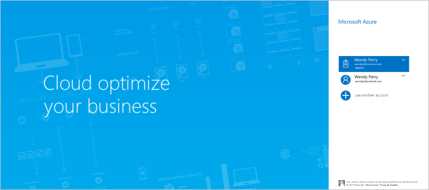
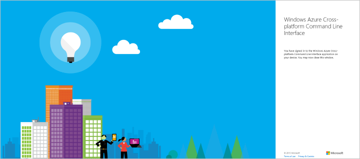

<properties
    pageTitle="DocumentDB 自动化 - 管理区域 | Azure"
    description="使用 Azure CLI 1.0 和 Azure资源管理器管理 DocumentDB 数据库帐户中的区域。 DocumentDB 是用于 JSON 数据的云端 NoSQL 数据库。"
    services="documentdb"
    author="dmakwana"
    manager="jhubbard"
    editor=""
    tags="azure-resource-manager"
    documentationcenter=""
    translationtype="Human Translation" />
    
<tags
    ms.assetid="7f765c17-8549-4108-9475-46394fc3a218"
    ms.service="documentdb"
    ms.workload="data-services"
    ms.tgt_pltfrm="na"
    ms.devlang="na"
    ms.topic="article"
    ms.date="02/17/2017"
    wacn.date="04/17/2017"
    ms.author="dimakwan"
    ms.sourcegitcommit="7cc8d7b9c616d399509cd9dbdd155b0e9a7987a8"
    ms.openlocfilehash="ecc59562005ce7ca5c1d1594b48b55a3b5d3fb9b"
    ms.lasthandoff="04/07/2017" />

# 使用 Azure CLI 1.0 和 Azure 资源管理器模板自动管理 DocumentDB 帐户区域

本文说明了如何使用 Azure CLI 1.0 命令和 Azure 资源管理器模板在 Azure DocumentDB 帐户中添加/删除区域。 也可通过 [Azure 门户预览](/documentation/articles/documentdb-portal-global-replication/)实现区域管理。 请注意，以下教程中的命令不可更改各个区域的故障转移优先级。 只可添加或删除读取区域。 不能添加或删除数据库帐户中的写入区域（故障转移优先级为 0）。

DocumentDB 数据库帐户是目前唯一可以使用 [Azure 资源管理器模板和 Azure CLI 1.0](/documentation/articles/documentdb-automation-resource-manager-cli/) 创建或修改的 DocumentDB 资源。

## 做好准备

必须拥有正确的 Azure CLI 1.0 版本和 Azure 帐户，才能将 Azure CLI 1.0 与 Azure 资源组配合使用。 如果没有 Azure CLI 1.0，[请安装](/documentation/articles/cli-install-nodejs/)。

### 更新 Azure CLI 1.0 版本

在命令提示符处，键入 `azure --version` 即可查看安装的是否为版本 0.10.4 或更高版本。 系统可能会在此步骤提示参与 Azure CLI 1.0 数据收集，此时可以选择 y 或 n 来选择参与或不参与。

    azure --version
    0.10.4 (node: 4.2.4)

如果版本不是 0.10.4 或更高版本，则需要使用某个本机安装程序[安装 Azure CLI 1.0](/documentation/articles/cli-install-nodejs/) 或进行更新，或者通过在 **npm** 中键入 `npm update -g azure-cli` 进行更新或键入 `npm install -g azure-cli` 进行安装。

### 设置 Azure 帐户和订阅

如果还没有 Azure 订阅，可以注册一个[试用版](/pricing/1rmb-trial/)。

需有一个工作或学校帐户或者一个 Microsoft 帐户标识，才能使用 Azure 资源管理模板。 如果你有其中一个帐户，请键入以下命令。

    azure login -e azureChinaCloud

这将生成以下输出： 

    info:    Executing command login
    |info:    To sign in, use a web browser to open the page https://aka.ms/deviceloginchina. 
    Enter the code E1A2B3C4D to authenticate.

> [AZURE.NOTE]
> 如果你没有 Azure 帐户，则会看到一条错误消息，指出你需要不同类型的帐户。 若要从当前 Azure 帐户创建一个帐户，请参阅[在 Azure Active Directory 中创建工作或学校标识](/documentation/articles/virtual-machines-windows-create-aad-work-id/)。

在浏览器中打开 [https://aka.ms/deviceloginchina](https://aka.ms/deviceloginchina) ，然后输入命令输出中提供的代码。

输入代码后，便可选择想要在浏览器中使用的标识，并根据需要提供用户名和密码。

成功登录之后，将会收到下列确认屏幕，接着就能关闭浏览器窗口。

命令行界面还会提供下列输出。

    /info:    Added subscription Visual Studio Ultimate with MSDN
    info:    Setting subscription "Visual Studio Ultimate with MSDN" as default
    +
    info:    login command OK

除了此处所述的交互式登录方法之外，还有一些其他的 Azure CLI 1.0 登录方法可供使用。 有关其他方法的详细信息以及处理多个订阅的相关信息，请参阅[从 Azure 命令行接口 (Azure CLI 1.0) 连接到 Azure 订阅](/documentation/articles/xplat-cli-connect/)。

### 切换到 Azure CLI 1.0 资源组模式

默认情况下，Azure CLI 1.0 以服务管理模式（**asm** 模式）启动。 键入以下内容，切换到资源组模式。

    azure config mode arm

这将提供以下输出：

    info:    Executing command config mode
    info:    New mode is arm
    info:    config mode command OK

如果需要，可以键入 `azure config mode asm`切换回到默认的命令集。

### 创建或检索资源组

若要创建 DocumentDB 帐户，首先需要一个资源组。 如果已知道想要使用的资源组名称，请跳到 [步骤 2](#create-documentdb-account-cli)。 

若要查看列有你当前所有的资源组的列表，请运行下列命令，并记下你想要使用的资源组名称： 

    azure group list

若要创建新的资源组，请运行下列命令，并指定要创建的新资源组的名称，以及要在其中创建资源组的区域： 

    azure group create <resourcegroupname> <resourcegrouplocation>

 - `<resourcegroupname>` 只能使用字母数字字符、句点、下划线、“-”字符和括号，且不能以句点结尾。 
 - `<resourcegrouplocation>` 必须是已正式推出 DocumentDB 的区域之一。 [“Azure 区域”页](https://azure.microsoft.com/regions/#services)提供了当前的区域列表。

输入示例：

    azure group create new_res_group chinanorth

这将生成以下输出：

    info:    Executing command group create
    + Getting resource group new_res_group
    + Creating resource group new_res_group
    info:    Created resource group new_res_group
    data:    Id:                  /subscriptions/xxxxxxxx-xxxx-xxxx-xxxx-xxxxxxxxxxxx/resourceGroups/new_res_group
    data:    Name:                new_res_group
    data:    Location:            chinanorth
    data:    Provisioning State:  Succeeded
    data:    Tags: null
    data:
    info:    group create command OK

如果遇到错误，请参阅 [故障排除](#troubleshooting)。 

## 了解 Azure 资源管理器模板和资源组

大多数应用程序是通过不同资源类型的组合（例如，一个或多个 DocumentDB 帐户、存储帐户、虚拟网络或内容传送网络）构建而成的。 默认 Azure 服务管理 API 和 Azure 门户预览使用基于服务的方法代表这些项。 这种方法需要你单独部署和管理各个服务（或查找其他具备相同功能的工具），而不是当作单个逻辑部署单元。

可以利用 Azure 资源管理器模板将这些不同的资源声明为一个逻辑部署单元，然后进行部署和管理。 请不要以命令方式告知 Azure 逐一部署命令，而应该在 JSON 文件中描述整个部署 - 所有资源及关联的设置以及部署参数 - 然后告诉 Azure 将这些资源视为一个组进行部署。

可在 [Azure资源管理器概述](/documentation/articles/resource-group-overview/)中了解有关 Azure 资源组及其功能的详细信息。 若要了解如何创作模板，请参阅[创作 Azure 资源管理器模板](/documentation/articles/resource-group-authoring-templates/)。

## 任务：将区域添加到 DocumentDB 帐户

DocumentDB 能够跨不同的 [Azure 区域](https://azure.microsoft.com/regions/#services)[全局分发数据][distribute-globally]。 此部分中的说明介绍如何使用 Azure CLI 1.0 和资源管理器模板向现有 DocumentDB 帐户添加读取区域。 可以在 Azure CLI 1.0 中使用或不使用资源管理器模板完成此任务。

### 使用 Azure CLI 1.0 但不使用资源管理器模板将区域添加到 DocumentDB 帐户

在命令提示符处输入下列命令，将区域添加到新的或现有的资源组中的现有 DocumentDB 帐户。 请注意，“位置”数组应反映 DocumentDB 帐户中的当前区域配置，要添加的新区域除外。 以下示例显示的命令可将第二个区域添加到帐户。

使故障转移优先级值与现有配置相符。 其中一个区域的 failoverPriority 值必须为 0，表示此区域将保留为 [DocumentDB 帐户的写入区域][scaling-globally]。 故障转移优先级值在各个位置中必须唯一，最高故障转移优先级值必须小于区域总数。 新区域将是“读取”区域，其故障转移优先级值必须大于 0。

> [AZURE.TIP]
> 如果在 Azure PowerShell 或 Windows PowerShell 中运行此命令，将收到关于意外的令牌的错误。 请改为在 Windows 命令提示符处运行此命令。

    azure resource create -g <resourcegroupname> -n <databaseaccountname> -r "Microsoft.DocumentDB/databaseAccounts" -o 2015-04-08 -l <resourcegrouplocation> -p "{\"databaseAccountOfferType\":\"Standard\",\"ipRangeFilter\":\"<ip-range-filter>\",\"locations\":["{\"locationName\":\"<databaseaccountlocation>\",\"failoverPriority\":\"<failoverPriority1>\"},{\"locationName\":\"<newdatabaseaccountlocation>\",\"failoverPriority\":\"<failoverPriority2>\"}"]}"

 - `<resourcegroupname>` 只能使用字母数字字符、句点、下划线、“-”字符和括号，且不能以句点结尾。
 - `<resourcegrouplocation>` 是当前资源组的区域。
 - `<ip-range-filter>` 指定 IP 地址集合或者 CIDR 格式的 IP 地址范围，以便将这些地址作为指定数据库帐户所允许的客户端 IP 列表。 IP 地址/范围必须以逗号分隔，且不得包含空格。 
 - `<databaseaccountname>` 只能使用小写字母、数字及“-”字符，且长度必须为 3 到 50 个字符。
 - `<databaseaccountlocation>` 必须是已正式推出 DocumentDB 的区域之一。 [Azure 区域页面](https://azure.microsoft.com/regions/#services)提供当前的区域列表。
 - `<newdatabaseaccountlocation>` 是要添加的新区域，必须是已正式推出 DocumentDB 的区域之一。 [“Azure 区域”页](https://azure.microsoft.com/regions/#services)提供了当前的区域列表。

将“中国东部”区域添加为 DocumentDB 帐户中的读取区域的输入示例： 

    azure resource create -g new_res_group -n samplecliacct -r "Microsoft.DocumentDB/databaseAccounts" -o 2015-04-08 -l chinanorth -p "{\"databaseAccountOfferType\":\"Standard\",\"ipRangeFilter\":\"\",\"locations\":["{\"locationName\":\"chinanorth\",\"failoverPriority\":\"0\"},{\"locationName\":\"ChinaEast\",\"failoverPriority\":\"1\"}"]}"

若已预配新的帐户，这将生成以下输出：

    info:    Executing command resource create
    + Getting resource samplecliacct
    + Creating resource samplecliacct
    info:    Resource samplecliacct is updated
    data:
    data:    Id:        /subscriptions/xxxxxxxx-xxxx-xxxx-xxxx-xxxxxxxxxxxx/resourceGroups/new_res_group/providers/Microsoft.DocumentDB/databaseAccounts/samplecliacct
    data:    Name:      samplecliacct
    data:    Type:      Microsoft.DocumentDB/databaseAccounts
    data:    Parent:
    data:    Location:  China North
    data:    Tags:
    data:
    info:    resource create command OK

如果遇到错误，请参阅[故障排除](#troubleshooting)。 

在此命令返回之后，在帐户更改为“联机”状态以准备好可供使用之前，该帐户将会进入“正在创建”状态数分钟的时间。 可以在 [Azure 门户预览](https://portal.azure.cn)中的“DocumentDB 帐户”边栏选项卡上检查帐户的状态。

### 使用 Azure CLI 1.0 且使用资源管理器模板将区域添加到 DocumentDB 帐户

本部分中的说明介绍如何使用 Azure 资源管理器模板和可选参数文件（这两者都是 JSON 文件）将区域添加到现有 DocumentDB 帐户。 使用模板可以准确描述所需的信息，并可重复使用而不会出现任何错误。

使故障转移优先级值与现有配置相符。 其中一个区域的 failoverPriority 值必须为 0，表示此区域将保留为 [DocumentDB 帐户的写入区域][scaling-globally]。 故障转移优先级值在各个位置中必须唯一，最高故障转移优先级值必须小于区域总数。 新区域将是“读取”区域，其故障转移优先级值必须大于 0。

创建本地模板文件，该文件类似于下面与当前的 DocumentDB 区域配置匹配的文件。 “位置”数组应包含数据库帐户中所有现有的区域以及要添加的新区域。 将文件命名为 azuredeploy.json。

    {
        "$schema": "http://schema.management.azure.com/schemas/2015-01-01/deploymentTemplate.json#",
        "contentVersion": "1.0.0.0",
        "parameters": {
            "databaseAccountName": {
                "type": "string"
            },
            "locationName1": {
                "type": "string"
            },
            "locationName2": {
                "type": "string"
            },
            "newLocationName": {
                "type": "string"
            }
        },
        "variables": {},
        "resources": [
            {
                "apiVersion": "2015-04-08",
                "type": "Microsoft.DocumentDb/databaseAccounts",
                "name": "[parameters('databaseAccountName')]",
                "location": "[resourceGroup().location]",
                "properties": {
                    "databaseAccountOfferType": "Standard",
                    "ipRangeFilter": "",
                    "locations": [
                        {
                            "failoverPriority": 0,
                            "locationName": "[parameters('locationName1')]"
                        },
                        {
                            "failoverPriority": 1,
                            "locationName": "[parameters('locationName2')]"
                        },
                        {
                            "failoverPriority": 2,
                            "locationName": "[parameters('newLocationName')]"
                        }
                    ]
                }
            }
        ]
    }

上面的模板文件演示了一个示例，介绍如何将新区域添加到已经有 2 个区域的 DocumentDB 帐户。

可以在命令行中输入参数值，也可以创建参数文件来指定值。

若要创建参数文件，请将下列内容复制到新文件中，然后将文件命名为 azuredeploy.parameters.json。 如果计划在命令提示符处指定数据库帐户名称，就可以继续操作而不需创建此文件。

    {
        "$schema": "http://schema.management.azure.com/schemas/2015-01-01/deploymentParameters.json#",
        "contentVersion": "1.0.0.0",
        "parameters": {
            "databaseAccountName": {
                "value": "samplearmacct"
            },
            "locationName1": {
                "value": "chinanorth"
            },
            "locationName2": {
                "value": "ChinaEast"
            },
            "newLocationName": {
                "value": "northeurope"
            }
        }
    }

在 azuredeploy.parameters.json 文件中，将 `"databaseAccountName"` 的值字段更新为要使用的数据库名称，然后保存该文件。 `"databaseAccountName"` 只能使用小写字母、数字及“-”字符，且长度必须为 3 到 50 个字符。 将 `"locationName1"` 和 `"locationName2"` 值字段更新为 DocumentDB 帐户所在的区域。 将 `"newLocationName"` 值字段更新为要添加的区域。

若要在资源组中创建 DocumentDB 帐户，请运行下列命令，并提供模板文件的路径、参数文件的路径或参数值、要部署于其中的资源组名称，以及部署名称（-n 可选）。 

若要使用参数文件：

    azure group deployment create -f <PathToTemplate> -e <PathToParameterFile> -g <resourcegroupname> -n <deploymentname>

 - `<PathToTemplate>` 是步骤 1 中创建的 azuredeploy.json 文件的路径。 如果路径名称含有空格，请使用双引号括住此参数。
 - `<PathToParameterFile>` 是步骤 1 中创建的 azuredeploy.parameters.json 文件的路径。 如果路径名称含有空格，请使用双引号括住此参数。
 - `<resourcegroupname>` 是要在其中添加 DocumentDB 数据库帐户的现有资源组的名称。 
 - `<deploymentname>` 是部署的可选名称。

输入示例： 

    azure group deployment create -f azuredeploy.json -e azuredeploy.parameters.json -g new_res_group -n azuredeploy

或者，若要指定数据库帐户名称参数而不使用参数文件，并且改为让系统提示输入值，请运行下列命令：

    azure group deployment create -f <PathToTemplate> -g <resourcegroupname> -n <deploymentname>

输入示例，其中显示提示以及名为 samplearmacct 的数据库帐户条目：

    azure group deployment create -f azuredeploy.json -g new_res_group -n azuredeploy
    info:    Executing command group deployment create
    info:    Supply values for the following parameters
    databaseAccountName: samplearmacct

预配帐户时，你将收到下列信息： 

    info:    Executing command group deployment create
    + Initializing template configurations and parameters
    + Creating a deployment
    info:    Created template deployment "azuredeploy"
    + Waiting for deployment to complete
    + 
    + 
    info:    Resource 'new_res_group' of type 'Microsoft.DocumentDb/databaseAccounts' provisioning status is Running
    + 
    info:    Resource 'new_res_group' of type 'Microsoft.DocumentDb/databaseAccounts' provisioning status is Succeeded
    data:    DeploymentName     : azuredeploy
    data:    ResourceGroupName  : new_res_group
    data:    ProvisioningState  : Succeeded
    data:    Timestamp          : 2015-11-30T18:50:23.6300288Z
    data:    Mode               : Incremental
    data:    CorrelationId      : 4a5d4049-c494-4053-bad4-cc804d454700
    data:    DeploymentParameters :
    data:    Name                 Type    Value
    data:    -------------------  ------  ------------------
    data:    locationName1        String  chinanorth
    data:    locationName2        String  ChinaEast
    data:    newLocationName      String  ChinaEast
    data:    databaseAccountName  String  samplearmacct
    info:    group deployment create command OK

如果遇到错误，请参阅[故障排除](#troubleshooting)。  

在此命令返回之后，在帐户更改为“联机”状态以准备好可供使用之前，该帐户将会进入“正在创建”状态数分钟的时间。 可以在 [Azure 门户预览](https://portal.azure.cn)中的“DocumentDB 帐户”边栏选项卡上检查帐户的状态。

## 任务：将区域从 DocumentDB 帐户中删除

DocumentDB 能够跨不同的 [Azure 区域](https://azure.microsoft.com/regions/#services)[全局分发数据][distribute-globally]。 本部分中的说明介绍了如何使用 Azure CLI 1.0 和 资源管理器模板删除现有 DocumentDB 帐户中的某个区域。 可以在 Azure CLI 1.0 中使用或不使用资源管理器模板完成此任务。

###  使用 Azure CLI 1.0 但不使用资源管理器模板将区域从 DocumentDB 帐户中删除

若要删除现有 DocumentDB 帐户中的某个区域，可以使用 Azure CLI 1.0 执行以下命令。 “位置”数组应只包含删除该区域后帐户中所保留的区域。 **省略的位置将从 DocumentDB 帐户中删除**。 在命令提示符中输入以下命令。

其中一个区域的 failoverPriority 值必须为 0，表示此区域将保留为 [DocumentDB 帐户的写入区域][scaling-globally]。 故障转移优先级值在各个位置中必须唯一，最高故障转移优先级值必须小于区域总数。 

> [AZURE.TIP]
> 如果在 Azure PowerShell 或 Windows PowerShell 中运行此命令，将收到关于意外的令牌的错误。 请改为在 Windows 命令提示符处运行此命令。

    azure resource create -g <resourcegroupname> -n <databaseaccountname> -r "Microsoft.DocumentDB/databaseAccounts" -o 2015-04-08 -l <resourcegrouplocation> -p "{\"databaseAccountOfferType\":\"Standard\",\"ipRangeFilter\":\"<ip-range-filter>\",\"locations\":["{\"locationName\":\"<databaseaccountlocation>\",\"failoverPriority\":\"<failoverPriority>\"}"]}"

 - `<resourcegroupname>` 只能使用字母数字字符、句点、下划线、“-”字符和括号，且不能以句点结尾。
 - `<resourcegrouplocation>` 是当前资源组的区域。
 - `<ip-range-filter>` 指定 IP 地址集合或者 CIDR 格式的 IP 地址范围，以便将这些地址作为指定数据库帐户所允许的客户端 IP 列表。 IP 地址/范围必须以逗号分隔，且不得包含空格。 
 - `<databaseaccountname>` 只能使用小写字母、数字及“-”字符，且长度必须为 3 到 50 个字符。
 - `<databaseaccountlocation>` 必须是已正式推出 DocumentDB 的区域之一。 [“Azure 区域”页](https://azure.microsoft.com/regions/#services)提供了当前的区域列表。

输入示例： 

    azure resource create -g new_res_group -n samplecliacct -r "Microsoft.DocumentDB/databaseAccounts" -o 2015-04-08 -l chinanorth -p "{\"databaseAccountOfferType\":\"Standard\",\"ipRangeFilter\":\"\",\"locations\":["{\"locationName\":\"chinanorth\",\"failoverPriority\":\"0\"}"]}"

若已预配新的帐户，这将生成以下输出：

    info:    Executing command resource create
    + Getting resource samplecliacct
    + Creating resource samplecliacct
    info:    Resource samplecliacct is updated
    data:
    data:    Id:        /subscriptions/xxxxxxxx-xxxx-xxxx-xxxx-xxxxxxxxxxxx/resourceGroups/new_res_group/providers/Microsoft.DocumentDB/databaseAccounts/samplecliacct
    data:    Name:      samplecliacct
    data:    Type:      Microsoft.DocumentDB/databaseAccounts
    data:    Parent:
    data:    Location:  China North
    data:    Tags:
    data:
    info:    resource create command OK

如果遇到错误，请参阅[故障排除](#troubleshooting)。 

此命令返回后，在帐户将处于“正在更新”状态数分钟，然后更改为“联机”状态，准备好可供使用。 可以在 [Azure 门户预览](https://portal.azure.cn)中的“DocumentDB 帐户”边栏选项卡上检查帐户的状态。

###  搭配使用 Azure CLI 1.0 和 资源管理器模板将区域从 DocumentDB 帐户中删除

本部分中的说明介绍如何使用 Azure 资源管理器模板和可选参数文件（这两者都是 JSON 文件）将区域从现有 DocumentDB 帐户中删除。 使用模板可以准确描述所需的信息，并可重复使用而不会出现任何错误。

其中一个区域的 failoverPriority 值必须为 0，表示此区域将保留为 [DocumentDB 帐户的写入区域][scaling-globally]。 故障转移优先级值在各个位置中必须唯一，最高故障转移优先级值必须小于区域总数。 

创建本地模板文件，该文件类似于下面与当前的 DocumentDB 区域配置匹配的文件。 “位置”数组应只包含会在删除该区域后保留的区域。 **省略的位置将从 DocumentDB 帐户中删除**。 将文件命名为 azuredeploy.json。

    {
        "$schema": "http://schema.management.azure.com/schemas/2015-01-01/deploymentTemplate.json#",
        "contentVersion": "1.0.0.0",
        "parameters": {
            "databaseAccountName": {
                "type": "string"
            },
            "locationName1": {
                "type": "string"
            }
        },
        "variables": {},
        "resources": [
            {
                "apiVersion": "2015-04-08",
                "type": "Microsoft.DocumentDb/databaseAccounts",
                "name": "[parameters('databaseAccountName')]",
                "location": "[resourceGroup().location]",
                "properties": {
                    "databaseAccountOfferType": "Standard",
                    "ipRangeFilter": "",
                    "locations": [
                        {
                            "failoverPriority": 0,
                            "locationName": "[parameters('locationName1')]"
                        }
                    ]
                }
            }
        ]
    }

可以在命令行中输入参数值，也可以创建参数文件来指定值。

若要创建参数文件，请将下列内容复制到新文件中，然后将文件命名为 azuredeploy.parameters.json。 如果计划在命令提示符处指定数据库帐户名称，就可以继续操作而不需创建此文件。 请确保添加 Azure 资源管理器模板中定义的必需参数。

    {
        "$schema": "http://schema.management.azure.com/schemas/2015-01-01/deploymentParameters.json#",
        "contentVersion": "1.0.0.0",
        "parameters": {
            "databaseAccountName": {
                "value": "samplearmacct"
            },
            "locationName1": {
                "value": "chinanorth"
            }
        }
    }

在 azuredeploy.parameters.json 文件中，将 `"databaseAccountName"` 的值字段更新为要使用的数据库名称，然后保存该文件。 `"databaseAccountName"` 只能使用小写字母、数字及“-”字符，且长度必须为 3 到 50 个字符。 将 `"locationName1"` 值字段更新为希望在删除区域后其中仍然存在 DocumentDB 帐户的区域。

若要在资源组中创建 DocumentDB 帐户，请运行下列命令，并提供模板文件的路径、参数文件的路径或参数值、要部署于其中的资源组名称，以及部署名称（-n 可选）。 

若要使用参数文件：

    azure group deployment create -f <PathToTemplate> -e <PathToParameterFile> -g <resourcegroupname> -n <deploymentname>

 - `<PathToTemplate>` 是步骤 1 中创建的 azuredeploy.json 文件的路径。 如果路径名称含有空格，请使用双引号括住此参数。
 - `<PathToParameterFile>` 是步骤 1 中创建的 azuredeploy.parameters.json 文件的路径。 如果路径名称含有空格，请使用双引号括住此参数。
 - `<resourcegroupname>` 是要在其中添加 DocumentDB 数据库帐户的现有资源组的名称。 
 - `<deploymentname>` 是部署的可选名称。

输入示例： 

    azure group deployment create -f azuredeploy.json -e azuredeploy.parameters.json -g new_res_group -n azuredeploy

或者，若要指定数据库帐户名称参数而不使用参数文件，并且改为让系统提示输入值，请运行下列命令：

    azure group deployment create -f <PathToTemplate> -g <resourcegroupname> -n <deploymentname>

输入示例，其中显示提示以及名为 samplearmacct 的数据库帐户条目：

    azure group deployment create -f azuredeploy.json -g new_res_group -n azuredeploy
    info:    Executing command group deployment create
    info:    Supply values for the following parameters
    databaseAccountName: samplearmacct

预配帐户时，你将收到下列信息： 

    info:    Executing command group deployment create
    + Initializing template configurations and parameters
    + Creating a deployment
    info:    Created template deployment "azuredeploy"
    + Waiting for deployment to complete
    + 
    + 
    info:    Resource 'new_res_group' of type 'Microsoft.DocumentDb/databaseAccounts' provisioning status is Running
    + 
    info:    Resource 'new_res_group' of type 'Microsoft.DocumentDb/databaseAccounts' provisioning status is Succeeded
    data:    DeploymentName     : azuredeploy
    data:    ResourceGroupName  : new_res_group
    data:    ProvisioningState  : Succeeded
    data:    Timestamp          : 2015-11-30T18:50:23.6300288Z
    data:    Mode               : Incremental
    data:    CorrelationId      : 4a5d4049-c494-4053-bad4-cc804d454700
    data:    DeploymentParameters :
    data:    Name                 Type    Value
    data:    -------------------  ------  ------------------
    data:    databaseAccountName  String  samplearmacct
    data:    locationName1        String  chinanorth
    info:    group deployment create command OK

如果遇到错误，请参阅[故障排除](#troubleshooting)。  

此命令返回后，在帐户将处于“正在更新”状态数分钟，然后更改为“联机”状态，准备好可供使用。 可以在 [Azure 门户预览](https://portal.azure.cn)中的“DocumentDB 帐户”边栏选项卡上检查帐户的状态。

## 故障排除

如果在创建资源组或数据库帐户时收到错误（例如 `Deployment provisioning state was not successful` ），有几个故障排除选项可供使用。 

> [AZURE.NOTE]
> 在数据库帐户名称中提供不正确的字符，或提供无法使用 DocumentDB 的位置将导致部署错误。 数据库帐户名称只能使用小写字母、数字及“-”字符，且长度必须为 3 到 50 个字符。 [“Azure 区域”页](https://azure.microsoft.com/regions/#services)上列出了所有有效的数据库帐户位置。

- 如果输出包含以下 `Error information has been recorded to C:\Users\wendy\.azure\azure.err`，请查看 azure.err 文件中的错误信息。

- 可在资源组的日志文件中找到有用的信息。 若要查看日志文件，请运行下列命令：

        azure group log show <resourcegroupname> --last-deployment

    输入示例：azure group log show new_res_group --last-deployment

    有关其他信息，则请参阅 [Azure 中的资源组部署故障排除](/documentation/articles/resource-manager-common-deployment-errors/)。

- Azure 门户预览中也会提供错误信息，如下列屏幕截图所示。 导航到错误信息的步骤：单击跳转栏中的“资源组”，选择发生错误的资源组，接着在“资源组”边栏选项卡的“概要”区域中单击“上次部署”的日期，然后在“部署历史记录”边栏选项卡中选择失败的部署，之后在“部署”边栏选项卡中单击带有红色感叹号的“操作详细信息”。 失败部署的状态消息显示在“操作详细信息”边栏选项卡中。 

     

## 后续步骤

现在你已经有了 DocumentDB 帐户，下一步是创建 DocumentDB 数据库。 你可以使用下面其中一项来创建数据库：

- Azure 门户预览，如[使用 Azure 门户预览创建 DocumentDB 集合和数据库](/documentation/articles/documentdb-create-collection/)中所述。
- C# .NET 示例，位于 GitHub 上 [azure-documentdb-dotnet](https://github.com/Azure/azure-documentdb-net/tree/master/samples/code-samples) 存储库的 [DatabaseManagement](https://github.com/Azure/azure-documentdb-net/tree/master/samples/code-samples/DatabaseManagement) 项目中。
- [DocumentDB SDK](https://msdn.microsoft.com/zh-cn/library/azure/dn781482.aspx)。 DocumentDB 有 .NET、Java、Python、Node.js 和 JavaScript API SDK。 

创建数据库后，必须向数据库[添加一个或多个集合](/documentation/articles/documentdb-create-collection/)，然后向集合[添加文档](/documentation/articles/documentdb-view-json-document-explorer/)。 

当集合中有文档后，可以使用门户中的[查询资源管理器](/documentation/articles/documentdb-query-collections-query-explorer/)、[REST API](https://msdn.microsoft.com/zh-cn/library/azure/dn781481.aspx) 或某个 [SDK](https://msdn.microsoft.com/zh-cn/library/azure/dn781482.aspx)针对文档使用 [DocumentDB SQL](/documentation/articles/documentdb-sql-query/) [执行查询](/documentation/articles/documentdb-sql-query/#executing-sql-queries/)。

若要详细了解 DocumentDB，请浏览以下资源：

- [DocumentDB 资源模型和概念](/documentation/articles/documentdb-resources/)

<!--Reference style links - using these makes the source content way more readable than using inline links-->
[distribute-globally]: /documentation/articles/documentdb-distribute-data-globally/
[scaling-globally]:/documentation/articles/documentdb-distribute-data-globally/#scaling-across-the-planet/
<!--Update_Description: wording and commands update-->
