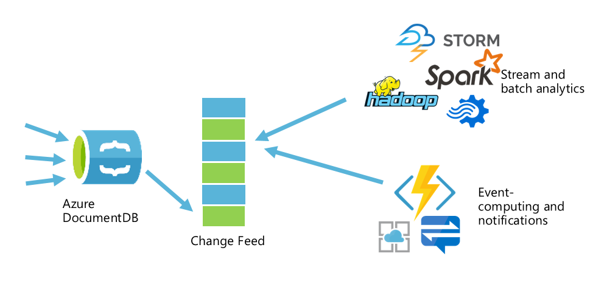
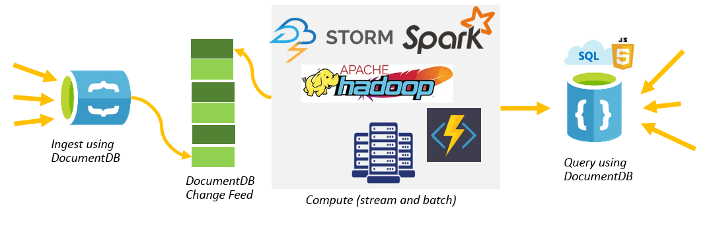
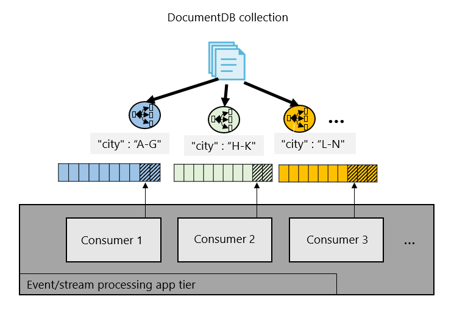
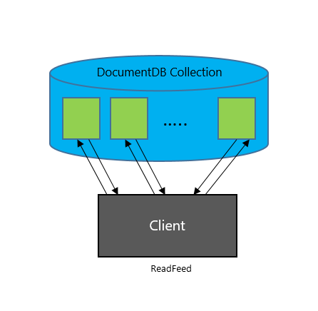
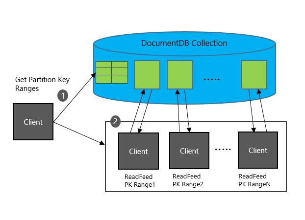

<properties
    pageTitle="使用 Azure DocumentDB 中的更改源支持 | Azure"
    description="使用 Azure DocumentDB 的更改源支持跟踪 DocumentDB 文档中发生的更改，执行基于事件的处理（例如触发器），使缓存和分析系统保持最新状态。"
    keywords="更改源"
    services="documentdb"
    author="arramac"
    manager="jhubbard"
    editor="mimig"
    documentationcenter="" />
<tags
    ms.assetid="2d7798db-857f-431a-b10f-3ccbc7d93b50"
    ms.service="documentdb"
    ms.workload="data-services"
    ms.tgt_pltfrm="na"
    ms.devlang="rest-api"
    ms.topic="article"
    ms.date="01/25/2017"
    wacn.date="03/22/2017"
    ms.author="arramac" />  

# 使用 Azure DocumentDB 中的更改源支持
[Azure DocumentDB](/documentation/articles/documentdb-introduction/) 是快速灵活的 NoSQL 数据库服务，用于存储大量事务与操作数据，读取和写入时的延迟不超过十毫秒且可预测。它非常适合用于 IoT、游戏、零售和操作日志记录应用程序。这些应用程序中的一种常见设计模式是跟踪对 DocumentDB 数据所做的更改、更新具体化的视图、执行实时分析、将数据存档到冷存储，以及在发生特定事件时根据这些更改触发通知。使用 DocumentDB 的**更改源支持**，可以针对其中的每种模式构建高效、可缩放的解决方案。

连同更改源一起，DocumentDB 在 DocumentDB 集合中按文档修改顺序提供排序的文档列表。此源可用于侦听对集合中数据所做的修改，以及执行如下操作：

- 插入或修改文档时触发 API 调用
- 针对更新执行实时（流）处理
- 将数据与缓存、搜索引擎或数据仓库同步

DocumentDB 中发生的更改可以保存、以异步方式进行处理，以及分散到一个或多个使用者供并行处理。让我们了解更改源的 API，以及如何使用它们来构建可缩放的实时应用程序。

  

## 用例和方案
使用更改源可对具有大量写入操作的大型数据集进行有效处理，这样就不需要查询整个数据集来识别发生了哪些更改。例如，可以有效地执行以下任务：

- 使用 Azure DocumentDB 中存储的数据更新缓存、搜索索引或数据仓库。
- 实现应用程序级别的数据分层和存档，即，将“热数据”存储在 DocumentDB 中，将“冷数据”搁置在 [Azure Blob 存储](/documentation/articles/storage-introduction/)中。
- 使用 [Apache Hadoop](/documentation/articles/documentdb-run-hadoop-with-hdinsight/) 实现数据批处理分析。
- 使用 DocumentDB [在 Azure 上实现 lambda 管道](https://blogs.technet.microsoft.com/msuspartner/2016/01/27/azure-partner-community-big-data-advanced-analytics-and-lambda-architecture/)。DocumentDB 提供一种可缩放的数据库解决方案，该解决方案可处理引入和查询，实现 TCO 较低的 lambda 体系结构。
- 在不造成任何停机的情况下迁移到使用不同分区方案的另一个 Azure DocumentDB 帐户。

**使用 Azure DocumentDB 构建用于引入和查询的 Lambda 管道：**

  

可以使用 DocumentDB 接收和存储设备、传感器、基础结构和应用程序发出的事件数据，然后使用 Azure 流分析、[Apache Storm](/documentation/articles/hdinsight-storm-overview/) 或 Apache Spark 实时处理这些事件。

在 Web 应用和移动应用中，可以跟踪各种事件（例如，对客户配置文件、首选项或位置的更改），以触发特定的操作，例如，使用[应用服务](/home/features/app-service/)向客户的设备发送推送通知。例如，若要使用 DocumentDB 来构建游戏，可以使用更改源，根据已完成的游戏的分数实时更新排行榜。

## 更改源在 Azure DocumentDB 中的工作原理
DocumentDB 能够以增量方式读取对 DocumentDB 集合所做的更新。此更改源具有以下属性：

- 更改将在 DocumentDB 中保存，并可以异步方式进行处理。
- 对集合中的文档所做的更改将立即在更改源中出现。
- 每次对文档所做的更改只会在更改源中出现一次。更改日志中仅包含最近对给定文档所做的更改，而不包含中途的更改。
- 更改源按照每个分区键值中的修改顺序排序。无法保证各分区键值中的顺序一致。
- 更改可从任意时间点同步，也就是说，发生更改的数据没有固定的保留期。
- 更改以分区键范围区块提供。多个使用者/服务器可以使用此功能并行处理大型集合中发生的更改。
- 应用程序可以针对同一个集合同时请求多个更改源。

DocumentDB 的更改源默认已针对所有帐户启用，不会在帐户中产生任何额外的费用。可以使用写入区域或任何[读取区域](/documentation/articles/documentdb-distribute-data-globally/)中的[预配吞吐量](/documentation/articles/documentdb-request-units/)从更改源中读取数据，就像在 DocumentDB 中执行其他任何操作一样。更改源包括针对集合中的文档所做的插入和更新操作。可以通过在文档中的删除位置设置“软删除”标志来捕获删除操作。或者，可以通过 [TTL 功能](/documentation/articles/documentdb-time-to-live/)为文档设置有限的过期期限（例如 24 小时），然后使用该属性的值捕获删除操作。使用此解决方案时，处理更改的时间间隔必须比 TTL 过期期限要短。更改源适用于文档集合中的每个分区键范围，因此，可以分散到一个或多个使用者供并行处理。

  

以下部分将介绍如何使用 DocumentDB REST API 和 SDK 访问更改源。

## 使用 REST API 和 SDK
DocumentDB 提供名为**集合**的弹性存储和吞吐量容器。集合中的数据已使用[分区键](/documentation/articles/documentdb-partition-data/)进行逻辑分组，以提高可伸缩性与性能。DocumentDB 提供各种 API 来访问这些数据，包括按 ID（读取/获取）、查询和读取源（扫描）进行查找。可以通过在 DocumentDB 的 `ReadDocumentFeed` API 中填充两个新请求标头来获取更改源，然后跨多个分区键范围并行处理更改源。

### ReadDocumentFeed API
让我们简单了解一下 ReadDocumentFeed 的工作原理。DocumentDB 支持通过 `ReadDocumentFeed` API 读取集合中文档的源。例如，以下请求返回 `serverlogs` 集合中的文档页面。

	GET https://mydocumentdb.documents.azure.com/dbs/smalldb/colls/serverlogs HTTP/1.1
	x-ms-date: Tue, 22 Nov 2016 17:05:14 GMT
	authorization: type%3dmaster%26ver%3d1.0%26sig%3dgo7JEogZDn6ritWhwc5hX%2fNTV4wwM1u9V2Is1H4%2bDRg%3d
	Cache-Control: no-cache
	x-ms-consistency-level: Strong
	User-Agent: Microsoft.Azure.Documents.Client/1.10.27.5
	x-ms-version: 2016-07-11
	Accept: application/json
	Host: mydocumentdb.documents.azure.com

可以使用 `x-ms-max-item-count` 限制结果；可以通过使用前一响应中返回的 `x-ms-continuation` 标头重新提交请求来恢复读取。在单个客户端中执行时，`ReadDocumentFeed` 将以串行方式循环访问各分区的结果。

**串行读取文档源**

  

还可以使用某个支持的 [DocumentDB SDK](/documentation/articles/documentdb-sdk-dotnet/) 检索文档源。例如，下面的代码片段演示如何在 .NET 中执行 ReadDocumentFeed。

    FeedResponse<dynamic> feedResponse = null;
    do
    {
        feedResponse = await client.ReadDocumentFeedAsync(collection, new FeedOptions { MaxItemCount = -1 });
    }
    while (feedResponse.ResponseContinuation != null);

> [AZURE.NOTE]
更改源需要 SDK 1.11.0 和更高版本（目前以个人预览版提供）

### ReadDocumentFeed 的分布式执行
对于包含 TB 量级数据的集合，或者在引入大量更新的情况下，从一台客户端计算机以串行方式执行源读取可能不可行。为了支持这些大数据方案，DocumentDB 提供了相应的 API，以透明方式在多个客户端读取者/使用者之间分布 `ReadDocumentFeed` 调用。

**分布式读取文档源**

  

为了针对增量更改提供可缩放的处理，DocumentDB 根据分区键的范围提供更改源 API 的扩展模型支持。

- 执行 `ReadPartitionKeyRanges` 调用可以获取集合的分区键范围列表。
- 对于每个分区键范围，可以执行 `ReadDocumentFeed` 来读取具有该范围内的分区键的文档。

### 检索集合的分区键范围
可以通过请求集合中的 `pkranges` 资源来检索分区键范围。例如，以下请求检索 `serverlogs` 集合的分区键范围列表：

	GET https://querydemo.documents.azure.com/dbs/bigdb/colls/serverlogs/pkranges HTTP/1.1
	x-ms-date: Tue, 15 Nov 2016 07:26:51 GMT
	authorization: type%3dmaster%26ver%3d1.0%26sig%3dEConYmRgDExu6q%2bZ8GjfUGOH0AcOx%2behkancw3LsGQ8%3d
	x-ms-consistency-level: Session
	x-ms-version: 2016-07-11
	Accept: application/json
	Host: querydemo.documents.azure.com

此请求返回以下响应，其中包含有关分区键范围的元数据：

	HTTP/1.1 200 Ok
	Content-Type: application/json
	x-ms-item-count: 25
	x-ms-schemaversion: 1.1
	Date: Tue, 15 Nov 2016 07:26:51 GMT

	{
	   "_rid":"qYcAAPEvJBQ=",
	   "PartitionKeyRanges":[
	      {
	         "_rid":"qYcAAPEvJBQCAAAAAAAAUA==",
	         "id":"0",
	         "_etag":"\"00002800-0000-0000-0000-580ac4ea0000\"",
	         "minInclusive":"",
	         "maxExclusive":"05C1CFFFFFFFF8",
	         "_self":"dbs\/qYcAAA==\/colls\/qYcAAPEvJBQ=\/pkranges\/qYcAAPEvJBQCAAAAAAAAUA==\/",
	         "_ts":1477100776
	      },
	      ...
	   ],
	   "_count": 25
	}

**分区键范围属性**：每个分区键范围包括下表中的元数据属性：

<table>
	<tr>
		<th>标头名称</th>
		<th>说明</th>
	</tr>
	<tr>
		<td>id</td>
		<td>
			
分区键范围的 ID。此 ID 在每个集合中是固定且唯一的。

			
必须在以下调用中使用此属性才能按分区键范围读取更改。

		</td>
	</tr>
	<tr>
		<td>maxExclusive</td>
		<td>分区键范围的最大分区键哈希值。供内部使用。</td>
	</tr>
	<tr>
		<td>minInclusive</td>
		<td>分区键范围的最小分区键哈希值。供内部使用。</td>
	</tr>		
</table>

可以使用支持的 [DocumentDB SDK](/documentation/articles/documentdb-sdk-dotnet/) 之一获取此值。例如，以下代码片段演示如何在 .NET 中检索分区键范围。

    string pkRangesResponseContinuation = null;
    List<PartitionKeyRange> partitionKeyRanges = new List<PartitionKeyRange>();

    do
    {
        FeedResponse<PartitionKeyRange> pkRangesResponse = await client.ReadPartitionKeyRangeFeedAsync(
            collectionUri, 
            new FeedOptions { RequestContinuation = pkRangesResponseContinuation });

        partitionKeyRanges.AddRange(pkRangesResponse);
        pkRangesResponseContinuation = pkRangesResponse.ResponseContinuation;
    }
    while (pkRangesResponseContinuation != null);

DocumentDB 支持通过设置可选的 `x-ms-documentdb-partitionkeyrangeid` 标头按分区键范围检索文档。

### 执行增量 ReadDocumentFeed
ReadDocumentFeed 支持使用以下方案/任务对 DocumentDB 集合中的更改进行增量处理：

- 读取自始至终（从创建集合时开始）对文档所做的全部更改。
- 读取从当前时间开始对文档所做的全部更改。
- 通过集合的逻辑版本 (ETag) 读取对文档所做的全部更改。可以通过增量读取源请求根据返回的 ETag 设置使用者检查点。

这些更改包括文档插入和更新。若要捕获删除操作，必须在文档中使用“软删除”属性，或使用[内置的 TTL 属性](/documentation/articles/documentdb-time-to-live/)在更改源中发出待删除信号。

下表列出了 ReadDocumentFeed 操作的请求和响应标头。

**增量 ReadDocumentFeed 的请求标头**：

<table>
	<tr>
		<th>标头名称</th>
		<th>说明</th>
	</tr>
	<tr>
		<td>A-IM</td>
		<td>必须设置为“Incremental feed”，否则省略</td>
	</tr>
	<tr>
		<td>If-None-Match</td>
		<td>
			
无标头：返回从一开始（创建集合时）所做的全部更改

			
"*"：返回最近对集合中数据所做的全部更改

			
&lt;etag>：如果设置为集合 ETag，则返回从该逻辑时间戳开始所做的全部更改

		</td>
	</tr>
	<tr>
		<td>x-ms-documentdb-partitionkeyrangeid</td>
		<td>用于读取数据的分区键范围 ID。</td>
	</tr>
</table>

**增量 ReadDocumentFeed 的响应标头**：

<table>
	<tr>
		<th>标头名称</th>
		<th>说明</th>
	</tr>
	<tr>
		<td>etag</td>
		<td>
			
响应中返回的最后一个文档的逻辑序列号 (LSN)。

			
在 If-None-Match 中重新提交此值可以恢复增量 ReadDocumentFeed。

		</td>
	</tr>
</table>

以下示例请求通过逻辑版本/ ETag `28535` 和分区键范围 `16` 返回集合中发生的所有增量更改：

	GET https://mydocumentdb.documents.azure.com/dbs/bigdb/colls/bigcoll/docs HTTP/1.1
	x-ms-max-item-count: 1
	If-None-Match: "28535"
	A-IM: Incremental feed
	x-ms-documentdb-partitionkeyrangeid: 16
	x-ms-date: Tue, 22 Nov 2016 20:43:01 GMT
	authorization: type%3dmaster%26ver%3d1.0%26sig%3dzdpL2QQ8TCfiNbW%2fEcT88JHNvWeCgDA8gWeRZ%2btfN5o%3d
	x-ms-version: 2016-07-11
	Accept: application/json
	Host: mydocumentdb.documents.azure.com

更改已按分区键范围内每个分区键值中的时间排序。无法保证各分区键值中的顺序一致。如果结果太多，无法在一个页面中显示，可以使用 `If-None-Match` 标头（其值等于前一响应中的 `etag`）重新提交请求来阅读下一页结果。如果在存储过程或触发器中以事务方式插入或更新了多个文档，这些文档都会在同一个响应页面中返回。

> [AZURE.NOTE]
使用更改源时，如果在存储过程或触发器中插入或更新了多个文档，则在一页中返回的项目可能会多于在 `x-ms-max-item-count` 中指定的。

.NET SDK 提供 [CreateDocumentChangeFeedQuery](https://msdn.microsoft.com/zh-cn/library/azure/microsoft.azure.documents.client.documentclient.createdocumentchangefeedquery.aspx) 和 [ChangeFeedOptions](https://msdn.microsoft.com/zh-cn/library/azure/microsoft.azure.documents.client.changefeedoptions.aspx) 帮助器类，用于访问对集合所做的更改。以下代码片段演示如何在单个客户端中使用.NET SDK 检索从一开始所做的全部更改。

    private async Task<Dictionary<string, string>> GetChanges(
        DocumentClient client,
        string collection,
        Dictionary<string, string> checkpoints)
    {
        string pkRangesResponseContinuation = null;
        List<PartitionKeyRange> partitionKeyRanges = new List<PartitionKeyRange>();

        do
        {
            FeedResponse<PartitionKeyRange> pkRangesResponse = await client.ReadPartitionKeyRangeFeedAsync(
                collectionUri, 
                new FeedOptions { RequestContinuation = pkRangesResponseContinuation });

            partitionKeyRanges.AddRange(pkRangesResponse);
            pkRangesResponseContinuation = pkRangesResponse.ResponseContinuation;
        }
        while (pkRangesResponseContinuation != null);

        foreach (PartitionKeyRange pkRange in partitionKeyRanges)
        {
            string continuation = null;
            checkpoints.TryGetValue(pkRange.Id, out continuation);

            IDocumentQuery<Document> query = client.CreateDocumentChangeFeedQuery(
                collection,
                new ChangeFeedOptions
                {
                    PartitionKeyRangeId = pkRange.Id,
                    StartFromBeginning = true,
                    RequestContinuation = continuation,
                    MaxItemCount = 1
                });

            while (query.HasMoreResults)
            {
                FeedResponse<DeviceReading> readChangesResponse = query.ExecuteNextAsync<DeviceReading>().Result;

                foreach (DeviceReading changedDocument in readChangesResponse)
                {
                    Console.WriteLine(changedDocument.Id);
                }

                checkpoints[pkRange.Id] = readChangesResponse.ResponseContinuation;
            }
        }

        return checkpoints;
    }

以下代码片段演示如何使用更改源支持和上述函数，在 DocumentDB 中实时处理更改。第一个调用返回集合中的所有文档，第二个调用仅返回自上一个检查点后创建的两个文档。

    // Returns all documents in the collection.
    Dictionary<string, string> checkpoints = await GetChanges(client, collection, new Dictionary<string, string>());

    await client.CreateDocumentAsync(collection, new DeviceReading { DeviceId = "xsensr-201", MetricType = "Temperature", Unit = "Celsius", MetricValue = 1000 });
    await client.CreateDocumentAsync(collection, new DeviceReading { DeviceId = "xsensr-212", MetricType = "Pressure", Unit = "psi", MetricValue = 1000 });

    // Returns only the two documents created above.
    checkpoints = await GetChanges(client, collection, checkpoints);

还可以筛选更改源 - 使用客户端逻辑有选择性地处理事件即可。例如，以下代码片段使用客户端 LINQ 专门处理设备传感器发送的温度更改事件。

    FeedResponse<DeviceReading> readChangesResponse = query.ExecuteNextAsync<DeviceReading>().Result;

    foreach (DeviceReading changedDocument in 
        readChangesResponse.AsEnumerable().Where(d => d.MetricType == "Temperature" && d.MetricValue > 1000L))
    {
        // trigger an action, like call an API
    }

本文逐步讲解了 DocumentDB 的更改源支持，以及如何使用 DocumentDB REST API 和/或 SDK 跟踪对 DocumentDB 数据所做的更改。

## 后续步骤
- 尝试运行 [Github 上提供的 DocumentDB 更改源代码示例](https://github.com/Azure/azure-documentdb-dotnet/tree/master/samples/code-samples/ChangeFeed)
- 详细了解 [DocumentDB 的资源模型和层次结构](/documentation/articles/documentdb-resources/)
- 使用 [DocumentDB SDK](/documentation/articles/documentdb-sdk-dotnet/) 或 [REST API](https://msdn.microsoft.com/zh-cn/library/azure/dn781481.aspx) 开始编写代码

<!---HONumber=Mooncake_0313_2017-->
<!--Update_Description: wording and code update-->