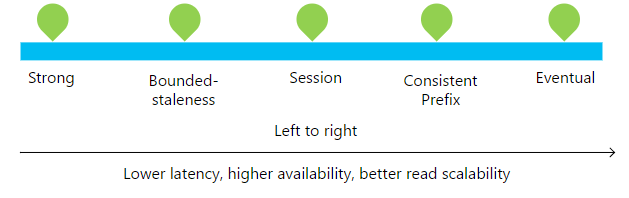
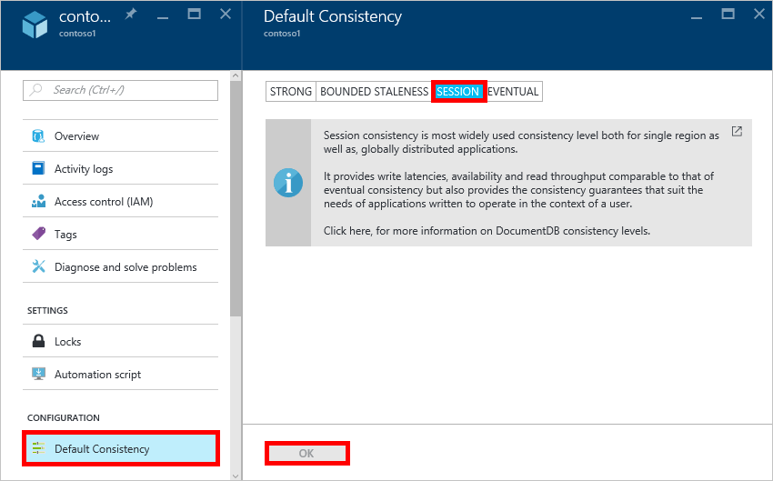

<properties
    pageTitle="DocumentDB 中的一致性级别 | Azure"
    description="DocumentDB 提供五种一致性级别来帮助在最终一致性、可用性和延迟之间做出取舍。"
    keywords="最终一致性, azure documentdb, azure, Azure"
    services="documentdb"
    author="syamkmsft"
    manager="jhubbard"
    editor="cgronlun"
    documentationcenter="" />
<tags
    ms.assetid="3fe51cfa-a889-4a4a-b320-16bf871fe74c"
    ms.service="documentdb"
    ms.workload="data-services"
    ms.tgt_pltfrm="na"
    ms.devlang="na"
    ms.topic="article"
    ms.date="05/11/2017"
    wacn.date="05/31/2017"
    ms.author="syamk"
    ms.custom="H1Hack27Feb2017"
    ms.translationtype="Human Translation"
    ms.sourcegitcommit="4a18b6116e37e365e2d4c4e2d144d7588310292e"
    ms.openlocfilehash="7a8b5a2215198bc23714de2fea15bf67f904479b"
    ms.contentlocale="zh-cn"
    ms.lasthandoff="05/19/2017" />

# DocumentDB 中的可优化数据一致性级别
DocumentDB 是从无到有开发出来的，其设计考虑到了每个数据模型的全局分发。 它旨在提供可预测的低延迟保证、99.99% 的可用性 SLA，以及多个定义完好的宽松一致性模型。 目前，DocumentDB 提供五种一致性级别：非常一致性、有限过期一致性、会话一致性和最终级别。 

除了分布式数据库通常会提供的**强一致性**和**最终一致性**模型以外，DocumentDB 还提供三个经过谨慎编码和操作化的一致性模型，并已根据真实用例验证它们的有效性。 这些模型为**有限过期**、**会话**和**一致前缀**一致性级别。 总而言之，这五个一致性级别可让你在一致性、可用性和延迟之间做出合理的取舍。 

## 分布式数据库和一致性
商用分布式数据库分为两类：根本不提供妥善定义的可证明一致性选择的数据库，以及提供两种极端可编程性选择（非常一致性与最终一致性）的数据库。 

前者使应用程序开发人员为复制协议的细节所累，需要他们在一致性、可用性、延迟和吞吐量之间做出困难的权衡。 后者则迫使用户选择两个极端之一。 尽管有了 50 个以上的一致性模型的大量研究和建议，分布式数据库社区尚未能够将非常一致性和最终一致性之外的一致性级别商业化。 使用 DocumentDB 可让开发人员沿一致性系列在五个妥善定义的一致性模型（非常、有限过期、[会话](http://dl.acm.org/citation.cfm?id=383631)、一致前缀和最终）之间进行选择。 

下表说明了每个一致性级别提供的特定保证。
 
**一致性级别和保证**

| 一致性级别    | 保证 |
| --- | --- |
| 强 | 可线性化 |
| 有限过期    | 一致前缀。 读取操作落后写入操作 k 个前缀或 t 时间间隔 |
| 会话    | 一致前缀。 单调读取、单调写入、读取你的写入、写入跟随读取 |
| 一致前缀    | 返回的更新是全部更新的某些前缀，不带间隔 |
| 最终    | 失序读取 |

可以在 DocumentDB 帐户上配置默认一致性级别（并且可在以后对特定读取请求替代一致性）。 在内部，默认一致性级别适用于可能跨地区的分区集内的数据。 我们大约 73% 的租户使用会话一致性，20% 的租户偏向于有限过期一致性。 我们已注意到，大约 3% 的客户会先体验不同的一致性级别，然后再根据应用程序选择特定的一致性。 此外，我们还注意到，只有 2% 的租户根据请求替代一致性级别。 

在 DocumentDB 中，以会话、一致前缀和最终一致性级别为读取操作提供服务，比以强或有限过期一致性级别提供此服务的成本要低两倍。 DocumentDB 提供行业领先的全面 99.99% SLA，包括可用性、吞吐量和延迟方面的一致性保证。 我们采用[可线性化检查器](http://dl.acm.org/citation.cfm?id=1806634)，它可以针对服务遥测数据持续运行，并公开报告所有一致性冲突。 对于有限过期一致性，我们将会监视并报告所有 k 和 t 边界冲突。 对于所有五个宽松的一致性级别，我们还会直接报告[概率有限过期指标](http://dl.acm.org/citation.cfm?id=2212359)。  

## 一致性的范围
一致性的粒度归并为单个用户请求。 写入请求可能对应于插入、替换、插入更新或删除事务。 与写入操作一样，读取/查询事务也归并为单个用户请求。 用户可能需要在跨越多个分区的大型结果集中分页，但每个读取事务归并为单个页面，并从单个分区内部进行。

## 一致性级别
可以配置数据库帐户的默认一致性级别，以应用于 DocumentDB 帐户下的所有集合（和数据库）。 所有针对用户定义的资源发出的读取和查询，默认都会使用数据库帐户上指定的默认一致性级别。 可以使用每个受支持的 API 放宽特定读取/查询请求的一致性级别。 如本部分所述，DocumentDB 复制协议支持五种类型的一致性级别，这些级别可在特定的一致性保证与性能之间提供明确的折衷。

**非常一致性**： 

- 非常一致性提供[可线性化](https://aphyr.com/posts/313-strong-consistency-models)保证，即保证读取操作返回项的最新版本。 
- 非常一致性保证写入只有在副本的多数仲裁一直提交的情况下才可见。 写入要么由主要副本和辅助副本仲裁一直同步提交，要么被中止。 读取始终由多数读取仲裁确认；客户端绝不会看到未提交或不完整的写入，而且始终保证读取最新确认的写入。 
- 配置为使用非常一致性的 DocumentDB 帐户不能将多个 Azure 区域与其 DocumentDB 帐户相关联。 
- 具有非常一致性的读取操作的开销（从消耗的[请求单位数](/documentation/articles/documentdb-request-units/)来讲）高于会话一致性和最终一致性，但与有限过期一致性相同。

**受限停滞一致性**： 

- 有限过期一致性保证读取操作滞后于写入操作最多 *K* 个项版本或前缀或 *t* 时间间隔。 
- 因此，选择有限过期时，可通过两种方式配置“过期”：读取操作比写入操作滞后的项版本 *K* 数；时间间隔 *t* 
- 有限过期提供全局整体顺序，但在“过期窗口”中除外。 请注意，“过期窗口”内部和外部的区域中提供单调读取保证。 
- 与会话或最终一致性相比，受限停滞一致性提供更强的一致性保证。 对于全局分发式应用程序，如果想要获得非常一致性，同时希望获得 99.99% 的可用性和低延迟，则建议使用受限停滞。 
- 配置了有限过期一致性的 DocumentDB 帐户可将任意数量的 Azure 区域与其 DocumentDB 帐户相关联。 
- 具有有限过期一致性的读取操作的开销（从消耗的 RU 来讲）高于会话一致性和最终一致性，但与非常一致性相同。

**会话一致性**： 

- 与非常一致性和受限停滞一致性级别所提供的全局一致性模型不同，会话一致性归并为客户端会话。 
- 对于涉及到设备或用户会话的所有方案，会话一致性非常合适，因为它提供单调读取、单调写入和读取自己的写入 (RYW) 保证。 
- 会话一致性为会话提供可预测的一致性和最大的读取吞吐量，同时提供最低延迟的写入和读取。 
- 配置了会话一致性的 DocumentDB 帐户可将任意数量的 Azure 区域与其 DocumentDB 帐户相关联。 
- 具有会话一致性级别的读取操作的开销（从消耗的 RU 来讲）小于非常一致性和有限过期一致性，但大于最终一致性

**一致前缀**： 

- 一致前缀保证在没有再收到任何写入的情况下，组中的副本最终只剩一个。 
- 一致前缀保证读取操作永远不会看到无序写入。 如果写入是按 `A, B, C` 顺序执行的，则客户端将看到 `A`、`A,B` 或 `A,B,C`，但永远不会看到类似于 `A,C` 或 `B,A,C` 的失序情况。
- 配置了一致前缀的 DocumentDB 帐户可将任意数量的 Azure 区域与其 DocumentDB 帐户相关联。 

**最终一致性**： 

- 最终一致性保证在没有再收到任何写入的情况下，组中的副本最终只剩一个。 
- 最终一致性是最弱的一致性形式，客户端可能会获取比之前看到的值还要旧的值。
- 最终一致性提供最差的读取一致性，但是读取和写入的延迟均为最低。
- 配置了最终一致性的 DocumentDB 帐户可将任意数量的 Azure 区域与其 DocumentDB 帐户相关联。 
- 具有最终一致性级别的读取操作的开销（从消耗的 RU 来讲）在所有 DocumentDB 一致性级别中是最低的。

## 配置默认的一致性级别
1. 在 [Azure 门户](https://portal.azure.cn/)的跳转栏中，单击“DocumentDB”。
2. 在“DocumentDB”边栏选项卡中，选择要修改的数据库帐户。
3. 在帐户边栏选项卡中，单击“默认一致性” 。
4. 在“默认一致性”边栏选项卡中，选择新的一致性级别并单击“保存”。
   
    

## 查询的一致性级别
默认情况下，对于用户定义的资源，查询的一致性级别与读取的一致性级别相同。 默认情况下，每次在 DocumentDB 容器中插入、替换或删除项时，都会同步更新索引。 这个行为让查询能够使用与时点读取相同的一致性级别。 虽然 DocumentDB 针对写入进行了优化，且支持写入，以及同步索引维护和提供一致的查询服务，但仍也可以配置某些集合，使其索引延迟更新。 延迟索引编制可大大提高写入性能，非常适合工作负荷主要具有大量读取操作的批量引入方案。  

| 索引模式 | 读取 | 查询 |
| --- | --- | --- |
| 一致（默认值） |从非常、有限过期、会话、一致前缀或最终一致性级别中选择 |从非常、受限停滞、会话或最终一致性级别中选择 |
| 延迟 |从非常、有限过期、会话、一致前缀或最终一致性级别中选择 |最终 |
| 无 |从非常、有限过期、会话、一致前缀或最终一致性级别中选择 |不适用 |

与读取请求一样，可在每个 API 中降低特定查询请求的一致性级别。

## 后续步骤
如果想详细了解一致性级别和权衡方案，建议参阅下列资源：

- Doug Terry。 Replicated Data Consistency explained through baseball（借助棒球解释重复数据一致性）。   
  [http://research.microsoft.com/pubs/157411/ConsistencyAndBaseballReport.pdf](http://research.microsoft.com/pubs/157411/ConsistencyAndBaseballReport.pdf)
- Doug Terry。 Session Guarantees for Weakly Consistent Replicated Data（弱一致性重复数据的会话保证）。   
  [http://dl.acm.org/citation.cfm?id=383631](http://dl.acm.org/citation.cfm?id=383631)
- Daniel Abadi。 Consistency Tradeoffs in Modern Distributed Database Systems Design: CAP is only part of the story”（现代分布式数据库系统设计中的一致性平衡方案：CAP 只是冰山一角）。   
  [http://computer.org/csdl/mags/co/2012/02/mco2012020037-abs.html](http://computer.org/csdl/mags/co/2012/02/mco2012020037-abs.html)
- Peter Bailis、Shivaram Venkataraman、Michael J. Franklin、Joseph M. Hellerstein、Ion Stoica。 实用部分法定人数的概率有限过期性 (PBS)。   
  [http://vldb.org/pvldb/vol5/p776_peterbailis_vldb2012.pdf](http://vldb.org/pvldb/vol5/p776_peterbailis_vldb2012.pdf)
- Werner Vogels。 Eventual Consistent - Revisited（最终一致 - 重新访问）。    
  [http://allthingsdistributed.com/2008/12/eventually_consistent.html](http://allthingsdistributed.com/2008/12/eventually_consistent.html)
- Moni Naor 和 Avishai Wool 共同撰写的“仲裁系统的负载、容量和可用性”，1998 年 4 月发表在 SIAM 计算期刊 v.27 n.2 上，请参阅其中的第 423-447 页。
  [http://epubs.siam.org/doi/abs/10.1137/S0097539795281232](http://epubs.siam.org/doi/abs/10.1137/S0097539795281232)
- 由 Sebastian Burckhardt、Chris Dern、Macanal Musuvathi 和 Roy Tan 共同撰写。摘要：完整的自动可线性化检查器。2010 年 6 月 5-10 日加拿大安大略省多伦多市 ACM SIGPLAN 大会上有关编程语言设计与实现的会议记录。[doi>10.1145/1806596.1806634] [http://dl.acm.org/citation.cfm?id=1806634](http://dl.acm.org/citation.cfm?id=1806634)
- Peter Bailis、Shivaram Venkataraman、Michael J. Franklin、Joseph M. Hellerstein、Ion Stoica 共同撰写的“实用部分仲裁的概率性有限过期性”，2012 年 4 月 VLDB Endowment 会议记录 v.5 n.8，第 776-787 页 [http://dl.acm.org/citation.cfm?id=2212359](http://dl.acm.org/citation.cfm?id=2212359)

