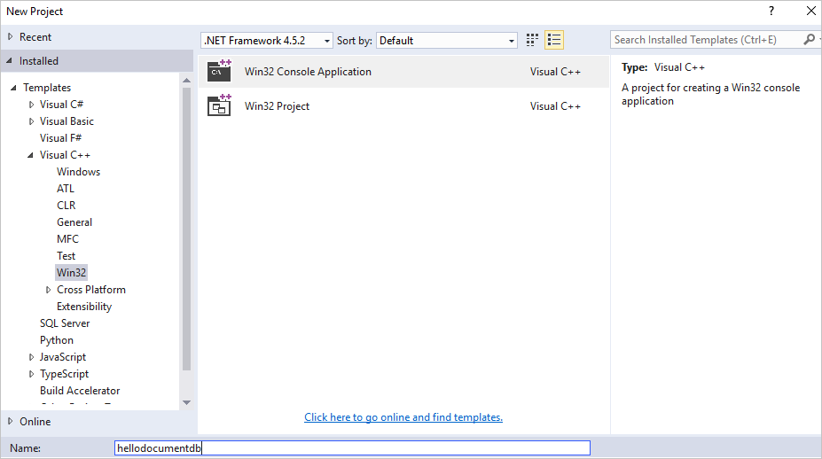
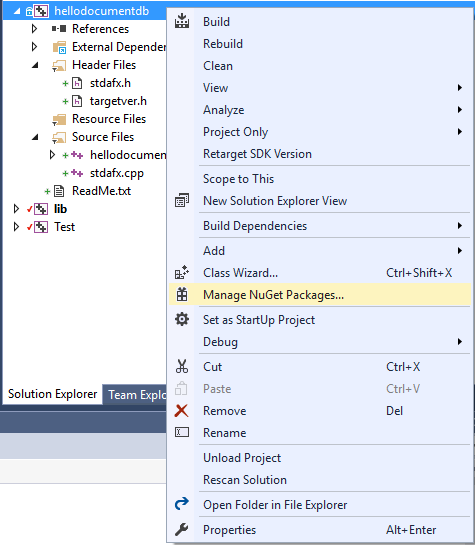
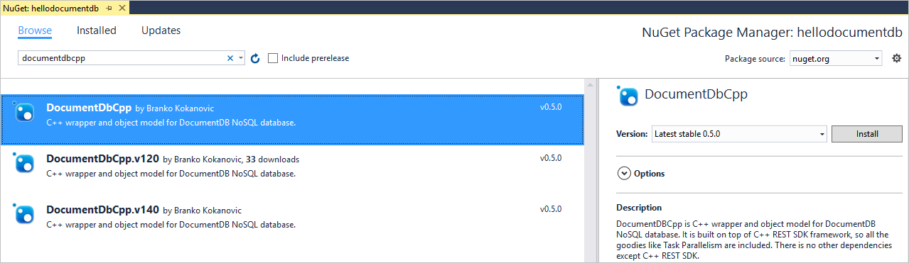
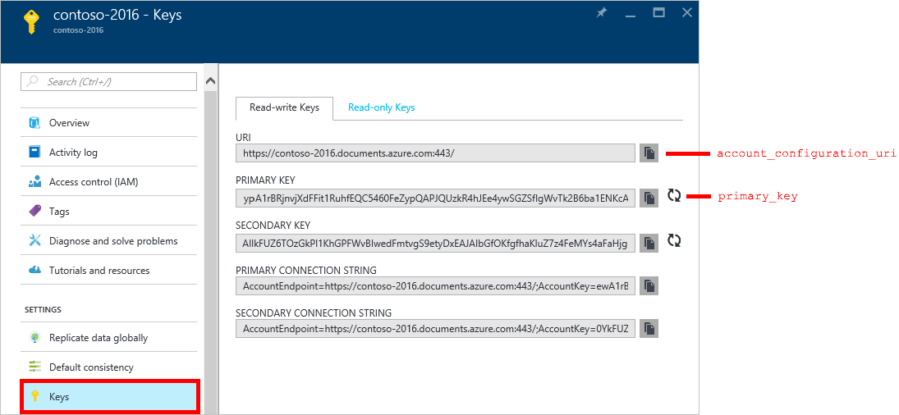
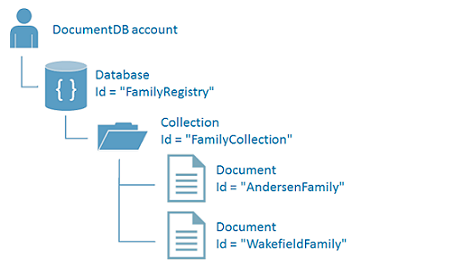
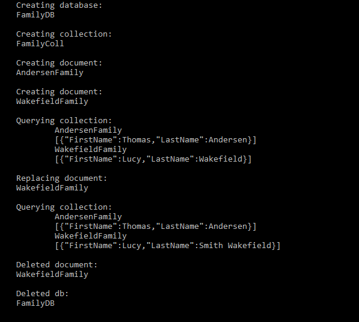

<properties
    pageTitle="适用于 DocumentDB 的 NoSQL C++ 教程 | Azure"
    description="使用面向 C++ 的 DocumentDB SDK 创建 C++ 数据库和控制台应用程序的 NoSQL C++ 教程。DocumentDB 是全球范围的 NoSQL 数据库服务。"
    services="documentdb"
    documentationcenter="cpp"
    author="asthana86"
    manager="jhubbard"
    editor="" />  

<tags
    ms.assetid="b8756b60-8d41-4231-ba4f-6cfcfe3b4bab"
    ms.service="documentdb"
    ms.workload="data-services"
    ms.tgt_pltfrm="na"
    ms.devlang="cpp"
    ms.topic="hero-article"
    ms.date="11/02/2016"
    wacn.date="01/06/2017"
    ms.author="aasthan" />  

# NoSQL C++ 教程：DocumentDB C++ 控制台应用程序
>[AZURE.SELECTOR]
[.NET](/documentation/articles/documentdb-get-started/)
[.NET Core](/documentation/articles/documentdb-dotnetcore-get-started/)
[Node.js](/documentation/articles/documentdb-nodejs-get-started/)
[C++](/documentation/articles/documentdb-cpp-get-started/)

欢迎使用面向 C++ 的 Azure DocumentDB SDK 的 C++ 教程！ 学习本教程后，你将拥有一个创建并查询 DocumentDB 资源（包括 C++ 数据库）的控制台应用程序。

我们将介绍：

- 创建并连接到 DocumentDB 帐户
- 设置应用程序
- 创建 C++ DocumentDB 数据库
- 创建集合
- 创建 JSON 文档
- 查询集合
- 替换文档
- 删除文档
- 删除 C++ DocumentDB 数据库

没有时间？ 不必担心！ 可在 [GitHub](https://github.com/stalker314314/DocumentDBCpp) 上获取完整的解决方案。有关快速说明，请参阅 [Get the complete solution](#GetSolution)（获取完整解决方案）。

完成此 C++ 教程后，请使用位于本页底部的投票按钮向我们提供反馈。

如果你希望我们直接与你联系，欢迎将你的电子邮件地址附在评论中，或者[在此处与我们联系](https://www.research.net/r/8BKRJ3Z)。

现在，让我们开始吧！

## C++ 教程的先决条件
请确保你具有以下内容：

- 有效的 Azure 帐户。如果你没有，可以注册 [Azure 试用版](/pricing/1rmb-trial/)。
- [Visual Studio](https://www.visualstudio.com/downloads/)，安装了 C++ 语言组件。

## 第 1 步：创建 DocumentDB 帐户
让我们创建一个 DocumentDB 帐户。如果已经有想要使用的帐户，可以跳到[安装 C++ 应用程序](#SetupC++)。

[AZURE.INCLUDE [documentdb-create-dbaccount](../../includes/documentdb-create-dbaccount.md)]

## 步骤 2：设置 C++ 应用程序
1. 打开 Visual Studio，在“文件”菜单中，单击“新建”，然后单击“项目”。
2. 在“新建项目”窗口中，在“已安装”窗格中展开“Visual C++”，单击“Win32”，然后单击“Win32 控制台应用程序”。将项目命名为 hellodocumentdb，再单击“确定”。
   
      

3. Win32 应用程序向导启动后，单击“完成”。
4. 创建项目后，右键单击“解决方案资源管理器”中的“hellodocumentdb”项目，并单击“管理 NuGet 包”以打开 NuGet 包管理器。
   
      

5. 在“NuGet: hellodocumentdb”选项卡上，单击“浏览”，然后搜索 *documentdbcpp*。在结果中选择 DocumentDbCPP，如下面的屏幕截图所示。此程序包安装 C++ REST SDK 的引用，该 SDK 是DocumentDbCPP 的依赖项。
   
      

   
    将程序包添加到项目后，我们已准备好开始编写一些代码。

## 步骤 3：从 Azure 门户预览中复制 DocumentDB 数据库的连接详细信息
打开 [Azure 门户预览](https://portal.azure.cn)，遍历到你创建的 NoSQL (DocumentDB) 数据库帐户。下一步需要 Azure 门户预览中的 URI 和主要密钥，以便使用 C++ 代码片段建立连接。

  

## 步骤 4：连接到 DocumentDB 帐户
1. 将以下标头和命名空间添加到源代码的 `#include "stdafx.h"` 后面。
   
        #include <cpprest/json.h>
        #include <documentdbcpp\DocumentClient.h>
        #include <documentdbcpp\exceptions.h>
        #include <documentdbcpp\TriggerOperation.h>
        #include <documentdbcpp\TriggerType.h>
        using namespace documentdb;
        using namespace std;
        using namespace web::json;
	
2. 接下来将以下代码添加到主函数，并替换帐户配置和主要密钥以匹配步骤 3 中的 DocumentDB 设置。
   
        DocumentDBConfiguration conf (L"<account_configuration_uri>", L"<primary_key>");
        DocumentClient client (conf);
   
    现已获得用于初始化 documentdb 客户端的代码，接下来让我们看看如何使用 DocumentDB 资源。

## 步骤 5：创建 C++ 数据库和集合
执行此步骤之前，针对 DocumentDB 的新用户，让我们回顾一下数据库、集合和文档的交互方式。[数据库](/documentation/articles/documentdb-resources/#databases/)是跨集合分区的文档存储的逻辑容器。[集合](/documentation/articles/documentdb-resources/#collections/)是 JSON 文档和相关联的 JavaScript 应用程序逻辑的容器。可以在 [DocumentDB 分层资源模型和概念](/documentation/articles/documentdb-resources/)中了解有关 DocumentDB 分层资源模型和概念的更多信息。

若要创建数据库和相应的集合，请将下面的代码添加到主函数末尾。这样可以使用上一步中声明的客户端配置创建名为“FamilyRegistry”的数据库和名为“FamilyCollection”的集合。

    try {
      shared_ptr<Database> db = client.CreateDatabase(L"FamilyRegistry");
      shared_ptr<Collection> coll = db->CreateCollection(L"FamilyCollection");
    } catch (DocumentDBRuntimeException ex) {
      wcout << ex.message();
    }

## 步骤 6：创建文档
[文档](/documentation/articles/documentdb-resources/#documents/)为用户定义的（任意）JSON 内容。现在，你可以将文档插入 DocumentDB。将下面的代码复制到主函数的末尾可创建一个文档。

    try {
      value document_family;
      document_family[L"id"] = value::string(L"AndersenFamily");
      document_family[L"FirstName"] = value::string(L"Thomas");
      document_family[L"LastName"] = value::string(L"Andersen");
      shared_ptr<Document> doc = coll->CreateDocumentAsync(document_family).get();

      document_family[L"id"] = value::string(L"WakefieldFamily");
      document_family[L"FirstName"] = value::string(L"Lucy");
      document_family[L"LastName"] = value::string(L"Wakefield");
      doc = coll->CreateDocumentAsync(document_family).get();
    } catch (ResourceAlreadyExistsException ex) {
      wcout << ex.message();
    }

总之，此代码创建可在 Azure 门户预览的文档资源管理器中查询的 DocumentDB 数据库、集合和文档。

  

## 步骤 7：查询 DocumentDB 资源
DocumentDB 支持对存储在每个集合中的 JSON 文档进行各种[查询](/documentation/articles/documentdb-sql-query/)。下面的示例代码演示了使用 DocumentDB SQL 语法创建的查询，可以对上一步中创建的文档运行此查询。

此函数包含三个参数：数据库和集合的唯一标识符或资源 id 以及文档客户端。在主函数前面添加此代码。

    void executesimplequery(const DocumentClient &client,
                            const wstring dbresourceid,
                            const wstring collresourceid) {
      try {
        client.GetDatabase(dbresourceid).get();
        shared_ptr<Database> db = client.GetDatabase(dbresourceid);
        shared_ptr<Collection> coll = db->GetCollection(collresourceid);
        wstring coll_name = coll->id();
        shared_ptr<DocumentIterator> iter =
            coll->QueryDocumentsAsync(wstring(L"SELECT * FROM " + coll_name)).get();
        wcout << "\n\nQuerying collection:";
        while (iter->HasMore()) {
          shared_ptr<Document> doc = iter->Next();
          wstring doc_name = doc->id();
          wcout << "\n\t" << doc_name << "\n";
          wcout << "\t"
                << "[{\"FirstName\":"
                << doc->payload().at(U("FirstName")).as_string()
                << ",\"LastName\":" << doc->payload().at(U("LastName")).as_string()
                << "}]";
        }
      } catch (DocumentDBRuntimeException ex) {
        wcout << ex.message();
      }
    }

## 步骤 8：替换文档
DocumentDB 支持替换 JSON 文档，如下面的代码所示。在 executesimplequery 函数后面添加此代码。

    void replacedocument(const DocumentClient &client, const wstring dbresourceid,
                         const wstring collresourceid,
                         const wstring docresourceid) {
      try {
        client.GetDatabase(dbresourceid).get();
        shared_ptr<Database> db = client.GetDatabase(dbresourceid);
        shared_ptr<Collection> coll = db->GetCollection(collresourceid);
        value newdoc;
        newdoc[L"id"] = value::string(L"WakefieldFamily");
        newdoc[L"FirstName"] = value::string(L"Lucy");
        newdoc[L"LastName"] = value::string(L"Smith Wakefield");
        coll->ReplaceDocument(docresourceid, newdoc);
      } catch (DocumentDBRuntimeException ex) {
        throw;
      }
    }

## 步骤 9：删除文档
DocumentDB 支持删除 JSON 文档，可以复制下面的代码并将其粘贴到 replacedocument 函数后面来实现此操作。

    void deletedocument(const DocumentClient &client, const wstring dbresourceid,
                        const wstring collresourceid, const wstring docresourceid) {
      try {
        client.GetDatabase(dbresourceid).get();
        shared_ptr<Database> db = client.GetDatabase(dbresourceid);
        shared_ptr<Collection> coll = db->GetCollection(collresourceid);
        coll->DeleteDocumentAsync(docresourceid).get();
      } catch (DocumentDBRuntimeException ex) {
        wcout << ex.message();
      }
    }

## 步骤 10：删除数据库
删除已创建的数据库将删除该数据库及其所有子资源（集合、文档等）。

复制以下代码片段（cleanup 函数）并将其粘贴到 deletedocument 函数后面，以删除数据库和所有子资源。

    void deletedb(const DocumentClient &client, const wstring dbresourceid) {
      try {
        client.DeleteDatabase(dbresourceid);
      } catch (DocumentDBRuntimeException ex) {
        wcout << ex.message();
      }
    }

## 步骤 11：一同运行所有 C++ 应用程序！
我们已添加代码用于创建、查询、修改和删除不同的 DocumentDB 资源。现在通过在 hellodocumentdb.cpp 中的主函数中调用这些不同的函数和添加一些诊断消息，从而将这些代码连接到一起。

可以通过将应用程序的主函数替换为以下代码来实现。这样会覆盖步骤 3 中复制到代码的 account\_configuration\_uri 和 primary\_key，因此请再次在门户中保存此代码行或复制这些值。

    int main() {
        try {
            // Start by defining your account's configuration
            DocumentDBConfiguration conf (L"<account_configuration_uri>", L"<primary_key>");
            // Create your client
            DocumentClient client(conf);
            // Create a new database
            try {
                shared_ptr<Database> db = client.CreateDatabase(L"FamilyDB");
                wcout << "\nCreating database:\n" << db->id();
                // Create a collection inside database
                shared_ptr<Collection> coll = db->CreateCollection(L"FamilyColl");
                wcout << "\n\nCreating collection:\n" << coll->id();
                value document_family;
                document_family[L"id"] = value::string(L"AndersenFamily");
                document_family[L"FirstName"] = value::string(L"Thomas");
                document_family[L"LastName"] = value::string(L"Andersen");
                shared_ptr<Document> doc =
                    coll->CreateDocumentAsync(document_family).get();
                wcout << "\n\nCreating document:\n" << doc->id();
                document_family[L"id"] = value::string(L"WakefieldFamily");
                document_family[L"FirstName"] = value::string(L"Lucy");
                document_family[L"LastName"] = value::string(L"Wakefield");
                doc = coll->CreateDocumentAsync(document_family).get();
                wcout << "\n\nCreating document:\n" << doc->id();
                executesimplequery(client, db->resource_id(), coll->resource_id());
                replacedocument(client, db->resource_id(), coll->resource_id(),
                    doc->resource_id());
                wcout << "\n\nReplaced document:\n" << doc->id();
                executesimplequery(client, db->resource_id(), coll->resource_id());
                deletedocument(client, db->resource_id(), coll->resource_id(),
                    doc->resource_id());
                wcout << "\n\nDeleted document:\n" << doc->id();
                deletedb(client, db->resource_id());
                wcout << "\n\nDeleted db:\n" << db->id();
                cin.get();
            }
            catch (ResourceAlreadyExistsException ex) {
                wcout << ex.message();
            }
        }
        catch (DocumentDBRuntimeException ex) {
            wcout << ex.message();
        }
        cin.get();
    }

现在可以按 F5 在 Visual Studio 中生成并运行代码，或者通过查找应用程序并运行可执行文件在终端窗口中生成并运行代码。

你应该看到已启动应用的输出。该输出应和以下屏幕截图一致。

  

祝贺你！ 你已完成 C++ 教程，并成功创建了第一个 DocumentDB 控制台应用程序！

## 获取完整的 C++ 教程解决方案
若要生成包含本文所有示例的 GetStarted 解决方案，需要以下项：

- [DocumentDB 帐户][documentdb-create-account]。
- GitHub 上提供的 [GetStarted](https://github.com/stalker314314/DocumentDBCpp) 解决方案。

## 后续步骤
- 了解如何[监视 DocumentDB 帐户](/documentation/articles/documentdb-monitor-accounts/)。
- 在 [Query Playground](https://www.documentdb.com/sql/demo) 中对示例数据集运行查询。
- 在 [DocumentDB 文档页](/documentation/services/documentdb/)的“Develop”（开发）部分中了解有关编程模型的详细信息。

[documentdb-create-account]: /documentation/articles/documentdb-create-account/
[documentdb-manage]: /documentation/articles/documentdb-manage/

<!---HONumber=Mooncake_1212_2016-->
