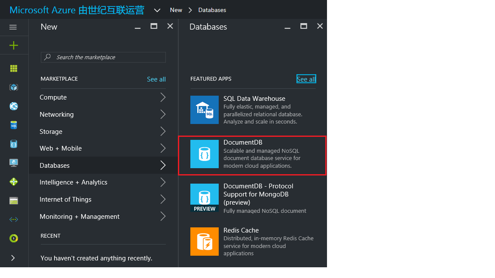
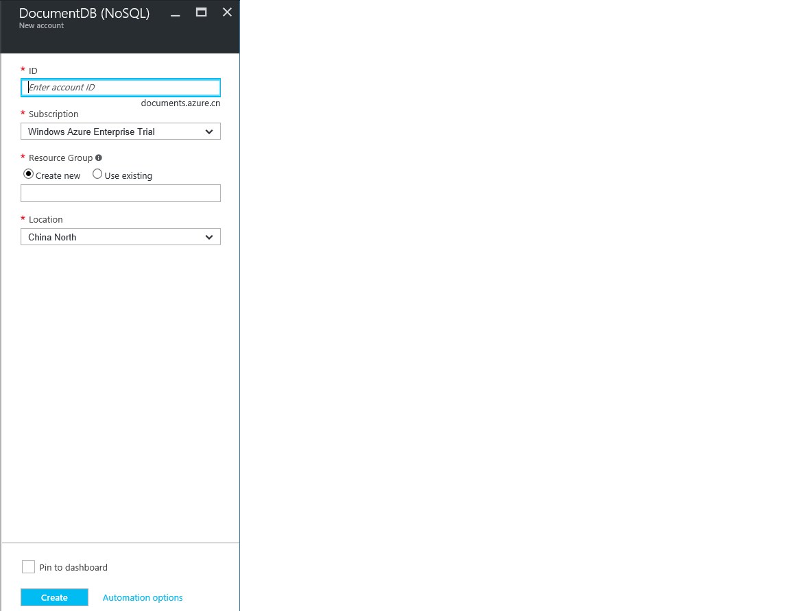

<properties
	pageTitle="如何创建 DocumentDB 帐户 | Azure"
	description="使用 Azure DocumentDB 创建 NoSQL 数据库。遵循本说明文档创建 DocumentDB 帐户，并开始构建运行速度飞快且可全局缩放的 NoSQL 数据库。" 
	keywords="构建数据库"
	services="documentdb"
	documentationCenter=""
	authors="mimig1"
	manager="jhubbard"
	editor="monicar"/>

<tags
	ms.service="documentdb"
	ms.workload="data-services"
	ms.tgt_pltfrm="na"
	ms.devlang="na"
	ms.topic="get-started-article"
	ms.date="09/12/2016"
	ms.author="mimig"
   	wacn.date="10/18/2016"/>  

# 如何使用 Azure 门户创建 DocumentDB NoSQL 帐户

> [AZURE.SELECTOR]
- [Azure 门户](/documentation/articles/documentdb-create-account/)
- [Azure CLI 和 Azure Resource Manager](/documentation/articles/documentdb-automation-resource-manager-cli/)

若要使用 Azure DocumentDB 构建数据库，必须：

- 有一个 Azure 帐户。如果没有 Azure 帐户，可以获取 [Azure 帐户](/pricing/1rmb-trial/)。
- 创建一个 DocumentDB 帐户。

可以使用 Azure 门户、Azure Resource Manager 模板或 Azure 命令行接口 (CLI) 来创建 DocumentDB 帐户。本文说明如何使用 Azure 门户创建 DocumentDB 帐户。若要使用 Azure Resource Manager 或 Azure CLI 创建帐户，请参阅[自动创建 DocumentDB 数据库帐户](/documentation/articles/documentdb-automation-resource-manager-cli/)。

1.	登录到 [Azure 门户](https://portal.azure.cn/)。
2.	在跳转栏中，依次单击“New”、“Databases”、“DocumentDB”。

	  

3. 在“新建帐户”边栏选项卡中，为 DocumentDB 帐户指定所需的配置。

	  

	- 在“ID”框中，输入一个名称用于标识 DocumentDB 帐户。对“ID”进行验证后，“ID”框中会出现一个绿色的复选标记。该“ID”值将成为 URI 中的主机名。“ID”只能包含小写字母、数字及“-”字符，且长度必须为 3 到 50 个字符。请注意，*documents.azure.com* 会追加到所选终结点名称后面，其结果将成为 DocumentDB 帐户终结点。

	- 对于“订阅”，请选择要用于 DocumentDB 帐户的 Azure 订阅。如果帐户只有一个订阅，则默认为选择该帐户。

	- 在“资源组”中，为 DocumentDB 帐户选择或创建资源组。默认创建新的资源组。有关详细信息，请参阅[使用 Azure 门户管理 Azure 资源](/documentation/articles/resource-group-portal/)。

	- 使用“位置”指定在其中托管 DocumentDB 帐户的地理位置。

4.	配置了新的 DocumentDB 帐户后，单击“创建”。若要检查部署状态，请查看“通知中心”。

	  

	  

5.	创建 DocumentDB 帐户之后，即可使用其默认设置。DocumentDB 帐户的默认一致性设置为“会话”。可单击资源菜单中的“默认一致性”调整默认一致性。若要了解有关 DocumentDB 提供的一致性级别的详细信息，请参阅 [DocumentDB 中的一致性级别](/documentation/articles/documentdb-consistency-levels/)。

      

    

[How to: Create a DocumentDB account]: #Howto
[Next steps]: #NextSteps
[documentdb-manage]: /documentation/articles/documentdb-manage/

## 后续步骤

现在你已经有了 DocumentDB 帐户，下一步是创建 DocumentDB 数据库。

可以使用以下项之一来新建数据库：

- Azure 门户，如[使用 Azure 门户创建 DocumentDB 数据库](/documentation/articles/documentdb-create-database/)中所述。
- 包含示例数据的全面教程：[.NET](/documentation/articles/documentdb-get-started/)、[.NET MVC](/documentation/articles/documentdb-dotnet-application/)、[Java](/documentation/articles/documentdb-java-application/)、[Node.js](/documentation/articles/documentdb-nodejs-application/) 或 [Python](/documentation/articles/documentdb-python-application/)。
- 可在 GitHub 中找到 [.NET](/documentation/articles/documentdb-dotnet-samples/#database-examples/)、[Node.js](/documentation/articles/documentdb-nodejs-samples/#database-examples/) 或 [Python](/documentation/articles/documentdb-python-samples/#database-examples/) 示例代码。
- [.NET](/documentation/articles/documentdb-sdk-dotnet/)、[Node.js](/documentation/articles/documentdb-sdk-node/)、[Java](/documentation/articles/documentdb-sdk-java/)、[Python](/documentation/articles/documentdb-sdk-python/) 和 [REST](https://msdn.microsoft.com/zh-cn/library/azure/mt489072.aspx) SDK。

创建数据库后，必须向数据库[添加一个或多个集合](/documentation/articles/documentdb-create-collection/)，然后向集合[添加文档](/documentation/articles/documentdb-view-json-document-explorer/)。

集合中有文档后，可以使用 [DocumentDB SQL](/documentation/articles/documentdb-sql-query/) 对这些文档[执行查询](/documentation/articles/documentdb-sql-query/#executing-queries/)。可以使用门户中的[查询浏览器](/documentation/articles/documentdb-query-collections-query-explorer/)、[REST API](https://msdn.microsoft.com/zh-cn/library/azure/dn781481.aspx) 或其中一个 [SDK](/documentation/articles/documentdb-sdk-dotnet/) 执行查询。

### 了解详细信息

若要详细了解 DocumentDB，请浏览以下资源：

-	[DocumentDB 学习路径](https://azure.microsoft.com/documentation/learning-paths/documentdb/)
-	[DocumentDB 分层资源模型和概念](/documentation/articles/documentdb-resources/)

<!---HONumber=Mooncake_1010_2016-->
