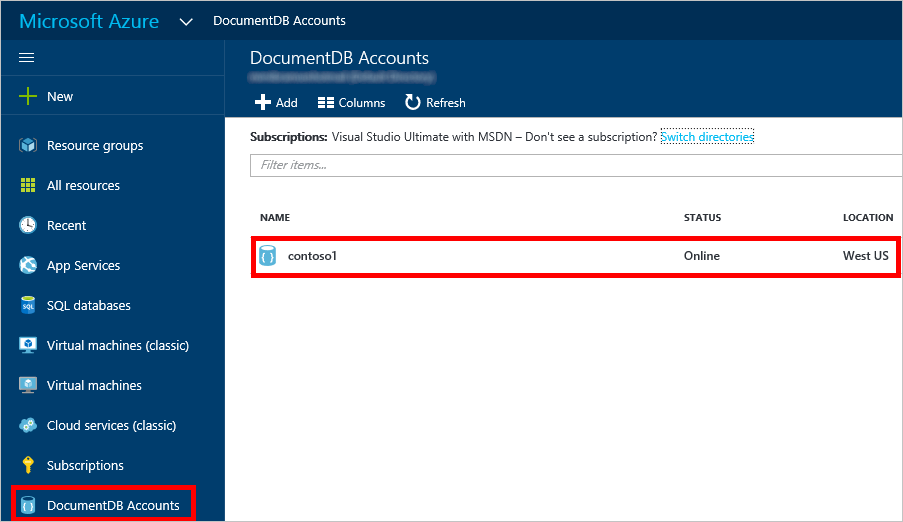
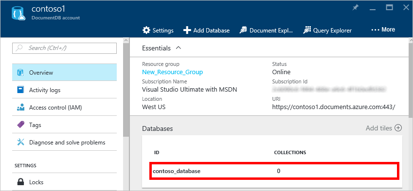
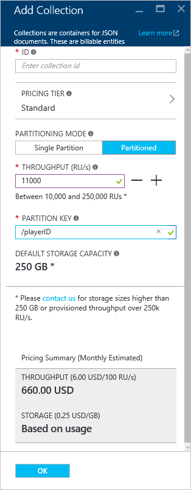
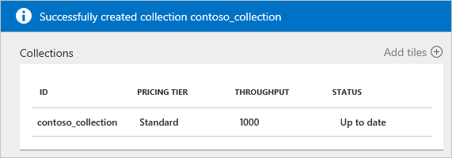

<properties 
	pageTitle="创建 DocumentDB 数据库集合 | Azure" 
	description="了解如何使用在线服务门户预览为 Azure DocumentDB（基于云的 NoSQL 文档数据库）创建 JSON 文档集合。立即获取免费试用版。" 
	services="documentdb" 
	authors="mimig1" 
	manager="jhubbard" 
	editor="monicar" 
	documentationCenter=""/>

<tags 
	ms.service="documentdb" 
	ms.date="08/15/2016" 
	wacn.date="09/12/2016"/>

# 如何使用 Azure 门户创建 DocumentDB 集合

若要使用 Azure DocumentDB，必须拥有 [DocumentDB 帐户](/documentation/articles/documentdb-create-account/)、[数据库](/documentation/articles/documentdb-create-database/)、集合和文档。本主题说明如何在 Azure 门户预览中创建 DocumentDB 集合。

不确定集合是什么？ 请参阅[什么是 DocumentDB 集合？](#what-is-a-documentdb-collection)

1.  在 [Azure 门户预览](https://portal.azure.cn/)的跳转栏中，单击“DocumentDB 帐户”。如果“DocumentDB 帐户”不可见，则单击“浏览”，再单击“DocumentDB 帐户”。

    
    
    如果“DocumentDB 帐户”在 Jumpbar 中不可见，请单击“更多服务”，再单击“DocumentDB 帐户”。如果没有任何列出的帐户，则需要[创建一个 DocumentDB 帐户](/documentation/articles/documentdb-create-account/)。

2. 在所选帐户的“DocumentDB 帐户”边栏选项卡的“数据库”可重用功能区，选择要在其中添加集合的数据库。

      

3. 在“数据库”边栏选项卡中，单击“添加集合”。

	

4. 在“添加集合”边栏选项卡的“ID”框中，输入新集合的 ID。集合名称的长度必须为 1 到 255 个字符，且不能包含 `/ \ # ?` 或尾随空格。对名称进行验证后，ID 框中会出现一个绿色的复选标记。

	

5. 默认情况下，“定价层”设置为“标准”，因此可以为集合自定义吞吐量和存储。有关定价层的详细信息，请参阅 [DocumentDB 中的性能级别](/documentation/articles/documentdb-performance-levels/)。

6. 选择集合的“分区模式”，即“单个分区”或“已分区”。

    **单个分区**保留的存储容量为 10GB，且吞吐量级别可以为每秒 400 个到 10,000 个请求单位（RU/秒）。一个 RU 相当于读取 1KB 文档的吞吐量。有关请求单位的详细信息，请参阅[请求单位](documentdb-request-units.md)。

    **已分区的集合**可以进行伸缩以处理多个分区不限容量的存储，且吞吐量级别最低可以为每秒 10,100 RU/秒。在门户中，能够保留的最大存储空间为 250 GB，能够保留的最大吞吐量为 250,000 RU/秒。若要增大任一配额，请按[请求增加 DocumentDB 帐户配额](/documentation/articles/documentdb-increase-limits/)中的说明提交请求。有关已分区集合的详细信息，请参阅[单个分区和已分区的集合](/documentation/articles/documentdb-partition-data#single-partition-and-partitioned-collections)。

    如果使用“标准”定价层，则可随时返回此边栏选项卡来更改集合的吞吐量。

7. 选择集合的“吞吐量”。若要了解如何估计吞吐量需求，请参阅[估计吞吐量需求](/documentation/articles/documentdb-request-units#estimating-throughput-needs/)和 [Capacity Planner](https://www.documentdb.com/capacityplanner/)。

8. 若要创建已分区的集合，请为集合选择“分区键”。选择正确的分区键对于创建高性能集合而言很重要。有关选择分区键的详细信息，请参阅[设计分区](/documentation/articles/documentdb-partition-data#designing-for-partitioning)。

9. 单击屏幕底部的“确定”，以创建新的集合。

10. 新的集合现在便会出现在“数据库”边栏选项卡上的“集合”可重用功能区中。
 
	

## 什么是 DocumentDB 集合？ 

集合是 JSON 文档和相关联的 JavaScript 应用程序逻辑的容器。集合是一个计费实体，其中[成本](/documentation/articles/documentdb-performance-levels/)由集合的预配吞吐量确定。集合可以跨一个或多个分区/服务器，并且能伸缩以处理几乎无限制增长的存储或吞吐量。

DocumentDB 自动将集合分区到一个或多个物理服务器。创建集合时，你可以指定预配吞吐量（根据每秒的请求单位数）和分区键属性。DocumentDB 会使用此属性的值将文档分布于分区和路由请求（例如查询）之间。分区键值还可作为存储过程和触发器的事务边界。每个集合都有该集合特定的保留吞吐量，且不会与相同帐户中的其他集合共享。因此，你可以在存储和吞吐量方面扩大你的应用程序。

集合与关系数据库中的表不同。集合不强制使用架构；事实上，DocumentDB 不强制使用任何架构，它是无架构的数据库。因此，你可以在同一集合中存储具有不同架构的不同类型的文档。你可以选择使用集合来存储单一类型的对象，就像你对表所做的一样。最佳模型仅取决于数据一起出现在查询和事务中的方式。

## 创建 DocumentDB 集合的其他方法

集合不一定要使用门户来创建，也可使用 [DocumentDB SDK](/documentation/articles/documentdb-sdk-dotnet/) 和 REST API 来创建集合。

- 有关 C# 代码示例，请参阅 [C# 集合示例](/documentation/articles/documentdb-dotnet-samples/#collection-examples)。
- 有关 Node.js 代码示例，请参阅 [Node.js 集合示例](/documentation/articles/documentdb-nodejs-samples/#collection-examples)。
- 有关 Python 代码示例，请参阅 [Python 集合示例](/documentation/articles/documentdb-python-samples/#collection-examples)。
- 有关 REST API 示例，请参阅[创建集合](https://msdn.microsoft.com/library/azure/mt489078.aspx)。

## 故障排除

如果 Azure 门户预览中的“添加集合”被禁用，则表明你的帐户当前已被禁用，这种情况通常会在当月的所有权益信用额度都用完时发生。

## 后续步骤

现在，你已有了集合，下一步是将文档添加或导入到集合中。向集合添加文档时，你有以下几种选择：

- 可以使用门户中的文档资源管理器来[添加文档](/documentation/articles/documentdb-view-json-document-explorer/)。
- 可以使用 DocumentDB 数据迁移工具来[导入文档和数据](/documentation/articles/documentdb-import-data/)，利用此工具可以导入 JSON 和 CSV 文件，以及来自 SQL Server、MongoDB、Azure 表存储及其他 DocumentDB 集合的数据。
- 也可以使用某个 [DocumentDB SDK](/documentation/articles/documentdb-sdk-dotnet/) 来添加文档。DocumentDB 有 .NET、Java、Python、Node.js 和 JavaScript API SDK。有关说明如何使用 DocumentDB .NET SDK 处理文档的 C# 代码示例，请参阅 [C# 文档示例](/documentation/articles/documentdb-dotnet-samples/#document-examples)。有关说明如何使用 DocumentDB Node.js SDK 处理文档的 Node.js 代码示例，请参阅 [Node.js 文档示例](/documentation/articles/documentdb-nodejs-samples/#document-examples)。

当集合中有文档后，你就可以利用门户预览中的[查询资源管理器](/documentation/articles/documentdb-query-collections-query-explorer/)、[REST API](https://msdn.microsoft.com/library/azure/dn781481.aspx) 或某个 [SDK](/documentation/articles/documentdb-sdk-dotnet/)，来针对文档使用 [DocumentDB SQL](/documentation/articles/documentdb-sql-query/) [执行查询](/documentation/articles/documentdb-sql-query/#executing-queries)。

<!---HONumber=Mooncake_0905_2016-->