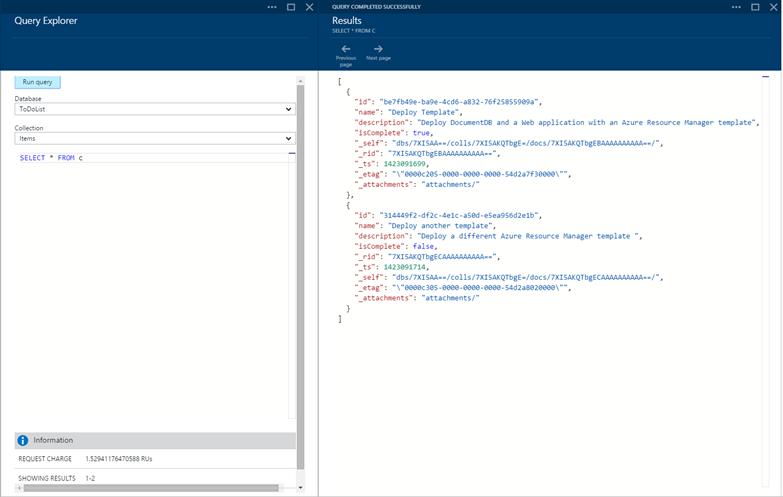
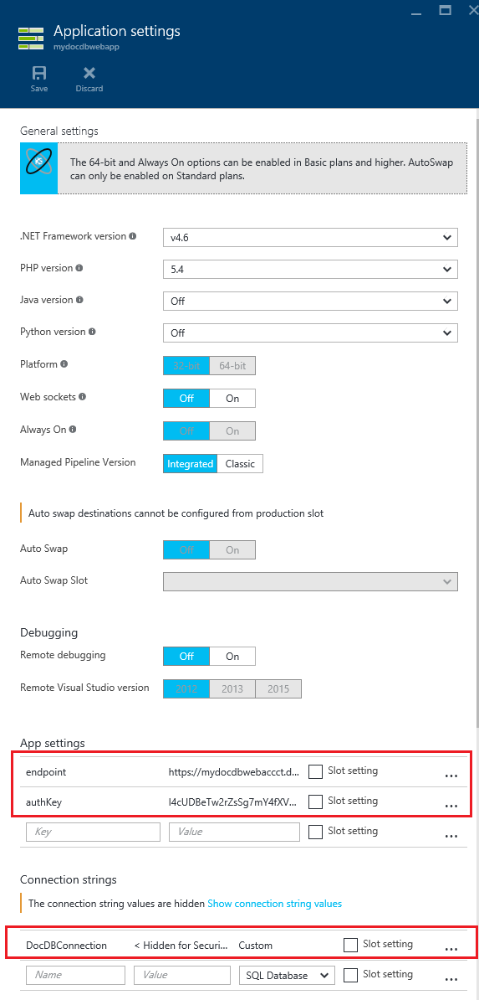

<properties 
	pageTitle="使用 Azure Resource Manager 模板部署 DocumentDB 和 Azure App Service Web Apps | Azure" 
	description="了解如何使用 Azure Resource Manager 模板部署 DocumentDB 帐户、Azure App Service Web Apps 以及示例 Web 应用程序。" 
	services="documentdb, app-service\web" 
	authors="stephbaron" 
	manager="jhubbard" 
	editor="monicar" 
	documentationCenter=""/>

<tags 
	ms.service="documentdb" 
	ms.workload="data-services" 
	ms.tgt_pltfrm="na" 
	ms.devlang="na" 
	ms.topic="article" 
	ms.date="08/02/2016" 
	wacn.date="10/18/2016" 
	ms.author="hawong"/>  

# 使用 Azure Resource Manager 模板部署 DocumentDB 和 Azure App Service Web Apps

本教程说明如何使用 Azure Resource Manager 模板来部署和集成 [Azure DocumentDB](/home/features/documentdb/)、[Azure 应用服务](/documentation/articles/app-service-changes-existing-services/) Web 应用以及示例 Web 应用程序。

使用 Azure Resource Manager 模板，你可以轻松自动化 Azure 资源的部署和配置。本教程演示如何部署 Web 应用程序，以及自动配置 DocumentDB 帐户的连接信息。

完成本教程后，你将能够回答以下问题：

-	如何使用 Azure Resource Manager 模板来部署和集成 DocumentDB 帐户与 Azure App Service 中的 Web 应用？
-	如何使用 Azure Resource Manager 模板来部署和集成 DocumentDB 帐户、App Service Web Apps 中的 Web 应用以及 Webdeploy 应用程序？

## 先决条件
> [AZURE.TIP] 虽然本教程不会假设先前有使用 Azure Resource Manager 模板或 JSON 的经验，但是，如果你想修改引用的模板或部署选项，则需要有其中每个领域的知识。

在按照本教程中的说明操作之前，请确保已有下列各项：

- Azure 订阅。Azure 是基于订阅的平台。有关获得订阅的详细信息，请参阅[购买选项](/pricing/purchase-options/)或[试用版](/pricing/1rmb-trial/)。

##步骤 1：下载模板文件 ##
让我们从下载模板文件开始，我们将在本教程中使用这些文件。

1. 将“创建 DocumentDB 帐户、Web 应用和部署演示应用程序示例”模板下载到本地文件夹（例如 C:\\DocumentDBTemplates）。此模板将部署 DocumentDB 帐户、App Service Web 应用和 Web 应用程序。它还会自动配置 Web 应用程序，以连接到 DocumentDB 帐户。

2. 将“创建 DocumentDB 帐户和 Web 应用示例”模板下载到本地文件夹（例如 C:\\DocumentDBTemplates）。此模板将部署 DocumentDB 帐户、App Service Web 应用，并修改站点的应用程序设置以便轻松地呈现 DocumentDB 连接信息，但不包含 Web 应用程序。

##步骤 2：部署 DocumentDB 帐户、App Service Web 应用和演示应用程序示例

现在让我们来部署第一个模板。

> [AZURE.TIP] 该模板不会验证下面输入的 Web 应用名称和 DocumentDB 帐户名称是否 a) 有效以及 b) 可用。强烈建议在提交部署之前，先确认你打算提供的名称的可用性。

1. 登录到 [Azure 门户预览](https://portal.azure.cn)，单击“新建”并搜索“模板部署”。
	

2. 选择模板部署项并单击“创建” 
	

3.  单击“编辑模板”，粘贴 DocDBWebsiteTodo.json 模板文件的内容，然后单击“保存”。
	

4. 单击“编辑参数”，为每个必需参数提供值，然后单击“确定”。参数如下：

	1. SITENAME：指定应用服务 Web 应用名称，该名称用来构造将用于访问 Web 应用的 URL（例如，如果指定“mydemodocdbwebapp”，则用于访问 Web 应用的 URL 将是 mydemodocdbwebapp.chinacloudsites.cn）。

	2. HOSTINGPLANNAME：指定要创建的 App Service 托管计划的名称。

	3. LOCATION：指定要在其中创建 DocumentDB 和 Web 应用资源的 Azure 位置。

	4. DATABASEACCOUNTNAME：指定要创建的 DocumentDB 帐户的名称。

	  

5. 选择现有的资源组或提供名称以创建新的资源组，然后选择资源组的位置。
  
6.  依次单击“查看法律条款”、“购买”和“创建”以开始部署。选择“固定到仪表板”，让生成的部署轻松显示在 Azure 门户预览的主页上。
	

7.  部署完成后，将会打开“资源组”边栏选项卡。
	

8.  若要使用应用程序，只需导航到 Web 应用 URL（上述示例中的 URL 会是 http://mydemodocdbwebapp.chinacloudsites.cn）。你会看到下列 Web 应用程序：

	  

9. 继续在 Web 应用中创建几个任务，然后返回到 Azure 门户预览中的资源组边栏选项卡。单击“资源”列表中的“DocumentDB 帐户”资源，然后单击“查询浏览器”。
	

10. 运行默认查询“SELECT * FROM c”，并检查结果。请注意，查询已检索你在上面的步骤 7 中创建的待办事项的 JSON 表示形式。随意尝试查询；例如，尝试运行 SELECT * FROM c WHERE c.isComplete = true，以返回所有标记为完成的待办事项。

	  

11. 任意体验 DocumentDB 门户预览，或修改示例待办事项应用程序。当你准备好时，让我们来部署另一个模板。
	
## 步骤 3：部署 DocumentDB 帐户和 Web 应用示例

现在让我们来部署第二个模板。此模板可用于演示如何将帐户终结点和主密钥等 DocumentDB 连接信息插入 Web 应用，作为应用程序设置或自定义连接字符串。例如，你或许有想要使用 DocumentDB 帐户部署的 Web 应用程序，以及在部署期间自动填充的连接信息。

> [AZURE.TIP] 该模板不会验证下面输入的 Web 应用名称和 DocumentDB 帐户名称是否 a) 有效以及 b) 可用。强烈建议在提交部署之前，先确认你打算提供的名称的可用性。

1. 在 [Azure 门户预览](https://portal.azure.cn)中，单击“新建”并搜索“模板部署”。
	

2. 选择模板部署项并单击“创建” 
	

3.  单击“编辑模板”，粘贴 DocDBWebSite.json 模板文件的内容，然后单击“保存”。
	

4. 单击“编辑参数”，为每个必需参数提供值，然后单击“确定”。参数如下：

	1. SITENAME：指定应用服务 Web 应用名称，该名称用来构造将用于访问 Web 应用的 URL（例如，如果指定“mydemodocdbwebapp”，则用于访问 Web 应用的 URL 将是 mydemodocdbwebapp.chinacloudsites.cn）。

	2. HOSTINGPLANNAME：指定要创建的 App Service 托管计划的名称。

	3. LOCATION：指定要在其中创建 DocumentDB 和 Web 应用资源的 Azure 位置。

	4. DATABASEACCOUNTNAME：指定要创建的 DocumentDB 帐户的名称。

	  

5. 选择现有的资源组或提供名称以创建新的资源组，然后选择资源组的位置。
	
  
6.  依次单击“查看法律条款”、“购买”和“创建”以开始部署。选择“固定到仪表板”，让生成的部署轻松显示在 Azure 门户预览的主页上。
	

7.  部署完成后，将会打开“资源组”边栏选项卡。
	

8. 单击“资源”列表中的“Web 应用”资源，然后单击“应用程序设置”
	

9. 注意出现的 DocumentDB 终结点和每个 DocumentDB 主密钥的应用程序设置。
	

10. 继续随意浏览 Azure 门户预览，或按照其中一个 DocumentDB [示例](/documentation/articles/documentdb-dotnet-samples/)来创建自己的 DocumentDB 应用程序。

	
	

## 后续步骤

祝贺你！ 你已使用 Azure Resource Manager 模板部署了 DocumentDB、App Service Web 应用以及示例 Web 应用程序。

- 若要了解有关 DocumentDB 的详细信息，请单击[此处](/documentation/services/documentdb/)。
- 若要了解有关 Azure 应用服务 Web 应用的详细信息，请单击[此处](/documentation/services/web-sites/)。
- 若要了解有关 Azure Resource Manager 模板的详细信息，请单击[此处](https://msdn.microsoft.com/zh-cn/library/azure/dn790549.aspx)。

## 发生的更改
* 有关从网站更改为 App Service 的指南，请参阅 [Azure App Service 及其对现有 Azure 服务的影响](/documentation/articles/app-service-changes-existing-services/)
* 有关从旧门户更改为新门户的指南，请参阅：[有关在 Azure 经典管理门户中导航的参考](/documentation/articles/app-service-web-app-azure-portal/)

 

<!---HONumber=Mooncake_1010_2016-->
