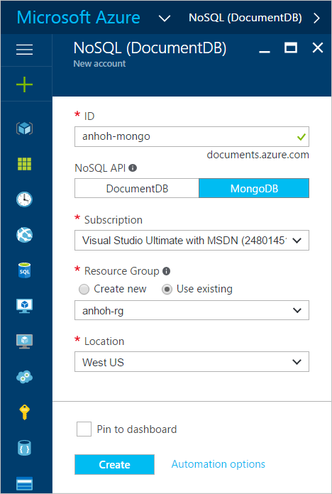

<properties 
	pageTitle="创建具有 MongoDB 协议支持的 DocumentDB 帐户 | Azure" 
	description="了解如何创建具有 MongoDB 协议支持的 DocumentDB 帐户（目前以预览版提供）。" 
	services="documentdb" 
	authors="stephbaron" 
	manager="jhubbard" 
	editor="" 
	documentationCenter=""/>

<tags 
	ms.service="documentdb" 
	ms.workload="data-services" 
	ms.tgt_pltfrm="na" 
	ms.devlang="na" 
	ms.topic="article" 
	ms.date="08/23/2016" 
	ms.author="stbaro"
   	wacn.date="10/18/2016"/>  

# 如何使用 Azure 门户预览创建具有 MongoDB 协议支持的 DocumentDB 帐户

若要创建具有 MongoDB 协议支持的 Azure DocumentDB 帐户，必须：

- 有一个 Azure 帐户。如果没有 Azure 帐户，可以获取 [Azure 帐户](/pricing/1rmb-trial/)。

## 创建帐户  

若要创建具有 MongoDB 协议支持的 DocumentDB 帐户，请执行以下步骤。

1. 在新窗口中，登录到 [Azure 门户预览](https://portal.azure.cn)。
2. 依次单击“新建”、“数据 + 存储”、“查看所有”，然后搜索“DocumentDB 协议”的“数据 + 存储”类别。单击“DocumentDB - MongoDB 协议支持”。

	

3. 或者，在“存储”下面的“数据 + 存储”类别中，单击“更多”，然后单击“加载更多”一次或多次，以显示“DocumentDB - MongoDB 协议支持”。单击“DocumentDB - MongoDB 协议支持”。

	

4. 在“DocumentDB - MongoDB 协议支持(预览版)”边栏选项卡中，单击“创建”以启动预览版注册过程。

	

5. 在“DocumentDB 帐户”边栏选项卡中，单击“注册预览版”。阅读信息，然后单击“确定”。

	

6.  接受预览版条款之后，你将返回到“创建”边栏选项卡。在“DocumentDB 帐户”边栏选项卡中，为帐户指定所需的配置。

	

	- 在“ID”框中，输入一个名称用于标识帐户。对“ID”进行验证后，“ID”框中会出现一个绿色的复选标记。该“ID”值将成为 URI 中的主机名。“ID”只能包含小写字母、数字及“-”字符，且长度必须为 3 到 50 个字符。请注意，*documents.azure.com* 会追加到所选择的终结点名称，其结果将成为帐户终结点。

	- 对于“订阅”，请选择要用于帐户的 Azure 订阅。如果帐户只有一个订阅，则默认为选择该帐户。

	- 在“资源组”中，为帐户选择或创建资源组。默认情况下，会选择 Azure 订阅下的现有资源组。但是，可以选择创建要将帐户添加到其中的新资源组。有关详细信息，请参阅[使用 Azure 门户预览管理 Azure 资源](/documentation/articles/resource-group-portal/)。

	- 使用“位置”指定在其中托管帐户的地理位置。
   
	- 选中“固定到仪表板”

7.	在配置了新的帐户选项后，单击“创建”。可能需要几分钟来创建帐户。要检查状态，可以在启动板上监视进度。
	

	或者，可以从通知中心监视进度。

	  

	

8.	创建帐户之后，可随时将它与默认设置结合使用。

	
	

## 后续步骤

- 了解如何[连接](/documentation/articles/documentdb-connect-mongodb-account/)到具有 MongoDB 协议支持的 DocumentDB 帐户。

 

<!---HONumber=Mooncake_1010_2016-->
