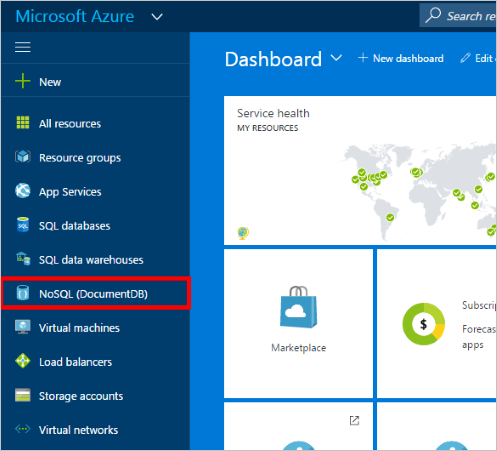
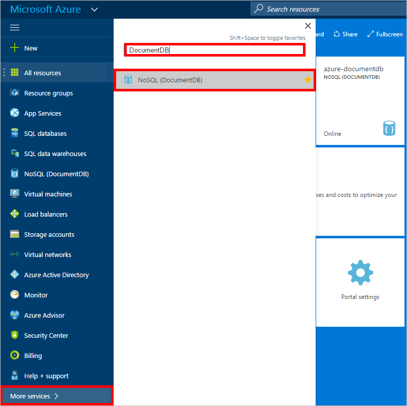
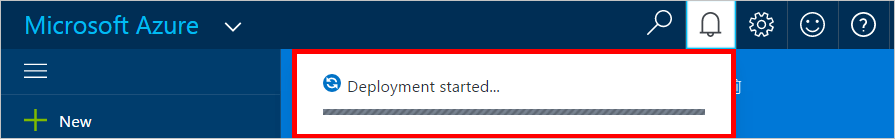
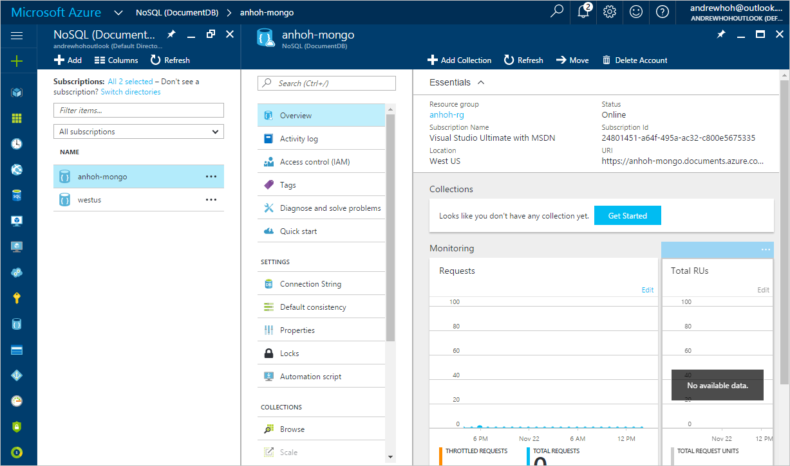

<properties
    pageTitle="创建与 MongoDB 应用配合使用的 DocumentDB 帐户 | Azure"
    description="使用本教程了解如何创建具有 MongoDB 协议支持的 DocumentDB 帐户（目前以预览版提供）。"
    keywords="mongodb 应用, mongodb 应用"
    services="documentdb"
    author="AndrewHoh"
    manager="jhubbard"
    editor=""
    documentationcenter="" />
<tags
    ms.assetid="413f3ae1-a68e-43be-b0d7-fa2987644f3e"
    ms.service="documentdb"
    ms.workload="data-services"
    ms.tgt_pltfrm="na"
    ms.devlang="na"
    ms.topic="article"
    ms.date="11/24/2016"
    wacn.date="01/23/2017"
    ms.author="anhoh" />  

# 创建与 MongoDB 应用配合使用的 DocumentDB 帐户
现在可以将 DocumentDB 数据库用作为 MongoDB 编写的应用的数据存储。若要使用此功能，需要一个 Azure 帐户和一个 DocumentDB 帐户。本教程指导完成创建与 MongoDB 应用配合使用的 DocumentDB 帐户的过程。

## 先决条件
一个 Azure 帐户。如果没有 Azure 帐户，请立即创建 [Azure 帐户](/pricing/1rmb-trial/)。
## 创建 DocumentDB 帐户

1. 在 Internet 浏览器中，登录 [Azure 门户预览](https://portal.azure.cn)。
2. 在左侧导航栏中，单击“NoSQL \(DocumentDB\)”。

      

3. 或者，单击“更多服务 \>”，在顶部搜索栏中键入 **DocumentDB**，然后单击“NoSQL \(DocumentDB\)”。

      

4. 在“NoSQL \(DocumentDB\)”边栏选项卡顶部，单击顶部操作栏中的“+ 添加”。

      

5. 在“DocumentDB 帐户”边栏选项卡中，为帐户指定所需的配置。

	

    - 在“ID”框中，输入一个名称用于标识帐户。对“ID”进行验证后，“ID”框中会出现一个绿色的复选标记。该“ID”值将成为 URI 中的主机名。“ID”只能包含小写字母、数字及“-”字符，且长度必须为 3 到 50 个字符。请注意， *documents.azure.com* 会追加到所选择的终结点名称，其结果将成为帐户终结点。

    - 对于 **NoSQL API**，请选择“MongoDB”。此选项可指定想要用于与 DocumentDB 数据库进行交互的通信 API。

    - 对于“订阅”，请选择要用于帐户的 Azure 订阅。如果帐户只有一个订阅，则默认为选择该帐户。

    - 在“资源组”中，为帐户选择或创建资源组。默认情况下，会选择 Azure 订阅下的现有资源组。但是，可以选择创建要将帐户添加到其中的新资源组。有关详细信息，请参阅[使用 Azure 门户预览管理 Azure 资源](/documentation/articles/resource-group-portal/)。

    - 使用“位置”指定在其中托管帐户的地理位置。

6. 在配置了新的帐户选项后，单击“创建”。可能需要几分钟来创建帐户。

   可通过通知中心监视进度。

     

7. 若要访问新帐户，请单击左侧菜单上的“DocumentDB \(NoSQL\)”。在常规的 DocumentDB 帐户和具有 Mongo 协议支持的 DocumentDB 帐户列表中，单击新帐户的名称。
8. DocumentDB 帐户现在可用于 MongoDB 应用。

     

## 后续步骤
- 了解如何[连接](/documentation/articles/documentdb-connect-mongodb-account/)到具有 MongoDB 协议支持的 DocumentDB 帐户。

<!---HONumber=Mooncake_0109_2017-->
<!---Update_Description: wording update -->
