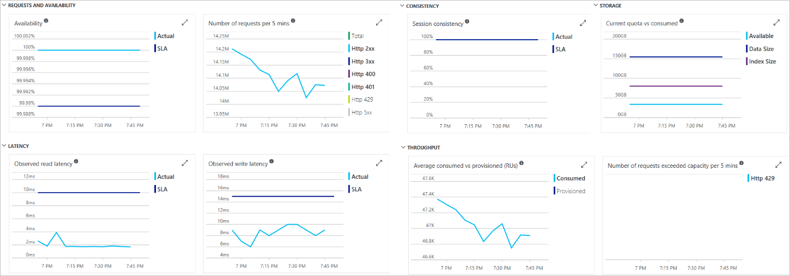

<properties
    pageTitle="使用 DocumentDB 全局分发数据 | Azure"
    description="了解如何通过 Azure DocumentDB（一种完全托管的 NoSQL 数据库服务），使用全局数据库进行全球范围的异地复制、故障转移和数据恢复。"
    services="documentdb"
    documentationcenter=""
    author="arramac"
    manager="jhubbard"
    editor="" />
<tags
    ms.assetid="ba5ad0cc-aa1f-4f40-aee9-3364af070725"
    ms.service="documentdb"
    ms.devlang="multiple"
    ms.topic="article"
    ms.tgt_pltfrm="na"
    ms.workload="na"
    ms.date="01/10/2017"
    wacn.date="02/27/2017"
    ms.author="arramac" />  

# DocumentDB - Azure 上的全球分布式数据库服务
Azure 无所不在 - 跨 30 多个地理区域，遍布全球并且仍在持续扩展中。遍及全球的 Azure 为开发人员提供一种差异化功能，让他们轻松构建、部署和管理全球分布的应用程序。DocumentDB 是 Microsoft 分布在全球各地的多租户数据库系统，旨在让开发人员构建全球规模的应用程序。使用 DocumentDB 可跨数目不限的地理区域弹性缩放吞吐量与存储。该服务提供 P99 的低延迟、99.99% 的可用性和可预测的吞吐量保证，以及[多个完善定义的一致性模型](/documentation/articles/documentdb-consistency-levels/) - 都有全面的 SLA 提供保障。借助其[架构无关的、写入优化的数据库引擎](http://www.vldb.org/pvldb/vol8/p1668-shukla.pdf)，DocumentDB 默认能够以规模无关的方式，自动为其引入并提供给 [SQL](/documentation/articles/documentdb-sql-query/)、[MongoDB](/documentation/articles/documentdb-protocol-mongodb/) 和 [JavaScript 语言集成的查询](/documentation/articles/documentdb-programming/#javascript-language-integrated-query-api/)的所有数据编制索引。作为一种云服务，DocumentDB 从头经过严谨的设计，支持多租户并在全球分布。

**已分区并分布在三个 Azure 区域的单个 DocumentDB 集合**

  

我们在构建 DocumentDB 时已经了解到，添加全球分布性是当务之急 - 不能只是定位在“单站点”数据库系统上。全球分布式数据库提供的功能远远超过“单站点”数据库提供的传统地区性灾难恢复（异地灾难恢复）功能。提供异地灾难恢复功能的单站点数据库是分布在全球各地的数据库的严格子集。

使用 DocumentDB 周全的全局分布功能，开发人员可以通过数据库日志采用 Lambda 模式（例如，AWS DynamoDB 复制），或跨多个区域执行“重复写入”，而无需构建自己的复制基架。由于无法确保这些做法的正确性并提供完善的 SLA，因此我们不建议使用此类做法。

本文提供 DocumentDB 全球分布功能的概述。另外，介绍 DocumentDB 提供全面 SLA 的独特方式。

## 启用周全的全球分发
DocumentDB 提供以下功能让你轻松编写全球规模的应用程序。可以通过 DocumentDB 的基于资源提供程序的 [REST API](https://docs.microsoft.com/rest/api/documentdbresourceprovider/) 以及 Azure 门户预览来获取这些功能。

### 遍及各个区域 
Azure 通过将新的地理区域上线，不断扩大其地理覆盖范围。默认情况下，在所有新的 Azure 区域中都可使用 DocumentDB。这样，一旦 Azure 开辟了新的业务区域，你就能将某个地理区域与 DocumentDB 数据库帐户相关联。

**默认情况下，在所有 Azure 区域中都可使用 DocumentDB**

  

### 将数目不限的区域与 DocumentDB 数据库帐户相关联
在 DocumentDB 中，可将任意数量的 Azure 区域与 DocumentDB 数据库帐户相关联。除了地域隔离限制（例如在中国和德国）以外，可与 DocumentDB 数据库帐户关联的区域数目没有限制。下图显示了配置为跨 21 个 Azure 区域的数据库帐户。

**某个租户的跨 21 个 Azure 区域的 DocumentDB 数据库帐户**

  

### 基于策略的地域隔离
DocumentDB 在设计上提供基于策略的地域隔离功能。地域隔离是一个重要组件，确保遵循数据监管与法规遵循限制，防止将特定的地区与帐户相关联。地域隔离的例子包括但不限于：不能超过主权云（例如中国和德国）或政府税务边界（例如澳洲）界定各区域的全局分布范畴。策略是使用 Azure 订阅的元数据控制的。

### 动态添加和删除区域
DocumentDB 允许随时在数据库帐户中添加（关联）或删除（取消关联）区域（参阅[上图](#UnlimitedRegionsPerAccount)）。通过跨分区并行复制数据，DocumentDB 可确保新的区域上线后 30 分钟内即可在全球任何位置使用 DocumentDB（最多存储 100 TB 数据）。

### 故障转移优先级
为了在出现多个区域性故障时准确控制区域故障转移的顺序，DocumentDB 允许将优先级关联到与数据库帐户关联的各个区域（参阅下图）。DocumentDB 确保自动故障转移顺序以指定的优先顺序发生。

**DocumentDB 的租户可以针对与数据库帐户关联的区域配置故障转移优先顺序（右窗格）**

  

### 以动态方式使区域“离线”
DocumentDB 允许让数据库帐户在特定区域离线，之后再让其重新上线。标记为“离线”的区域不主动参与复制，且不包括在故障转移顺序中。这样，用户便可以在具有潜在风险的升级推出到应用程序之前，在一个读取区域中冻结上一个已知良好的数据库映像。

### 用于全局复制数据库的多个完善定义的一致性模型
DocumentDB 公开由 SLA 提供支持的[多个完善定义的一致性级别](/documentation/articles/documentdb-consistency-levels/)。可根据工作负荷/方案选择特定的一致性模型（从可用的选项列表中选择）。

### 可优化的全局复制数据库一致性
DocumentDB 允许基于每个请求在运行时以编程方式重写和放宽默认的一致性选择。

### 可动态配置的读取和写入区域
DocumentDB 允许将区域配置为“读取”、“写入”或“读/写”区域（与数据库关联）。

### 跨 Azure 区域灵活缩放吞吐量
能够以编程方式预配吞吐量，灵活缩放 DocumentDB 集合。吞吐量将应用到分发集合的所有区域。

### 异地-本地读取和写入
全球分布式数据库的主要优势是能够在世界各地以较低的延迟访问数据。DocumentDB 针对各种数据库操作提供 P99 的低延迟保证。它确保所有读取都会路由到最靠近的本地读取区域。为读取请求提供服务时，将使用发出读取请求的区域的本地仲裁；这同样适用于写入。只有在大多数副本已在本地持久提交写入但没有针对远程副本（用于确认写入）限制写入确认时，才会确认写入。换言之，DocumentDB 复制协议是根据以下假设运行的：读取和写入仲裁始终分别位于发出请求的读取和写入区域的本地。

### 手动启动区域性故障转移
使用 DocumentDB 可以触发数据库帐户的故障转移，以验证整个应用程序（而不仅仅是数据库）的*端到端*可用性属性。由于故障检测和前导选择的安全与活跃度属性均得到了保证，DocumentDB 可确保租户启动的手动故障转移操作实现*零数据丢失*。

### 自动故障转移
DocumentDB 支持在发生一个或多个区域性故障时自动进行故障转移。区域性故障转移期间，DocumentDB 会保持其读取延迟率、运行时间可用性、一致性和吞吐量 SLA。DocumentDB 对完成自动故障转移操作的持续时间实施上限。这是区域性故障期间潜在的数据丢失时间段。

### 旨在实现不同的故障转移粒度
目前，自动和手动故障转移功能以数据库帐户的粒度公开。请注意，在内部，DocumentDB 旨在以更细的数据库、集合或甚至（拥有一系列键的集合的）分区粒度提供*自动*故障转移。

### 多宿主 API
DocumentDB 允许使用逻辑（与区域无关）或物理（特定于区域）终结点与数据库交互。使用逻辑终结点可确保发生故障转移时，应用程序可以透明方式采用多个宿主。后者（物理终结点）提供对应用程序的细粒度控制，将读取和写入重定向到特定区域。

### 透明且一致的数据库架构和索引迁移 
DocumentDB 完全与[架构无关](http://www.vldb.org/pvldb/vol8/p1668-shukla.pdf)。其数据库引擎的特殊设计允许其自动且同步地索引所有其引入的数据，而无需要求用户提供任何架构或辅助索引。这使用户能够快速地循环访问全局分布式应用程序，而无需担心数据库架构和索引迁移或者协调多阶段应用程序的架构更改推出。DocumentDB 保证用户对索引策略进行的任何显式更改不会导致性能或可用性的降低。

### 全面的 SLA（不只是高可用性）
作为一种全球分布式数据库服务，无论与数据库关联的区域数量是多少，DocumentDB 都可为整个数据库提供针对**数据丢失**、**可用性**、**P99 的延迟**、**吞吐量**和**一致性**的完善定义的 SLA。

## 延迟保证
DocumentDB 等全球分布式数据库服务的主要优势是能够在世界各地以较低的延迟访问数据。DocumentDB 针对各种数据库操作提供 P99 的低延迟保证。DocumentDB 采用的复制协议确保数据库操作（理想情况下，读取和写入均适用）始终在客户端的本地区域执行。DocumentDB 的延迟 SLA 包括对读取、（同步）索引写入和各种大小的请求和响应的查询均实现 P99。写入的延迟保证包括持久的本地数据中心内的大多数仲裁提交。

### 延迟与一致性的关系 
为使全球分布式服务在全球分布式设置中提供较强的一致性，它需要同步复制写入或同步执行跨区域读取 - 光速和广域网可靠性决定了较强的一致性会导致数据库操作的高延迟和低可用。因此，为了提供有保证的 P99 低延迟和 99.99 的可用性，该服务必须采用异步复制。这进而还会要求服务必须提供[完善定义且宽松的一致性选项](/documentation/articles/documentdb-consistency-levels/) - 相比“强”而言较弱的（提供低延迟和可用性保证）且理想情况下强于“最终”一致性（提供直观的编程模型）。

DocumentDB 确保无需读取操作便可跨多个区域联系副本，提供特定的一致性级别保证。同样，它可确保跨所有区域复制数据（即跨各区域异步复制写入）时不会阻止写入操作。对于多区域数据库帐户，提供了多个宽松的一致性级别。

### 延迟与可用性的关系 
延迟与可用性类似于同一硬币的两面。我们讨论的是出现故障时的操作延迟（稳定状态下）和可用性。从应用程序角度来看，慢速运行的数据库操作与不可用的数据库没有区别。

为将高延迟与不可用区分开来，DocumentDB 针对各种数据库操作的延迟提供绝对上限。如果数据库操作完成所用时间超过上限，DocumentDB 将返回超时错误。DocumentDB 可用性 SLA 确保根据可用性 SLA 计算超时。

### 延迟与吞吐量的关系
DocumentDB 不会让用户在延迟和吞吐量之间做出选择。它遵循 SLA，两者延迟均为 P99 并提供预配的吞吐量。

## 一致性保证
虽然[强一致性模型](http://cs.brown.edu/~mph/HerlihyW90/p463-herlihy.pdf)是可编程性的黄金标准，但该模型导致的延迟代价太高（稳定状态下）且会损失可用性（遇到故障时）。

DocumentDB 为用户提供了完善定义的编程模型，用于推断复制数据的一致性。为使用户能够生成多宿主应用程序，DocumentDB 公开的一致性模型设计为与区域无关，且不依赖进行读取和写入的区域。

DocumentDB 的一致性 SLA 可保证 100% 的读取请求满足所请求的一致性级别的一致性保证（数据库帐户上的默认一致性级别或请求上的重写值）。如果满足与一致性级别关联的所有一致性保证，则读取请求被视为已满足一致性 SLA。下表列出了与 DocumentDB 提供的特定一致性级别相对应的一致性保证。

**与 DocumentDB 中给定的一致性级别关联的一致性保证**

<table>
	<tr>
		<td><strong>一致性级别</strong></td>
		<td><strong>一致性特征</strong></td>
		<td><strong>SLA</strong></td>
	</tr>
	<tr>
		<td rowspan="3">会话</td>
		<td>读取自己的写入内容</td>
		<td>100%</td>
	</tr>
	<tr>
		<td>单调读取</td>
		<td>100%</td>
	</tr>
	<tr>
		<td>一致前缀</td>
		<td>100%</td>
	</tr>
	<tr>
		<td rowspan="3">有限过期</td>
		<td>单调读取（区域内部）</td>
		<td>100%</td>
	</tr>
	<tr>
		<td>一致前缀</td>
		<td>100%</td>
	</tr>
	<tr>
		<td>过期期限 &lt; K,T</td>
		<td>100%</td>
	</tr>
	<tr>
		<td>最终</td>
		<td>一致前缀</td>
		<td>100%</td>
	</tr>
	<tr>
		<td>强</td>
		<td>线性化</td>
		<td>100%</td>
	</tr>
</table>

### 一致性与可用性的关系
[CAP 定理](https://people.eecs.berkeley.edu/~brewer/cs262b-2004/PODC-keynote.pdf)的[不可能结果](http://www.glassbeam.com/sites/all/themes/glassbeam/images/blog/10.1.1.67.6951.pdf)证明遇到故障时，系统确实不可能保持可用并提供线性一致性。数据库服务必须选择采用 CP 还是 AP - CP 系统会放弃可用性以支持线性一致性，而 AP 系统会放弃[线性一致性](http://cs.brown.edu/~mph/HerlihyW90/p463-herlihy.pdf)以支持可用性。DocumentDB 绝不会违反所请求的一致性级别，由此可准确判断其为 CP 系统。但在实践中，一致性并不是一个“全有或者全无”的命题 - 介于线性一致性和最终一致性之间的一致性范畴中还存在多个定义完善的一致性模型。在 DocumentDB 中，我们已尝试通过现实世界的适用性和直观的编程模型来确定多个宽松的一致性模型。DocumentDB 通过提供 99.99 的可用性 SLA 和[多个宽松且完善定义的一致性级别](/documentation/articles/documentdb-consistency-levels/)，进行一致性与可用性的权衡取舍。

### 一致性与延迟的关系
Prof.Daniel Abadi 提出了更全面的 CAP 变体，名为 [PACELC](http://cs-www.cs.yale.edu/homes/dna/papers/abadi-pacelc.pdf)，该变体也用于稳定状态下的延迟和一致性的权衡取舍。该定理认为在稳定状态下，数据库系统必须在一致性和延迟间做出选择。通过多个宽松的一致性模型（由异步复制和本地读取、写入仲裁提供支持），DocumentDB 可确保所有读取和写入分别在读取和写入区域本地进行。这允许 DocumentDB 针对一致性级别在区域内提供低延迟保证。

### 一致性与吞吐量的关系
由于特定一致性模型的实现依赖于所选的[仲裁类型](http://cs.brown.edu/~mph/HerlihyW90/p463-herlihy.pdf)，因此吞吐量也会根据所选一致性而有所不同。例如，在 DocumentDB 中，强一致读取的吞吐量大约是最终一致读取的一半。
 
**DocumentDB 中特定一致性级别的读取容量关系**

  

## 吞吐量保证 
DocumentDB 允许根据需求，灵活地跨不同区域缩放吞吐量（以及存储）。

**跨三个分片分区，然后跨三个 Azure 区域分布的单个 DocumentDB 集合**

  

DocumentDB 集合使用两个维度进行分布 - 先在某个区域内，然后跨区域分布。方法如下：

- 在单个区域内，DocumentDB 集合根据资源分区进行扩展。凭借一组副本中的状态机复制，每个资源分区管理一组密钥，且实现强一致性并高度可用。DocumentDB 是一种完全由资源管理的系统，其中资源分区负责传递系统资源分配给它的预算吞吐量。DocumentDB 集合的缩放完全透明 - DocumentDB 管理资源分区并根据需要进行拆分和合并。
- 然后，每个资源分区跨多个区域分布。跨各个区域拥有相同密钥集的资源分区构成分区集（参阅[上图](#ThroughputGuarantees)）。通过跨多个区域使用状态机复制，对分区集内的资源分区进行协调。根据配置的一致性级别，使用不同的拓扑（例如，星形、菊花链、树状等）动态配置分区集内的资源分区。

凭借高响应分区管理、负载均衡和严格的资源监控，DocumentDB 允许跨多个 Azure 区域在 DocumentDB 集合上灵活缩放吞吐量。集合上不断变化的吞吐量是 DocumentDB 中的运行时操作，例如，通过其他数据库操作，DocumentDB 可保证请求延迟的绝对上限以更改吞吐量。例如，下图显示了一个根据需求灵活预配吞吐量（在两个区域之间，范围为 1M-10M 个请求/秒）的客户集合。
 
**灵活预配吞吐量的客户集合（1M-10M 个请求/秒）**

  

### 吞吐量与一致性的关系 
与[一致性与吞吐量的关系](#ConsistencyAndThroughput)相同。

### 吞吐量与可用性的关系
吞吐量更改时，DocumentDB 继续保持其可用性。DocumentDB 以透明方式管理分区（例如，拆分、合并、克隆操作），并确保应用程序灵活增加或减少吞吐量时，操作不会降低性能或可用性。

## 可用性保证
DocumentDB 为每一个数据和控制平面操作提供 99.99% 的运行时间可用性 SLA。如前所述，DocumentDB 的可用性保证包括针对每一个数据和控制平面操作的绝对延迟上限。可用性保证固定不变，不会随区域数量或区域间的地理距离而更改。可用性保证适用于手动及自动故障转移。DocumentDB 提供透明的多宿主 API，可确保应用程序可针对逻辑终结点运行，并且发生故障转移时可以透明方式将请求路由到新区域。换而言之，应用程序不需要在区域性故障转移时重新进行部署，并会保持可用性 SLA。

### 可用性与一致性、延迟和吞吐量的关系
[一致性与可用性的关系](#ConsistencyAndAvailability)、[延迟与可用性的关系](#LatencyAndAvailability)和[吞吐量与可用性的关系](#ThroughputAndAvailability)中介绍了可用性与一致性、延迟和吞吐量的关系。

## 针对“数据丢失”的保证和系统行为
在 DocumentDB 中，集合的每个分区通过至少跨 10-20 个容错域分布的大量副本实现高度可用。所有写入先由副本的多数仲裁进行同步和持久地提交，然后才会确认到客户端。通过协调，在跨多个区域分布的分区中应用异步复制。DocumentDB 保证租户启动的手动故障转移不会发生数据丢失。DocumentDB 保证其 SLA 包括自动故障转移期间 5 秒的数据丢失时段上限。

## 面向客户的 SLA 指标
DocumentDB 以透明方式公开吞吐量、延迟、一致性和可用性指标。这些指标可通过 Azure 门户预览以编程方式进行访问（参阅下图）。还可以使用 Azure Application Insights 对各种阈值设置警报。
 
**一致性、延迟、吞吐量和可用性指标以透明方式向每个租户提供**

  

## 后续步骤
若要使用 Azure 门户预览实现 DocumentDB 帐户的全局复制，请参阅[如何使用 Azure 门户预览执行 DocumentDB 全局数据库复制](/documentation/articles/documentdb-portal-global-replication/)。

## 参考
1. Eric Brewer：[Towards Robust Distributed Systems](https://people.eecs.berkeley.edu/~brewer/cs262b-2004/PODC-keynote.pdf)（打造强大稳定的分布式系统）
2. Eric Brewer：[CAP Twelve Years Later - How the rules have changed](http://informatik.unibas.ch/fileadmin/Lectures/HS2012/CS341/workshops/reportsAndSlides/PresentationKevinUrban.pdf)（十二年之后的 CAP - 规则如何改变）
3. Gilbert, Lynch：- [Brewer&#39;s Conjecture and Feasibility of Consistent, Available, Partition Tolerant Web Services](http://www.glassbeam.com/sites/all/themes/glassbeam/images/blog/10.1.1.67.6951.pdf)（Brewer 的猜想以及一致、可用、分区容错的 Web 服务可行性）
4. Daniel Abadi：[Consistency Tradeoffs in Modern Distributed Database Systems Design](http://cs-www.cs.yale.edu/homes/dna/papers/abadi-pacelc.pdf)（现代分布式数据库系统设计中的一致性取舍）
5. Martin Kleppmann：[Please stop calling databases CP or AP](https://martin.kleppmann.com/2015/05/11/please-stop-calling-databases-cp-or-ap.html)（请不要再将数据库称作 CP 或 AP）
6. Peter Bailis et al：[Probabilistic Bounded Staleness \(PBS\) for Practical Partial Quorums](http://vldb.org/pvldb/vol5/p776_peterbailis_vldb2012.pdf)（实用部分仲裁的概率有限过期 \(PBS\)）
7. Naor 和 Wool：[Load, Capacity and Availability in Quorum Systems](http://www.cs.utexas.edu/~lorenzo/corsi/cs395t/04S/notes/naor98load.pdf)（仲裁系统中的负载、容量和可用性）
8. Herlihy 和 Wing：[Lineralizability: A correctness condition for concurrent objects](http://cs.brown.edu/~mph/HerlihyW90/p463-herlihy.pdf)（线性化：并发对象的正确性条件）
9. Azure DocumentDB SLA（上次更新时间：2016 年 12 月）

<!---HONumber=Mooncake_0220_2017-->
<!--Update_Description: wording update-->